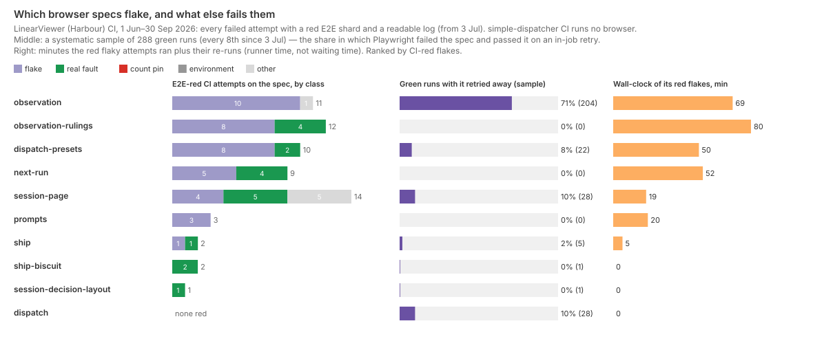
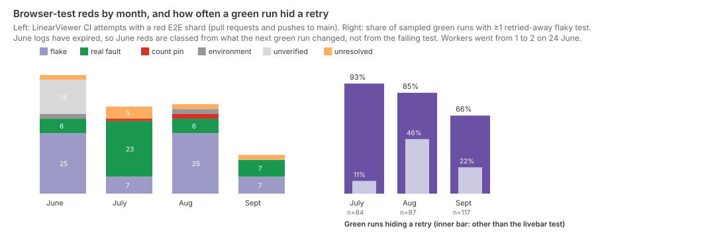

# Which browser specs flake, why, and what do they cost?

A few specs, one test each, from three causes. Since 1 June, LinearViewer's CI has had
138 attempts with a red browser (Playwright E2E) shard. At least 64 of them were flakes, 42 were real faults, 3
were count pins, 4 were the environment, and 25 cannot be placed. Every CI-red flake whose failing test is
known sits in one of seven specs, and three of them (`observation`,
`observation-rulings`, `dispatch-presets`) carry two-thirds. The causes read from the source and the
failure output are shared server-side state between the two parallel workers, waits that
do not wait for what they check, and a computed style read before the rule applies. The red flakes cost 38 red pull-request runs, 54 re-runs
and about 7½ runner-hours. The larger cost is hidden: Playwright retries every failing test
twice in CI, and 80% of sampled green runs contained a test that failed and then passed on
retry. One reduced-motion test in `observation.spec.js` did so in 71% of all green runs. simple-dispatcher's
CI runs no browser, so every CI number here is LinearViewer's.

## Findings

**Flakes are a burst after a change, then a few repeat offenders.** `test-estate.md` found
browser flakes to be the largest single cause of red CI. Split by period, they are not a steady
background:

| Period (LinearViewer) | CI runs | E2E-red flakes | per 100 runs |
|---|--:|--:|--:|
| 1–23 June, one Playwright worker | 526 | 0 | 0.0 |
| 24–30 June, two workers | 253 | 25 | 9.9 |
| July | 790 | 7 | 0.9 |
| August | 713 | 25 | 3.5 |
| September | 956 | 7 | 0.7 |

On 24 June LIN-629 raised CI to two Playwright workers (`playwright.config.js:12`). The week
after had 25 flakes, and four tickets named for flakes killed them within six days: seed ids
colliding across worker scopes (LIN-800, LIN-801, LIN-802) and a feed cache not cleared on
test reset (LIN-799). August's 25 are the second burst. Five come from `next-run`, all on one
day, and eight from `observation-rulings`, which was new on 22 August. The LIN-1727 PR
(0e8a1461) fixed both, and its commit names the cause: other specs' rows in the shared
per-worker queue and store. June's logs have expired, so June's flakes are counted from the
same commit passing on a re-run, not from a failing test. Every flake with a readable log
failed exactly one test (39 of 39).

**Concentration: seven specs, one test in each.** Ranked by CI-red flakes, with each spec's other failures:

| Spec | Flakes | Real faults | Other | First–last flake | The flaky test |
|---|--:|--:|--:|---|---|
| `observation` | 10 | 0 | 1 | 5 Jul – 5 Sep | reduced-motion livebar renders a static fill |
| `observation-rulings` | 8 | 4 | 0 | 23 Aug – 27 Aug | a mid-turn ruling unaffected; a non-page workspace ruling |
| `dispatch-presets` | 8 | 2 | 0 | 18 Jul – 28 Aug | clearing a blend preset's per-kind override |
| `next-run` | 5 | 4 | 0 | 23 Aug (one day) | clicking a target dispatches inline |
| `session-page` | 4 | 5 | 5 | 28 Jul – 29 Aug | a finished session with a lingering blocked worker |
| `prompts` | 3 | 0 | 0 | 23 Aug – 24 Sep | suggest button shows the recommendation container |
| `ship` | 1 | 1 | 0 | 30 Sep | layout is deterministic across reloads |

Those 39 flakes are every CI-red flake with a known spec. The other 25 are June's, with no log.
Since July, the other 85 specs have never turned CI red on a flake. `header-nav` is the mirror image: its 5 reds
were all real faults. Trend: `observation`'s red flakes run steadily from July to September.
`dispatch-presets` last went red on 28 August, and `next-run` and `observation-rulings` stop
with the LIN-1727 fix. `prompts` is the one still rising, at two of its three in September.

**Most flakiness never turns CI red: the retries absorb it.** CI retries each failing test twice
(`playwright.config.js:7`), so CI goes red only when a test fails three times running. A
systematic sample of 288 green runs (every 8th since 3 July, when logs start) read each E2E
shard's "flaky" summary:

- **Any retry:** 229 of the 288 green runs (80%) passed only after at least one test had failed
  and been retried; 289 flaky tests in all.
- **The livebar test:** `observation.spec.js`'s reduced-motion livebar test (`:401`) accounts
  for 204 of the 289, in 71% of green runs. Its share fell from about 90% of runs in July to
  44% in the second half of September.
- **Everything else:** a green run hid some other retried test in 11% of runs in July, 46% in
  August and 22% in September. That covers `session-page` (28), `dispatch` (28; never CI-red),
  `dispatch-presets` (22) and `ship` (5).

**Causes: shared state, waits and computed style, then network and ordering.** Reading the failing tests and
their errors:

- **Shared server-side state.** This covers the June burst (seed collisions across worker scopes,
  a cache surviving reset); `next-run` and `observation-rulings` in August (rows left in the
  shared queue by other specs, per 0e8a1461); and `dispatch`'s "lists queue items" retries.
  It is the `urlKey` partition problem LIN-625 names. The per-worker `workerUrlKey` fixture
  now exists and 30 of the 92 specs use it. But CLAUDE.md:54 still says `workers > 1` "is
  **not** enabled yet", while CI has run two workers since 24 June. Sixteen specs still name
  the fixed `test-workspace` or `local-workspace` key, or call `createSession` with no
  `urlKey`, which returns `test-workspace` for every worker (`tests/helpers.js:35`, `:73`).
  Two of the sixteen, `observation` and `next-run`, are in the flake table. Whether
  their flaky tests read the shared key was not checked.
- **Waits that do not wait for the thing checked.** `dispatch-presets` clicks save, waits for
  `networkidle`, then reloads (`:231-238`). Eight times the reload hit `net::ERR_ABORTED`,
  "frame was detached": a navigation was still in flight.
- **Animation and computed style.** The livebar test reads `getComputedStyle(el, '::after')`
  once, as soon as the element exists (`observation.spec.js:413-418`). Its CI-red failures read
  an `animationName` of `""` where `"none"` was expected, as if the rule had not yet applied.
  The retry, which also turns on tracing, passes.
- **Network and streaming.** `prompts` routes the recommendation stream and expects its
  container hidden; three times it was still visible.
- **Ordering.** A new spec in `ship-biscuit` changed shard order and exposed a cleanup gap that
  reproduced on main (the blind coder's reading, below).
- **Fixed sleeps.** `waitForTimeout` appears in 12 specs, including two in the table
  (`observation-rulings`, `session-page`). This paper traced no failure to one.

**Cost.** The following are from LinearViewer CI unless marked:

- **Red PR runs:** 105 PR attempts had a red E2E shard. 44 of them, in 38 runs, were flakes,
  against 41 real faults and 3 count pins. Flakes are 42% of E2E-red PR attempts, and 38 of the
  1,944 PR runs (2.0%).
- **Re-runs:** 54 of the 82 re-run attempts LinearViewer made since June re-ran a flaky E2E
  shard. The median re-run started 1.1 minutes after the red run finished. Another 10 flakes
  cleared by a new push or the next merge.
- **Wall-clock:** the red flaky attempts ran 252 minutes, and their re-runs 192 minutes more.
  The E2E jobs inside those failed attempts used 679 job-minutes. A typical flake costs the
  session waiting on it one extra attempt, a median of about 3½ minutes.
- **Retries inside green runs:** these are not timed here. Each hidden retry reruns one test,
  with tracing on.
- **Inside agent sessions** (both repos' transcripts, 29 August – 30 September):
  - **Who saw a red E2E shard:** of 2,016 sessions, 1,231 looked at CI, 37 saw it red and 15
    saw a red E2E shard. All 15 were LinearViewer sessions, and one was a deliberate mutation
    probe. Six of the 15 were the livebar test.
  - **Diagnosis before acting:** every session read the CI log before acting, and none re-ran
    blind.
  - **What the reds cost:** three read the log, called it a flake and re-ran, for a median of
    about 4 active minutes each. Four waited for a new push (62 active minutes in all, some of it
    other work). Four edited code, and three never saw green in the session.
  - **Flakes misread as real:** the rule for a session that diagnosed a flake as real and fixed
    it flagged one episode. On a hand reading that was PR #1451, LIN-2797's real race, where the
    session wrote "Not flaky. Deterministic". So none was found, but on 14 episodes that is thin.
    The agent judgements were right in every hand-read case (8 of 8).

**Masking: the bias runs both ways, and more often a flake hides a fault than the reverse.**

- **A flake that was a fault.** On PR #1451, two "pre-existing" flaky bulk-agree tests in
  `observation-rulings` were a real race in `public/observation.js`: a rebuild could discard a
  settled row's feedback. LIN-2797 (d4a05f2e, 12 September) root-caused it from CI and fixed
  it in product code. The census counts it as a real fault. By the paper's own rule it would
  have been a flake if a re-run had passed.
- **A test that fails first nearly every time.** The livebar test failed its first attempt in
  71% of green runs, and all year the retry has passed it. A fault that makes it fail only
  sometimes would look exactly like today's behaviour. Nothing in CI would tell the two apart.
- **Real faults on specs already known to flake.** Seven red attempts, on `dispatch-presets`,
  `next-run` and `observation-rulings`, were resolved by a change to product code or the spec
  after that spec had already flaked. None was waved through: each was fixed before its branch
  went green. The blind coder reads three of the seven as flaky specs fixed in the PR.
- **Faults landing on main while a spec flaked.** None found. Pushes to main were E2E-red 33
  times: 20 flakes, 1 real fault, 2 environment and 10 unverified from June. Of the 14 with a
  known spec, none followed a red attempt on that spec in the merged PR's own runs.
- **The count the other way.** Eleven flakes (10 on PRs, 1 on main) came on a diff that touched
  the flaky spec or code named like it, and a re-run cleared them. They are on three specs:
  `observation`, `dispatch-presets` and `observation-rulings`. That is where a real,
  intermittent fault could have passed as a flake. Of the three, only `observation-rulings`
  later needed a product fix (LIN-2797, above), in different tests.

So the census's flake count is a floor for failures that were not the diff's fault. Three
blind-coded "real faults" were flaky specs that the PR fixed itself, or an ordering gap. Its real-fault count
includes at least one fault that looked like a flake.

## Method

- **Population.** `scripts/survey-tests-ci-runs.mjs` (LIN-3151) snapshots every run of
  LinearViewer's `test.yml` (3,238 runs) and simple-dispatcher's `ci.yml` (280) from 1 June to
  30 September. simple-dispatcher's CI installs with `PLAYWRIGHT_SKIP_BROWSER_DOWNLOAD` and runs
  only `npm test` (`ci.yml:47-53`), so it has no browser failures to census. Its 84 full-system
  tests are not in CI (`test-estate.md`).
- **Fetch.** `scripts/survey-flakes-ci-fetch.mjs` pulls every attempt of every failed or re-run
  run: job and step timings, and each red E2E shard's log parsed for Playwright's failure blocks,
  retry markers and summary. Logs expire after about 90 days, and the uploaded Playwright
  reports after 7 (`test.yml:111`). So test names exist from 3 July; 51 of the 138 attempts have
  none.
- **Resolution.** `scripts/survey-tests-ci-classify.mjs` (LIN-3151) finds the next green run on
  the branch and classifies what changed.
- **Census.** `scripts/survey-flakes-analyse.mjs` keeps attempts with a red E2E shard and
  records the spec and test, the shard, the sha, whether that sha later passed, and whether the
  run was re-run. It also computes the branch's own diff at the failing sha, walking first
  parents back to main's first-parent chain. From that diff it asks whether the change could
  plausibly have caused the failure:
  - `direct`: the diff touched the spec, a fixture or the config;
  - `name`: production code named like the spec;
  - `prod`: other production code;
  - `none`.

  Then it classifies, first match wins:
  1. **Environment:** the failing step was not the E2E test step, or the log shows the server
     or browser never started.
  2. **Flake:** the same sha passed later, or an empty re-trigger passed. On a push to main, the
     next merge did not touch the spec's surface.
  3. **Count pin:** an integer total (expected 2 to 99, so not an HTTP status) or an "all N"
     title, changed by the next green in the test, or by main.
  4. **Real fault:** product or test code changed before green. On main, only if the next merge
     touched the spec's surface.
  5. **Unverified:** June push reds and literal-only test fixes with no failing test known.
  6. **Unresolved:** the branch never went green.
- **Blind second coding.** `--sample-blind 32 --seed 3168` drew every second attempt from the 89
  with a log or an environment class, and shuffled them. A separate subagent coded them from the
  errors, the diffs and git, without the labels (`blind-codes.json`).
  - **Agreement:** 21 of 32 on the rule as first run. The disagreements showed the count-pin
    rule firing on `toHaveCount(0)` and on HTTP status codes; with that fixed, 23 of 32. The
    second figure is not independent of the second coder.
  - **Where they still disagree:** four "unresolved" the second coder called real faults
    (abandoned branches); three real faults it called flakes (two flaky specs fixed in the PR,
    one ordering gap); one real fault it called a count pin; one environment against
    unverified. It never disagreed with a flake.
- **Green-run sample.** `scripts/survey-flakes-green-sample.mjs --every 8` reads every 8th
  green run since 3 July (288 runs, 1,152 shard logs) for the "N flaky" summary.
- **Spec source.** `scripts/survey-flakes-spec-source.mjs` counts risk markers in each spec at
  origin/main: fixed sleeps, fixed workspace keys, per-worker keys, network waits, streams,
  animation, clocks and seeding.
- **Sessions.** `scripts/survey-flakes-sessions.mjs` reads the dispatched-session transcripts
  still on the machine. It finds each point where a session saw its own CI red on an E2E shard,
  then what it did before the next green: re-ran, diagnosed, edited, or never cleared it.
- **Snapshots and figures.** Snapshots live in the git-ignored `data/survey-flakes/`.
  `scripts/survey-flakes-figures.mjs` draws both figures.

## Limits

- **June has no test names.** Its 25 flakes and 14 unverified reds cannot be put on a spec. The
  concentration table therefore covers July to September only, and under-states whichever specs
  flaked in the June burst.
- **"Flake" is a floor.** A flaky spec that the PR fixed in its own branch counts as a real
  fault (three of 32 in the blind sample). So does a failure whose branch changed before anyone
  re-ran it. The real-fault count is correspondingly high.
- **"Same commit passed" is also a ceiling on innocence.** A real intermittent fault passes a
  re-run too (LIN-2797). Some flakes here may be product races.
- **The push-to-main rule is inferred.** "The next merge did not touch the spec" calls 8 main
  reds flakes without a re-run to prove it.
- **Count pins are few and the rule is rough.** It was tightened after the blind coding, and the
  blind coder still adds one. Two of the three here, `audit.spec`'s template count, are also in
  `test-estate.md`'s three.
- **The green sample is one run in eight, and only since 3 July.** The 80% and 71% are sample
  shares, with a 95% interval of about ±5 points at n = 288. Retry time inside green runs is
  not measured, so the hidden cost is under-stated.
- **Wall-clock is runner time.** It is not the operator's or the session's waiting time, which
  includes the time to notice and re-run: a median of 1.1 minutes here.
- **Session transcripts are kept about 30 days,** so session costs cover September only. That
  misses August's burst. Sessions that never polled CI, and subagents, are invisible. All of this
  under-states the cost in sessions, and 14 episodes support no rates.
- **Causes are read, not reproduced.** No spec was re-run here. Each cause is the one the error
  and source support, or that a fixing commit states.

## Next

- **Is the livebar test's first-attempt failure a product behaviour or a harness one?** It fails
  first in most green runs and passes on the traced retry. Running it alone, repeated, with and
  without tracing, at origin/main would say which. It is the one test that could be hiding a
  real reduced-motion fault.
- **Which of the 16 specs on a fixed workspace key share rows across workers today?** None has
  flaked yet. A census of which ones read counts or lists from the shared partition would say
  whether they are safe or only lucky.
- **What do the retries inside green runs cost in minutes?** Playwright's JSON reporter records
  each attempt's duration. One week of it would put a number on the hidden 80%.
