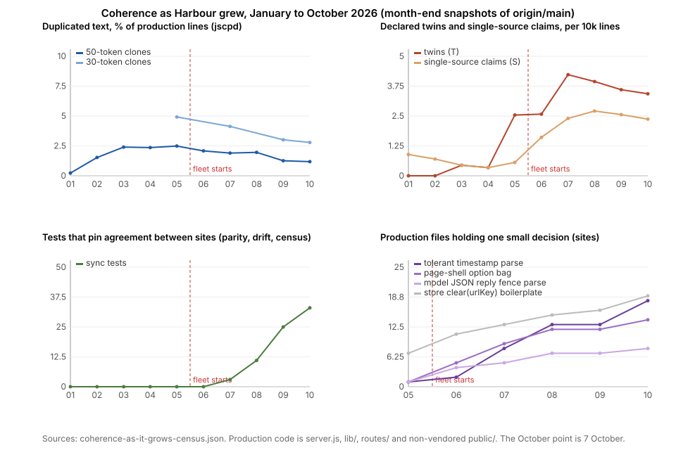

# Does a codebase built by agents lose coherence as it grows, and is that what makes later work harder?

Partly, and not in the way the hypothesis says. Harbour's code did not get messier as it grew. Duplicated text fell from 2.5% of production lines in May to 1.2% in October while the code grew four and a half times, and the fleet declares more single sources than twins. What grew is the number of places that hold one small decision: a tolerant timestamp parse went from one file to eighteen, the option bag a page passes to its shell from one to fourteen, and 33 decisions now carry a comment admitting a second copy that must be kept in sync by hand, up from nine in May, with 33 tests that pin the copies to each other where there were none in June. Most of those copies were made with the original in view. In 21 of the 33 the comment names a rule or a boundary that forbade the import, eleven of them the project's first-day rule that the browser and the server share no module. The cost is real and it is paid where the literature says it is paid, when the decision changes: 15 of 190 escaped defects on record are a fault fixed at one site and found later at a sibling, and until 4 October 84% of changes to the prompt rules had to be made twice. But it is not paid as a tax on the average change. Within month and size, tickets that touched a known multi-authority site were sent back no more often, took no more sessions, and escaped no more than tickets that did not; same-sized changes were sent back no more often in September than in August while the code grew by a quarter; and the earlier papers found the fleet's cost rising around the change, not in it, with escapes flat and the model tier making no difference. So the strong form of the hypothesis, that an apparent decline in agent ability is really a decline in the system's coherence, is not supported here, because the record does not show the decline it would explain. A weaker form is: coherence is lost one decision at a time as a stock of obligations, and Harbour's ways of paying it down have mostly not worked. A review that files has filed tickets nobody worked since June; parity tests preserve the twin; helper extractions half-finish (two of four old SSE writers still inline a month on); deletion finishes. The remedy the evidence points to is structural first, a shared pure module the browser can load and a layering rule with a place for shared predicates, and then the ticket's definition of done narrowed to the decisions a change touches, tested as the last section sets out.



## Findings

### 1. The code did not get textually messier as it grew; it got tidier

**Duplicated text fell from 2.5% of production lines in May to 1.2% in October, while the code grew 4.5×.**
`jscpd` over the production code at each month-end snapshot, counting any run of 50 or more tokens that appears twice:

| Month end | Production lines | Duplicated text (50-token clones) | Same at 30 tokens | Cross-file clone pairs | Pairs per 10k lines |
|---|--:|--:|--:|--:|--:|
| Jan | 11,226 | 0.2% | – | 0 | 0 |
| Mar | 22,760 | 2.4% | – | 12 | 5.3 |
| May | 35,468 | 2.5% | 4.9% | 24 | 6.8 |
| Jun | 61,992 | 2.1% | – | 43 | 6.9 |
| Jul | 87,484 | 1.9% | 4.1% | 58 | 6.6 |
| Aug | 114,213 | 2.0% | – | 76 | 6.7 |
| Sep | 144,607 | 1.3% | 3.0% | 60 | 4.1 |
| Oct 7 | 160,384 | 1.2% | 2.8% | 61 | 3.8 |

The fleet started in June. Duplicated text peaked before it, in the prototyping months, and has fallen since, under both thresholds. Cross-file clone pairs grew in number until August and then fell while the code kept growing. The agents do not copy and paste. Of the 61 cross-file clone pairs at HEAD, read one by one, 24 are store scaffolding (the same `clear(urlKey)` or `list(urlKey)` method in a dozen Mongo-backed stores), 10 are one feature cloned from a sibling (brief from recap; the create and edit forms), and 27 encode a rule a later change would have to find twice: a tolerant timestamp parse (five pairs), the parse of a model's JSON reply with its code fence stripped (four), the option bag every page route passes to the shell (four), duration formatting, an in-progress de-duplication rule. On the measure the outside literature uses most for "AI code is messier", GitClear's duplication and churn series [GC25], Harbour moved the other way.

### 2. What grew is the number of places that hold one small decision

**Eleven named decisions went from one or two sites to as many as eighteen, roughly one new site for every new module.** Counting the production files that contain each decision's signature at six snapshots:

| Decision | May | Jun | Jul | Aug | Sep | Oct 7 |
|---|--:|--:|--:|--:|--:|--:|
| Tolerant timestamp parse (`toMillis`, `toMs`, `_epoch`) | 1 | 2 | 8 | 13 | 13 | 18 |
| Page-shell option bag passed by a route | 1 | 5 | 9 | 12 | 12 | 14 |
| Parse of a model's JSON reply, fence stripped | 1 | 4 | 5 | 7 | 7 | 8 |
| Bookkeeping stamp classifier (`decision-withdrawal-reversed`) | 0 | 0 | 0 | 0 | 7 | 8 |
| Session classification (`isStandaloneSession`, `isTerminalLoop`) | 0 | 1 | 3 | 3 | 5 | 6 |
| Review ledger heading (`What CI Did Not Prove`) | 0 | 4 | 5 | 5 | 5 | 6 |
| Terminal-state literal `['completed','canceled','duplicate']` | 4 | 4 | 4 | 4 | 5 | 5 |
| Duration formatting | 0 | 0 | 1 | 2 | 3 | 4 |
| Store `clear(urlKey)` boilerplate | 7 | 11 | 13 | 15 | 16 | 19 |
| Ship layout primitives, server and browser | 4 | 4 | 4 | 4 | 4 | 4 |
| Swim-lane segment rank, server and browser | 2 | 2 | 2 | 2 | 2 | 2 |
| *Production files* | *94* | *171* | *231* | *291* | *347* | *398* |

The decisions that grew are the ones a new module needs on its first day: how to read a timestamp that may be a `Date`, a string or garbage; how to read a model's answer; what the page shell needs. Each new module wrote its own. None of these eighteen timestamp parsers carries a comment that names another; they were not copied, they were re-derived. The two decisions that did not grow are the ones that were already duplicated across the server and browser in May and have had no new runtime to spread to. The Drift & Coherence review's own hand counts say the same of the decisions it tracks: the hand-rolled workspace lookup went from 4 sites in June to 16 in August and 17 in September, and the inline error envelope from 76 to 87 sites between its last two editions, all 11 new ones in code written in that window (`docs/reviews/drift-coherence-review-2026-09-26.md:59-73, 94-103`).

**Thirty-three decisions carry a comment admitting a second copy that must be kept in sync by hand.** A census of production comments that name a second site for the same rule, list, constant or algorithm, read and classed one by one (Method), finds 126 such lines at HEAD in 68 files: 55 declare a live twin, 38 declare the opposite (that this site is now the single source), 6 describe a copy that has since been removed, 5 are promises that behaviour stays byte-identical across a change, and 22 are something else (data copied at run time, an analogy). The 55 twin lines describe 33 distinct decisions. They were first declared at 4 to 9 a month through the fleet era (June 4, July 9, August 4, September 9, three in October's first week), so the rate has not fallen. Per 10,000 production lines, declared twins peaked in July at 4.2 and were 3.4 in October; single-source claims rose from 0.6 in May to 2.4, so the fleet era declares consolidations at a higher rate than it declares twins. In October the codebase also carried 33 unit-test files whose name says they pin agreement between sites (parity, drift, census, single-source); there were none before July.

**Most declared twins exist because a rule forbade the import, not because the agent missed the original.** The comment on each twin says why it exists:

| Stated reason | Twins | Example |
|---|--:|---|
| The server and the browser cannot share a module | 11 | `public/swim.js:27-31`: "duplicated because the `no build step` constraint (CLAUDE.md) prevents importing from lib/. Keep in sync; unifying client+server is a candidate follow-up under LIN-174" |
| A layering or purity rule (a lib module must not import a route, must stay a leaf) | 4 | `lib/run-view.js:267-272` (2 October): "Same rule as `routes/dashboard.js`'s `isStandaloneSession` … Inlined here (rather than importing the route) to keep this module pure" |
| Code and a human document must match | 2 | the autopilot kickoff and `docs/autopilot-kickoff.md` |
| A data mirror kept for older readers | 2 | the binding's credentials and the legacy scalar mirror (LIN-562); the connection record and its row mirror, which served the stale token in the 3 October incident (`lib/connection-credential.js:595-603`) |
| Two repositories or systems | 2 | the model preset list, "hand-mirrored across repositories. Update both" (`lib/render-settings.js:116-121`) |
| A declared list kept beside the thing it describes, in one module | 5 | `PROVIDER_SURFACE` beside the provider methods; two interval constants that "MUST stay the same value" |
| A plain convenience copy where an import was possible | 7 | "Copied verbatim from lib/live-console.js's `_epoch`" |

Twenty-one of the 33 name a boundary or a rule. The largest single producer is a line in the project's first commit: "Keep it minimal - no frameworks, no build step" (`CLAUDE.md:43`, from `a82b8758`, 4 January). Read as "no shared module between server and browser", it has produced eleven twins, six of them before the fleet existed (the swim-lanes prototype of 16 March and the radial Ship view of 16 May). Browsers load ES modules without a build step, so the rule does not require the copies; the reading of it does. The copy in `public/swim.js` has pointed at LIN-174 as the place its unification would be filed since 7 June; LIN-174 closed on 10 June with no such child. The 2 October twin was made the day before the October authority rules landed, by an agent that found the original, named it, and declined to import it for a reason of its own.

### 3. The duplicated decisions are an obligation paid when the decision changes

**For the prompt rules, 84% of changes to the stage definitions also had to change the meta-prompt, until LIN-3300 deleted the second path.** Of the 63 merged PRs from June to 7 October that touched `lib/prompt-template-defs.js`, 53 also touched `lib/prompts/meta-prompt-template.js` (June 18 of 20, July 8 of 11, August 12 of 13, September 10 of 12). That is the "must update BOTH" rule `steady-base.md` found written into the architecture doc, measured as what it made every change do. On 4 and 5 October (`19d7198a`, PRs #1751 and #1752) the meta-prompt path was deleted: the 106 KB meta-prompt is gone, the stage definitions shrank from 132 KB to 110 KB, and an 8 KB selector took its place. There is now one place to change a stage's rules, by construction rather than by discipline. The same kind of count for the Observation page: of the 50 PRs that touched the browser script `public/observation.js`, 25 also touched the server route `routes/dashboard.js`, which holds the session banner's "waiting for a person" derivation the first paper named and whose data the script renders.

**Four in a hundred merged PRs added the same lines to two production files at once.** A detector over every merged PR since January finds 70 of 1,686 (4.2%) that added three or more identical, non-trivial lines to two production files in the same change: the same `isAiNotConfigured` function in the brief and recap scripts, the same OAuth viewer lookup in the two GitHub auth routes (20 lines), the same layout step in `lib/ship-layout.js` and `public/ship.js`. Not every hit is a divergence in the making; the LIN-1084 PR appears because it wrote the same call to its new shared validator at both dispatch entrances, which is convergence. The rate by month runs 1.5–12% with no trend (June 2.8%, July 5.1%, August 3.4%, September 2.9%, October 9.6%). This is a floor: a rule restated in different words, or split across server and client in different syntax, does not match.

**Fifteen of the 190 escaped defects on record are a fault fixed at one site and found later at a sibling.** `reliability-baseline-defects.json` records a reason for every escaped Bug. Fifteen say, in their own words, that the fault was a sibling of one already fixed: "pre-existing sibling found by LIN-2262 review", "class sibling of LIN-2281", "older sibling explicitly dropped by LIN-2637 close-out", "its partial fix left this sibling". Thirteen of the fifteen were filed from late August on, when the class-enumeration rules (LIN-313, LIN-1871) had reviews looking for siblings, so the count measures finding as much as making. The record also holds the divergence defects that motivate the whole question: `lib/dispatch-validation.js:1-13` says the proxy and session dispatch routes "independently hand-rolled the same … checks for `model`, and drifted: the proxy path rejected `model: 0` … while the dispatch path silently accepted it" (LIN-1084, 6 July); LIN-525 (16 June) fixed a toggle whose state had desynchronised between two sites; the 3 October incident was two credential paths serving different tokens (`one-job-many-paths.md`).

**In the aggregate, though, a change that touches a known multi-authority site costs no more than one that does not, once size and month are held fixed.** Every ticket named by a merged PR since June was read from the tracker: 940 Done tickets with production lines and at least one comment. A ticket is *exposed* when one of its PRs touched a file that, at the last month-end before it, held a declared twin, the partner a twin names, or a decision-bearing clone pair. Split into month and size cells (1–49, 50–299 and 300 or more production lines) and compared within each cell:

| Measure (within month × size cells, exposed minus not) | Exposed to any site | Exposed to a declared twin |
|---|--:|--:|
| Review send-backs per ticket, June–October (940 tickets, 11 cells) | −0.08 | −0.11 |
| Share of tickets sent back at least once | −4 points | −5 points |
| Worker sessions per ticket, September (139 tickets with a cost lineage) | 7.0 against 9.6 at 1–49 lines; 8.0 against 10.0 at 50–299 | 13.2 against 6.8 at 300+ lines (19 against 6 tickets) |
| Median working hours, September | 2.6 against 2.4; 5.6 against 5.0 | 13.9 against 5.7 at 300+ |
| Escaped Bugs naming the ticket, per 100 | 5.8 against 5.6 | 5.6 against 6.1 |

In eight of the eleven cells the exposed tickets were sent back no more often than the others. The one cell that shows a penalty is September's largest changes touching a declared twin, which took twice the sessions and hours of the six unexposed tickets beside them; those nineteen are mostly the credential cutover and the proxy decomposition, which are large because of what they were, not because of what they touched. The git-only measure says the same: within month and size cells from June to September, PRs touching such a file took 0.04 fewer commits than PRs that did not (twins alone 0.10 more), and no cell differs by more than a third of a commit. October's PRs are the exception, 84% exposed at 5.0 commits against 2.1, because October's work is the consolidation itself, which touches every authority at once. So the cost of a duplicated decision does not show as a tax on the changes that touch its files. It shows where the detector cannot look: in the change that has to find the second site, and in the escape when it does not.

### 4. The record does not show the agents getting worse, or the same work getting harder

**The hypothesis predicts a change of a given size costing more as the codebase grows. The record shows the cost rising around the change, not in it, and quality holding.** The earlier papers measured this from the runner's logs and the tracker, and the figures do not move the way the hypothesis needs:

- A correct change kept its size (median 70 production lines in June, 67 later) and its working time: 1.52 hours at the frontier tier and 1.60 at the mid tier within the later weeks (`why-throughput-halved.md:105-116`). What rose two-and-a-half-fold at the 12 July step was dispatches per correct change, 7.6 to 20, and that rise is cold resumes and wakes into held supervisors, not implementation (`what-doubled-the-dispatches.md`).
- Escaped defects per 100 merged PRs in Harbour were 5.4 in June and 5.7 in September once the rows that name the review that found an older fault are set aside (`reliability-baseline.md:57-69`). The faults the fleet makes did not multiply with the code.
- The model tier did not move whole-life cost per correct change: 2.9–3.0 hours frontier-implemented against 3.2–3.3 mid, within noise (`model-choice.md:109-131`). A change of capability is not what moved the cost either.
- The steady-base expedition's own summary: "the cost rose while quality held, and it rose around the change, not in it" (`steady-base-menu.md`): mechanical supervision, wakes that change nothing, orientation and re-finding.

This paper's own join says the same at fixed size. Review send-backs per Done code ticket, by the month it last merged:

| Production lines changed | July | August | September | October (7 days) |
|---|--:|--:|--:|--:|
| 1–49 | 0.01 (86 tickets) | 0.23 (69) | 0.29 (49) | 0.57 (7) |
| 50–299 | 0.15 (130) | 0.47 (92) | 0.45 (89) | 0.12 (8) |
| 300 or more | 0.39 (44) | 1.00 (36) | 1.02 (44) | 1.58 (36) |

June is near zero at every size: the verdict wording this count reads ("Request Changes" in a review comment) was rarely posted to the tracker before the review ledger and close-out step of 29 June (LIN-550), so June's reviews are mostly invisible to it. The step is from July to August, when the plan-review leg (26 July), the mutation check (24 August) and the rest of the gate rules landed (`how-process-changes-land.md`). From August to September the rate held at every size while the production code grew by a quarter. If the system were getting harder to change, the same-sized change would be sent back more often month on month; it is not. October's largest tickets are higher, and they are the consolidation work.

**Each alternative explanation finds some support, and none of them is "the agent".**

- *Harder requirements.* The credential and auth work that produced the October incidents took 10% of September's tokens (`cost-mix.md`), and it is where review has caught the most real faults: one credential ticket, LIN-2081, held 8 of the 22 review-caught bugs in `reliability-baseline.md`'s sample. It is also the area with the fewest detected duplicate sites, 4 of 42 files (finding 6 below). The hard work and the duplicated work are mostly not the same work; where they meet, in the two credential mirrors, the duplicate is a deliberate data mirror rather than a re-derived helper.
- *Abstractions that later work exposes as inadequate.* This is the mechanism the record shows most often, and it is sharper than "a local patch is cheaper". The canonical workspace lookup takes a session, and the seventeen call sites hold a bare array, so each re-derives the lookup; the review's own root cause is "a signature mismatch … the fix is the helper's shape, not 17 call-site edits" (`drift-coherence-review-2026-09-26.md:94-103`). The shared dispatch validator takes the length bound as an argument, so five callers still decide it. The pure run-view module could not import the route that held the rule. In each case the authority existed, the agent found it, and the authority's shape or place put it out of reach of a change scoped to one ticket. Reshaping the authority is the work the scope rules excluded until 3 October (`like-a-skilled-developer.md`).
- *Misunderstanding of existing code.* The record shows the opposite more often than not: the skipped credential test (`one-job-many-paths.md`, finding 3), the 2 October comment that names the original rule it declines to import, the swim-lane comment that names the ticket its unification belongs to. These are copies made with the original in view.
- *Model and prompt changes over time.* The 12 July tier switch is the one dated step in the throughput series, and the prompts grew five-fold since May (`steady-base.md`). Both changed what a session is told and who runs it; neither changed the code's duplication series, which peaked before the fleet and fell after.

So the strong form of the hypothesis, that an apparent decline in agent ability is really a decline in the coherence of the system, is not supported by Harbour's record, because Harbour's record does not show the decline it would explain. A weaker form is supported. Coherence is lost one decision at a time, as a stock of obligations: twins to keep in sync, parity tests to bump, N-place edits to make, sibling sites to find after the first fix. The stock grew with the module count. It is paid when a decision changes, which is why it shows in the divergence defects and the sibling escapes and does not show as a tax on the average change.

### 5. What Harbour has tried, and what stuck

**Review-and-file has not converted.** The Drift & Coherence review has run as a periodical since 10 June, with five persisted editions (the 12 July edition was never written to any branch). It measures exactly the duplicated decisions this paper is about, and its own trend ledger says they worsened: the workspace-lookup incantation 5 → 4 → 16 → 17 sites, the inline error envelope 76 → 87, native `confirm()` dialogs 6 → 9 against a registry that still says four, the provider import cycle 13 → 15 members (`drift-coherence-review-2026-09-26.md:314-330`). The three fix tickets it minted, LIN-675 on 25 June and LIN-2388 and LIN-2389 on 29 August, were all Backlog with zero comments on 8 October; the review itself writes "the promotion path is still not converting" (`:190-202`). Its chosen fix direction for the error envelope, "adopt-on-next-touch, no sweep", produced flat adoption: the one file that genuinely adopted the canonical module in September, `routes/flight-companion.js`, was written from scratch in the window, imports the helpers, and wrote eight raw inline envelopes beside them (`:59-73`). This matches `tasks-generate-tasks.md` (half of all filings never worked) and `never-worked-pile.md` (the pile is live work in the wrong place); a review that files is a filing.

**Pinning the twin is what the process reaches for; it preserves the twin.** The 33 parity, drift and census tests are the response that did land: a test that fails when two copies disagree. LIN-3037 (25 September) is the clearest case. Asked about four inline copies of the bookkeeping stamp classifier, it added a helper and a test that reads the four files' source and asserts their literal sets match the helper's (`tests/unit/decision-lifecycle-stamp-drift.test.js:116-129`); the copies stayed, and a fifth arrived a week later outside the test (`one-job-many-paths.md`, finding 2). A parity test is a debt record that never comes due.

**Helper extraction lands, and usually half-finishes.** Four consolidations with a countable old pattern, checked at HEAD:

| Consolidation | Landed | Old sites then | Old sites at HEAD |
|---|---|--:|--:|
| LIN-1157: one function mints the bootstrap and appends the proxy preamble | 9 Jul | 6 inline sequences in 2 route files | 0; finished in the same PR |
| LIN-1084: one validator for opaque dispatch fields | 6 Jul | 3 local length bounds | 5 local `MAX_NAME_LENGTH` definitions; the helper takes the bound as an argument, so the mechanism is shared and the decision is not |
| LIN-2631: one SSE frame writer (`lib/sse.js:1-13`: "Four copies of a wire format is how one of them quietly stops matching the others") | 5 Sep | 4 inline writers | 2 still inline (`routes/workspace-api-roadmap.js:52`, `routes/workspace-api.js:1075`), 33 days on |
| LIN-2970/2978: one chat-request preamble for credentials and the free-tier gate | 21–22 Sep | 0 importers | 13 importers, and the surrounding credential scaffold still copied in 8 route files |

The first paper's rule reads the table: a helper counts as consolidation only when the callers stop making the old decision. Two of these four did not, and a third took a second ticket to get halfway.

**Deletion finishes.** LIN-3300 did not add a helper beside the meta-prompt; it deleted the meta-prompt. simple-dispatcher's LIN-910 deleted the SDK runner (`growth-atlas.md`). Both left one authority because there was nothing left to converge. The October task-address work (LIN-3332 to LIN-3336, PRs #1764 to #1767) is deleting the second source-kind plumbing the same way, and is three days old, so this paper cannot say what it bought.

### 6. Where it concentrates

**A quarter of production files hold at least one detected site, and the routes and the chat and fleet code hold most of them; the credential code holds few.** Taking the union of the three detectors at HEAD (files with a declared twin, files in a decision-bearing clone pair, files holding one of the eleven named decisions):

| Area | Production files | With a detected site | Share |
|---|--:|--:|--:|
| chat + LLM calls | 15 | 8 | 53% |
| routes + server | 47 | 20 | 43% |
| dispatch + fleet | 45 | 15 | 33% |
| views + rendering | 47 | 14 | 30% |
| UI (public, components) | 56 | 14 | 25% |
| prompt text | 26 | 6 | 23% |
| other lib | 86 | 19 | 22% |
| proxy | 9 | 1 | 11% |
| accounts + credentials | 42 | 4 | 10% |
| tracker providers | 25 | 2 | 8% |
| *All* | *398* | *103* | *26%* |

The share is a floor, since every detector under-finds (Limits). Its shape is the useful part. The sites gather where modules are added fastest and share the most (routes, the fleet, the LLM call sites), which fits finding 2's "one new site per new module". They are rare in the credential and provider code, where the first paper found the costliest two-path incidents. There the duplicates are few, deliberate and dangerous (a data mirror, a copied ranking rule), and not what a census of small helpers sees. Two kinds of incoherence, then: many cheap re-derivations in the busy middle of the system, and a few expensive mirrors at its edges. They need different remedies.

### 7. What the outside literature says

The sources are listed at the end with what each measured; this section says what they add up to, with peer-reviewed work, industry reports and argument kept apart.

**The mechanism is old, and the oldest statements of it are the sharpest.** Parnas's 1972 criterion is that a module hides "a design decision which is likely to change" [P72]; a decision implemented in several places is, by that criterion, one that was never hidden. His 1979 paper names "excessive information distribution" as the first reason a system is hard to extend or to *contract*, with a worked example in which a decision to support three languages leaked into tables sized for exactly three, so that removing one would have cost as much as adding one [P79]. His 1994 essay on software aging describes "ignorant surgery", changes made without the design concept, after which "a change that might have been made in one or two parts of the original program, now requires altering many sections of the code" and "it is more difficult to find the routines that must be changed" [P94]. Perry and Wolf's 1992 definitions give the feedback loop: drift produces "a lack of coherence and clarity of form, which in turn makes it much easier to violate the architecture" [PW92]. Brooks's conceptual integrity is the same thing seen from the design side: better one set of ideas "than … many good but independent and uncoordinated ideas" [B75], and he treats removing a duplicate as definitional of software: "no two parts are alike … If they are, we make the two similar parts into one" [B87]. Ousterhout's "change amplification", one decision requiring many edits, and "complexity is incremental, the result of thousands of choices" are the modern wording [O18]. Lehman's second law is the same claim as a statistical regularity over OS/360's releases [L80]. None of these measures the cost; they define it. John's hypothesis is a restatement of Parnas, Perry and Wolf, and Brooks with an agent in the developer's seat, and its mechanism needs no new theory.

**The measured evidence says scattering costs in faults and in span, not in file-level effort, and that textual clones are the wrong thing to count.** The strongest classical result for the cost is Eick and colleagues' fifteen years of change data on a telephone switch: the share of changes touching more than one file more than doubled over the years, and the span of a change predicted its effort [E01]. Mockus and Weiss found the diffusion of a change across files, modules and subsystems "essential to predicting failures" on the same system [MW00]; Eaddy and colleagues found moderate to strong correlations between how scattered a concern's implementation is and its defects, with the stated theory that "maintainers may make changes incorrectly or neglect to make changes in all the right places" [E08]; Hassan found the entropy of how changes scatter across files predicts faults better than churn [H09]; Cataldo and colleagues found hidden co-change dependencies explained more failure variance than the dependencies the code declares [C09]; Xiao and colleagues found that a few groups of files with flawed architectural relations consumed 20–61% of each of seven Apache projects' maintenance effort, a third of them with accelerating cost [X16]. On the other side, the one controlled study with hired developers and logged time found that no named smell, Shotgun Surgery included, cost measurable effort once file size and number of changes were held fixed; its unit was the file, so a cost paid in *finding the other file* is exactly what it could not see [S13]. The clone literature is where the simple reading fails. Kapser and Godfrey judged 71% of the clones in two systems beneficial [KG08]; Rahman, Bird and Devanbu found cloned code no more defect-prone than the rest, and clones spread across files no worse than collocated ones [R12]; Göde and Koschke found most clones rarely change [GK11]. Juergens and colleagues supply the reconciliation: clones are harmless until the duplicated decision changes, and then "nearly every second unintentionally inconsistent change to a clone leads to a fault", 107 developer-confirmed faults across five industrial and open-source systems [J09]. Tufano and colleagues found 80% of smells survive and most are born with the artefact rather than grown [T17]. Harbour's record fits this literature closely: textual clones fell while re-derived decisions multiplied (finding 1 and 2); the cost appears as sibling escapes and divergence defects, not as a per-change tax (finding 3); and the one controlled design that found nothing is the one whose unit was the file, as this paper's exposure measure is (Limits).

**The debt literature puts the cost at the level of decisions and finds the loop in people before agents.** Cunningham's founding statement of the metaphor was about exactly this: "Entire engineering organizations can be brought to a stand-still under the debt load of an unconsolidated implementation" [C92]. The field's consensus definition builds the cost in, "a technical context that can make future changes more costly or impossible", and adds that the worst debt "is caused by design trade-offs, which are not detectable by measuring code quality" [A16]; 1,831 practitioners surveyed by Ernst and colleagues named architectural decisions as the most important source [E15]. Besker, Martini and Bosch had 43 developers at six companies report weekly for seven weeks: 23% of working time lost to debt, and "developers are frequently forced to introduce new TD due to already existing TD" [B19], which is John's feedback loop measured in people. Martini and Bosch call some architectural debt "contagious", its interest compounding [MB17], and their multiple-case study names "non-completed refactoring" as a cause in its own right: "the new API is added but the previous one cannot be removed", and a duplication "was not considered as such (but only temporary duplication)" until the substitution proved impossible for want of priority [MBC15]. Harbour's half-finished helper extractions are that finding verbatim. The self-admitted debt studies measure how rarely a known shortcut is retired: 26–64% of self-admitted debt is ever removed [PS14], and across 159 projects it survived more than a thousand commits on average even when it was [BR16]; Wehaibi and colleagues found changes that touch admitted debt are more diffuse and harder, not buggier, which is the shape of cost this paper's exposure measure cannot see [W16]. Sturtevant's thesis on one commercial product's eight releases is the strongest cost figure in the classical set: differences in architectural complexity "could account for 50% drops in productivity, three-fold increases in defect density, and order-of-magnitude increases in staff turnover" [ST13], and MacCormack's propagation-cost measure shows a deliberate redesign cutting Mozilla's by over 80%, so coherence is not destiny [M06]. Tornhill and Borg's 39 proprietary codebases, with a vendor's composite health score, put issues in low-health files at 124% longer in development and 15 times the defects [TB22]; that is industry evidence from a tool vendor and is listed as such.

**Every migration pattern ends in a deletion, the deletion is the step that gets skipped, and there is now a measured reason agents skip it more.** Hammant's branch by abstraction ends "6. Delete the first implementation" [H07]; Sato's parallel change ends in a contract phase and warns "If the contract phase is not executed you might end up in a worse state than you started" [SA14]; Fowler's strangler fig ends when the host dies [F24]. What the record says happens: in Chrome a cleanup campaign on 160 release toggles actually removed 51, and two of eleven marked "Removed" were still in the code [RQ16]; Uber needed a tool that generates the deletion and a bot that chases the owner to clear 1,381 stale flags, 17% of all its flags, and even then people landed 86% of the generated diffs only within five days of a reminder [PIR20]; only a median 20% of affected projects reacted to a deprecation in a Smalltalk ecosystem, with "parts of it remain[ing] in an inconsistent state for long periods of time" [RL12]; 95–100% of Java clients kept adding calls to already-deprecated APIs [SRB18]; 81.5% of 4,600 Java projects kept outdated dependencies [K18]. Google's deprecation chapter draws the practitioner conclusion: "code is a liability, not an asset", advisory deprecation "often lacks enforcement", compulsory deprecation has a deadline and is "actively staffed by a specialized team through completion", and "Without backsliding prevention, deprecation can become a game of whack-a-mole" [G20]. Its large-scale-change chapter adds that "Different LSCs have different definitions of 'done'" and that nearly every one carries a mechanism that blocks new uses of the old symbol [G20b]. The one controlled result on organised refactoring is Kim, Zimmermann and Nagappan's Windows 7 study: the most-refactored binaries had fewer post-release defects and fewer inter-module dependencies, from a dedicated team, not opportunistic cleanup [KZN12]. On why the deletion is skipped: Adams and colleagues showed in eight experiments that "people systematically default to searching for additive transformations", and that an explicit cue to consider subtraction raised the subtractive share from 21% to 48% [AD21]; Uhler and colleagues found the bias stronger in language models (GPT-4o chose additive solutions 96% of the time against 54% for people) and insensitive to subtraction being the more efficient move [U26]; and Ebrahimi and colleagues measured it in code: across SWE-bench tasks the models left at least 28% of the deletions a fix required in place (deletion recall "reaches at most 71.7% even on tasks all five solve"), and in 29% of passing patches kept the old logic alive behind a new guard, which the authors name "Guard-and-Go" [EB26]. That last result is Harbour's "add a path, keep the old one" caught in the act with tests green. No study tests whether a definition of done that names retirement changes any of this; the closest evidence is Piranha's process and Google's practice, and the practitioner writing on toggles has converged on "done when the flag is archived" without measuring it [LD].

**The AI-assisted studies measure assistants on short tasks or repositories over months, and they split the same way.** Three peer-reviewed results from 2026 measure the mechanism directly. Huang and colleagues found that functions written by agents were, on a semantic-similarity score, about 1.9 times as redundant with functions already in the repository as functions written by people, and that "LLM agents frequently disregard code reuse opportunities" [HU26]. Kashif and colleagues generated ten projects feature by feature with Cursor and a person in the loop, found them 91% functionally correct, and found code duplication the most prevalent of 1,305 design issues [K26]. He and colleagues' difference-in-differences over 806 repositories that adopted Cursor found "a statistically significant, large, but transient increase in project-level development velocity" and "a substantial and persistent increase in static analysis warnings and code complexity", and a dynamic panel in which the accumulated warnings and complexity "are major factors driving long-term velocity slowdown"; duplicate-line density rose 7% and was not significant [HE26]. That last paper is the closest published test of John's hypothesis: the same repositories, the same tool, and the state of the code at one period predicting the output of the next. A follow-up from the same group found committed agent configuration files cut the post-adoption rise in cognitive complexity from about 53% to 27% [RAMP26]. Watanabe and colleagues found 45% of merged Claude Code PRs were revised by people before merge, for "bug fixes, documentation, and adherence to project-specific standards", and the full text puts refactoring, "including eliminating code duplication and aligning with architecture", in about a quarter of those revisions [W26]. On the size gradient, benchmarks hold the model fixed and vary the repository: FeatBench reports 60–70% success below 50,000 lines falling to 10–30% above 300,000 [FB26], SWE-bench Pro reports 43.6% on public repositories against 17.8% on proprietary enterprise ones for the same models [SBP25], and the long-context papers give the mechanism, with code-understanding scores collapsing past about 32,000 tokens and "inter-code unit relation understanding" the hardest skill [LCU25]. The industry reports point the same way with weaker designs: GitClear's 211 million changed lines show moved lines falling from 24% to under 10% of changes and copy-pasted lines rising from 8% to 12% between 2020 and 2024, without per-line attribution to any tool [GC25]; the Stanford talk's matrix puts gains at 30–40% for simple greenfield work and 0–10% for complex brownfield work, from slides rather than a paper, with a commercial interest declared [DB25]. Against all this stand the throughput results (Cui and colleagues' 26% more completed tasks across 4,867 developers [CU25]) and METR's two readings of the same design: experienced maintainers of million-line repositories were 19% slower with early-2025 tools, with "large and complex repositories" and "implicit repository context" among the likely causes [M25], and the same team's late-2025 follow-up points to a speed-up it calls "only very weak evidence" because developers increasingly refuse to work without the tools [M26]. Two things follow for Harbour. The published mechanism, re-derivation in place of reuse, is what finding 2 measured. And every longitudinal claim that work got harder is confounded by the tool changing underneath it, which is why finding 4 holds the tier fixed and still finds no rise.

## Options

These are for John; writing them here changes nothing.

1. **Let the browser import the pure modules.** Eleven of the 33 declared twins, and both of the decisions that have sat duplicated since May, exist because `public/` cannot import `lib/`. Browsers have loaded ES modules without a build step for years; serving a `lib/pure/` directory statically and loading it with `<script type="module">` keeps "no build step" and removes the reason for every server-and-browser twin. The ship, swim and timeline layouts, the terminal-state list, the components' markup and the stamp classifier are all pure functions. This is the one option that removes a class rather than a case.
2. **Make the layering rule hold a place for shared predicates.** Four twins exist because a lib module may not import a route, or wants to stay a leaf. A predicate that two layers need belongs in a pure module both may import; the rule should say so, and the 2 October copy would then have been an import.
3. **When a helper's shape keeps callers from using it, change the helper, not the callers.** The workspace lookup, the dispatch validator's bound and the chat-request scaffold are helpers whose callers still decide the thing the helper exists for. The review has named the fix for one of them since 29 August (LIN-2389). This is a small change each time and it is the change the scope rules excluded.
4. **Count a change finished when the decision it touched has one authority again.** This is the ticket's definition, narrowed to what a change touches: not every structure the feature "makes obsolete", which no one can enumerate, but the sites of the decisions its diff changed, which the census script lists. A close-out that leaves a losing site in place says so and keeps the ticket open. The cost is in the change, which October's PRs show: 5 commits and 28 files where the average is 2 and 3. The saving is in every later change to that decision and is not yet measured anywhere; the trial below is how to measure it.
5. **Give parity tests a due date.** A test that asserts two copies agree is a record that a debt exists. Recording its intended retirement (the ticket that will remove one copy, and the date) turns the 33 pins from a way to keep twins into a list of twins to remove. A pin past its date fails.
6. **Prefer deletion to a helper beside the old path, where the old path can be deleted.** LIN-3300 and LIN-910 finished because nothing was left to converge. Of the four helper extractions checked, one finished in its PR, two left the old decision at the callers, and one still has two of four copies after a month.
7. **Stop filing from the Drift & Coherence review.** Its measurements are good and its tickets do not move; five editions and three Backlog fix tickets say so. The census here runs in a minute from git and could replace the hand counts, and its findings could be routed into the next ticket that touches the seam, which is where the review already says the fix should land.

## How to test it

**The experiment.** For six weeks, every ticket whose plan touches a seam on a list fixed in advance (the 33 declared twins, the eleven named decisions and the review's standing rows) is assigned by the parity of its ticket number to one of two definitions of done. Arm A is today's: the ticket's own acceptance criteria. Arm B adds one line: the decision the change touched has one authority at close-out, every caller reaches it, and the obsolete sites are deleted in the same PR or the ticket stays open. Nothing else differs; the same stages, tiers and reviewers run.

**Measures, named now.**

1. *Sites per touched decision*, before and after each change, from the census script run on the PR head (`coherence-as-it-grows-scripts/coherence-census.mjs`). The primary outcome. Deterministic, so a dozen seams per arm is enough to see whether arm B retires and arm A does not.
2. *Callers converged and old branches deleted*, read by a second reader blind to the arm, against the first paper's classes (independent policy, duplicated fact, delegation, intentionally different semantics).
3. *N-place edits on the same decision in the following eight weeks*: the mirrored-adds detector and the co-change count of the decision's sites, per PR that touched the seam.
4. *Sibling escapes within 30 days* that name the ticket, read against `reliability-baseline-defects.json`'s rubric. Secondary: at 1–4 escapes per 100 changes, six weeks cannot detect a difference, and the trial should say so rather than read noise.
5. *Effort*: worker sessions, working hours and review send-backs from `/issues/{id}/cost` and the comments, charged by the lineage rule so that supervision above a change is not hidden (`how-process-changes-land.md`, finding 5), for the change itself and for every later change to the same seam in the eight weeks. The hypothesis says arm B costs more now and less later; the trial measures both halves.

**What would count.** Arm B leaves fewer sites than it found and arm A leaves the same or more, on most seams: the mechanism is real and the rule works. Arm B's later changes to the same seams take fewer sessions and send-backs at the same size: the obligation is paid down and the saving is measurable. Arm B costs more now and no less later: the rule is a tax, and the paper's weaker form stands without a remedy. Arm B does not retire the sites either: the rule is not enforceable as a close-out line, which is what the Drift & Coherence tickets already suggest, and the remedy has to be structural (options 1 to 3).

**Confounds and their handling.** Assignment by ticket-number parity is not blind to a supervisor who learns the rule; the arm is written in the ticket, so the effect of knowing is part of what is measured. Seams differ in size; the seam list is fixed and both arms draw from it. October's authority rules change both arms alike. The trial costs one census run per PR and one close-out line; it needs no new stage. A cheaper quasi-experiment is already running: the prompt rules had two authorities until 4 October and have one now, so the next eight weeks of changes to `lib/prompt-template-defs.js` can be set against the previous eight on files touched, commits, send-backs and hours, with the size band held fixed.

## Method

Everything about Harbour here is measured at `d61903f3` (origin/main, 7 October 2026) or at the last first-parent commit of each month before it, from the git history, the public GitHub record of merged PRs on `main`, the workspace proxy's read endpoints and the papers' committed data files. The scripts live beside this paper in `coherence-as-it-grows-scripts/`; their outputs are the three companion JSON files. Nothing was written to the tracker or the repository, no production system was touched, and the proxy was read at under 15 calls a minute.

**Production code** is `server.js`, `lib/`, `routes/` and non-vendored `public/`, as `steady-base-code.mjs` defines it, and the ten **areas** are `survey-growth-git.mjs`'s path patterns. Snapshots are the last first-parent commit of each month (`coherence-census.mjs snapshots`).

**Four detectors, each a floor.**

1. *Textual clones.* `jscpd@4.0.5` over the production files materialised from each snapshot, `--min-tokens 50 --min-lines 5 --format javascript`, and again at 30 tokens for four snapshots (`coherence-census.mjs clones <sha>`). The 61 cross-file pairs at HEAD were read and classed by one reader as decision (the fragment encodes a rule a later change would have to find twice), mechanism (store scaffolding and the like) or feature clone; the codes are in `coherence-as-it-grows-codes.json`.
2. *Self-admitted twins.* A regular expression over production comment lines for a second site named for the same rule, list, constant or algorithm ("mirror of lib/…", "keep in sync", "kept in lockstep", "copied verbatim", "single source of truth", "update both" and their kin; the pattern is in the script, and "mirrors the X pattern" is deliberately not matched). The 126 lines at HEAD were classed by one reader as twin, single-source claim, historical, preservation promise or other; the 55 twin lines were grouped into 33 decisions and each decision's stated reason was read from its comment; each line was dated by `git log -S` on its distinctive text. Earlier snapshots inherit a line's class by exact text; one to two lines a snapshot did not match and are counted as unmatched. Test files whose basename contains parity, drift, census, mirror, single-source, one-path, in-sync, inventory, allow-list or guard are the **sync tests** (`coherence-census.mjs admissions <sha>`).
3. *Named decisions.* For eleven decisions chosen from the admissions, the clone pairs and the first paper, the count of production files holding the decision's signature at six snapshots (`git grep -l -E <pattern> <sha> -- server.js lib routes public`); the patterns are in the census file.
4. *Mirrored adds and co-change.* For every merged PR on `main` (1,686, by merge subject), the production files whose added lines share three or more identical non-trivial lines (`coherence-census.mjs mirrored`); and for named file pairs, the count of PRs touching both (from `coherence-census.mjs prs`). A fifth measure, co-changed pairs with no import edge (`coherence-census.mjs coupling`), is in the census file but not relied on: dependency injection hides most of Harbour's structural edges from an import graph, so its "hidden" pairs mix the duplicated with the merely injected.

**Exposure and cost.** A PR is *exposed* when it touches a file that, at the last snapshot before its month, held a declared twin, the named partner of one, or a decision-bearing clone pair (`exposure.py`). Tickets are joined to PRs by the ticket id in the merge subject or branch name (1,289 of 1,686 PRs carry one; 1,177 distinct tickets since June). For each, the proxy's issue detail gives the comments, from whose first 400 characters a review send-back is a "Request Changes" or "Needs Discussion" verdict and a plan-review send-back the same under a plan-review heading, and `/issues/{id}/cost` gives the worker sessions by kind, their duration and, where priced, their cost (`tracker-fetch.mjs`, `tracker-analyse.py`). Comparisons are within month × size cells (1–49, 50–299, 300 or more production lines changed), with the cell differences averaged, weighted by the smaller arm. Escapes come from `reliability-baseline-defects.json`'s `introducedBy` field and the sibling-site reading from its `reason` text, by one reader against the words quoted in finding 3.

**Consolidations.** For LIN-1157, LIN-1084, LIN-2631 and LIN-2970/2978 the old pattern was counted before, at and after the consolidating commit with `git grep` (the commands are in the census file's `consolidations` entry). LIN-3300's sizes are `git cat-file -s` at the September and October snapshots.

**The outside literature** was gathered by three in-session subagents briefed on topics, not conclusions. Each read the primary text where it could reach it, recorded the figures and quotations with how each was read (full text, abstract, or second-hand), and wrote a per-source record; the author read those records in full, used only what each record's reading supports, and re-read the primary text or abstract of the sources the paper leans on most (METR 2025 and 2026, GitClear 2025, the Stanford talk page, and the 2026 arXiv abstracts of He, Huang, Kashif, Watanabe, Denisov-Blanch and Ebrahimi). The source list says for each how it was read.

```sh
S=docs/papers/harbour/coherence-as-it-grows-scripts
node $S/coherence-census.mjs snapshots
for sha in $(node $S/coherence-census.mjs snapshots | jq -r '.[].sha'); do
  node $S/coherence-census.mjs clones $sha --out data/clones        # jscpd via npx, ~10 s a snapshot
  node $S/coherence-census.mjs admissions $sha > data/admissions-$sha.json
done
node $S/coherence-census.mjs mirrored origin/main --json > data/mirrored.json
node $S/coherence-census.mjs prs origin/main --json > data/prs.json
node $S/coherence-census.mjs coupling <sha> --since 2026-08-01 --until 2026-09-30 --json
python3 -I $S/exposure.py                                            # data/exposure.json and the git-only cells
HARBOUR_TOKEN=… node $S/tracker-fetch.mjs tickets.txt data/tracker-cache.json   # read-only, paced
python3 -I $S/tracker-analyse.py                                     # the tracker cells
python3 -I $S/assemble-census.py; python3 -I $S/figure.py            # the census file and the figure
```

## Limits

- **Every detector under-finds, so every count of duplicated decisions is a floor, and the shares in finding 7 most of all.** Clones see only identical text; admissions see only what an agent chose to write down; the named decisions are eleven the author chose. A rule re-derived in different words at two sites, the common case in finding 2, is found only when its signature is known. *Bias:* the prevalence is understated, and understated most in the newest code, whose decisions have not yet been named by an incident.
- **The classes are one reader's.** The 126 admission lines, the 61 clone pairs, the 33 reasons and the 15 sibling escapes were read once, by the author, against written classes, and not blind. *Bias:* unknown in direction; the twin count is the most judgement-laden figure here, and a second reader could move it by several.
- **"Exposed" is coarse.** It marks a PR by the files it touched, not by whether it touched the duplicated decision inside them, and the exposed set is dominated by the largest, hottest files. *Bias:* this dilutes any real per-change penalty toward zero, so finding 3's null is weaker evidence than a decision-level comparison would be. The experiment is designed at the decision level for this reason.
- **The cost measures are proxies.** Commits per PR follows the merge method, which changed month to month (August's PRs were all but one squash-merged, October's all merge commits), so it compares only within a month and weakly there; send-backs are read from comment heads; sessions and hours come from `/cost`, whose lineages exist mainly for September's tickets and are reported under every ticket a lineage touched. *Bias:* noise rather than direction, except that supervision above a ticket is not charged to it.
- **Sibling escapes are counted where a reviewer wrote the word.** Thirteen of fifteen postdate the rules that told reviews to look for siblings. *Bias:* the count rises with finding, so the share may say more about August's reviews than about August's code.
- **The consolidation table has four rows.** They were chosen because their old pattern could be counted, not at random. *Bias:* unknown; LIN-3300 and the October task-address work are too young to count.
- **The twin-creation rate cannot yet show an October effect.** The authority rules of 3 October have seven days of record behind them.
- **The literature is read for what each source measured, not reconciled into one estimate.** Several of the AI-assisted studies are vendor reports and say so in the list; the peer-reviewed ones measure assistants, not agents, and short tasks, not repositories built over months.
- **Unchecked.** `standard.md` asks for a second document to check a paper. This one has none yet.

## Next

- **Run the two-arm trial in "How to test it", or at least its free half:** set the next eight weeks of changes to `lib/prompt-template-defs.js` against the eight before 4 October on files touched, send-backs and hours, with size held fixed. That is the one consolidation old enough to measure soon, and it tests the paper's weaker claim directly. This goes into `proposals.md`.
- **Count the decisions, not the files.** A sample of production functions, each traced to every other site that makes the same decision, would turn finding 7's file share into a decision share with an interval. One reader could do fifty in a day; two readers blind would give the agreement this paper lacks.
- **Date the twins' cost.** For each of the 33 declared twins, read every PR that touched either side and say whether the other side moved with it, lagged it, or was missed and fixed later. That is the obligation measured directly, and it says which twins have ever been paid for.
- **Re-read the fifteen sibling escapes blind,** and widen the search to the Bug tickets filed since 30 September, when the defects file ends.
- **An independent check should look first at** the twin classification (the 126 lines and 33 reasons), then at whether the within-cell null in finding 3 survives a decision-level exposure measure, then at the four consolidation counts, which are small `git grep`s a reader can redo in minutes.

## Sources outside the repository

Each entry says what the source is, what it measured or argued, and how it was read: *full text* means the author read the paper; *abstract* means only the abstract or publisher record could be read, and only what the abstract states is used; *second-hand* means the wording comes from another document and is used only for framing. Peer-reviewed work, industry and vendor reports, and argument are marked.

- **[P72]** Parnas, D. L. (1972). On the criteria to be used in decomposing systems into modules. *CACM* 15(12), 1053–1058. https://doi.org/10.1145/361598.361623. Peer-reviewed argument; one worked example. Full text.
- **[P79]** Parnas, D. L. (1979). Designing software for ease of extension and contraction. *IEEE TSE* SE-5(2), 128–138. https://doi.org/10.1109/TSE.1979.234169. Peer-reviewed argument from experience; no data. Full text.
- **[P94]** Parnas, D. L. (1994). Software aging. *ICSE '94*, 279–287. https://doi.org/10.1109/ICSE.1994.296790. Invited essay; no data. Full text.
- **[PW92]** Perry, D. E., & Wolf, A. L. (1992). Foundations for the study of software architecture. *ACM SIGSOFT SEN* 17(4), 40–52. https://doi.org/10.1145/141874.141884. Definitions; no data. Full text.
- **[B75]** Brooks, F. P. (1975/1995). *The Mythical Man-Month*, ch. 4. Addison-Wesley, ISBN 0-201-83595-9. Essay from OS/360 experience; no data. Full text of the chapter.
- **[B87]** Brooks, F. P. (1987). No silver bullet. *IEEE Computer* 20(4), 10–19. https://doi.org/10.1109/MC.1987.1663532. Essay. Full text.
- **[O18]** Ousterhout, J. (2018). *A Philosophy of Software Design*. Yaknyam Press. Argument from teaching; no data. Second-hand, from published reading notes; the two phrases quoted are as recorded there.
- **[L80]** Lehman, M. M. (1980). Programs, life cycles, and laws of software evolution. *Proc. IEEE* 68(9), 1060–1076. https://doi.org/10.1109/PROC.1980.11805. Laws from release data on a few 1970s systems. Full text.
- **[E01]** Eick, S. G., Graves, T. L., Karr, A. F., Marron, J. S., & Mockus, A. (2001). Does code decay? *IEEE TSE* 27(1), 1–12. https://doi.org/10.1109/32.895984. Peer-reviewed; fifteen years of change data on one telephone switch; multi-file-change probability roughly doubled (under 2% to over 5%) and span predicted effort (R² 0.38). Full text.
- **[MW00]** Mockus, A., & Weiss, D. M. (2000). Predicting risk of software changes. *Bell Labs Technical Journal* 5(2), 169–180. https://doi.org/10.1002/bltj.2229. Industrial journal; the same system. Full text.
- **[E08]** Eaddy, M., et al. (2008). Do crosscutting concerns cause defects? *IEEE TSE* 34(4), 497–515. https://doi.org/10.1109/TSE.2008.36. Peer-reviewed; three systems; correlations 0.39–0.90 between scattering and defects. Full text.
- **[H09]** Hassan, A. E. (2009). Predicting faults using the complexity of code changes. *ICSE '09*, 78–88. https://doi.org/10.1109/ICSE.2009.5070510. Peer-reviewed; six projects. Full text.
- **[C09]** Cataldo, M., Mockus, A., Roberts, J. A., & Herbsleb, J. D. (2009). Software dependencies, work dependencies, and their impact on failures. *IEEE TSE* 35(6), 864–878. https://doi.org/10.1109/TSE.2009.42. Peer-reviewed; two projects. Abstract.
- **[X16]** Xiao, L., Cai, Y., Kazman, R., Mo, R., & Feng, Q. (2016). Identifying and quantifying architectural debt. *ICSE '16*, 488–498. https://doi.org/10.1145/2884781.2884822. Peer-reviewed; seven Apache projects; effort proxied by bug-fix commits. Full text.
- **[S13]** Sjøberg, D. I. K., Yamashita, A., Anda, B. C. D., Mockus, A., & Dybå, T. (2013). Quantifying the effect of code smells on maintenance effort. *IEEE TSE* 39(8), 1144–1156. https://doi.org/10.1109/TSE.2012.89. Peer-reviewed; six hired developers, four systems, logged time per file. Full text.
- **[KG08]** Kapser, C. J., & Godfrey, M. W. (2008). "Cloning considered harmful" considered harmful. *EMSE* 13(6), 645–692. https://doi.org/10.1007/s10664-008-9076-6. Peer-reviewed; two C systems; the 71% is the authors' judgement per pattern. Full text.
- **[R12]** Rahman, F., Bird, C., & Devanbu, P. (2012). Clones: what is that smell? *EMSE* 17(4–5), 503–530. https://doi.org/10.1007/s10664-011-9195-3. Peer-reviewed; four C systems; defects, not effort. Full text.
- **[GK11]** Göde, N., & Koschke, R. (2011). Frequency and risks of changes to clones. *ICSE '11*, 311–320. https://doi.org/10.1145/1985793.1985836. Peer-reviewed. Abstract.
- **[J09]** Juergens, E., Deissenboeck, F., Hummel, B., & Wagner, S. (2009). Do code clones matter? *ICSE '09*, 485–495. https://doi.org/10.1109/ICSE.2009.5070547. Peer-reviewed; five systems, developer-confirmed faults. Full text (arXiv 1701.05472).
- **[T17]** Tufano, M., et al. (2017). When and why your code starts to smell bad. *IEEE TSE* 43(11), 1063–1088. https://doi.org/10.1109/TSE.2017.2653105. Peer-reviewed; 200 projects. Full text.
- **[C92]** Cunningham, W. (1992). The WyCash portfolio management system. *OOPSLA '92 experience report*. https://doi.org/10.1145/157709.157715. Experience report. Full text.
- **[A16]** Avgeriou, P., Kruchten, P., Ozkaya, I., & Seaman, C. (2016). Managing technical debt in software engineering (Dagstuhl 16162). *Dagstuhl Reports* 6(4), 110–138. https://doi.org/10.4230/DagRep.6.4.110. Consensus report. Full text.
- **[E15]** Ernst, N. A., et al. (2015). Measure it? Manage it? Ignore it? *ESEC/FSE 2015*, 50–60. https://doi.org/10.1145/2786805.2786848. Peer-reviewed survey of 1,831 practitioners. Abstract.
- **[B19]** Besker, T., Martini, A., & Bosch, J. (2019). Software developer productivity loss due to technical debt. *JSS* 156, 41–61. https://doi.org/10.1016/j.jss.2019.06.004. Peer-reviewed; self-reported time, 43 developers, six companies. Full text.
- **[MB17]** Martini, A., & Bosch, J. (2017). On the interest of architectural technical debt: uncovering the contagious debt phenomenon. *JSEP* 29(10), e1877. https://doi.org/10.1002/smr.1877. Peer-reviewed multiple-case study; qualitative. Abstract.
- **[MBC15]** Martini, A., Bosch, J., & Chaudron, M. (2015). Investigating architectural technical debt accumulation and refactoring over time. *IST* 67, 237–253. https://doi.org/10.1016/j.infsof.2015.07.005. Peer-reviewed; seven sites, five companies; qualitative. Full text.
- **[PS14]** Potdar, A., & Shihab, E. (2014). An exploratory study on self-admitted technical debt. *ICSME 2014*, 91–100. https://doi.org/10.1109/ICSME.2014.31. Peer-reviewed; four projects. Full text.
- **[BR16]** Bavota, G., & Russo, B. (2016). A large-scale empirical study on self-admitted technical debt. *MSR 2016*, 315–326. https://doi.org/10.1145/2901739.2901742. Peer-reviewed; 159 projects. Abstract.
- **[W16]** Wehaibi, S., Shihab, E., & Guerrouj, L. (2016). Examining the impact of self-admitted technical debt on software quality. *SANER 2016*, 179–188. https://doi.org/10.1109/SANER.2016.72. Peer-reviewed; five projects. Full text.
- **[ST13]** Sturtevant, D. J. (2013). *System design and the cost of architectural complexity*. PhD thesis, MIT. https://dspace.mit.edu/handle/1721.1/79551. One commercial product, eight releases; observational. Full text.
- **[M06]** MacCormack, A., Rusnak, J., & Baldwin, C. Y. (2006). Exploring the structure of complex software designs. *Management Science* 52(7), 1015–1030. https://doi.org/10.1287/mnsc.1060.0552. Peer-reviewed; Linux and Mozilla; structural measure, not observed cost. Full text of the working-paper version.
- **[TB22]** Tornhill, A., & Borg, M. (2022). Code Red: the business impact of code quality. *TechDebt '22*, 11–20. https://doi.org/10.1145/3524843.3528091. Industry authors at a peer-reviewed venue; 39 proprietary codebases; a vendor's composite score. Full text (arXiv 2203.04374).
- **[H07]** Hammant, P. (2007). Branch by abstraction. https://paulhammant.com/blog/branch_by_abstraction.html. Practitioner essay. Full text.
- **[SA14]** Sato, D. (2014). ParallelChange. https://martinfowler.com/bliki/ParallelChange.html. Practitioner essay. Full text.
- **[F24]** Fowler, M. (2024). Strangler fig. https://martinfowler.com/bliki/StranglerFigApplication.html. Practitioner essay. Full text.
- **[RQ16]** Rahman, M. T., Querel, L.-P., Rigby, P. C., & Adams, B. (2016). Feature toggles: practitioner practices and a case study. *MSR 2016*, 201–211. https://doi.org/10.1145/2901739.2901745. Peer-reviewed; 39 Chrome releases. Full text.
- **[PIR20]** Ramanathan, M. K., Clapp, L., Barik, R., & Sridharan, M. (2020). Piranha: reducing feature flag debt at Uber. *ICSE-SEIP 2020*. https://doi.org/10.1145/3377813.3381350. Peer-reviewed industry report. Full text.
- **[RL12]** Robbes, R., Lungu, M., & Röthlisberger, D. (2012). How do developers react to API deprecation? *FSE 2012*, art. 56. https://doi.org/10.1145/2393596.2393662. Peer-reviewed; 2,600 Smalltalk systems. Full text.
- **[SRB18]** Sawant, A. A., Robbes, R., & Bacchelli, A. (2018). On the reaction to deprecation of clients of 4+1 popular Java APIs and the JDK. *EMSE* 23(4), 2158–2197. https://doi.org/10.1007/s10664-017-9554-9. Peer-reviewed; 25,000 clients. Full text.
- **[K18]** Kula, R. G., German, D. M., Ouni, A., Ishio, T., & Inoue, K. (2018). Do developers update their library dependencies? *EMSE* 23(1), 384–417. https://doi.org/10.1007/s10664-017-9521-5. Peer-reviewed; 4,600 projects. Abstract.
- **[G20]** Wright, H. (2020). Deprecation. In Winters, Manshreck & Wright (eds.), *Software Engineering at Google*, ch. 15. O'Reilly. https://abseil.io/resources/swe-book/html/ch15.html. Industry experience; no measurement. Full text.
- **[G20b]** Wright, H. (2020). Large-scale changes. Same book, ch. 22. https://abseil.io/resources/swe-book/html/ch22.html. Full text.
- **[KZN12]** Kim, M., Zimmermann, T., & Nagappan, N. (2012). A field study of refactoring challenges and benefits. *FSE 2012*; extended in *IEEE TSE* 40(7), 633–649 (2014), https://doi.org/10.1109/TSE.2014.2318734. Peer-reviewed; survey of 328 engineers and Windows 7 version history; observational. Full text of the FSE version.
- **[AD21]** Adams, G. S., Converse, B. A., Hales, A. H., & Klotz, L. E. (2021). People systematically overlook subtractive changes. *Nature* 592, 258–261. https://doi.org/10.1038/s41586-021-03380-y. Peer-reviewed; eight experiments, not on software. Full text.
- **[U26]** Uhler, L., Jordan, V., Buder, J., Huff, M., & Papenmeier, F. (2026). Influence of solution efficiency and valence of instruction on additive and subtractive solution strategies in humans, GPT-4, and GPT-4o. *Communications Psychology* 4, 41. https://doi.org/10.1038/s44271-026-00403-0. Peer-reviewed; two pre-registered studies; not code. Full text.
- **[EB26]** Ebrahimi, A. M., Hasan, M. M., Bhatia, A., Rajbahadur, G. K., & Hassan, A. E. (2026). To add is machine, to delete is human: measuring and mitigating deletion avoidance in LLM code editing. arXiv:2607.28887 (30 July 2026). Preprint. Full text; the figures quoted are in the abstract.
- **[LD]** LaunchDarkly, "Reducing technical debt from feature flags" (undated), and Stirrup, A., "The engineer's guide to feature flag technical debt", GrowthBook (9 June 2026). Vendor guidance. Full text.
- **[HU26]** Huang, Y., et al. (2026). More code, less reuse: investigating code quality and reviewer sentiment towards AI-generated pull requests. *MSR 2026*; arXiv:2601.21276. Peer-reviewed; 3,858 PRs, redundancy measured on one repository. Full text; the 1.87× figure is in the body, the reuse claim in the abstract.
- **[K26]** Kashif, M., et al. (2026). Beyond functional correctness: design issues in AI IDE-generated large-scale projects. arXiv:2604.06373 (7 April 2026). Preprint; ten generated projects. Full text; the duplication share is in the body.
- **[HE26]** He, H., Miller, C., Agarwal, A., Kästner, C., & Vasilescu, B. (2026). Speed at the cost of quality: how Cursor AI increases short-term velocity and long-term complexity in open-source projects. *MSR 2026*; arXiv:2511.04427. Peer-reviewed; 806 adopting repositories and 1,380 matched controls, difference-in-differences and panel GMM. Full text; the quoted sentences are in the abstract.
- **[RAMP26]** Denisov-Blanch, Y., et al. (2026). A few pages of Markdown: committed AI configuration and lower quality cost after coding-agent adoption. arXiv:2608.25241 (v2, 14 September 2026). Preprint; 441 repositories; observational. Abstract.
- **[W26]** Watanabe, M., et al. (2026). On the use of agentic coding: an empirical study of pull requests on GitHub. arXiv:2509.14745 (v3, 9 February 2026). Preprint; 567 Claude Code PRs in 157 projects. Full text; the 45.1% and the revision kinds are in the abstract, the refactoring share in the body.
- **[FB26]** Chen, H., Li, Y., & Li, L. (2026). FeatBench: towards more realistic evaluation of feature-level code generation. arXiv:2509.22237 (v2). Preprint; 157 tasks, 27 repositories. Full text.
- **[SBP25]** Deng, X., et al. (2025). SWE-Bench Pro: can AI agents solve long-horizon software engineering tasks? arXiv:2509.16941 (v2). Preprint from a benchmark vendor; 1,865 problems, 41 repositories. Full text.
- **[LCU25]** Li, J., et al. (2025). LongCodeU: benchmarking long-context language models on long code understanding. *ACL 2025*; arXiv:2503.04359. Peer-reviewed. Full text.
- **[GC25]** GitClear (2025). AI copilot code quality: 2025 look back at 12 months of data. https://www.gitclear.com/ai_assistant_code_quality_2025_research. Vendor report; 211 million changed lines, 2020–2024; no per-line attribution to any tool. Full text of the report.
- **[DB25]** Denisov-Blanch, Y. (2025). Does AI actually boost developer productivity? Talk, AI Engineer World's Fair, https://www.ai.engineer/talks/tbDDYKRFjhk-ai-developer-productivity. Conference talk; the greenfield/brownfield matrix rests on 136 teams at 27 companies and is called "orientative"; the speaker has a commercial interest. Talk page.
- **[CU25]** Cui, Z. K., Demirer, M., Jaffe, S., Musolff, L., Peng, S., & Salz, T. (2025). The effects of generative AI on high-skilled work: evidence from three field experiments with software developers. *Management Science*. https://doi.org/10.1287/mnsc.2025.00535. Peer-reviewed field experiments, 4,867 developers; authors include the vendor's employees. Abstract.
- **[M25]** Becker, J., Rush, N., Barnes, E., & Rein, D. / METR (2025). Measuring the impact of early-2025 AI on experienced open-source developer productivity. arXiv:2507.09089; https://metr.org/blog/2025-07-10-early-2025-ai-experienced-os-dev-study/. Preprint; randomised, 16 developers, 246 tasks. Full text of the blog and paper.
- **[M26]** METR (24 February 2026). We are changing our developer productivity experiment design. https://metr.org/blog/2026-02-24-uplift-update/. Blog update; 57 developers, 800+ tasks; the authors call the data "only very weak evidence". Full text.
