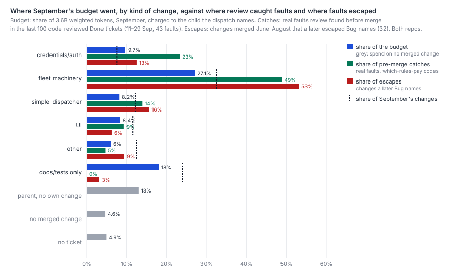
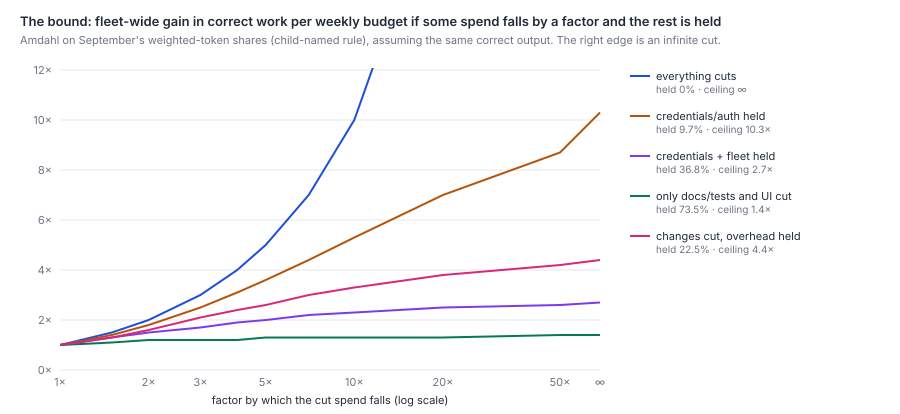
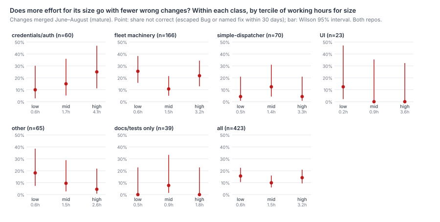
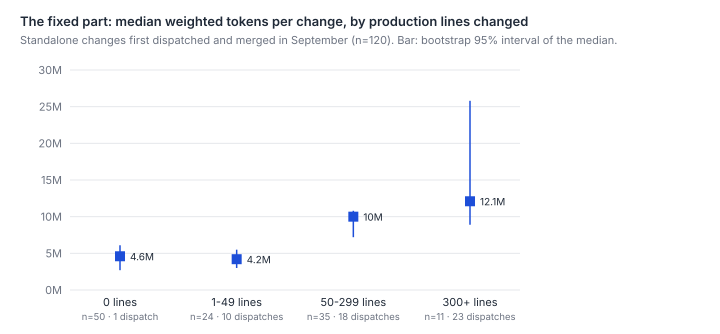

# Where does Harbour's weekly budget go by kind of change, and where does more effort buy correctness?

Most of it goes where review rarely catches anything, and the part that must stay rigorous is
small. In September the fleet spent 3.6 billion weighted tokens. A quarter of that went to
proxy, dispatch and fleet machinery, over a third of it the rulings feed and the Flight
Companion that the class's paths take in. A fifth went to work that merged no change of its own:
parent tickets, unmerged tickets and sessions with no ticket. A tenth went to the survey papers.
Credential and auth work took only a tenth. Review's real catches do not follow the budget. In
the last 100 reviewed tickets every one of the 43 real faults found sat in a change of 50
production lines or more, three-quarters of them in changes of 300 or more, and none in the 23
small or docs-only changes, though across June to September review caught a real fault on about
2 in 100 small changes. Escapes run at 1.3 to 3 in 100 small changes, depending on whether faults
that later reviews found are counted, and at 2 to 4 in 100 larger ones. So the curve from effort
to correctness is steep for large changes and for credential and fleet machinery. It is shallow
for small changes and docs, where review catches little and little escapes. Amdahl's law then
sets the bound. Hold credential work at today's cost and cut everything else by a factor of
three, and a weekly budget buys at most 2.5 times the correct work. Cut everything else by ten
and it buys 5.3 times. The ceiling, with everything else free, is about ten. Two other limits
bind sooner. At least half of what a standalone change costs does not depend on its size. A
split family of tickets costs 1.8 times what its children would have cost as standalone
tickets.



The figures were drawn for version 1 and still show its escape counts. The tables are version 2's.



## Findings

**A quarter of September's budget went to fleet machinery. A fifth went to work that merged
nothing of its own, and only a tenth to credential and auth work.** Every weighted token in the
local transcripts of September's dispatched sessions was charged to a ticket. Each ticket was
then classed by the production paths its merged change touched; Method gives the rules. Both
repos are in every row. The budget columns are September only, because transcripts on this
machine begin on 31 August.

| Kind of change | Tokens, Sep (child named) | Tokens, Sep (session entered) | Dispatches, Aug | Dispatches, Sep (child / session) | Working hours, Aug / Sep merges | Changes merged, Aug / Sep |
|---|--:|--:|--:|--:|--:|--:|
| credentials, auth, migration, security | 9.7% | 10.3% | 7.4% | 12.1% / 11.2% | 11.7% / 9.9% | 30 / 25 |
| proxy, dispatch and fleet machinery | 27.1% | 27.7% | 35.1% | 25.2% / 23.6% | 45.7% / 42.4% | 116 / 107 |
| simple-dispatcher | 8.2% | 8.3% | 7.4% | 8.0% / 6.8% | 12.6% / 11.0% | 30 / 40 |
| UI | 8.4% | 9.2% | 2.6% | 8.6% / 8.3% | 4.1% / 9.8% | 14 / 38 |
| other product code | 6.0% | 6.0% | 11.5% | 5.3% / 4.6% | 17.9% / 10.3% | 48 / 41 |
| docs and tests only | 18.0% | 18.2% | 5.5% | 20.6% / 22.3% | 8.1% / 16.7% | 33 / 79 |
| parent ticket, no change of its own | 13.0% | 11.6% | 13.7% | 13.2% / 16.7% | – | – |
| ticket with no merged change | 4.6% | 4.0% | 4.1% | 5.7% / 5.2% | – | – |
| no ticket | 4.9% | 4.6% | 12.5% | 1.3% / 1.3% | – | – |
| **Total** | **3,593M** | | **5,398** | **9,523** | | **271 / 330** |

The two charging rules move little. Charging each token to the session it was spent in, rather
than to the ticket of the dispatch item being worked, moves 8% of the budget between tickets but
at most 1.4 points between rows. A third of what moves leaves a parent for its children. Dispatches in August come
out the same under both rules, because wakes began naming their child only on 13 September.
Hours are each merged change's whole working life from the runner's oplog. They cover only
merged changes, so they have no overhead rows.

Three rows need a word. **Docs and tests only** includes the survey papers, which took 10.0% of
September's tokens by themselves. That is research spend, not the cost of a change. **Parent, no
change of its own** is the orchestration of split tickets, the V1 passage (LIN-3099) among them.
**No ticket** is mostly sessions that never fetched an item naming one: diagnostics and ad hoc
prompts. In August it also includes dispatches whose log names no issue.

**Fleet machinery** is broader than its name. Its path rule includes the rulings feed, the Flight
Companion, briefs, recaps and periodicals. Twenty-one of its 91 tickets with September spend are
rulings, Flight Companion and scan-due work by title, read by hand: 9.7 of its 27.1 points
(`survey-check-9.md`). The credential rule, by contrast, mostly finds credential work. Three
tickets that are not credential work are filed under it (LIN-3139, LIN-3130 and LIN-2360), under
1% of the budget.

**By size, the budget sits in the middle and large changes. By shape, children of a split take
as much as standalone tickets.** Of September's tokens, changes of 0 lines took 18.0%, 10 points
of it the papers. Changes of 1–49 lines took 7.3%, 50–299 lines 24.0% and 300 or more 28.3%. The
rest, 22.5%, merged no change. By ticket shape, children of a split took 38.7%, standalone
tickets 36.9% and parents 19.7%, counting a parent's own change where it had one. Of the 601
changes merged in August and September, 366 were standalone, 218 were children and 17 were
parents with a change of their own. In credential and UI work, the children carry most of the
spend: 293M of credentials' 349M, and 215M of UI's 302M.

**Review's real catches follow size, not the budget.** `which-rules-pay.md` followed every
finding on the last 100 Done tickets that went through code review, 11–29 September, and coded
44 real faults on 18 tickets. Its codes are committed. Joined to this paper's classes:

| Kind of change | Coded tickets | Real faults | Tickets with one | Faults per 100M review and plan-review tokens |
|---|--:|--:|--:|--:|
| credentials, auth | 9 | 10 | 2 | 23 |
| fleet machinery | 34 | 21 | 9 | 31 |
| simple-dispatcher | 6 | 6 | 1 | 39 |
| UI | 9 | 4 | 3 | 37 |
| other | 11 | 2 | 2 | 9 |
| docs and tests only | 6 | 0 | 0 | 0 |

| Size of change | Coded tickets | Real faults | Tickets with one |
|---|--:|--:|--:|
| 0 production lines | 6 | 0 | 0 |
| 1–49 | 17 | 0 | 0 |
| 50–299 | 31 | 11 | 9 |
| 300+ | 21 | 32 | 8 |

Eight coded tickets merged no change of their own. One of them, LIN-3035, holds the 44th fault.
Within each class, the catches sit on a few large tickets:
- credentials: LIN-3124 has 8 of the 10;
- fleet machinery: LIN-2934 has 10 of the 21;
- simple-dispatcher: LIN-2837 has all 6.

The earlier samples point the same way:
- **`reliability-baseline.md`'s blockers.** Its 1-in-8 sample from June to September has 24 bug
  blockers, 22 of them from code review. Fifteen are on changes of 300+ lines, eight of them
  LIN-2081's credential work. One is on a change under 50 lines.
- **`proportional-process-backtest.md`'s light group.** Review and plan review found real faults
  on small changes, but rarely: on 8 of the 328 changes its small, low-risk rule routed light,
  11 of 15 findings at plan review. Five of those eight were docs-only, and three were small code
  changes. At that rate, 23 changes show no catch about half the time, so the 0 of 23 above says
  little on its own. Separately, 5 of that rule's 249 mature light changes went wrong after merge.

**Escapes follow size weakly, and class more.** Each escaped Bug that names the change that
introduced it was charged to that change. The table counts changes merged June to August, which
have had at least 30 days to show a fault. The intervals are Wilson 95%.

The first column counts every such Bug, 34 of them. The second uses `reliability-baseline.md`
v2's terms, which leave 18. That removes review residue, a Bug filed from another ticket's review
ledger. It also removes finder rows, where the named ticket is the one whose review found an
older fault (`survey-check.md`). Neither is exact. Some residue does name the change that wrote
the fault, such as LIN-2272 against LIN-2252.

| Kind of change | Changes, Jun–Aug | Every named escape | Without residue and finder rows |
|---|--:|--:|--:|
| credentials, auth | 78 | 4, 5.1% (2.0–12.5) | 4, 5.1% (2.0–12.5) |
| fleet machinery | 388 | 17, 4.4% (2.8–6.9) | 9, 2.3% (1.2–4.3) |
| simple-dispatcher | 140 | 5, 3.6% (1.5–8.1) | 2, 1.4% (0.4–5.1) |
| UI | 134 | 2, 1.5% (0.4–5.3) | 0 (0–2.8) |
| other | 172 | 3, 1.7% (0.6–5.0) | 2, 1.2% (0.3–4.1) |
| docs and tests only | 92 | 1, 1.1% (0.2–5.9) | 0 (0–4.0) |
| 1–49 lines (any class) | 297 | 9, 3.0% (1.6–5.7) | 4, 1.3% (0.5–3.4) |
| 50–299 lines | 434 | 16, 3.7% (2.3–5.9) | 9, 2.1% (1.1–3.9) |
| 300+ lines | 181 | 6, 3.3% (1.5–7.0) | 4, 2.2% (0.9–5.5) |

Credential and fleet work escape more often than UI and other code under either count, and fleet
machinery holds about half the escapes under both. Every interval overlaps, though, and only
about one escaped Bug in six names its introducer at all (`measuring-throughput.md`).

By size, counting every Bug gives a flat 3 in 100. On v2's terms small changes escape at about
half the rate of larger ones, the order `reliability-baseline.md` found on total lines (0.7, 1.2
and 2.5 per 100). Put the tables together:
- **Large changes:** review catches several faults per change, and their escape rate is no lower
  than a small change's. More checking buys correctness here.
- **Small changes:** review catches a real fault on about 2 in 100 across June to September, and
  they escape at 1.3 to 3 in 100. Both rates are low and close. Neither table can say how much of
  the escape rate review would have prevented.

**Within a class, more effort for a change's size does not go with fewer wrong changes.**
Mature changes with runner hours, 423 of them, were split within each class into terciles of
working hours for their size. These are mostly July and August changes, because the oplog starts
on 12 July. "Wrong" is the scorecard's "not correct": an escaped Bug or a named fix commit within
30 days.

Pooled, the least-worked third went wrong 15.6% of the time (10.5–22.5), the middle third 9.9%
(6.0–16.0) and the most-worked third 14.2% (9.4–20.9). Within the classes:
- **Credentials:** the most-worked third went wrong most often, 5 of 20 against 2 of 20 for the
  least-worked. Hours follow trouble here; they do not prevent it.
- **Fleet machinery:** U-shaped, at 14 of 55, 6 of 56 and 12 of 55.
- **UI, other, and docs and tests:** too few changes, or too few wrong ones, to read.

No class shows a curve that falls outside its intervals. So at today's levels the steep part of
the effort–correctness curve lies between kinds and sizes of change. It does not appear as a dose
response within one. By class, the rate of wrong changes is ordered like the escapes:

| Class | Wrong (95%) |
|---|--:|
| credentials | 16.7% (10.0–26.5) |
| fleet machinery | 15.7% (12.4–19.7) |
| simple-dispatcher | 13.6% (8.9–20.2) |
| other | 7.6% (4.5–12.5) |
| docs and tests | 4.3% (1.7–10.7) |
| UI | 3.0% (1.2–7.4) |



**The bound: credentials cap the gain at about ten. A gain of five needs everything else at a
tenth of today's cost.** The gain in correct work per weekly budget is 1 / (held share + cut
share ÷ factor) if the output stays the same. The shares are September's tokens, child-named
(session-entered in brackets).

| What keeps today's cost | Held share | ×2 | ×3 | ×5 | ×10 | ceiling |
|---|--:|--:|--:|--:|--:|--:|
| nothing | 0% | 2.0 | 3.0 | 5.0 | 10.0 | none |
| credentials and auth | 9.7% (10.3%) | 1.8 | 2.5 | 3.6 | 5.3 | 10.3 (9.7) |
| credentials and fleet machinery | 36.8% (38.0%) | 1.5 | 1.7 | 2.0 | 2.3 | 2.7 (2.6) |
| all spend that merged no change of its own | 22.5% (20.3%) | 1.6 | 2.1 | 2.6 | 3.3 | 4.4 (4.9) |
| everything except docs, tests and UI | 73.5% (72.5%) | 1.2 | 1.2 | 1.3 | 1.3 | 1.4 (1.4) |

The bound barely moves if the September mid tier is weighted at its list ratio, 0.4 of the
frontier tier rather than 0.6 (Limits). It becomes 2.5×, 5.2× and a ceiling of 9.9, or 2.8 with
fleet machinery held.

Two classes dominate the bound. Credentials are small, so holding them alone still allows about
ten. Fleet machinery is a quarter of the budget, carries half of review's catches and half of the
escapes, and has the second-highest escape rate. If rigour has to stay there too, the ceiling
falls to 2.7. That counts the class's rulings, Flight Companion and scan-due work, 9.7 points of
it, as machinery. Cut too, they would leave a ceiling of about 3.7. A light lane for docs, tests and UI alone, the obvious first tier, is worth at most
1.4. The overhead rows are a fifth of the budget, so even a perfect process for the changes
themselves would stop at 4.4 if overhead stayed.



**At least half of a standalone change's cost is fixed.** These are standalone changes whose every dispatch
fell in September, so all of their spend is in the transcripts. Children are left out because
part of their work is spent in their parent's session.

| Size | Changes | Median tokens (95%) | Median dispatches | Median working hours |
|---|--:|--:|--:|--:|
| 0 production lines | 50 | 4.6M (2.7–6.1) | 1 | 0.7 |
| 1–49 | 24 | 4.2M (3.0–5.5) | 10 | 0.9 |
| 50–299 | 35 | 10.0M (7.2–10.8) | 18 | 2.0 |
| 300+ | 11 | 12.1M (8.9–25.8) | 23 | 2.5 |

A change of a few lines still costs about 4 million weighted tokens, ten dispatches and an hour
of work. A change of a few hundred lines costs only two to three times that. If every one of these
120 changes had cost the 1–49-line median, they would have cost 49.6% of what they did. That
floor is a lower bound on the fixed part, and 50 of the 120 are docs-only changes, mostly papers.
A linear fit of tokens on production lines over the 70 code changes puts the intercept at 7.8M of
an 8.8M mean. So a process that shrank only the size-dependent work would raise output per budget
by somewhere between about 1.1× and 2×. A
large multiple needs the fixed part to fall: orientation, gates, supervision, wakes. That is
where the sibling papers look (`starting-context.md`, `held-or-fresh.md`, `step-overlap.md`).

**Splitting is common, and a split family costs about 1.8 times its children's standalone
equivalent.** In August and September, 36% of merged changes were children of a split. Twenty-five
families had their parent first dispatched in September, with 82 merged children. Together they
spent 1,572M tokens, 44% of the month. Had each child cost the standalone mean for its size band,
they would have spent 889M. The parent's own sessions were 39.5% of the family's spend. Across all 26 families with
September spend, the parent adds 52% on top of its children when charged to the child named, and
56% when charged to the session entered. This overstates what splitting itself adds, because work is split when it is large or
uncertain. Children cost more than standalone changes of their size even before the parent's spend
(951M against 889M), so about 0.1 of the 1.8× is the children themselves. It is still the largest
single lever on the fixed part that the data show.

**Correct, complete changes per budget: about 71 per billion weighted tokens, or 14M per change.** September's merges are scored on the scorecard's terms, and they are provisional because their
30-day window is still open. The fleet spent 3,593M weighted tokens and merged 330 changes, of which
254 were correct and complete: 14.1M each, or 70.7 per billion. That sits inside
`measuring-throughput.md`'s weekly range of 11.4–16.0M. With the mid tier at its list ratio it is
13.0M.

Charging each class only its own spend leaves out the fifth that merged no change of its own:

| Class | Tokens per correct change | Correct changes per billion |
|---|--:|--:|
| credentials | 16.6M | 60 |
| simple-dispatcher | 14.1M | 71 |
| fleet machinery | 11.7M | 85 |
| UI | 11.6M | 86 |
| docs and tests | 9.1M | 110 |
| other | 6.8M | 147 |
| all classes | 11.0M | 91 |

Docs and tests include the papers, whose output is research rather than changes. The per-class
figures understate what each class costs, because the overhead rows are not allocated.

**John's meter is the same measure in other units, and September's fleet roughly filled it.**
There is one calibration of the weekly meter. On 14 August it moved 27 points while the fleet
spent $1,070.58 at list prices (`lib/weekly-budget.js`). LIN-2113 later found that the pricing
table of that day understated spend by 18.2%. At $5 per million weighted tokens, one weekly
allowance is therefore about 793–937M weighted tokens: the +18.2% is a markup on the day's
priced spend. September's fleet spent 838M a week, which is 0.89–1.06 allowances a week from
Harbour alone. These weights price the September mid tier at 0.6 of the frontier tier, but the
list table that priced the calibration day has it at 0.4. At list ratios September is 773M a week,
0.82–0.97 allowances. On this machine, other projects were 1.5% of
September's Claude tokens. Use on claude.ai and on other machines is invisible here. Three things
follow:
- **The meter's units are nearly this paper's units.** The meter is a share of a list-price-like
  budget. Weighted tokens are list-price ratios for the frontier and cheap tiers, and overweight
  the September mid tier by half. The conversion is one constant that one more paired reading
  would pin down.
- **Today's correct work is probably capped by the allowance, not by demand.** At about one
  allowance a week, any gain should show as more correct changes per week, not as a lower meter
  reading. That is an inference from being near one, not a measurement.
- **A multiple of correct work per budget is the same number as a multiple of correct changes
  per weighted token.** That makes the scorecard's tokens-per-correct-change the measure to
  track.

## Options

Each option is a choice for John, sized from the data above. None has been tried. The multiples
use September's shares under the child-named rule and assume the same correct output.

| Option | Estimated gain in correct work per budget | Evidence | Risk to correctness | How the scorecard would measure it |
|---|---|---|---|---|
| **1. A light lane for small, non-credential changes** (0–49 production lines; survey papers excluded) at a third of today's cost | 1.1× (1.08× at a half, 1.14× at a fifth) | Small changes are 15.3% of the budget. Review found no real fault on the 23 small or docs-only changes it coded in September, and on 8 of 328 across June to September. They escape at 1.3–3 in 100, no more often than large changes | Low. Review caught a real fault on 8 of the backtest's 328 small low-risk changes, mostly at plan review, and some of those would ship. 5 of its 249 mature light changes went wrong after merge even with today's process | Tokens per correct change in the 1–49 band, which shows first. Its escape rate, with intervals: at about 75 small changes a month, a doubling from 1.3–3 in 100 would take a year or more to see |
| **2. Lighter orchestration of split families** (parents at half their spend) | 1.1× alone, 1.2× with option 1 | Parent-only spend is 13% of the budget, and families cost 1.8× their children's standalone equivalent | Low to moderate. Parents hold the cross-child checks. The V1 passage is live and its data are fair to read | Family spend divided by children's standalone equivalent, monthly. Escapes on children |
| **3. Cut the fixed part** (orientation, gates, wakes) by half, everywhere | 1.3× | Half of a small change's cost does not depend on its size. Supervision is 35% of tokens (`where-the-effort-goes.md`) | Depends on what is cut. The sibling papers size each piece | Median tokens for a 1–49-line standalone change. Today it is 4.2M (3.0–5.5) |
| **4. Size the gates to the change:** keep today's process for credentials and 300+ line changes, halve the rest | 1.2× on the 0–299-line changes it touches; 1.5× only if the papers', parents' and unmerged spend halve too | 32 of 43 coded faults were in 300+ line changes, and none in 0–49 | Moderate. The 50–299 band holds 11 of 43 catches and 2.1–3.7% escapes | Catches per 100M review tokens by band (today 0 at 0–49). Escapes by band |
| **5. Hold credentials; cut everything else to a third** | 2.5× | The Amdahl table above | High. Fleet machinery carries half the catches and half the escapes | All of the above. Escapes in fleet machinery would show first |
| **6. Hold credentials; cut everything else to a tenth** | 5.3× | The Amdahl table above | Very high on today's evidence | Same as option 5 |

Options 1 to 4 together come to about 1.7–1.8×, not their product, because they cut the same spend.
For example, holding credentials and 300+ line changes, halving everything else, and cutting the
held work's fixed part by half gives 1.74×. That example halves the papers', parents' and unmerged
spend as well. Beyond
that the evidence offers nothing yet. Reaching 5× or more needs fleet machinery to become cheap
without its catches moving into escapes. No paper has measured whether that is possible.

## Method

**Population.** Every first-parent merge on `origin/main` since 1 June in LinearViewer
(26014544) and simple-dispatcher (33667480), grouped into one change per ticket by
`survey-effort-git.mjs`'s rule: the union of merges whose branch or merged subjects carry the
LIN-id, dated by the last merge. That gives 1,337 changes. Tokens are September's only, from the
local Claude Code transcripts of every session in a simple-dispatcher workspace (1,960 sessions,
subagents included).

**Classes.** These were fixed in the script before any cost or outcome was joined. Test, doc and
noise paths follow `survey-effort-git.mjs`, with one change: the survey papers' own
`scripts/survey-*` and `scripts/steady-base-*` count as docs. The first matching rule wins:
1. **Credentials, auth, migration, security:** any production path in either repo matching
   `survey-effort-git.mjs`'s high-risk regex, unchanged.
2. **Simple-dispatcher:** production code in that repo only.
3. **Fleet machinery:** LinearViewer's proxy, dispatch, runner and passage routes; its dispatch,
   wake, scheduler, prompt, autopilot, observation and cost-telemetry modules (the regex is in
   the script).
4. **UI:** every production path under `public/`, `lib/components/`, `lib/render*.js` or `.css`.
5. **Docs and tests only:** no production lines.
6. **Other:** everything else.

A change with production code in both repos takes its LinearViewer class.

**Size bands and shape.** Size bands are the scorecard's: 0, 1–49, 50–299 and 300+ production
lines, added plus deleted. Shape comes from the tracker snapshot's parent field:
- **child:** the ticket has a parent;
- **parent:** some ticket names it as parent;
- **standalone:** neither.

**Weighted tokens.** The weights are `fleet-complexity-read.md`'s, as coded in
`survey-effort-fleet.mjs`, in frontier-input-token units:
- input 1, output 5, cache read 0.1, one-hour cache write 2, five-minute cache write 1.25;
- the mid tier counts at 0.6 of the frontier tier and the small tier at 0.2.

Each message id is counted once and dated by its own timestamp.

**Charging.** Each assistant message is charged to a ticket in two ways:
- **Session entered:** the ticket in the session's `# LIN-n · kind` header. A session with no
  header takes the first dispatch item it fetched.
- **Child named:** the `issueIdentifier` of the last dispatch item the session fetched before the
  message.

**Dispatches.** Dispatches are the runner's claimed items that opened, resumed or signalled a
session (`survey-doubling-runner.mjs`). They are charged to the item's own `Issue:` line (child
named) or to the ticket of the item that created its session (session entered).

**Hours.** Working hours are `survey-effort-runner.mjs`'s phase clock.

**Catches and escapes.**
- **Catches** are `which-rules-pay-codes.json`'s `realFault` findings. Review spend is the
  session-entered tokens of review and plan-review sessions on those tickets.
- **Escapes** are `reliability-baseline-defects.json`'s `escaped` verdicts that name an
  `introducedBy`.
- **Correct and complete** are the scorecard's (`survey-scorecard.mjs`, cut 30 September).

**The curve.** Each mature change's working hours were regressed on its production lines (logs
of both). Within each class, the residual splits the changes into terciles.

**Fixed part and families.**
- **Fixed part:** read on standalone changes whose first claimed dispatch was on or after 1
  September and that merged in September, with no OpenCode dispatch.
- **Families:** a parent first dispatched in September, with its children merged in September
  or October.

```sh
node scripts/survey-costmix-classes.mjs                    # classes, sizes (git; both clones fetched)
node scripts/survey-costmix-tokens.mjs                     # September tokens per ticket, both rules (~/.claude/projects)
node scripts/survey-doubling-runner.mjs --out data/survey-costmix/dispatch-items.json
node scripts/survey-effort-git.mjs && node scripts/survey-effort-runner.mjs
node scripts/survey-growth-fleet.mjs --json > data/survey/scorecard-fleet.json
node scripts/survey-reliability-github.mjs data/survey/reliability-github.json --since 2026-05-01 --until 2026-10-01
node scripts/survey-reliability-tracker.mjs data/survey/reliability-tracker.json --pace 7500      # proxy; see Limits
node scripts/survey-scorecard.mjs
node scripts/survey-costmix-analyse.mjs                    # every table and figure number
node scripts/survey-costmix-figures.mjs                    # docs/papers/harbour/figures/cost-mix/
```

## Limits

- **One month of tokens.** Transcripts on this machine start on 31 August, so the budget columns
  are September's alone. August appears only as dispatches and hours. A survey wave and the V1
  passage were both running in September. That inflates docs and tests (the papers) and the
  parent row (the passage) against a quieter month.
- **The transcripts miss some spend.** Not counted:
  - cheap-tier calls on the app side, which `where-the-effort-goes.md` puts under 0.1%;
  - OpenCode sessions, which write no transcript;
  - any fleet use on another machine.

  All three bias the budget down. The first is negligible. The second leaves out the cheap
  implementer's share from 25 September, which would sit mostly in the change classes.
- **Classes are path rules.** The credential regex reads file names. It misses credential logic
  inside `routes/proxy.js`, which lands under fleet machinery, and it catches modules such as
  `refresh-strategy.js` that are not credential code. Both errors move cost and catches between
  the two classes that the bound holds. A change touching both repos takes its LinearViewer
  class.
- **Children understate and parents overstate their own cost.** A stepper or lane often works a
  child inside the parent's session, so even the child-named rule leaves some of a child's work
  on the parent. That is why the fixed-cost table uses standalone changes only. Families are
  selected for being large or uncertain, so the 1.8× overstates what splitting itself adds.
- **Catches are one month and a census of reviewed tickets only.** `which-rules-pay.md` codes
  83 of its 100 tickets. The other 17 changed nothing after their first review and are not in
  the codes file, so their classes are unknown. The per-class counts are too high by up to 17
  tickets' worth of zeros. Most of those are probably small changes, which would only sharpen
  the size gradient. Faults per 100M review tokens use September's spend on tickets that may have
  started in August, which biases the rate up.
- **Escapes are floors, and their convention matters.** About one escaped Bug in six names its
  introducer. Sixteen of the 34 named here are review residue or finder rows, which
  `reliability-baseline.md` v2 removes; the Findings give both counts. If credential faults are reported
  more readily, their rate is biased up against the other classes. Counts are too small for the
  class differences to be more than suggestive.
- **The curve is observational.** Working hours for size measure struggle as much as rigour. A
  change that went wrong and was reworked before merge has more hours and also more chances to
  be named. Both push toward a positive slope that is not causal.
- **The bound assumes the same correct output.** It is the best case for each cut. It cannot see
  a cut that moves catches into escapes, which is exactly the risk in fleet machinery.
- **The weights are list ratios for the frontier and cheap tiers only.** `fleet-complexity-read.md`
  set the mid tier at 0.6 when its list price was 0.6 of the frontier tier's. The September mid
  tier lists at 0.4 and carried 23.6% of weighted tokens. So the totals here are about 8% above
  list ratios. Shares move by under 1.5 points and the bound by under 0.4.
- **The meter conversion rests on one day.** That day included about two hours of ramp below the
  first reading and "not much" personal use. Model prices and the subscription's own accounting
  may have changed since, and the conversion assumes the meter counts cache reads at list ratios.
- **The tracker snapshot was partial.** Bug details were fetched only for the Bugs the scorecard
  needs dates for, those naming an introducer. The paging at 8 calls a minute hit repeated 503s,
  which `survey-reliability-tracker.mjs` now retries.

## Next

The bound turns on one unmeasured thing: whether fleet machinery can be made cheap without its
catches becoming escapes. The data here cannot tell a fleet change that needed its four rounds
from one that did not. The next study would take September's fleet-machinery changes with a
real catch and those without one. For each it would ask whether a plan-time signal visible
before any review (size, paths, a new endpoint or wake path, a cross-repo contract) separates
them. The question is in `proposals.md`.
