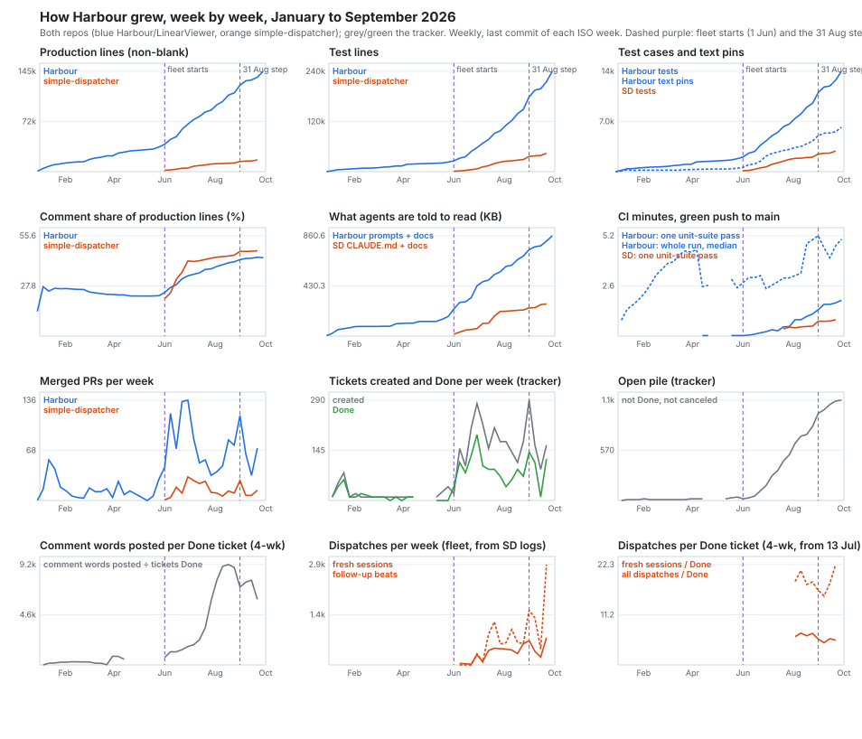
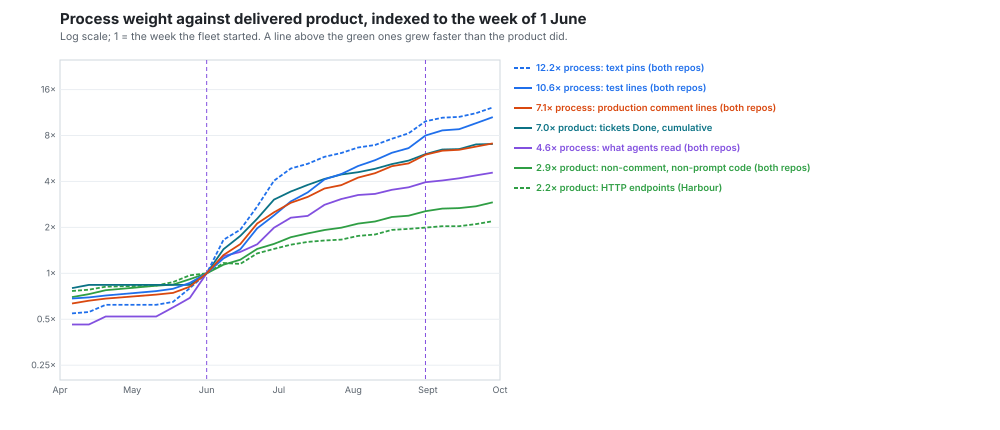
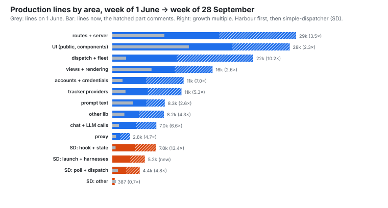

# The growth atlas — how has Harbour grown since January, and where?

Mostly after June, and mostly in the process around the product rather than in the product
itself. The fleet started on 1 June. Between then and 28 September, Harbour's production code
grew 3.7×, its tests 9.3×, and what its agents are told to read 3.7×. simple-dispatcher's code
grew 8.4× and its tests 42×. The code grew fastest in the fleet's own machinery: Harbour's
dispatch and fleet code grew tenfold and simple-dispatcher's hook and state machine thirteenfold. The views a user sees grew
2.3–2.6×.

Process weight is outrunning delivered product. Product code grew 2.9× across both repos and
Harbour's endpoints 2.2×. Test lines grew 10.6×, text pins 12.2× and comment lines 7.1×. The gap shows
per delivered ticket too:

- the product code each Done ticket brings has held at 24–41 lines a month;
- the test lines it brings went from 75 in June to 184–237;
- the comment words posted went from about 1,600 to 6,000–7,500;
- the dispatches went from about 16–18, from mid-July to August, to about 22 in September.

The one process series that tracks delivery is the reading load. It adds a steady 36–41 KB a
week, about 0.4–0.8 KB per Done ticket in every month. Almost nothing has shrunk. There was one
real removal, simple-dispatcher's SDK runner and Slack bot in July. `CLAUDE.md` shrank only by
moving into `docs/architecture/`. Since June nothing has levelled off except the rate of
product code, which has stayed at about 2,800 lines a week.



## Findings

**Process weight is outrunning delivered product, and the gap holds per delivered ticket.**
The figure indexes each series to the week of 1 June. The process series finished 4.6× (what
agents read, both repos; Harbour alone 3.7×) to 12.2× (text pins) above their June level.
Product finished 2.2× by Harbour's endpoints and 2.9× by code with no comments and no prompt
text. June is a step, so every multiple depends on the base week: from 8 June, pins are 7.4×
and product code 2.6×; from 6 July, 2.5× and 1.7×. At every base from 25 May to 6 July each
process series still outgrows product code. It finished 7.0× by cumulative Done tickets,
but that measure starts from a small base: the tracker held only about 250 Done tickets before
the fleet. Divided by the tickets Done in each month (both repos' git; the tracker sample for
Done and comments):

| Month | Done | Product lines per Done | Test lines per Done | Comment lines per Done | Reading KB per Done | Comment words posted per Done | Merged PRs per Done |
|---|--:|--:|--:|--:|--:|--:|--:|
| Jun (5 wk) | 550 | 34 | 75 | 31 | 0.6 | 1,602 | 1.0 |
| Jul (4 wk) | 350 | 36 | 160 | 36 | 0.8 | 5,894 | 0.9 |
| Aug (5 wk) | 400 | 41 | 237 | 55 | 0.6 | 7,519 | 1.1 |
| Sep (3 wk) | 240 | 24 | 184 | 32 | 0.4 | 6,751 | 0.8 |

A Done ticket brings about one merged PR and a similar amount of product code in every month.
It brings 2.5 to 3 times the tests and about 4 times the written conversation it did in June.
September stayed well above June. The Done counts are a one-in-ten sample, good to about ±15%
a month. A second one-in-ten sample (every Done ticket numbered …5) puts August at 500, and
the two together at 445. On that count August brings 37 product lines, 213 test lines and
about 6,600 comment words per Done ticket, level with September rather than a peak above it. The reading load is the
exception. It grows in step with delivery, not ahead of it. `ticket-record-and-quality.md`
found that, over 184 Done tickets, the size of this written record predicts nothing about
first-pass review approval. `review-loops.md` found that the review loops, which write much
of it, cost about a third of session time.



**June is the step in every series, and 31 August is a second one in the tests.** Harbour merged
300 PRs in the 21 weeks to the end of May, about 14 a week. It merged 970 in the 13 weeks from June to August, about 75 a week.
Harbour's production code went from 1,835 net lines a week before June to 5,998 after. The week of 31 August added the most test lines of any week, 29,781 net in Harbour, with 115
Harbour PRs, 27 simple-dispatcher PRs and 2,288 dispatches. More PRs merged in the weeks of 22
and 29 June (134 and 136), and more dispatches ran in the week of 21 September (3,725). The
week has no single cause. Its largest test additions came from eight different tickets. Net
test lines per week rose from 9,711 over June to August to 18,172 from 31 August on, or 15,269
in the weeks after the step week itself. Harbour's product code did not
follow: 2,872 net lines a week, excluding comments and prompt text, from June to August, and 2,709 since.

**The code grew most in the fleet's own machinery.** Between the weeks of 1 June and 28 September:



| Repo | Area | Lines, 1 Jun | Lines, 28 Sep | Growth | Net lines a week, Jun–Aug → since 31 Aug |
|---|---|--:|--:|--:|--:|
| Harbour | dispatch + fleet | 2,205 | 22,421 | 10.2× | 1,033 → 1,392 |
| Harbour | accounts + credentials | 1,628 | 11,342 | 7.0× | 452 → 781 |
| Harbour | chat + LLM calls | 1,057 | 7,004 | 6.6× | 291 → 450 |
| Harbour | tracker providers | 2,095 | 10,999 | 5.3× | 641 → 207 |
| Harbour | proxy | 597 | 2,784 | 4.7× | 118 → 130 |
| Harbour | routes + server | 8,291 | 29,249 | 3.5× | 1,321 → 986 |
| Harbour | views + rendering | 6,242 | 15,952 | 2.6× | 651 → 308 |
| Harbour | prompt text (code lines) | 3,246 | 8,346 | 2.6× | 287 → 407 |
| Harbour | UI (public, components) | 12,179 | 28,234 | 2.3× | 829 → 1,275 |
| simple-dispatcher | hook + state | 519 | 6,958 | 13.4× | 379 → 480 |
| simple-dispatcher | launch + harnesses | 0 | 5,178 | new | 299 → 324 |
| simple-dispatcher | poll + dispatch | 906 | 4,353 | 4.8× | 197 → 292 |

(simple-dispatcher's last snapshot is 21 September; it had no commits in the final week.) The
parts that dispatch, watch and pay for agents grew fastest: dispatch and fleet tenfold in
Harbour, and the hook and state machine thirteenfold in simple-dispatcher. The parts a user looks at, views and UI,
grew least, although UI has picked up again since 31 August. Two areas have slowed to under half
their summer pace: tracker providers and views. None has stopped. Comments are now a third to a half of every
area's lines. The share is highest in the fleet and credential code: 54% in dispatch and fleet,
53% in accounts and credentials, and 48% in simple-dispatcher's hook and state machine. It is
lowest in the UI, at 33%.

**Tests outgrew the code in both repos, and the suite's run time grew faster still.** Test lines
per production line went from 0.66 to 1.66 in Harbour and from 0.52 to 2.62 in
simple-dispatcher. Harbour's test cases went from 2,059 to 14,097. The regex count includes 1,566 e2e and 80
visual cases. Its unit-only count, 12,451, is 9% under the 13,690 that `node --test` reports at
HEAD. Text pins are assertions that a string is or is not in
some text. Harbour's went from 580 to 6,234 and simple-dispatcher's from 28 to 1,195.
`steady-base.md` counted only the prompt test files and found 279 at the end of June and 493
at the end of September, so most pins are outside the prompt tests. One pass of Harbour's unit suite on CI took 0.23 minutes in the last week of June, 0.85 in the
first week of August, 1.38 in the week of 31 August and 1.9–2.2 in the last week, depending on
which run is read. That is 8–10× since late June, while test lines grew 4.2×. `fleet-complexity-read.md` found about
70% of the lines added in three sampled PRs were tests. The weekly series says the same of the
whole repo: tests were 40% of Harbour's net added lines before June, 62% from June to August, and
75% since 31 August. Since LIN-1880 (4 September), CI runs the suite twice, so the unit job itself
takes 4.5 minutes. The whole run, with the four e2e shards in parallel, went from a median 2.8
minutes in the week of 1 June to 5.1 now. simple-dispatcher's single pass went from 0.37 minutes
in July to 0.85.

**What agents are told to read grew by about 37 KB a week in Harbour, steadily, since June.**
Excluding the proxy instructions catalogue, Harbour's prompt text and agent docs went from 24 KB
in the first week of January to 233 KB on 1 June and 861 KB now. It added 8.9 KB a week before
June, 40.9 KB a week from June to August and 35.7 KB a week since. simple-dispatcher's
`CLAUDE.md`, README and `docs/` went from 16 KB to 276 KB. At HEAD, Harbour's total is:

- worker templates, 203 KB;
- other `lib/prompts/` templates (roadmap, chat, lane kickoffs), 164 KB;
- `docs/architecture/` including `prompt-system.md`, 165 KB;
- proxy instructions catalogue, 106 KB (not in the series);
- meta-prompt, 104 KB;
- lane and passage prompts, 68 KB;
- autopilot kickoff and manual, 63 KB;
- operating manual, 44 KB;
- proxy preamble, 41 KB;
- `CLAUDE.md`, 10 KB.

This is the load on the system, not on any one session. `steady-base.md` found the dispatched
prompt is about 2% of what a worker carries, and that a cheap-tier model reads the meta-prompt to
write it. The weekly growth is steady rather than accelerating. The worker templates slowed from
9.0 KB a week to 4.0 KB, and the meta-prompt from 5.4 KB to 3.8 KB. Since 31 August the growth
has moved next door:
- lane and passage prompts went from 45 KB to 68 KB;
- the proxy preamble went from 25 KB to 41 KB;
- `CLAUDE.md` and `docs/architecture/` together went from 144 KB to 175 KB, through and after
  the split.

**Almost nothing shrinks.** Harbour has 38 weekly snapshots. In none of them did production
lines, comment lines, test lines or test cases fall from the week before. The same holds for
simple-dispatcher's 18. The declines we found:

- `CLAUDE.md` fell 144,671 bytes in the week of 14 September (LIN-2896). The text moved into
  `docs/architecture/`, as `steady-base.md` found.
- The meta-prompt fell in three weeks, by at most 840 bytes.
- Harbour's text pins fell once, by 93, in January.
- Harbour's endpoint count fell once, by 2, in June.
- simple-dispatcher deleted a whole substrate. LIN-910 (2 July) removed the SDK runner and the
  Slack bot, 563 production lines. That is the one deliberate removal of a product surface we
  found in either repo. The same week added more
  than it took away, so no weekly total fell.

The only plateaus in the whole period come before June. Harbour had three quiet weeks from 9
February to 1 March, of 4 to 9 commits each, two more in late March and mid-April, and no
commits from 26 April to 15 May. simple-dispatcher had no commits
from March to May. Since June, no series has levelled off. The one flat thing is a rate:
product code grows by about 2,800 lines a week.

**The tracker files faster than it finishes, and the open pile has grown every week since June.**
The one-in-ten sample puts June to August at 2,100 tickets created and 1,160 Done, 1.8 created
for every Done. From 13 July to 30 August the ratio was 2.2, which matches
`tasks-generate-tasks.md`'s 2.1 over the sixty days to 12 September. Since 31 August it has been
1.8. Done ran about 108 a week from 1 June to 12 July, 73 a week from 13 July to 30 August, and
95 a week since. The open pile, meaning tickets neither Done, canceled nor duplicate, was at least about 20 on
1 June and is about 1,140 now. The June figure rests on two sampled tickets. 45 pre-June
tickets were canceled or marked duplicate on dates the proxy does not give, so the June pile
could have been as large as about 75. The census agrees: it counts 1,144 open today, 857 of them
in Backlog. This series has no plateau. What grew per ticket is the conversation, not the
statement of the task:

- **Descriptions stepped up in April, not June.** Across all 3,092 tickets, the median
  description was 96–147 words for tickets filed January to March, and 394–413 in April and
  May. It was 369, 334, 505 and 477 from June to September.
- **Comment words posted per Done ticket grew almost fivefold, then eased.** They were 1,702 from 1 June to
  12 July, 8,180 from 13 July to 30 August, and 6,037 since 31 August.

This agrees with `writing-length.md` (1,201 comment words per issue in June against 4,332 in
August, and no trend in descriptions) and with `steady-base.md`.

**The fleet's fresh sessions are flat. What grew is the beats inside them.** From 13 July, the
oplog dates every item. From then to 30 August, simple-dispatcher opened 456 fresh Harbour
sessions a week and signalled 809 follow-up beats into held ones. From 31 August to
27 September it averaged 526 fresh sessions and 1,572 beats a week. Since the logs begin, 14,011
of Harbour's 20,449 dispatches have been follow-up beats. Of the 5,295 fresh sessions since
13 July, 68% ran at the frontier tier, 27% at mid and 5% at cheap. The cheap tier ran 8 to 18
sessions a week in July and none in August. From the week of 7 September it ran 23 to 125 a
week. That week holds `cheap-implementer.md`'s trial of 12–13 September. The week of 14 September is the only visible dip in the fleet: Harbour had no commits on 15 or 16 September. Per Done ticket, fresh sessions held
at 6.3 from 13 July to 30 August and 5.5 since 31 August. All dispatches rose from 17.8 to 22.3, and follow-up beats account for all of that rise. On
the two samples' Done count together, the rise is 16.2 to 22.6.

## Method

Everything is re-runnable from four committed scripts and one chart script. Each writes only to
`data/survey/`, which git ignores.

```sh
node scripts/survey-growth-git.mjs lv . origin/main --json > data/survey/git-lv.json                   # Harbour: code, tests, pins, endpoints, reading load, PRs per ISO week
node scripts/survey-growth-git.mjs sd ../simple-dispatcher origin/main --json > data/survey/git-sd.json # simple-dispatcher: the same
node scripts/survey-growth-ci.mjs JKershaw/LinearViewer test.yml --json > data/survey/ci-lv.json       # GitHub Actions, via gh
node scripts/survey-growth-ci.mjs JKershaw/simple-dispatcher ci.yml --json > data/survey/ci-sd.json
node scripts/survey-growth-fleet.mjs --json > data/survey/fleet.json   # needs this machine's ~/development/simple-dispatcher/state
node scripts/survey-growth-tracker.mjs fetch                           # ≈25 min over the local proxy at ≤15/min → data/survey/tracker-cache.json
node scripts/survey-growth-chart.mjs                                   # draws figures/growth-atlas/*.svg and prints every number cited here
```

- **Snapshots.** The last first-parent commit of each ISO week on `origin/main` of each repo:
  38 weeks for Harbour (from 29 December 2025) and 18 for simple-dispatcher, which had no
  commits between 26 February and 1 June.
- **Code.** Harbour production is `server.js`, `lib/`, `routes/` and non-vendored `public/`, as
  in `steady-base-code.mjs`; simple-dispatcher production is its root `*.js` files except the
  `e2e-*` probes. Tests are `tests/` (Harbour) and `test/` (simple-dispatcher), excluding
  fixtures. Lines are non-blank. A comment line starts with `//`, `/*` or `*`. Areas are an
  ordered list of path patterns, first match wins, defined once at the top of the script.
  "Prompt text" code is the prompt templates, formatters, `lib/prompts/`, and the proxy
  instructions and preamble.
- **Tests and pins.** A test case is a line opening `it(`, `test(` or `t.test(`. A text pin is
  an `assert.match`, `assert.doesNotMatch` or `.includes(` call in a test file: an assertion
  that a string is present in, or absent from, some text. This is wider than
  `steady-base.md`'s pin count, which read only the prompt test files.
- **What agents are told to read.** Bytes of `steady-base-growth.mjs`'s groups (worker templates,
  meta-prompt, autopilot kickoff and manual, operating manual, lane and passage prompts,
  `prompt-system.md`, `CLAUDE.md`, proxy instructions) plus the rest of `docs/architecture/`, the
  proxy preamble, and the other `lib/prompts/` templates. For simple-dispatcher, `CLAUDE.md`,
  `README.md` and the markdown under `docs/`. The proxy instructions catalogue is left out of the series because
  it lived inside `routes/proxy.js` until LIN-2245 moved it to its own file on 3 September.
- **Endpoints.** `app|router.get|post|put|patch|delete('…` calls in `routes/` and `server.js`.
- **CI.** Green, first-attempt push runs on `main`, listed a month at a time because the API
  stops at 1,000 runs. For each week: the median whole-run minutes, and in the week's last green
  run, the longest unit-test step. That step is one pass of the suite. Harbour's unit tests got a
  job of their own on 6 April.
- **Tracker.** The whole issue list, paged at 250 (3,092 tickets, current state and
  description), and the detail of every tenth identifier (313 tickets with a readable detail: created and
  completed dates, comments). Weekly counts are the sample's times ten.
- **Fleet.** simple-dispatcher logs every claimed item as `Found dispatch item: <id>` with its
  workspace and, usually, its issue. Distinct ids in the Harbour workspaces (`linearviewer`, `harbour-cat`, `simple-dispatcher`) are
  dispatches; the other workspaces (other projects) are 2% of items. An item
  followed by `Claimed item` opened a fresh session; one followed by `[follow-up]` was a beat
  signalled or resumed into a held session. Items are dated by the first oplog event that names
  them (from 12 July, 17,798 of 20,804 items) and before that by their position within a log file
  whose name gives its start and whose mtime gives its end.

## Limits

- **Net, not gross.** Weekly snapshots show what stayed. A week that writes and deletes the
  same amount looks flat. This understates the work done, and it understates removal most:
  "almost nothing shrinks" is about what survives, not what was tried.
- **Comment lines are counted by their first character.** A line in a template literal that
  starts with `*`, such as a markdown bullet inside a prompt, counts as a comment. This
  overstates comment share, most of all in the prompt-text area. The trend holds in areas
  with no prompt text, such as fleet, credentials and simple-dispatcher's hook code.
- **The text-pin count is wide.** `.includes(` also matches list membership in test logic,
  which overstates pins at every date. Test style did change. On 1 June, 522 of Harbour's 580
  pins were `.includes(` calls. Across both repos `assert.match` and `assert.doesNotMatch` grew
  57× and `.includes(` 6.0×, so the 12.2× depends on the mix.
- **Reading load is bytes on disk, not bytes read.** No single agent reads the whole 861 KB,
  so the series overstates what one session carries (`steady-base.md` puts the dispatched
  prompt at about 2%). Leaving out the proxy catalogue understates the total by 106 KB now.
  Before September the catalogue sat inside `routes/proxy.js` and counted as product code.
  That overstates product code before 3 September by about 660 lines, which makes product
  growth look slightly smaller.
- **Endpoints are a regex count, and Harbour's only.** The index leaves out simple-dispatcher's
  `http.js`. Routers mounted or built dynamically are missed at both ends. The count understates the surface, and its growth is only as good as the stability of style.
- **CI is one run per week.** Each week's suite pass comes from that week's last green run, and
  step times are whole seconds. The June base, about two seconds, is too coarse to index
  against, which is why the index figure leaves CI out. Counting only green first attempts
  understates the time anyone actually waited.
- **The tracker is a one-in-ten sample, scaled back up.** A week with ten sampled tickets has an
  error of roughly ±30% in its created or Done count. Canceled and duplicate tickets carry no
  close date on the proxy's read, so they are left out of the open pile at every date. That
  understates the pile before each cancel. In the census, 192 of 3,092 tickets are canceled
  or duplicate. Comment words are counted
  per ticket by creation week, as of today. Recent tickets have had less time to collect
  comments, so the last weeks are understated. Descriptions are today's text, not the text at
  filing.
- **The fleet series has holes before 12 July.** There are no run logs for 8–19 June and
  6–11 July. Items before the oplog starts are dated by their position within a log file, and
  one log can span days. The kind of dispatch is not in the log, so fresh sessions include wakes
  and periodicals. June's dispatches are undercounted. The ratio of dispatches to Done tickets
  is only meaningful from mid-July.
- **Product is what the repos and tracker can see.** Code, endpoints and Done tickets are
  proxies for delivered product. None of them measures whether a user got more. If the fleet
  era's product is better per line, as its tests may make it, these measures understate it.
  `what-the-reviews-checked.md` found seven genuine later-found misses among thirteen later bugs.
  Whether the added process buys reliability is the sibling survey's question (LIN-3149), not
  this one's.
- **Unchecked.** `standard.md` asks for a second document to check a paper. This version has
  none. The brief ran it as one session, alongside two sibling surveys and a check of
  `steady-base.md`.

## Next

- **What does a follow-up beat buy?** Fresh sessions have held at about 450–530 a week since
  mid-July. Follow-up beats into held sessions doubled after 31 August, from about 800 a week to
  about 1,600. Trace a sample of beats to what each changed: a commit, a ticket state, a comment,
  or nothing.
- **Why does the unit suite slow faster than it grows?** One pass took 8–10× longer from late June to now, while test lines grew 4.2×. A per-file timing census of `node --test` at each month
  end would say whether a few files or the whole suite carry the time.
- **Is about 2,800 product lines a week a ceiling, and on what?** Net product code per week has
  been flat since June while everything around it accelerated. Compare the weeks above and
  below that rate with the fleet's session count, the halt record and the review loops, to see
  what bounds it.
