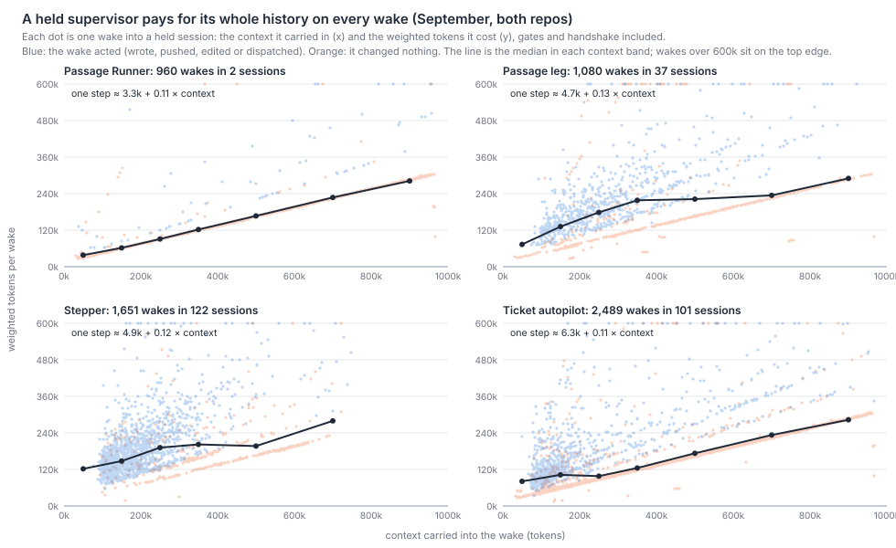
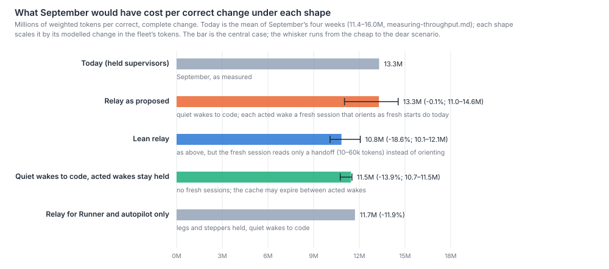
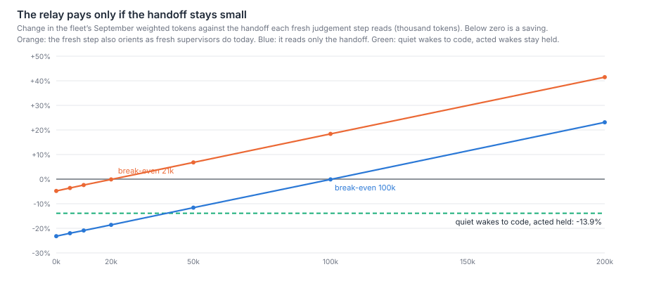

# What does a Harbour supervisor cost held open and woken, against started fresh for each step, and what would John's relay have cost on September's work?

A held supervisor pays for its whole history on every wake. Each model step costs about 3–6k
weighted tokens plus 0.11 of everything the session has accumulated, because the whole context
is read back from cache. Cost per wake therefore rises in a straight line with history: it is
not flat, and it is no worse than linear. A session's total grows a little faster than its
number of wakes (exponent 1.1–1.2). Starting fresh is not cheap either. A fresh supervisor
spends 116–238k tokens and one to two minutes orienting before its first decision, plus a 60–80k
bootstrap. Its first prompt to a decision is 76–96k tokens, mostly docs and code it reads.

Modelled on September's 6,209 wakes into held supervisors, the relay as proposed would have cost
about the same as today: **+2% of the fleet's weighted tokens (range −18% to +11%), about 13.6M
per correct change against 13.3M**. The two halves of the relay pull opposite ways. Sending the
3,233 wakes that changed nothing to code removes 16% of the fleet's tokens. Turning each of the
2,976 wakes that acted into a fresh session costs twice what holding them did, because orientation
is 62% of a fresh step's price. The relay saves money only when the fresh step reads a small
handoff instead of orienting as today's fresh starts do. That *lean relay* comes to −19%
(range −25% to −9%, 10.8M per correct change). Most of that saving does not need fresh sessions
at all: keeping acted wakes held and sending only the quiet ones to code comes to −14%
(−21% to −13%).

Little is lost by forgetting. In a blind-coded sample of 48 wakes that acted, no decision rested
on a fact only the session's memory held. About a third of the facts the decisions used came from
memory, but every one of them had first come from a record a fresh session could read. Of the 25
supervisor failures on record, one recovery clearly depended on held memory (LIN-2078). Eleven
of the failures, mostly lost wakes into held sessions, would not exist under a relay.

## Findings

**Cost per wake rises linearly with the context the session carries, because every step re-reads
it.** For September's held supervisors (all transcripts, both repos' tickets), one model step costs
a fixed few thousand weighted tokens plus about 0.11 times its whole prompt:

| Role | Wakes (sessions) | Context at wake, median (p10–p90) | Tokens per wake, median | One step ≈ | Cache read share of wake cost | Context added per wake | Session total ∝ wakes^ |
|---|--:|--:|--:|---|--:|--:|--:|
| Passage Runner | 960 (2) | 482k (133–859k) | 165k | 3.3k + 0.110 × context | 85% | 6.3k | n/a (2 sessions) |
| Passage leg | 1,080 (37) | 293k (130–632k) | 184k | 4.7k + 0.129 × context | 68% | 10.5k | 1.17 |
| Stepper | 1,651 (122) | 202k (117–436k) | 173k | 4.9k + 0.116 × context | 72% | 11.2k | 1.17 |
| Ticket autopilot | 2,489 (101) | 265k (98–743k) | 140k | 6.3k + 0.107 × context | 77% | 6.6k | 1.11 |

A *wake* here is every delivery into a held supervisor after its own task arrived. It includes
the handshake before it and the completion gates after it, as `wake-inventory.md` counts an
episode. The slope is the 0.1 weight on cache reads, plus a little. By median per band, a wake
into a Runner holding under 100k tokens cost 38k; one holding over 800k cost 282k, 7.4 times
more. The same band-to-band rise is 4.0× for legs, 2.3× for steppers and 3.5× for autopilots.
Late wakes do not take more steps: steps per wake fall slightly as context grows, because late
wakes are more often quiet. An autopilot's wakes change nothing 26% of the time under 100k and
89% of the time over 800k. So the shape is linear per wake, and a held session's total grows as
roughly the square of its wakes. Over September's range that shows as an exponent of 1.1–1.2,
because a few thousand tokens of context are added per wake against a starting context of about
100k. This extends `what-supervisors-do.md`'s finding that the same gate reply costs three times
as much late in a session as early.

**A fresh start costs one to two minutes and 116–238k tokens to orient, plus a 60–80k bootstrap,
by role.** From the moment a session's task arrived to its first write, push, edit or dispatch:

| Role (fresh sessions in September) | Tokens to first decision, median (p25–p75) | Bootstrap before the task | Context at first decision | Minutes | What it read, by characters |
|---|--:|--:|--:|--:|---|
| Ticket autopilot (101) | 116k (99–131k) | 82k | 76k | 0.7 | docs 45%, code 43%, tracker 4%, dispatch rows 3% |
| Passage leg (37) | 209k (179–236k) | 62k | 93k | 1.6 | code 46%, docs 34%, other proxy 11% |
| Stepper (122) | 238k (201–272k) | 72k | 96k | 2.1 | code 40%, docs 36%, other proxy 10% |
| Plan (273) | 315k (172–457k) | none | 128k | 4.7 | code 54%, docs 11%, tracker 8% |
| Plan-review (217) | 609k (406–821k) | 74k | 138k | 5.9 | code 41%, docs 31% |
| Review (428) | 115k (70–398k) | 69k | 74k | 0.8 | code 27%, git 15%, dispatch rows 14%, docs 14% |

A held wake that acted reached its first action in 0.15–0.56 minutes (median by role), so a fresh
step would add about half a minute to a minute and a half to every judgement, before launch time.
A session's first prompt, before it reads anything, is about 33k tokens of system prompt, tools and
standing files. A supervisor's role prompt is roughly 6–18k tokens more. The rest of the 76–96k a
fresh supervisor carries into its first decision is what it chose to read.
`starting-context.md`, running alongside this paper, asks what that reading is for.

**Cold resumes, LIN-1219's natural experiment, cost more than starting fresh.** When a finished
session is resumed for a follow-up, its first step re-writes the whole context to cache. In
September 130 of 155 resume handshakes into held supervisors were cold, and 48 of 54 failsafe
re-confirms. A cold first step cost 1.81 weighted tokens per context token, against 0.11 warm.
The 183 cold resumes into held supervisors held a median 152–349k tokens by role, and their first
steps alone cost 106M weighted tokens, 3.1% of the fleet's September tokens. Starting the same
roles fresh at those moments would have cost about 45M. A cold resume costs more than a fresh
start once the session holds more than about 110k tokens (autopilot) to 170k (stepper), and most
of them did.

**The relay as proposed would have cost about what September did: +2% of the fleet's tokens
(−18% to +11%).** In the model, every wake into a held supervisor that changed nothing goes to code
at no model cost. Every wake that acted becomes a fresh session of its role. That session pays
its role's measured orientation and bootstrap, reads a handoff, and then does the wake's own steps
at its smaller fresh context. The central case takes the median orientation, a 20k handoff and the
bootstrap. The dear case takes the 75th percentile, a 50k handoff and the bootstrap. The cheap case
takes the 25th percentile and a 5k handoff, drops the bootstrap, and also sends to code the 32% of
acted wakes the coders marked mechanical.

| Shape | Fleet tokens, central (range) | Per correct change (range) | Runner (175M today) | Leg (247M) | Stepper (335M) | Autopilot (440M) |
|---|--:|--:|--:|--:|--:|--:|
| Today | 0 | 13.3M | | | | |
| Relay as proposed | +2.1% (−18.2 to +11.3) | 13.6M (10.9–14.8) | −84% | +22% | +88% | −30% |
| Lean relay (fresh step reads only a 10–60k handoff) | −18.6% (−25.4 to −9.3) | 10.8M (9.9–12.1) | −93% | −47% | −24% | −63% |
| Quiet wakes to code, acted wakes stay held | −13.9% (−20.7 to −13.4) | 11.5M (10.5–11.5) | −81% | −26% | −16% | −50% |
| Relay for Runner and autopilot only | −11.5% | 11.8M | −84% | −26% | −16% | −30% |

The relay wins where wakes are mostly quiet and loses where they mostly act. The Runner's wakes
change nothing 93% of the time, and the relay removes 84% of its cost. A stepper's wakes act 79%
of the time, and each fresh start (238k plus a 72k bootstrap) costs more than the held wake it
replaces (median 173k), so the relay nearly doubles its cost. Held-supervisor wakes are 35% of the
fleet's September tokens: 16.3% in wakes that changed nothing and 18.7% in wakes that acted. As
proposed, the relay saves the first and roughly doubles the second.

**The result turns on the handoff.** If the fresh step also orients as fresh supervisors do today,
the relay breaks even with a handoff of just 11k tokens. If it reads only its handoff, it breaks
even at 100k, and every 10k of handoff costs about 2.3 points of the fleet's tokens. The lean relay
beats keeping acted wakes held only while the handoff stays under about 40k. The hybrid's figure
already pays for about 105 acted wakes whose cache would have expired once the quiet wakes no longer
kept it warm. That is about 2 points of fleet tokens, and it barely moves (−13.4%) if the cache
lived five minutes instead of an hour.

**Per merged change, under both charging rules, the relay costs 9–13% more as proposed, and the
lean relay 9–13% less.** The cohort is the 298 tickets whose work merged in September and whose
first session is in the transcripts: 258 LinearViewer and 50 simple-dispatcher, a change in both
counted in both. Charged by the child each wake names, a merged change cost a mean 9.4M weighted
tokens (LinearViewer 9.7M, simple-dispatcher 8.6M). Charged to the session each wake entered, it
cost 9.1M (9.4M and 8.9M).

| Shape | By the child named (LV / SD) | By the session entered (LV / SD) |
|---|--:|--:|
| Relay as proposed | ×1.09 (1.09 / 1.15) | ×1.13 (1.13 / 1.12) |
| Lean relay | ×0.87 (0.87 / 0.95) | ×0.91 (0.90 / 0.93) |
| Quiet wakes to code, acted held | ×0.91 (0.91 / 0.95) | ×0.94 (0.94 / 0.94) |

Session starts plus wakes per merged change fall from 20.4 (by the child) or 18.6 (by the session)
to 14.6 under any of the shapes. The cohort's savings are smaller than the fleet's because the
Runner's wakes are charged to the passage epics, which the cohort leaves out (as
`wake-inventory.md` does), or to legs' tickets that had not merged. simple-dispatcher's changes
save less than LinearViewer's under most shapes and both rules.

**A handoff would lose almost nothing: no sampled decision rested on memory alone.** Two blind
coders read 48 wakes that acted, drawn systematically, 12 from each role, out of 2,970. For each
wake they listed the facts its decision used and where each fact lived. They could search the
session's transcript up to that moment.

| Where the fact came from | Coder A | Coder B |
|---|--:|--:|
| The session's memory, first read from a record earlier in the session | 37.5% | 35.8% |
| The delivered wake or dispatch item | 18.8% | 16.9% |
| Harbour's dispatch rows and feedback, read in the wake | 15.1% | 15.7% |
| The tracker | 9.2% | 10.2% |
| The session's own task prompt or standing rules | 8.5% | 9.1% |
| PR, git or code | 5.9% | 6.3% |
| CI | 3.3% | 3.5% |
| The session's notes file | 1.8% | 2.4% |
| Only the session's memory | 0 | 0 |

41–43 of the 48 decisions used at least one remembered fact, and none needed a fact that no record
held. The coders put the smallest note that would carry every remembered fact at a median of 300
characters (p90 600, largest 850). On those cards, the handoff would be a few hundred tokens. What
makes a fresh step dear is the orientation it does around the handoff, not the handoff itself.
The coders marked 32% of the acted decisions mechanical (agreement 85%, κ 0.67): 7 of 12 at the
Runner, 6 at the autopilot, 1.5 at the stepper and 1 at the leg.

**Recoveries worked from the record. One clear failure depended on held memory, and eleven would
not exist under a relay.** Two blind coders read each of the 25 supervisor failures on record with
its comments (`wake-inventory-failures.json`; agreement 80%, κ 0.64 on what the recovery used):
- **From the record:** 14–17 recoveries.
- **Not recovered in flight:** 5–7, which have only a later fix.
- **Unclear:** 2.
- **Needed held memory:** 1–2. Both coders put **LIN-2078** there. An autopilot was re-woken by
  its own abort items. It worked out that it should stop stamping `sessionId` on them, and that
  remedy lived only in the run's context, so a fresh session would have had to find it again. One
  coder also put LIN-353 there: the held session noticed a loop because it remembered triggering
  twice.

Under a relay, both coders judged that **11** failures would not exist, because the mechanism that
failed is the held session or its wake delivery: LIN-870, LIN-881, LIN-1059, LIN-1323, LIN-1355,
LIN-1357, LIN-1697, LIN-1816, LIN-2511, LIN-2517 and LIN-2720. Most were lost or severed wakes,
the stall reaper killing a held session, or a session that only claimed to be holding. They judged
9–11 unchanged and 1–2 worse. The transcripts show the same split:
- **Failsafe re-confirms:** September's 154 were all answered without a tool call. The session
  restates its own state, and 48 of the 73 in supervisors paid a cold resume to do it.
- **Silence re-fires:** 81 of 116 read the record before answering.

## Method

Run in order: `scripts/survey-held-extract.mjs`, `scripts/survey-held-sample.mjs`, the two blind
codings, `scripts/survey-held-failures.mjs` (25 proxy reads at one per 10 s, rendered as text for the coders), the two failure
codings, `scripts/survey-held-codes.mjs`, `scripts/survey-held-analyse.mjs` and
`scripts/survey-held-figures.mjs`. Snapshots go to the git-ignored `data/survey-held/`. Both
codebooks and all four codings are committed in `held-or-fresh-codes.json`;
`survey-held-codes.mjs` scores them from that file when the snapshots are gone.

- **Population.** Every main transcript under `~/.claude/projects/*simple-dispatcher-workspaces*`
  modified since 29 August, read on 1 October: 2,040 dispatched sessions, both repos' tickets.
  Deliveries and layers are classed exactly as `survey-wake-extract.mjs` and
  `survey-effort-fleet.mjs` class them, and the counts match that extract. Figures cover 1–30
  September. In-session subagents are left out (about 2.6% of tokens).
- **Cost.** A step is one assistant API message, with its usage counted once. Weighted tokens use
  `fleet-complexity-read.md`'s weights: input 1, output 5, cache read 0.1, 1-hour cache write 2,
  5-minute cache write 1.25; the mid tier ×0.6. A step's *context* is input plus cache read plus
  cache write: the whole prompt. A wake's context is its first step's.
- **Wakes and outcomes.** A wake is a delivery into a held supervisor after its own task arrived
  (not a gate or handshake), together with the handshake just before it and the gates, compactions
  and continues after it. It *acted* if any step wrote, pushed, edited or dispatched, read from tool
  inputs with `survey-check-5-wake.mjs`'s version 2 write pattern. This counts 6,209 wakes, more
  than `wake-inventory.md`'s 4,602, because it includes every delivery into a held supervisor: task
  notifications, failsafe re-confirms, silence re-fires and the Runner's deliveries whose kind
  could not be read.
- **Fits.** The per-wake and per-step fits are least squares of weighted tokens on context. The
  session exponent is least squares of log total on log wakes, over sessions with at least two
  wakes.
- **Fresh starts.** For a session whose task arrived in September: tokens and minutes from the task
  to the first step that wrote, pushed, edited or dispatched. The bootstrap is the turns before the
  task arrived. The reads are the tool results before that step, classed by the tool call (tracker,
  dispatch rows, PR and CI, git, docs, code, search). Fresh Runner starts did not occur in
  September, so the Runner borrows the leg's figures.
- **Cold.** A first step is cold when cache reads are under half its context.
- **The relay.**
  - *Relay as proposed:* each acted wake costs its role's orientation (a quantile of the fresh
    starts) and bootstrap, plus a handoff written once to the 1-hour cache. Its own steps are
    re-priced with each prompt moved from the held context to the role's median context at first
    decision plus the handoff.
  - *Lean relay:* it starts from the bare 33k first prompt plus the handoff and does no other
    orientation.
  - *Hybrid:* acted wakes stay held. A wake pays a full cold re-write when the last acted wake was
    more than an hour before but some wake (now gone) came within the hour.
  - *Fleet change:* measured against all September steps in all sessions (3,424M weighted tokens).
  - *Per correct change:* applies that change to the mean of `measuring-throughput.md`'s four
    September weeks, 13.3M (11.4–16.0M). That figure is fleet tokens divided by correct, complete
    changes, so it moves one for one with the fleet if the correct rate holds.
- **Per merged change.** The cohort is tickets named (case-insensitively, in subject or body) by a
  first-parent merge on either repo's `origin/main` dated 1–30 September, first seen in the
  transcripts on or after 30 August, excluding the passage epics LIN-3099 and LIN-2888. Each
  session's own steps are charged to its ticket. A wake is charged by the child its wake text
  names, else the item's issue line, else the session's ticket, or to the session it entered. The
  count is session starts plus wakes.
- **Handoff sample.** The population is 2,970 acted wakes. Twelve per role were taken by a fixed
  stride from the middle of each stride. Two coders worked from the codebook, one in forward and
  one in reverse order, each split across two agents. Each card gives the delivered text, every
  step, its calls and clipped results, and the transcript's path for searching earlier lines.
- **Failures.** The 25 tickets of `wake-inventory-failures.json` were read with all their comments
  from the proxy on 1 October and coded blind by two coders from the failure codebook.

## Limits

- **The relay is a re-pricing, not a replay.** It assumes a fresh step takes the same steps as the
  held wake it replaces. A fresh session without the history may take more steps to find the facts
  the held one remembered: 36–38% of facts were remembered, though all were in a record. That would
  bias every relay figure towards saving. It may also take fewer, since late held wakes carry long
  contexts that sometimes wander.
- **Code is priced at zero.** Quiet wakes sent to code cost no tokens in the model, and code that
  mishandles a progress wake is not counted. `what-supervisors-do.md` found 39% of progress wakes
  led to an action, and here those are counted as acted wakes, not quiet ones. This biases every
  shape's saving up.
- **The lean relay assumes a fresh step reads nothing beyond its handoff.** Today's fresh
  supervisors read 40–60k tokens of docs and code by choice or by prompt. If a relay step did the
  same, it would move to the "as proposed" line. The lean figure is a bound on what a deliberately
  small step could reach, so it is biased towards saving.
- **The hybrid ignores slower context growth.** Removing quiet wakes would also stop the 6–11k of
  context each one adds, so later held wakes would be cheaper. This biases the hybrid's saving down.
  The cache penalty assumes the session's cache lives an hour. At five minutes the saving moves by
  half a point.
- **"Acted" is read from tool inputs.** A scratch-file write counts as acting, so some quiet wakes
  are counted as acted. That moves the relay towards its dear side.
- **The Runner is two sessions.** No fresh Runner start was observed, so the Runner borrows the
  leg's orientation. The Runner's 84–93% saving describes two voyages.
- **Per correct change assumes the correct rate holds.** If fresh steps judged worse, cost per
  correct change would rise and the scorecard would show it. The model cannot, so it is biased
  towards saving. The per-merged-change cohort counts every merged change, correct or not.
- **The handoff coders are models of the tier under study, reading cards.** A remembered fact
  counts as recorded if it appeared in an earlier tool result, but a fresh session would still have
  to know where to look. With 0 of 48 memory-only decisions, the 95% upper bound is about 6% of
  acted wakes. Roles were sampled equally, so the Runner is over-represented against its 67 acted
  wakes. The handoff size is the coders' estimate.
- **The failure record under-counts memory-dependent recoveries.** Recoveries are rarely written
  down: 7 of 25 have no stated recoverer, and a held session that fixed itself quietly leaves no
  ticket. This biases the memory share down. The "avoided" judgement also ignores the new failure
  modes a relay would bring, such as a lost handoff or a fresh step launched twice. That biases the
  relay's safety up.
- **September only.** Transcripts were read on 1 October while the V1 passage was flying. September
  rows do not change, but a Runner session in October could relabel a few sessions as legs on a
  re-run. The weights make cache reads the dominant cost, so a change in cache pricing would change
  the shape.

## Options

Each option is sized from this paper. None is a change; John decides.

| Option | Estimated effect | Evidence | Risk to correctness | How the scorecard measures it |
|---|---|---|---|---|
| **A. Code delivers or absorbs the wakes that change nothing; acted wakes stay held** (the anchor's map rows 1–3, sized) | −13% to −21% of weighted tokens; 11.5M per correct change (10.5–11.5) | 3,233 quiet wakes are 16.3% of fleet tokens; the cache-expiry cost is about 2 points | Lost wakes are the most common failure (15 of 25); the plumbing moves rather than disappears. Code must still pass on the 39% of progress wakes that lead somewhere | Tokens and wakes per correct change; correct rate; lost-wake incidents |
| **B. On top of A, a lean fresh session for each judgement step** | A further −5 points at a 20k handoff (−9 at none), falling to 0 at about 40k; worse than A above it | 0 of 48 decisions needed memory alone; handoff notes 300–850 characters; role prompts about 6–18k tokens | Behavioural fixes that live only in a run's memory (LIN-2078) are lost; judgement quality without history is unmeasured; about 0.5–1.5 minutes more per step | Review send-backs and escapes per correct change; tokens per judgement step |
| **C. Start fresh instead of resuming cold once a session holds more than about 110–170k tokens** | About −1.8% of fleet tokens (106M of cold first steps against about 45M fresh) | 183 cold resumes; 1.81 against 0.11 tokens per context token | As B, for those sessions only | Tokens per correct change; cold-resume count |
| **D. The relay as proposed, with today's orientation** | +2% (−18% to +11%): no reliable saving | Orientation is 62% of a fresh step's cost; a stepper's cost nearly doubles | As B | Not recommended without B's small handoff |

## Next

- **How many steps does a fresh session take to reach the decision a held wake made?** Replay a
  sample of acted wakes as fresh sessions in a sandbox, from the record and a short handoff. Count
  the steps and tokens, and whether the decision matches. That replaces this paper's re-pricing
  assumption with a measurement, and it is the number options B and D turn on.
- **What do fresh supervisors read to orient, and how much of it do their first decisions use?**
  This is `starting-context.md`'s question, running alongside. It decides whether the lean relay's
  bound can be reached.
- **What would code need to know to answer a progress wake that today leads to an action?**
  Following `what-supervisors-do.md`'s Next. It decides how much of option A's 16% code can take
  safely.
