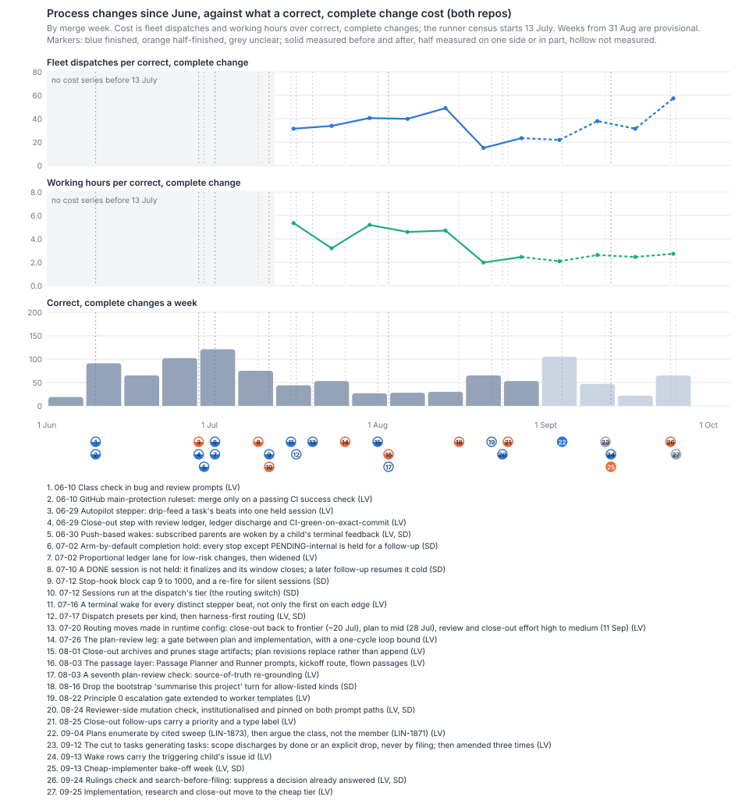
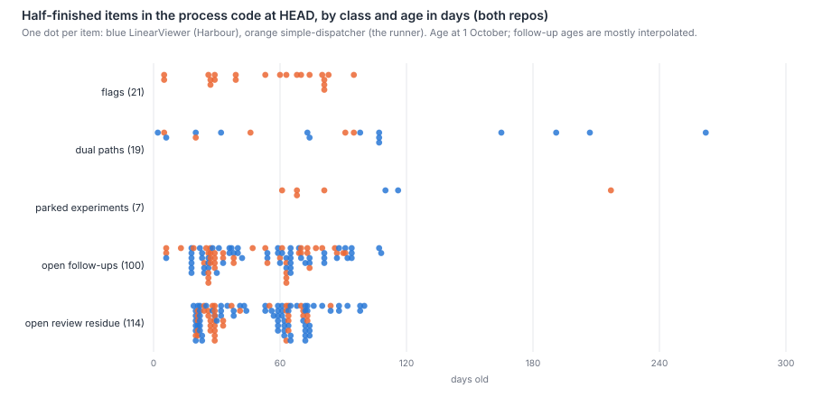
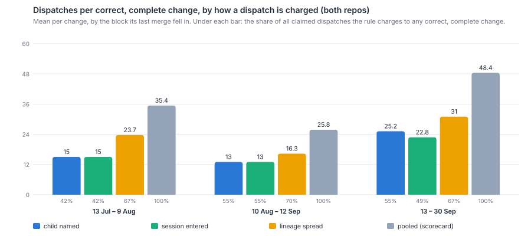

# When Harbour's process has changed, how did each change land, was it measured, and did it finish?

Since June, process changes have landed often and been measured rarely. 27 notable changes were
read across both repos. 16 landed as a series of PRs, 7 as one PR and 4 as configuration with no
code. Only 2 were measured before and after by design: the plan-enumeration rule and the
cheap-implementer bake-off. 15 had no number before they landed. Five more took a number first,
and none of them has had its after-read yet: one was canceled, three were never taken and one is not
due until November. The rest were measured only afterwards, by the papers of 30 September. 9 of the 27 are still half-finished
today, and none came with a condition for retiring it. Across all 652 process changes, those that
added a step, rule or wake outnumber those that removed one by about six to one. Only one added
step carried a sunset condition (LIN-2323), and its review, due about 26 September, was never
recorded. The process code today holds 21 switches that keep an old path or leave a new one off, 19 old paths kept beside new ones and
7 parked experiments, and the tracker holds 214 open follow-ups on process work, at a median of
about two months old. The scorecard cannot say what any one past change did to cost per correct
change: each landed within four weeks of 5 to 16 others. For the next changes, a before-and-after
read sees about a doubling in four weeks a side. A holdout by ticket sees about ×1.8 in
dispatches and ×1.5 in hours in four weeks, but only for costs paid inside a ticket's own
sessions. Shadow mode measures agreement rather than cost and suits the mechanical supervision
the anchor targets. Each mode except before-and-after leaves a second path running until someone
deletes it, which is how the half-finished items above came about. Which wake-charging rule
measures fairly depends on where a change saves: a ticket's own sessions, or the supervision above
them.

## Findings

### 1. The history: how each change landed, and whether it was measured and finished

**The named changes, as they landed.** All 27 are in `how-process-changes-land-changes.json`,
each with its tickets, commits and evidence. These are the ones the brief names:

| Change | Repo | Landed | Problem it answered | Before | After | Finished? |
|---|---|---|---|---|---|---|
| Routing: sessions run at the dispatch's tier (LIN-1285), 12 Jul | SD | one PR | The harness ignored the model Harbour sent, so every session ran at the account default | no | retrospective (`model-choice.md`) | **half**: the planned before/after study (LIN-1628) never ran |
| Routing moves in configuration (close-out back to frontier ~20 Jul, plan to mid 28 Jul, effort 11 Sep) | LV | config only | Tuning tier and effort per kind | partly (11 Sep only) | dated afterwards from run logs | finished |
| Cold resumes: a DONE session is closed, not held (LIN-1219, LIN-1100), 10 Jul | SD | 3 PRs | DONE sessions never closed | no | retrospective: cold resumes 0.2 → 2.6 per correct change (`survey-check-4.md`) | **half**: the rollback switch `SD_CLOSE_WINDOW_ON_DONE` is still read at HEAD, 82 days on |
| A wake per stepper beat (LIN-1343, LIN-1357), 15–16 Jul | LV | 2 PRs | A lost up-chain wake stalled a child about 31 minutes, seen once | no ("single observed occurrence") | retrospective: follow-ups per held session 4.7 → 7.4 (`what-doubled-the-dispatches.md`) | finished |
| The plan-review leg (LIN-1600 to LIN-1603), 26 Jul | LV | 3 PRs | Missed siblings caught at code review each cost a new arc | **yes**: follow-on-ratio baseline (LIN-1655), flagged insufficient at n = 30 | **lost**: the after-read LIN-1661 could not run, was deferred, released and canceled on 12 Sep ("the measurement follows the change") | **half**: metric decisions open (LIN-1662); the loop bound is prose only |
| The cheap implementer: bake-off (LIN-2828), 8–14 Sep | both | config only | Weekly quota hit 79% early | **yes**: the mid tier's 84% first-pass rate as the bar | **yes**: 8 of 13 passed first time (`cheap-implementer.md`) | **half**: the fleet week and the default-or-preset decision (LIN-2833, LIN-2834) never ran |
| The cheap implementer: default for implementation, research and close-out, 25 Sep | LV | config only, no ticket or commit | Weekly budget | partly (the bake-off's 13 small tickets) | provisional until late October | unclear: made before the bake-off's own decision ticket (LIN-2834, Todo) |
| The cut to tasks generating tasks (LIN-2825, then LIN-3006, LIN-3033, LIN-3056), 12–26 Sep | LV | 4 PRs in 14 days | 2.1 tickets filed per one closed; close-outs filed their own scope | **yes**: 2.1 per one closed, and a 0.74 floor, with the expected direction written down | not yet due (on or after 11 Nov) | unclear: amended three times before its read, so the read now covers four versions of the rule |
| The passage layer (LIN-1809 family), first PR 3 Aug, live 13–17 Sep | LV | 7 PRs over 54 days | Hold intent at the altitude of a campaign, not a run ("an experiment umbrella") | no | retrospective: supervision 28% → 45% of tokens in September, all of it this layer (`survey-check.md`) | **half**: the umbrella and six follow-ups are open |
| Gates and rules: class check (10 Jun), CI ruleset (10 Jun), close-out ledger (29 Jun), seventh plan-review check (3 Aug), Principle 0 (22 Aug), mutation check (24 Aug), follow-up triage (25 Aug), plan enumeration (4 Sep), rulings check (24 Sep) | both | 2 one-PR, 1 config, 6 series | Each answered an incident or a paper | yes for 2 (triage, enumeration), partly for 2, no for 5 | yes for 1 (enumeration); retrospective for 4 (`which-rules-pay.md`); none for 4 | 7 finished; follow-up triage half (its monitor, LIN-2314, never ran); rulings check half (LIN-3020) |

**Across all 27, most changes were measured only afterwards, by someone else.** By repo:
LinearViewer (Harbour) has 22 changes and simple-dispatcher 10, and a change touching both counts in each.

| | Both repos | LinearViewer | simple-dispatcher |
|---|--:|--:|--:|
| Changes | 27 | 22 | 10 |
| Measured before: yes / partly / no | 7 / 5 / 15 | 6 / 5 / 11 | 2 / 2 / 6 |
| Measured after: yes / retrospective or partly / no | 2 / 16 / 9 | 2 / 12 / 8 | 1 / 6 / 3 |
| Finished / half-finished / unclear | 16 / 9 / 2 | 14 / 6 / 2 | 5 / 5 / 0 |
| Added a rule / step / wake; removed one; neither | 10 / 4 / 4; 3; 6 | 10 / 4 / 2; 1; 5 | 2 / 0 / 3; 2; 3 |
| Stated a condition for retiring it | 0 | 0 | 0 |

Sixteen of the after-reads are "retrospective": a paper written on 29–30 September measured the change's effect weeks
or months later, as one line in a wider survey. Only two changes completed a read designed
in advance. One of them, LIN-1871 (re-read on LIN-2924 on 25 September), did not bear out its
predicted direction. First-pass approval rose from 9% to 21%, but plans sent back
twice or more rose from 43% to 50%. Measurement intentions were written down and then lost.
`scripts/prompt-template-change-log.md` exists to segment exactly these reads (LIN-1662). Of its
29 rows, 9 record an expected direction before any read, 2 are baselines and 18 say "unknown",
14 of them backfilled after the fact.

**Changes landed in series and in crowds, so no single change's cost can be read from the
scorecard.** 16 of the 27 landed as a series of PRs (the passage layer over 54 days, the filing cut
over 14). Only two kept a switch to undo them, and both switches are still in the code. Every change shares its four weeks either side with 5 to 16 other catalogued changes
(median 13; `survey-landing-history.mjs`). Behind those are all 652 process changes since June:
about 38 a week, 455 in LinearViewer only, 183 in simple-dispatcher only and 14 in both
(`survey-landing-accretion.mjs`). The cost series starts on 13 July, so changes before 20 July have
no before-window at all, and the later July ones only one week. The paper that came closest used the runner's logs to separate the stages
(7.6 dispatches per correct code change in the fortnight before 12 July, 20.0 after). It found
the tier switch was coincidence and could tie only two mechanisms to the step, LIN-1219 and
LIN-1357 (`what-doubled-the-dispatches.md:18, 102-111`). What the scorecard's series can say, change by
change, is in the chart. Fleet dispatches per correct, complete change ran 31–40 in the four weeks
after each July change, 23–27 after each change of 1–22 August, 35.5 after 24 August, and 46–51
after the September changes. Working hours per change fell from 4.4 to about 2.5 and held. Those moves belong to
crowds of changes, not to any one of them.

### 2. Half-finished things today

**The process code carries 47 half-finished items and the tracker 214 open process follow-ups,
most of them older than a month.** Counted at HEAD, both repos, with every candidate the scan
found either coded or excluded with a reason (`survey-landing-halfdone.mjs`,
`how-process-changes-land-halfdone.json`). Ages are in days to 1 October:

| Class | LinearViewer: n, median age, oldest | simple-dispatcher: n, median age, oldest | Older than 30 days |
|---|---|---|--:|
| Flags: switches back to an old path, or new paths left off | 0 | 21, 60, 95 | 67% |
| Dual paths: an old path, alias or data shape kept beside its replacement | 14, 103, 262 | 5, 46, 95 | 74% |
| Parked experiments: proposals or prototypes with no recorded conclusion | 2, 113, 116 | 5, 68, 217 | 100% |
| Open follow-ups on process fronts (`kind:follow-up`) | 57, 59, 108 | 43, 38, 91 | 65% |
| Open review residue on process fronts (`kind:review-residue`) | 74, 59, 100 | 40, 29, 84 | 62% |

- **simple-dispatcher's flags.** Four are dark: the assistant-text, tool-activity, opencode-telemetry and resource relays (LIN-1290, LIN-1293, LIN-1417, LIN-1790; 60–81 days old). Their tickets are Done, but the new path is off and the runner does not switch it on. Seven are kept after rollout: the new path is live and the switch back stays. Ten are rollback knobs, where setting 0 restores the path before a named change.
- **The shipped default differs from what runs.** `SD_WORKER_USAGE_RELAY` (LIN-1425, 70 days) defaults to off in code but is on in the runner's environment. It is the relay the `[usage]` series rests on.
- **A partial rollout runs two launch paths.** `NO_BOOTSTRAP_KINDS` (LIN-2116, 46 days) skips the bootstrap only for implementation, research and plan. Every other kind still takes the old path.
- **LinearViewer's dual paths are older.** The oldest are aliases and interfaces that predate the fleet: `isInReadyQueue` (262 days), `useMcp` (207 days) and an inline spawn mode (165 days).
- **No process-code TODO names a ticket in either repo.** Unfinished work lives in the tracker, not the code.

Follow-up ages are interpolated from ticket numbers for 204 of the 214 (see Limits).

### 3. Accretion

**About six changes added a step, rule or wake for every one that removed one.** A seeded sample
of 80 of the 652 process changes (seed 3182, stratified by repo and month), coded from the ticket
and the process-code diff:

| | Sample | Estimated in the 652 (95%) |
|---|--:|--:|
| Added a step, rule or wake | 24 | about 200 (137–266) |
| Removed one | 3 | about 25 (8–68) |
| Both | 1 | about 9 |
| Neither: a fix, refactor or tuning | 52 | about 420 |

By kind, 12 added a rule, 7 a step and 5 a wake; 2 removed a rule and 1 a step. By repo, the 56
LinearViewer-only changes had 17 adds and 3 removes, and the 24 touching simple-dispatcher had
7 adds, 1 both and no removal. Adds were most common in June (9 of 17) and steady at about one in
four after (7 of 27, 4 of 17, 4 of 19), while removals stayed at one or none a month. The catalogue
of 27 agrees: 18 adds and 3 removals. So does the reading load agents carry, by a measure that
does not need a reader: 274 changes since June net-added lines to it and 11 net-removed, and none
removed any in September in either repo (`survey-scorecard.mjs`). A blind second reader agreed on 85% of the
codes (κ 0.72) and put the ratio at about eight to one (Method).

**One added process step came with a condition for retiring it, and nobody checked it.** No change in the
catalogue of 27 states one, and one in the 80 does: LIN-2253's deprecated alias, "for one deprecation cycle"
(a cycle defined nowhere, and the alias is still there 32 days on). A scan of all 652 tickets'
descriptions and their process commits found 251 hits for retirement language. By hand, 16 of them
on 5 tickets are real conditions. Only one is a sunset on an added process step. LIN-2323 added an
adversarial second read of every periodical report on 26 August, "written in deliberately: if after
~1 month of operation the disagreement rate is near zero … this step should be retired". The ticket
has no comment after its close-out on 26 August, no paper records the read, and the step is still
in `lib/periodicals.js`. The other conditions retire an older path, not the change's own addition. One of them
(LIN-1448, "remove once no ownerless tokens remain") was found unsatisfiable by its own fix on
25 July and replaced by a switch, `DISPATCH_OWNERLESS_BROKER_COMPAT`, on by default
and still documented in `docs/architecture/configuration.md`. It is read in `lib/ownerless-token-policy.js`,
outside the process-code paths counted in finding 2, so that count misses it.

### 4. Ways to trial the next changes

**Four trial modes see very different sizes of change, and the one that sees the most is the hardest
to finish.** Detectable ratios at 80% power and a two-sided 5% level, from the scorecard's own noise
over 13 July – 21 September, both repos together (`survey-landing-trials.mjs`):

| Trial mode | What it compares | Smallest change it sees | Risk to a live passage | Risk of being left half-done |
|---|---|---|---|---|
| **Before and after** | k weeks against k weeks, whole fleet, pooled cost | ×2.9 in 2 weeks a side, ×2.1 in 4, ×1.7 in 8 (dispatches per change); ×2.9, ×2.1, ×1.7 (hours per change) | One switch, which the anchor allows only between passages ("the structure doesn't change mid-passage") | Low for the change itself: it lands whole. High for the read: of the 7 changes measured beforehand, 5 have had no after-read |
| **Alternate weeks** | on weeks against off weeks | The same arithmetic, so twice the calendar time: ×2.1 needs 8 weeks | A passage sees the process flip every week; a weekly switch splits about 10% of changes | High: the switch must live as a flag for the whole trial, the class that is 21 strong and 67% older than a month today |
| **Holdout by ticket** | changes in the same weeks, assigned at random | ×1.8–1.9 in dispatches in 4 weeks (session or child rule, September's spread), ×2.1–2.7 if changes under one supervisor move together; ×1.5 in working hours | Two processes live at once, often under one supervisor: 222 of 482 timed changes share a lineage with another (change-weighted mean lineage size 6.1) | High: the losing arm is a dual path until someone deletes it |
| **Shadow mode** | code's answer against the agent's on each decision | Agreement, not cost: no disagreement in 1,000 paired decisions bounds the rate below 0.3%; September delivered about 1,450 follow-ups a week | None while the code only logs | Highest: a shadow is a second path by construction, finished only by a cutover and a deletion |

- **Before and after is the scorecard's own design.** It sees only large changes, and it cannot separate a change from the crowd around it: every change in the history had 5–16 others within four weeks. `measuring-throughput.md` gives ×2.8 for dispatches per change at four weeks on the observed spread of weekly means. The ×2.1 here is its weekly-ratio figure (`measuring-throughput.md:162-167`).
- **Holdout by ticket gains power because both arms share the same weeks,** so the week-to-week swings that blur before and after cancel. Its cost is that it needs a per-change charging rule (finding 5). Under the child or session rule it cannot see savings that land in the epics' and Runner's sessions above a change, which is where the anchor's largest options sit (`steady-base.md:142-144`).
- **Shadow mode fits the mechanical supervision** that the anchor's map rows 1–3 target. 77% of supervision tokens go to steps that observable state fully decides (`what-supervisors-do.md:20`), so code can compute the same answer and be compared with the agent's on every wake before anything switches. It says nothing about cost until the cutover. The cutover is then a before-and-after change of its own. The sibling `where-judgement-happens.md` says where a rule over observable state could make the call. `held-or-fresh.md` prices the held wakes such a cutover would replace.

### 5. The wake-charging rule

**The charging rule became a question only on 13 September, when a process change altered the
log.** The runner's logs give every dispatch the ticket on its own `Issue:` line. Until LIN-2121
(13 September), a follow-up's line named the ticket of the session it entered. From then on a wake
names the child that triggered it. So the two rules charge every dispatch the same way except 4
before 13 September, and differ on 896 follow-ups after it, all wakes into epics' and Runners'
sessions (`survey-landing-charge.mjs`; simple-dispatcher's run logs, which cover both repos'
workspaces). Any per-change series that follows the log's line has a step at 13 September that
is not in the work.

**There are four rules, not two.**
- **By the child named:** charge a dispatch to the ticket its log line names.
- **By the session entered:** charge it to the ticket whose launch opened the session it entered, so a wake into an epic's autopilot is charged to the epic.
- **Spread over the lineage**, found here: charge it to the session's ticket if that is a correct change, and otherwise split it equally over the correct changes beneath that ticket in the tracker's parent tree. This rule answers the anchor's open question, whether a change's cost includes the wakes into the epics and Runner above it (`steady-base.md:168`), with yes.
- **Pooled:** charge nothing; take all fleet dispatches in a week over that week's correct changes. The scorecard's headline already does this.

| Merge block | Correct, complete changes | By the child named | By the session entered | Lineage spread | Pooled |
|---|--:|--:|--:|--:|--:|
| 13 Jul – 9 Aug | 152 | 15.0 | 15.0 | 23.7 | 35.4 |
| 10 Aug – 12 Sep | 285 | 13.0 | 13.0 | 16.3 | 25.8 |
| 13 – 30 Sep, both repos | 140 | 25.2 | 22.8 | 31.0 | 48.4 |
| 13 – 30 Sep, LinearViewer | 127 | 25.4 | 23.6 | 31.4 | – |
| 13 – 30 Sep, simple-dispatcher | 15 | 26.6 | 25.5 | 31.7 | – |
| Share of claimed dispatches charged to any correct change, 13 – 30 Sep | | 55% | 49% | 67% | 100% |

Means per correct, complete change, by the block its last merge fell in. The rules disagree most
on what they leave out: the per-change rules charge only 42–55% of the dispatches the runner
claimed to any correct change. The rest goes to epics, Runners, research, papers and work that
never merged. Counted as `what-doubled-the-dispatches.md` counts (dispatches naming every change
merged in the block, over the correct ones), late September is 36.9 by the child and 35.0 by the
session. That matches its 36.3.

**What each rule does to the anchor's headline figures** (`steady-base.md:121-125` and the map):

| Headline figure | Child named | Session entered | Lineage spread | Pooled |
|---|---|---|---|---|
| ~47 correct, complete changes a week | no effect | no effect | no effect | no effect (it is a count) |
| 26–49 dispatches and 2.7–3.7 hours per correct change | would read 13–25 | would read 13–23 | would read 16–31 | **as printed**: the headline is pooled |
| 11–16M weighted tokens per change | not charged by ticket | not charged by ticket | not computed | as printed |
| Wakes per correct change, September | 29 (`what-doubled`); 18.9 (`wake-inventory`) | 18; 14.9 | 23.7 here | – |
| Dispatches per correct change by implementer tier, September (frontier, mid, cheap) | 60, 35, 48 | 52, 32, 37 | not computed | – |
| September against the map: quiet wakes, passage layer, acted, in no row | 10%, 15%, 34%, 32% | 7%, 8%, 38%, 36% | not computed | – |
| Repeat legs as a share of dispatches per change | 7.8% of 39.4 | 9.0% of 34.3 | not computed | – |
| Small low-risk changes against the rest | 23.8 against 39.4 | 20.7 against 34.3 | not computed | – |
| Detectable change at four weeks | – | – | – | ×2.1 (weekly ratio), as printed |

The figures in the first two columns are `survey-check-4.md:128-131, 205-213` and
`wake-inventory.md:28-29`. The anchor's "about a third" is the gap on wakes, the figure most
exposed to the rule. On dispatches per change it is about a tenth (25.2 against 22.8) and on the
ratio a twentieth.

**Which rule each kind of candidate change needs to be measured fairly.** Not a choice between
them; that is John's.

| Candidate change | Where its saving lands | Fair rule | Unfair rule, and which way it errs |
|---|---|---|---|
| Wake plumbing and the passage layer's bookkeeping (map rows 1–3) | Epics' and Runners' sessions above the change | Pooled, or lineage spread | Session entered: blind to it, so it reads zero. Child named: sees wakes only from 13 September, so it overstates a saving taken across that date |
| Moving work between levels (code taking over a supervisor's step, or judgement moved up to the Runner) | From one level to another | Pooled | Any per-change rule: cost leaving the change looks like a saving, and cost arriving looks like a loss |
| A lighter path for small work, or fewer review rounds (rows 7–8) | The change's own sessions | Session entered; lineage spread as a check | Pooled: diluted by everything else in the week |
| Test and CI fixes (rows 4–5) | Inside a ticket's sessions, and red-CI rounds | Session entered, or pooled | Child named across 13 September: a step that is not in the work |
| Any change to what the logs record | The instrument itself | Pooled, the only rule that reads no log line | Child named, as LIN-2121 showed |

## Method

Snapshots go to the git-ignored `data/survey/`. Every script has a one-line header and makes no
proxy calls unless stated.

1. `node scripts/survey-doubling-runner.mjs`: every dispatch item the runner claimed since 20 June,
   with its session, its log's `Issue:` line and its follow-up root, read from
   `~/development/simple-dispatcher/state` (21,212 items; 19,738 of them fresh launches, warm
   follow-ups or cold resumes).
2. `data/survey/scorecard.json`, `scorecard-fleet.json` and `reliability-tracker.json`: the output and inputs of
   `scripts/survey-scorecard.mjs` (cut 30 September, heads `26014544` and `33667480`). A sibling session built them on
   1 October from that morning's tracker snapshot (fetched 06:57 UTC) with the same scripts. They were copied here
   unchanged, so this paper made no proxy calls for them.
3. `node scripts/survey-landing-history.mjs` reads the coded catalogue
   `how-process-changes-land-changes.json`. That is 27 changes, chosen to cover every change the brief names plus the
   others that the cited papers' timelines date. It checks every listed commit against first-parent `origin/main` in its repo (all
   present) and re-checks each residue at HEAD (18 of 21 still present or open). It prints the
   scorecard's cost for the four full weeks either side of each change, the crowding count and the
   change log's tally. "Measured before" means a number on the thing the change targeted, taken
   before it landed, in the ticket, a comment or a document. A paper that measured it later is
   recorded as "retrospective" and counted as partial. Three proxy reads were made (LIN-2924, and
   LIN-1661 twice), plus one for LIN-2323's comments.
4. `node scripts/survey-landing-halfdone.mjs` scans 152 process files (83 in LinearViewer, 69 in
   simple-dispatcher) for switches, kept old paths and experiment documents, and dates each by
   the commit that introduced it. It checks every candidate is coded or excluded with a reason
   in `how-process-changes-land-halfdone.json` (47 coded items, 26 exclusions, none uncovered), and takes open
   follow-ups from the tracker snapshot. Process code is growth-atlas's "prompt text" and
   "dispatch + fleet" areas, the scorecard's reading paths and the runner kit in LinearViewer, and
   every production file plus its docs in simple-dispatcher. 57 numeric tuning knobs (LinearViewer 2,
   simple-dispatcher 55) are counted but not coded as flags.
5. `node scripts/survey-landing-accretion.mjs` rebuilds the population: scorecard changes merged
   June to September whose first-parent merges touched process code, 652 of them. It re-draws the
   seeded sample (seed 3182; 56 LinearViewer-only, 24 touching simple-dispatcher, proportional by
   month), and re-runs the retirement-language scan over all 652 descriptions and their process
   commit messages, checking every hit has a hand verdict (251 hits: 180 other uses, 50 retiring
   an older path, 5 deprecated with no condition, 16 conditions). The codebook is in the JSON's
   `method`.
6. `node scripts/survey-landing-charge.mjs`, then `node scripts/survey-landing-trials.mjs`: the four
   charging rules over the runner census and the scorecard's correct, complete changes, then each trial
   mode's detectable ratio, exp(2.8 · sd · √(2/n)), as `survey-scorecard.mjs` computes it. Weekly
   modes use the scorecard's weekly noise. Holdout uses the standard deviation of log per-change
   dispatches under each rule, inflated by a design effect 1 + (m − 1)ρ for lineage clusters, with
   ρ assumed at 0.1 and 0.3.
7. `node scripts/survey-landing-figures.mjs` draws the three charts under
   `docs/papers/harbour/figures/how-process-changes-land/`.

**Second reading.** A fresh subagent re-coded the 80 accretion changes blind, from the codebook
alone, without the first coder's file. The two readers agree on 85% of the eight effects
(κ 0.72) and 87.5% of three classes: added something, removed something, neither (κ 0.74). The
second reader found 25 changes that added something against 3 that removed one, so about eight to one
where the first found six to one. Of the 12 disagreements, 8 are between an add and "neither", and
they cut both ways (`survey-landing-accretion.mjs` lists them). The second reader also took one
retirement condition the first did not: LIN-215's note that parallel workers wait on LIN-625.

## Limits

- **The catalogue is a selection.** It covers the changes the brief names and those the cited
  papers date, 27 in all. It is not a census of the 652. *Bias:* the selection favours changes large
  enough to be written about, which are the likeliest to have been measured. So the share
  measured before and after (2 of 27) is, if anything, high for process changes in general.
- **"Retrospective" is generous.** A paper of 30 September that measured a July change in passing
  is counted as a partial after-read. *Bias:* "measured after" is overstated. Counted strictly,
  only 2 of 27 have one.
- **"Half-finished" is a judgement on residue that still exists.** Rollback switches kept on
  purpose (`SD_CLOSE_WINDOW_ON_DONE`) and partial rollouts (`NO_BOOTSTRAP_KINDS`) are counted.
  *Bias:* the half-finished count is high if those switches are wanted, and low because no
  ticket's comments were read for open promises beyond the four tickets fetched.
- **Ages run short for dual paths and are estimates for follow-ups.** A dual path is dated by the
  commit that added its marker, which can be later than the path itself. 204 of the 214 follow-up
  ages are interpolated from ticket numbers between the snapshot's 95 dated tickets. *Bias:*
  dual-path ages are low; follow-up ages are unbiased in expectation but uncertain by days to a week.
- **Follow-ups are selected by their front label, not read one by one.** A few are off-topic
  (LIN-619 is a session-secret item). *Bias:* the count of open process follow-ups is slightly high.
- **The tracker snapshot was copied from a sibling's run while its detail fetch was still going.**
  The list was complete (3,124 tickets). The detail records, which hold creation dates, were not.
  *Bias:* none on counts. More follow-up ages had to be interpolated.
- **The accretion sample is 80 changes, coded by two readers who agree on 85% (κ 0.72); the paper reports the first.**
  Removals are rare (4 in 80), so their population estimate is wide (8–68). The process-code
  paths include periodicals, recommendations and next-run, which are not fleet machinery. *Bias:*
  the "neither" share is inflated and the add and remove shares slightly deflated. The 6:1 ratio is
  unaffected in direction.
- **The retirement scan reads ticket descriptions and commit messages, not comments or PR bodies.**
  The GitHub snapshot has no bodies. *Bias:* retirement conditions are undercounted if they were
  written only in comments. The LIN-2323 read was checked in its comments and is absent there.
- **Cost before and after each change is the scorecard's pooled weekly series.** It starts on
  13 July, and every window is shared with other changes. *Bias:* none in direction. The per-change
  cost column is not an attribution, and the paper does not use it as one.
- **The charging rules rest on the runner's logs and the tracker's parent links.** Items with no
  `Issue:` line and no root (about 2,700 of 21,212) are charged by no rule except pooled. The
  lineage rule splits equally, whatever the beneath-tickets' sizes. *Bias:* every per-change rule is
  low by the unmapped items. The lineage rule over-charges small changes in large trees and
  under-charges large ones.
- **The trial-mode sizes assume the noise of 13 July – 21 September holds.** The clustering
  correlation for holdout is assumed (0.1 and 0.3), not measured. September's provisional weeks
  are in the per-change spread. *Bias:* if the passage era is noisier, every mode sees less than
  stated, holdout least affected because its arms share weeks.
- **Shadow mode's rule of three assumes independent decisions.** Wakes from one session are not.
  *Bias:* the bound is optimistic; it needs more decisions than stated.

## Options

The menu John asked for, sized where the evidence allows. Writing them here changes nothing;
John decides.

| # | Option | Estimated effect | Evidence | Risk to correctness | How the scorecard would measure it |
|---|---|---|---|---|---|
| 1 | **Every process change names its read and its retirement before it lands.** A number before, the date of the read after, the rule it will be judged by, and when it will be removed | No direct cost saving. Turns 2 in 27 changes measured on purpose into most of them, and gives 0 in 27 a retirement condition | 5 changes measured beforehand have no after-read; the change log has 18 "unknown" of 29; LIN-2323's sunset went unread | None. It adds a rule, so it should replace the change log's backfilled rows rather than sit beside them | The share of process changes with a completed read at four weeks; the count in finding 2 |
| 2 | **One process change at a time, landed between passages, with nothing else in its four weeks** | Makes ×2 visible in four weeks a side instead of not at all; slows the rate of change from about 38 process changes a week | Every change shared its window with 5–16 others; the July step had five mechanisms in three days | Low. It delays fixes, so it needs an exception for repairs | Before and after on pooled dispatches and hours per correct change (×2.1 at four weeks) |
| 3 | **Shadow mode for the mechanical supervision rows (map 1–3), with the cutover and the deletion of the old path in the same series** | Agreement on 1,000 decisions in under a week; the saving is the anchor's ~27% of tokens at most, read at cutover | 77% of supervision tokens mechanical; about 1,450 follow-ups a week to compare | Low while shadowing; the cutover carries the risk | Agreement rate, then before and after at the cutover, on pooled cost |
| 4 | **Holdout by lineage for ticket-level changes (map rows 7–8)** | Sees about ×1.8–2.7 in dispatches and ×1.5 in hours in four weeks | Per-change spread; 301 lineages among 482 timed changes | Medium: two processes at once; the losing arm must be deleted on a date | Per-change dispatches by the session entered, with lineage spread beside it |
| 5 | **Burn down what is half-finished before starting a new trial** | 47 items in code and 214 open follow-ups; the effect on cost is unmeasured | Finding 2: 21 switches (4 dark, 7 kept after rollout, 10 rollback), 19 dual paths, 7 parked experiments | Low for switches kept after rollout for more than 30 days; each removal is its own change | The count and age in finding 2, re-run; a removal does not have to move cost to count |
| 6 | **Report the pooled headline and one per-change rule side by side, chosen by the candidate's kind** (finding 5's table) | No saving; prevents a change's saving from being read as zero, or as a step at 13 September | Per-change rules charge 42–55% of dispatches; LIN-2121 moved the child rule | None | Both columns in every read |

## Next

- Did LIN-2323's adversarial second read of periodical reports ever disagree with a report, and
  should its own sunset condition have retired it on about 26 September? This goes into
  `proposals.md`.
- For the 4 dark relay flags and 7 switches kept after rollout in simple-dispatcher, is the old
  path still reachable in practice, and what would removing each one break?
- How often did a measured-before change's after-read get lost across the whole 652, not just
  the 27, and at which step: the instrument, the substrate, or attention moving on?
