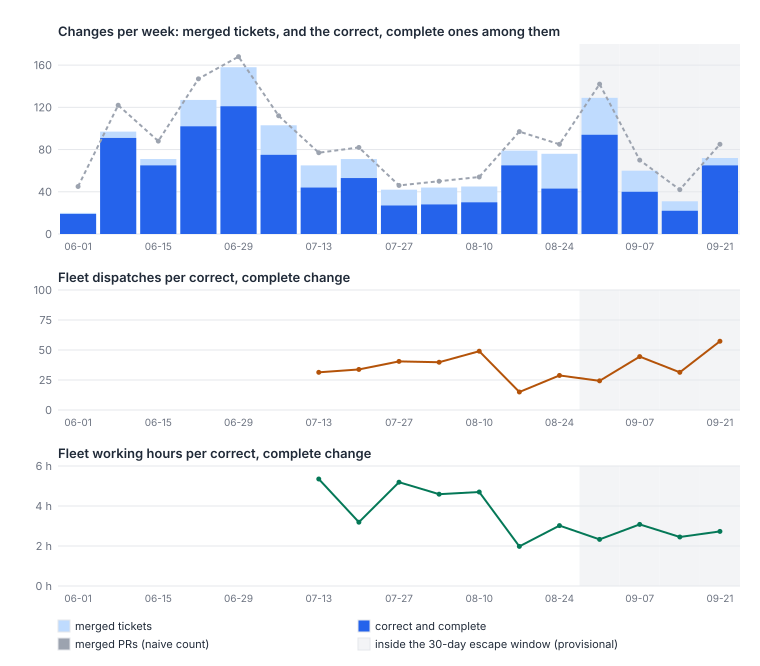
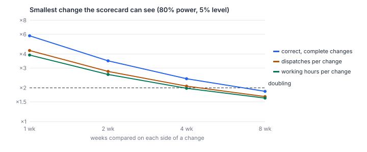

# How should Harbour measure its throughput of correct work, and what is the baseline today?

Count a change once, when its ticket's work has merged to main and the ticket reached Done.
Call it correct if, within 30 days, no escaped Bug names it as the change that introduced the
fault and no later fix commit names it. Call it complete if it filed none of its work as a
follow-up. Throughput is the number of such changes per week, per fleet dispatch and per
working hour. By that measure Harbour has shipped **about 47 correct, complete changes a
week since mid-July**, against 95 a week in the weeks from 8 to 29 June (69 in June's four
calendar weeks, when fewer PRs named a ticket). That is three in four of all merged tickets
old enough to judge, and 72% of those since mid-July, at **26 to 49 fleet dispatches** and
**2.7 to 4.4 working hours** for each one, and 11 to 16 million weighted tokens for each in
September. The two costs do not move together: dispatches per change fell from 35 to 26 and
then rose to 49, while hours per change fell from 4.4 and held near 2.7. July's 4.4 counts
sessions outside Harbour's workspaces; on Harbour's own it is about 3.7. No series sees a
doubling quickly. Over four weeks on each side of a change the weekly count detects ×2.4,
fleet dispatches per change ×2.1 and working hours per change ×2.0; over eight weeks, ×1.9,
×1.7 and ×1.6. So a doubling will show first, and only just, as halved hours per correct
change after about four weeks, and in the weekly count after about eight.

## Findings

**The measures can be computed from what exists today, but only the tracker and git go back
further than June.** Each measure, its source, and how far back the data goes:

| Measure | Operational definition | Source | Earliest week |
|---|---|---|---|
| Change | A ticket whose LIN-id names a first-parent merge on `origin/main`, dated by its last merge | git, both repos | June (before June, PRs rarely name tickets) |
| Correct | Done; no escaped Bug naming it as introducer within 30 days; no named fix commit within 30 days | tracker, the committed Bug verdicts, git + GitHub PRs | June |
| Complete | No `kind:follow-up` ticket and no routed Bug names it as origin | tracker | June |
| Cost: dispatches | Every dispatch the runner claimed that week, across Harbour's workspaces | runner run logs | 13 July (logs from 20 June; dated by the oplog from 12 July) |
| Cost: working hours | Session time in SUMMARIZING, RESUMING or EXECUTING, each interval capped at 2 h | runner oplog | 13 July |
| Cost: weighted tokens | Claude usage weighted to frontier-input equivalents | local transcripts | 31 August only (**30-day retention**) |
| Elapsed | Changes per calendar day | git | June |
| Human attention | Entries into BLOCKED (a ruling or park); share of changes that ever waited on a human | oplog | 13 July |
| Proportionality | A change's dispatches ÷ the median of its size × risk cell; rank correlation of dispatches with size | git + run logs | 13 July |
| Process weight | Net lines of the text agents are told to read, added or removed by the change | git, both repos | June |

Three sources are kept for only 30 days: dispatch feedback with its `[usage]` lines
(`historyTtl`, `lib/dispatch-store.js:248`), local session transcripts, and the app-call log.
So token cost, per-lineage cost and app-call spend cannot go back past 31 August, and each
re-run moves that window forward. Dispatch counts and session time survive because the
runner's own logs are not pruned. *Reopened* cannot be measured. The proxy exposes no state
history, and the house habit is to file a new ticket rather than reopen
(`reliability-baseline.md:138-146`). The named fix commit stands in for it.

**Correct and complete removes a quarter of merged tickets, and each class removes a
different part.** Of the 998 changes old enough to have closed their 30-day window:

| | Changes | Share |
|---|--:|--:|
| Merged, not Done | 14 | 1.4% |
| An escaped Bug names it as introducer | 31 | 3.1% |
| A later fix commit names it | 78 | 7.8% |
| Not correct (any of the above) | 114 | 11.4% |
| Filed a follow-up, or a routed Bug names it | 139 | 13.9% |
| **Correct and complete** | **763** | **76.5%** |

Eight of the 31 changes in the second row are named only by Bugs whose own reason says the
change's review *found* an older fault ("pre-existing, not introduced by #1275; found in
LIN-2037 review"). Without them the row is 23, and 770 changes pass.

Escapes surface within the window. 66 escaped Bugs have an `introducedBy`, but 35 of them name
the ticket whose review found or deferred an older fault, not the one that wrote it: their
reasons say "pre-existing", "predates" or "older code", and they include all 18 finder rows
`survey-check.md` listed. The other 31 were filed a median of 3.3 days after the change's
last merge, 71% within 7 days and 97% within 30. That is why the window is 30 days; a week older
than 7 days has about seven in ten of its escapes on file. It agrees with the corrected median of
about 4 days in `reliability-baseline.md` version 2. *Merged on green*
adds nothing in LinearViewer. GitHub's ruleset has refused any merge to `main` without a
passing `CI success` check since 10 June (`steady-base-check.md:76-80`). simple-dispatcher has
no such protection, and the instrument cannot check it there per PR.

**A count of tickets or PRs would mislead, in three ways.** First, it counts the quarter that
is not correct and complete, and that share moves from week to week: from 5% to 43% of merged
tickets (panel A). Second, the unit is not stable. The tracker files 2.1 tickets for every one
it closes (`tasks-generate-tasks.md:14`), and a breakdown tree counts as several tickets
(`root-task-ratio.md:17`). Merged PRs ran 1.16 to the ticket since mid-July, so a PR count
rewards splitting. Third, a count ignores cost. Since mid-July the weekly count averaged about 47
while the fleet's dispatches per week rose from 1,346 (13 July to 9 August) to 2,065 (7 to 27
September). Per ticket, dispatches rose about 1.4× from July while working time held, almost all
of it warm beats into held sessions (`survey-check.md`, correcting `where-the-effort-goes.md:107`).
Weighting each change by its size does not rescue a count. Half of new production lines are
comments (`steady-base.md`), and effort tracks size only loosely (next finding). So the
instrument counts correct, complete changes unweighted, and reports three things beside them:
the cost of each change, its size mix, and the docs-only share (43 of the 763).

**The baseline, in four-week blocks since the runner's census became continuous.** Both repos
together. Each week counts the changes whose last merge fell in it:

| Weeks | Correct, complete changes | Per day | Fleet dispatches | per change | Working hours | per change | Per 100 dispatches | Median dispatches per change |
|---|--:|--:|--:|--:|--:|--:|--:|--:|
| 13 Jul – 9 Aug | 152 | 5.4 | 5,382 | 35.4 | 673 | 4.43 | 2.8 | 13 |
| 10 Aug – 6 Sep | 232 | 8.3 | 5,972 | 25.7 | 619 | 2.67 | 3.9 | 9 |
| 7 – 27 Sep (3 weeks) | 127 | 6.0 | 6,196 | 48.8 | 355 | 2.79 | 2.0 | 18 |

In the four weeks from 8 June to 5 July the count was 95 a week (131 merged PRs a week). June's
four calendar weeks, from 1 to 28 June, give 69 a week, but in the week of 1 June only half of
merged PRs named a ticket, against 81–100% in every week after. The runner's census does not
cover June, so June has no cost. The weeks from 31 August are provisional: their
30-day window is still open. Weighted tokens per correct, complete change were 11.4, 14.4,
11.4 and 16.0 million frontier-input equivalents in the four weeks from 31 August. At the
frontier input list price that is about $57 to $80 a change. The Claude lanes run on a
subscription, so this is a share of quota rather than cash.

The two cost measures disagree about September, and the instrument should report both.
Dispatches per change rose 1.9× from August, the cheapest block, and 1.4× from July, while
working hours per change held. That is `survey-check.md`'s reading of `where-the-effort-goes.md`
again: more beats and wakes, about the same work. If only one cost is reported, a change to dispatch mechanics can pass for a
change in productivity.

**By repo:** of the mature changes, 77.2% of LinearViewer's 850 and 71.4% of
simple-dispatcher's 161 are correct and complete. Median dispatches are 9 and 8, and median
working hours 1.42 and 1.37. Since mid-July, simple-dispatcher has contributed about 8 correct,
complete changes a week and LinearViewer about 39. A change that touched both repos counts
once in the total and once in each repo.

**Human attention, proportionality and process weight, as baselines.**
- **Human attention.** Sessions entered BLOCKED 186, 100 and 51 times in the three blocks,
  which is 1.2, 0.4 and 0.4 times per correct, complete change. In each block, 8% to 12% of
  timed changes waited on a human at some point.
- **Proportionality.** Dispatches track production lines weakly. The rank correlation was 0.06
  in July, 0.25 in August and 0.23 in September; with test lines added it was 0.20, 0.33 and
  0.32. July's figure includes tickets merged from 1 to 12 July, before the oplog, whose median
  is 5 dispatches; from 13 July it is 0.11. High-risk changes take a median of 14 dispatches
  against 11 for the rest. Once size is held fixed, `survey-check.md` found the data cannot
  tell equal effort from a difference of half either way.
- **Process weight.** Since June, 272 changes net-added lines to the text agents read, and 11
  net-removed lines. The reading load grew by 12,241 lines across both repos. September's
  blocks removed more than before (1,465 lines removed against 2,724 added), but none of them
  shrank the total.

**How big a change the instrument can see.** Noise was estimated over the 11 full weeks from
13 July to 21 September. The detectable change compares k weeks after a change with k weeks
before it, at 80% power and a two-sided 5% level:

| Series | Week-to-week CV | 1 wk | 2 wk | 4 wk | 8 wk |
|---|--:|--:|--:|--:|--:|
| Correct, complete changes a week | 0.46 | ×5.8 | ×3.5 | ×2.4 | ×1.9 |
| Merged PRs a week (the naive count) | 0.38 | ×4.2 | ×2.8 | ×2.1 | ×1.7 |
| Fleet dispatches per change, weekly | 0.33 | ×4.3 | ×2.8 | ×2.1 | ×1.7 |
| Working hours per change, weekly | 0.35 | ×3.9 | ×2.6 | ×2.0 | ×1.6 |
| Dispatches, per change (455 changes), as printed | – | ×2.0 | ×1.6 | ×1.4 | ×1.3 |
| Working hours, per change (455 changes), as printed | – | ×1.8 | ×1.5 | ×1.3 | ×1.2 |
| Dispatches, per change, on the observed spread of weekly means | – | ×7.9 | – | ×2.8 | ×2.1 |
| Working hours, per change, on the observed spread of weekly means | – | ×4.3 | – | ×2.0 | ×1.6 |

The weekly count is about three times noisier than chance alone would make it: a count
averaging 47 would vary by about 15% from week to week, not 46%. Something beyond chance moves the
weeks, and this paper does not identify it. Their lag-1
autocorrelations run from −0.13 to 0.19, so weeks behave as nearly independent. A doubling of
the weekly count would be missed about two times in five over four weeks each side, and seen
reliably only over about eight; with the noise itself estimated from 11 weeks, eight is the
edge (×2.0). Cost per change taken at the level of the change, the two printed rows, treats
about 47 changes a week as independent observations. They are not: the weekly means of log
cost vary 2.7 times (dispatches) and 2.1 times (hours) more than independent changes would
make them, and only about 41 changes a week have runner data. On the observed spread of the
weekly means, the per-change series detect no more than the weekly ratios do, and a halving
is not visible in one to two weeks. The per-change series also measure something else: the
dispatches are those mapped to each ticket, not fleet dispatches, and the hours are the runner's
uncapped clock. The naive PR count is slightly less noisy than the real measure, but it
measures the wrong thing.

## Method

Run `node scripts/survey-scorecard.mjs --svg docs/papers/harbour/figures/measuring-throughput`
after the scripts it reads. Its header lists them:
- `survey-effort-git.mjs`: changes, size and risk.
- `survey-effort-runner.mjs`: dispatches and working hours per ticket.
- `survey-growth-fleet.mjs --json > data/survey/scorecard-fleet.json`: fleet dispatches per week.
- `survey-reliability-github.mjs` and `survey-reliability-tracker.mjs`: PRs, CI and the tracker census.
- `survey-effort-fleet.mjs`: weighted tokens.

For this paper, the git and runner scripts were re-run at `c65b7dd8` and `3b1e734` on 30
September. The tracker and GitHub snapshots are the ones `reliability-baseline.md` took that
morning (07:00 UTC), and the token buckets are those `where-the-effort-goes.md` took. No new
proxy calls were needed. The script prints every number above and writes its table to the
git-ignored `data/survey/scorecard.json`.

- **Change population.** 1,311 tickets merged from 1 June to the cut. 998 are *mature*, meaning
  their last merge is at least 30 days before 30 September. Each change is dated by the Monday
  of its last merge's week.
- **Correct.**
  - The ticket's state is Done in the tracker census.
  - No Bug given an *escaped* verdict in `reliability-baseline-defects.json` names the ticket
    as `introducedBy` and was filed between 2 days before and 30 days after its last merge.
  - No *named fix-follow-up* (`survey-reliability-git.mjs`) names it. That is a later
    first-parent commit within 30 days that says fix or regression, touches one of the PR's
    production files, and names the ticket or the PR.
- **Complete.** No ticket labelled `kind:follow-up` has this ticket as its parent or as the
  first other LIN-id in its opening 600 characters, and no *routed* Bug names it as introducer.
- **Fleet cost.**
  - Dispatches are every item the runner claimed for LinearViewer, harbour-cat or
    simple-dispatcher workspaces in the week. This includes work that never merged, because
    that work is also spent budget.
  - Working hours are oplog phase intervals in a working phase. Each interval is capped at 2
    hours, because stale session records would otherwise book days. The cap keeps 1,729 of
    10,862 raw hours. With a cap of 1 to 4 hours, hours per change over the budget era, pooled
    as in the table, come to 3.0 to 3.5 (3.2 at the 2-hour cap). The hours are every session in
    the oplog, while the dispatches are Harbour's workspaces only; in the July block that adds
    about 19 hours from other workspaces and 94 hours the run logs cannot place.
  - Token weights follow `fleet-complexity-read.md`. The last token bucket runs 9.28 days and
    is scaled to seven.
- **Sensitivity.**
  - Weekly series: s is the standard deviation of log weekly values. The minimum detectable
    ratio over k weeks each side is exp(2.8·s·√(2/k)).
  - Per-change series: s is the spread of log cost across correct, complete changes, and k·47
    changes stand in for k weeks. That assumes changes independent; the check's rows use the
    observed spread of the weekly mean instead.

## Limits

- **Correct is an overstatement.** A defect counts only if someone filed a Bug and it names
  the change behind it (about 31 of 190 escaped Bugs do; 35 more name the ticket whose review
  found the fault), or a fix commit names the change. Faults
  that were never found, or were fixed quietly, are missing. So the correct share is biased
  up, most where finding was weakest. `reliability-baseline.md` shows who finds faults changed
  over the summer.
- **The named fix both over- and under-counts.** It misses fixes that do not name their source,
  which biases correct up. It counts later tickets whose title says fix and whose description
  mentions the change anywhere, which biases it down: 69 of the 78 are named only in the later
  ticket's description, and 36 say fix only in its title. A first reading by the check found
  about 11 of the 78 clearly blame the change, 15 unclear, and the rest mere mentions.
- **Complete is biased both ways, and the net direction is not known.** A `kind:follow-up`
  filing is counted against its origin whether or not it was that ticket's own scope.
  `never-worked-pile.md` found 23 of 40 never-worked filings were the parent's own scope
  (`:40`), but a quarter of follow-ups were worked, so that rate does not transfer to the 139.
  The other way: the parent wins even when it is an epic, so 38 mature changes named in the
  text of such follow-ups count as complete; and `kind:review-residue` filings are ignored,
  though filings that say "Filed by LIN-X close-out" or "Routed from LIN-X review" name 78
  more mature changes.
- **Provisional weeks run high.** The weeks from 31 August have not closed their 30-day window,
  and completeness has no window at all. The week of 21 September shows no named fix and 6%
  incomplete, against 8% and 20% in the mature weeks since mid-July; at mature rates it would
  have about 50 correct, complete changes, not 65. The week of 31 August would lose about 5.
- **Cost is Claude-heavy, and the budget era starts on 13 July.**
  - Tokens exist only for 31 August onwards, and only for Claude sessions. `/cost`
    under-reports opencode by about 45%, but the cheap tier is under 0.1% of weighted tokens.
  - Working hours count EXECUTING while a session sits in a CI poll, which biases them up.
    The 2-hour cap biases them down for genuinely long turns.
  - June has no cost at all.
- **The noise estimate rests on 11 weeks.** The detectable ratios are themselves uncertain by
  roughly a quarter. The per-change figures treat changes as independent. Changes flown in one
  passage share a supervisor and a week, so those figures are optimistic: the true detectable
  change is larger.
- **Size, risk and process weight are proxies.** Lines include comments. Risk comes from file
  names. Process weight counts only the reading-load paths `growth-atlas.md` defined, and misses
  rules embedded in code.
- **The snapshots are of one morning.** Five changes have no state in the tracker census, so they
  count as not Done. They merged from 13 to 28 June: two are Done but missing from the team list
  (LIN-450, LIN-704), and three no longer exist in the tracker (LIN-756, LIN-757, LIN-758).

## Next

- **Does per-change cost keep its sensitivity out of sample?** Re-run the scorecard weekly for
  eight weeks. Check whether the per-change detectable ratios hold, and whether the weekly count
  and per-change cost ever disagree in direction. This goes into `proposals.md`.
- **Why did the weekly count halve from June to July?** It fell from 95 in the weeks of 8 to 29
  June to about 47 from mid-July, while merged PRs per ticket barely moved. The check found
  about four-fifths of the fall is fewer merged tickets and a fifth a lower pass rate, much of
  that from follow-up labelling and routed Bugs that June did not yet have; median change size
  did not move. The runner census does not cover June, so the rest has to be read from git and
  the tracker.
- **How much of the 139 flagged incomplete is the ticket's own scope?** A blind reading of a
  sample would turn the completeness bound into an estimate. The paper is also owed a check
  (`standard.md`, rule 2).
