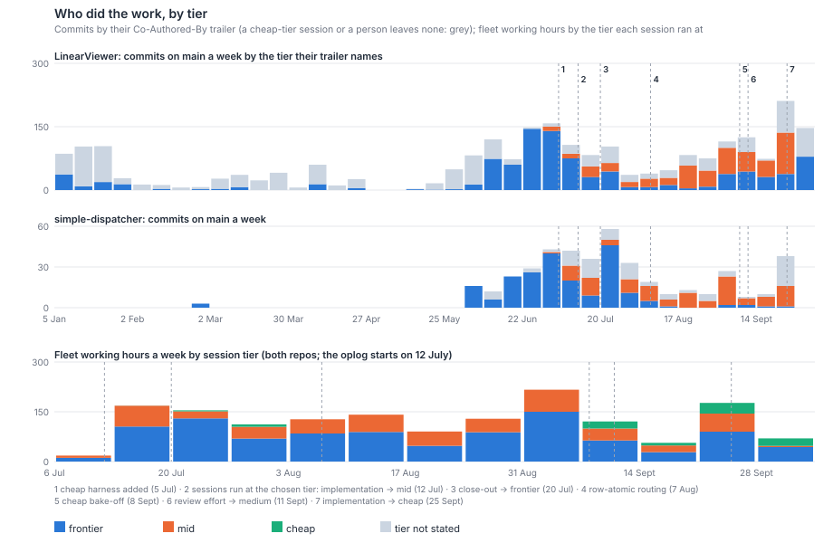
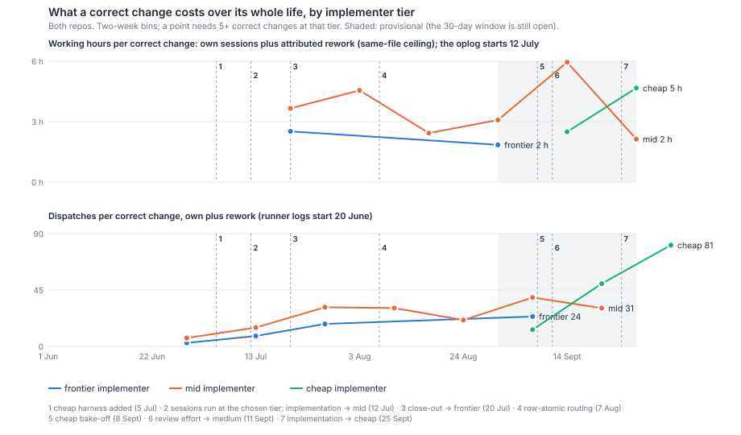
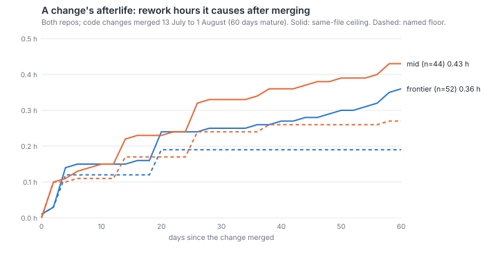

# What does each model tier really cost per correct change, once a ticket's afterlife is counted?

About the same for the frontier and mid tiers, and the afterlife barely changes that. In the
weeks where both tiers were in use and every change has had 30 days to show a fault (13 July to
30 August, both repos), a correct, complete change cost **3.25–3.4 working hours** over its whole
life when a mid-tier session implemented it, and **3.4–3.5** when a frontier session did. That
covers its own sessions plus the rework it later caused; the range runs from the fixes that name
the change to every fix on its files. Rework is under a tenth of either figure. A third to two-fifths
of it lands within a week, and a fifth to a third comes after day 30. Mid-tier changes do escape more often: 11 of 187 here against none
of 85. That count sets aside escape rows that name the ticket whose review found an older fault.
LIN-3155's "four times" (9.6% against 2.4%) counted those rows too. On its own weeks, without
them, the figures are 14 of 365 against none of 171. But an escape's fix costs a fraction of the process around the original ticket, so escapes move the
whole-life cost by tenths of an hour. What moved the cost per change was not the tier. At the
12 July step dispatches per correct change doubled for frontier-implemented changes too (5.3 to
10.4). Since then they have kept climbing. In September's provisional weeks the figures are 37
(frontier), 27 (mid) and 48 (cheap, whose work is cut into many short beats). The cheap tier's
changes are all younger than the 30-day window. Provisionally they cost what mid-tier changes
cost in hours (3.3 against 3.0) and less in dollars. LIN-3155's fall in frontier-written changes
(84 to 12 a week) and its equal cost per change reproduce. Its escape rates do not, so
`why-throughput-halved.md` is corrected to version 2 in the same PR.

## Findings

**Until 12 July every session ran at the frontier tier, whatever the dispatch asked for.**
Before simple-dispatcher's LIN-1285 (`b39648b`), claude-code sessions were launched with no
model flag, so they ran at the account default. Tier-bearing commit trailers from January to early
July name the frontier tier, apart from 25 changes in the fortnight before the switch. Harbour stored a per-kind model from 6 July (LIN-1094,
`fddf5271`) and per-kind presets from 17 July (LIN-1390, `a13880b4`). The values themselves
lived in runtime config, not in code, so the timeline below comes from the runner's own logs:

| # | Date | Rule change | Evidence |
|---|---|---|---|
| 1 | 5 Jul | Cheap-tier harness (OpenRouter via opencode) added; first real tickets on 8 Jul | SD `a5c7714`, run logs |
| 2 | 12 Jul | Sessions run at the dispatch's tier: implementation and close-out mid; autopilot, research, plan and review frontier | SD `b39648b`; first tier aliases in that day's log |
| 3 | ~20 Jul | Close-out back to frontier | last mid close-out 17 Jul, first frontier 20 Jul |
| — | 19–29 Jul | About fifteen tickets implemented at the cheap tier, then back to mid | run logs |
| 4 | 7 Aug | Harness resolved before model; unmappable models refused | SD `c97b26f` (LIN-1694) |
| 5 | 8–14 Sep | Cheap-implementer bake-off (LIN-2828); review and close-out stay frontier | `cheap-implementer.md:39-44` |
| 6 | 11 Sep | Review and close-out effort high → medium; tier unchanged | proposal `:11-36`, run log |
| 7 | 25 Sep | Implementation, research and close-out → cheap; plan stays mid; plan-review, review and autopilot frontier | run log, no commit |

By late August, implementation ran at the mid tier 172 times in 184 and plan 127 in 154. Every
other kind ran at frontier (`model-effort-routing-proposal-2026-09-11.md:11-36, 54-66`). In fleet
working hours the frontier tier still did most of the work after the switch, because it held
supervision, review and research: 65% of 943 hours from 13 July to 30 August (mid 32%, cheap 1%),
and 58% of 643 hours in September (mid 28%, cheap 13%). The cost lineages this survey fetched cover dispatches from late August onwards. They show the
same split by role:

- review: 381 of 385 sessions at frontier;
- plan-review: 163 of 169 at frontier;
- autopilot: 200 of 212 at frontier;
- close-out: 230 at frontier and 55 at cheap;
- research: 95 at frontier and 24 at cheap;
- plan: 191 at mid and 23 at frontier;
- implementation: 244 at mid, 104 at cheap and 27 at frontier.

**Changes written at the frontier tier fell from 84 a week to 12, as LIN-3155 said.** I
counted this before reading LIN-3155's script. Tier is the one most of a change's commit trailers
name, and a change is correct and complete on `measuring-throughput.md`'s rule. That gives
83.5 correct, complete frontier-written changes a week over 8–29 June, and 12.2 a week over
13 July–21 September. Over the same later weeks, frontier-written changes were 78.4% correct and
complete, with 2.3% escaping (4 of 171). Mid-tier changes were 66.6%, with 9.6% escaping (35 of
365). LIN-3155 reports 83.5, 12.1, 78%/2.4% and 67%/9.6% (`why-throughput-halved.md:73-94`).
Its script, read afterwards, uses the same trailer-majority rule, which is why the figures agree
to the first decimal. Those escapes, though, come straight from the scorecard. The independent
check that landed today (`survey-check-2.md`) found that many of its escape rows name the ticket
whose review *found* an older fault. It also found that the scorecard's window opens two days
before the merge. Applying the check's own reading rule ("pre-existing", "predates", "older
code", "left out of scope") and requiring the Bug to be filed after the change merged leaves:

- frontier: none of 171 changes escaped (95% upper bound 2.2%);
- mid: 14 of 365 (3.8%, 95% interval 2.3–6.3%).

So mid does escape more; a one-sided Fisher exact test gives p = 0.004. But neither 9.6% against
2.4% nor "four times" holds: with no frontier escapes, the ratio has no upper bound, and the data
say only that it is above about 1.7. On the same corrected basis the correct, complete shares are
79.5% and 69.6%. The tier's part of the June-to-July fall stays at about 3 to 4 of 48 changes a
week. `why-throughput-halved.md` version 2 makes exactly these corrections. Every escape figure
below uses this strict count.

**Per correct change, the two tiers cost the same, before and after the afterlife is counted.**
Code changes only, 13 July to 30 August (every one past its 30-day window):

| Implementer | Changes | Correct and complete | Escaped | Dispatches per correct change | Own hours per correct change | Whole-life hours per correct change | Rework hours per change |
|---|---|---|---|---|---|---|---|
| frontier | 85 | 71% | 0% (0) | 13.9 | 3.08 | 3.36–3.46 | 0.20–0.27 |
| mid | 187 | 63% | 5.9% (11) | 13.1 | 2.92 | 3.25–3.37 | 0.21–0.29 |
| tier not stated | 109 | 72% | 2.8% (3) | 11.4 | 2.32 | 2.61–2.71 | 0.21–0.29 |

By repo, the picture is the same. LinearViewer: frontier 3.7 and mid 3.3 whole-life hours per
correct change, with 0 and 9 escapes. simple-dispatcher: frontier 3.2 and mid 4.1, with 0 and 3
escapes. Holding size band and area fixed (15 cells both tiers reach, weighted to their pooled
mix), the escape gap stays (none against 6.0%) and the cost gap stays small, now slightly in
mid's favour: 2.2 against 1.8 own hours per change, and 2.4 against 2.1 whole-life. In dollars,
the priced lineage covers only September's dispatches, so it prices only provisional weeks.
The figure is ticket-scoped: it leaves out autopilot and wake sessions, which `/cost` reports
under every ticket they touch. On that basis a correct change cost $101 frontier-implemented
(13 correct changes), $53 mid and $31 cheap. The frontier figure rests on 13 changes and is 41%
imputed. The rework that September's changes have caused so far, on the ceiling, adds $22, $10
and $9 per change. Hours in the same weeks keep the tiers close: 4.1, 3.0 and 3.3 own hours per
correct change. The tier's price shows up in dollars, not in time.

**An escape is cheap next to the ticket that caused it, so tier barely moves whole-life cost.**
Per 100 changes in those weeks, frontier-implemented work caused no escaped Bug and mid-tier
work 6; each had 9 later fixes that named it. Each also had follow-up filings (31 and 24 per
100), which this paper counts as carried scope, not rework. The rework those escapes and fixes
caused came to 0.2–0.3 hours per change for either tier. That is under a tenth of the 3 hours
each change cost itself. So the tier's escape gap turns into a few hundredths of an hour.
Hours are not the operator's attention, though: `reliability-baseline.md` records who found each
escape, and this paper does not price the finding.

**The afterlife is front-loaded but has a tail past 30 days.** For changes merged 13 July to
1 August, followed for 60 days on the same-file ceiling, a third to two-fifths of the rework hours
land in the first week (42% frontier, 33% mid). By day 30 the share is 69% and 77%, and the rest
arrives by day 60. Mid-tier changes accumulate more of it: 0.43 against 0.36 hours per change by
day 60. The gap opens between days 10 and 26, which is when the mid tier's escaped Bugs are filed
and fixed. So the 30-day whole-life figures above miss about 0.1 hour per change, at either tier.
Reopens barely register: 2% of either tier's changes landed again three or more days after they
first merged.

**The 12 July step is a natural experiment, and it says the cost rise is not the tier.** On
12 July the rule moved implementation from frontier to mid overnight, while review, plan and
research stayed frontier. In the two weeks either side:

- Merged code changes fell from 125 a week to 65.
- Frontier-implemented changes fell from 102 a week to 27, while mid rose only from 12.5 to 21.
- Dispatches per correct change doubled at *both* tiers: frontier 5.3 to 10.4, mid 7.1 to 12.9.
  The frontier tier did not change for those tickets, so the doubling is not a tier effect.

The same day also brought the runner's new hook state machine (the oplog starts that afternoon).
Dispatch presets followed on 17 July and the plan-review leg on 26 July. So the step changed who
implements *and* how much process surrounds each change, and only the second moved cost per
change. A cleaner experiment would be a ticket switched between tiers part-way through. In the fetched
lineages that happened 12 times, all in September. Four went from frontier to mid in early
September. Five started cheap and ended at frontier or mid, and three went the other way around
the 25 September switch. Eight of the twelve are correct and complete so far, and none has
escaped yet. All twelve are younger than the 30-day window, and twelve is too few to read.

## Method

- **Population.** Changes are `survey-effort-git.mjs`'s: a ticket whose LIN-id names a
  first-parent commit on `origin/main` in LinearViewer or simple-dispatcher, dated by its last
  merge. *Correct* and *complete* are `measuring-throughput.md`'s definitions, taken from the
  same-day scorecard snapshot. Cost comparisons use code changes only: 1,164 of the 1,318
  changes since June, leaving out docs-only tickets such as papers.
- **Implementer tier.** Where the cost lineage records an implementation session, the tier of
  those sessions. Otherwise, the tier most of the change's commits' `Co-Authored-By` trailers
  name. The product-to-tier map lives in the scripts (`tierOfModel`, `tierOfModelName`); every
  OpenRouter model counts as cheap. 228 changes have a lineage tier. Where a change has both a
  lineage tier and a trailer tier, the two agree 137 times in 178; the disagreements are mostly
  a later session at another tier making the commits. 199 code and docs changes have neither
  and are shown as *tier not stated*.
- **Own cost.** Dispatches come from the runner's logs, one per dispatch item naming the ticket,
  from 20 June. Working hours come from the runner's oplog, from 12 July: each session's working
  phases, each interval capped at 2 hours, shared among the dispatches that ran in it. A
  follow-up beat inherits the tier its session launched at. API-equivalent dollars come from
  `/issues/{id}/cost` for 671 changes merged from 20 July. A session at an unpriced model is
  imputed at its tier's median dollars per hour, and opencode rows are scaled by 1/0.55 for the
  known 45% under-report.
- **Afterlife.** Five events follow a change's last merge:
  - an escaped Bug naming it as introducer (`reliability-baseline-defects.json`);
  - a later fix-worded first-parent commit whose ticket names it (*named*);
  - any fix-worded commit on its production files within 60 days (*same-file*), with the fixing
    ticket's cost split equally among every change it could belong to;
  - a `kind:follow-up` filing whose parent or first-named ticket it is;
  - a re-landing three or more days after its first merge.

  An escape is *strict*: its reason does not read as a fault that predates the change
  (`survey-check-2.md`'s rule), and it was filed 0–30 days after the merge.
  Rework cost is the fixing ticket's own hours, dispatches or dollars. The *floor* counts escaped
  Bugs and named fixes. The *ceiling* adds same-file fixes. Whole-life cost is own cost plus
  30-day rework, divided by correct, complete changes. Follow-ups are reported beside rework, not
  inside it.
- **Standardisation.** Within 13 July–30 August, size bands (1–49, 50–299, 300+ production
  lines) × area (UI, lib, routes, prompts, runner, other). The cells both tiers reach are weighted
  by their pooled count.
- **Scripts.** `scripts/survey-model-git.mjs`, `survey-model-runner.mjs`,
  `survey-model-cost-fetch.mjs` (proxy, about 4.9 s a call), `survey-model-analyse.mjs` and
  `survey-model-figures.mjs`. Snapshots go to the git-ignored `data/survey-model/`, and the
  scorecard and tracker snapshots are reused from the same day's `data/survey/`.

## Limits

- **The tier was not assigned at random, and after 12 July frontier implementation is the
  exception.** The rule sent implementation to mid, so frontier-implemented changes came from
  autopilot, research, custom or hand sessions. They were larger (median 139 against 89
  production lines) and riskier (20% against 11% in a high-risk path). *Bias:* this inflates
  frontier's raw cost and, if harder work escapes more, its escape rate too. So the escape gap is,
  if anything, understated. Standardising on size and area leaves both gaps as reported.
- **The strict escape count reads reasons by rule, not by hand.** The rule drops 20 finder rows,
  where the check's reader found 35 of 66. So some finder rows may remain, and the scorecard's
  *correct* also inherits the check's mention-matched named fixes. *Bias:* both push escapes up
  and correct shares down. Finder rows fall mostly on the tier whose review files residue on
  older code, and that review runs at frontier for every change. So the effect on the gap
  between tiers is small, but mid's 3.8% is, if anything, still high.
- **Every mid-tier change was reviewed at the frontier tier.** The escape rates are what got past
  a frontier review, not what each tier writes. *Bias:* the reviewer is the same for both tiers,
  so it does not distort the comparison. It does hide mid's unreviewed rate, which is higher.
- **Escapes are counted when someone files them.** After July, agents found most of them
  (`why-throughput-halved.md:79-81`). *Bias:* direction unknown. Mid-tier work may be read more
  suspiciously, which would overstate its escapes. Or quiet frontier faults may simply go
  unfound.
- **A quarter of later changes have no stated tier.** A cheap-tier session or a person leaves no
  trailer. They are shown separately, never merged into a tier. *Bias:* if most are frontier,
  frontier's count after July is understated. Their cost and correctness sit between the two
  tiers.
- **Hours start on 12 July.** Before that date there are dispatches but no hours. The
  multi-beat follow-up design also changed what one dispatch is around the step. *Bias:* this
  overstates the rise in dispatches for both tiers alike, so it does not affect the
  between-tier reading.
- **Rework attribution.** The same-file ceiling over-counts on hot files: a fix is shared among
  every change that touched the file in the window, so it is spread thin rather than left out.
  The named floor misses fixes that name nothing. The truth lies between the two, and both
  bounds are reported. Follow-ups are left out of rework. Counting them would favour mid (24
  against 31 per 100).
- **Dollars.** Lineage exists only for dispatches in the last few weeks, some models are unpriced
  (imputed per tier), and Claude sessions run on the subscription, so a dollar here is quota, not
  cash. 77% of all lineage dollars are imputed from duration. Most of those are long orchestrator
  sessions, which the ticket-scoped figure leaves out. *Bias:* the unpriced models are the newest
  frontier and mid ones, imputed at their predecessors' rates, so if the new rates are higher,
  frontier and mid dollars are understated.
- **The cheap tier is barely measured here.** Its 38 September changes, including the bake-off,
  are all younger than the 30-day window. Their strict escapes so far (2 of 38) will rise as the
  window closes, as will mid's (3 of 160) and frontier's (0 of 51). `cheap-implementer.md` is the
  evidence for that tier to date. *Bias:* September figures understate every tier's escapes and
  rework, most for the latest changes, which are mostly cheap.

## Next

- **What does an escaped defect cost the operator, by implementer tier?** Hours say escapes are
  cheap. The finding, triage and re-dispatch fall on John, and this paper does not price them.
- **After 25 September's move to cheap implementers has had 30 days, does the whole-life cost
  per correct change change, and where does the rework land?** Re-run `survey-model-analyse.mjs`
  in late October.
- **What made dispatches per correct change climb from about 5 in June to between 27 and 48 in
  September, at every tier?** Which legs grew, and did they grow alike for every ticket kind?

The first two go into `proposals.md`.
