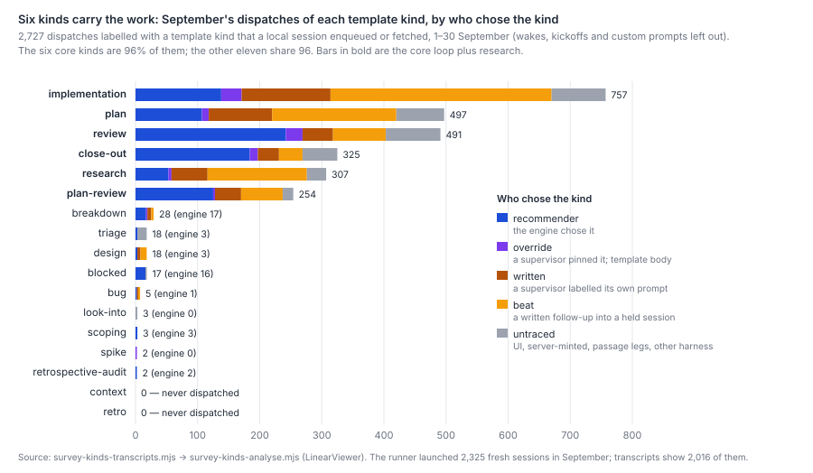

# Why does Harbour use only about six of its seventeen prompt kinds, and would the others earn their keep?

**Because the engine's decision tree is written as a lifecycle, and nothing outside it pushes back.**
In September, 96% of the 2,727 dispatches that carried a template kind used one of six kinds: plan,
plan-review, implementation, review, close-out and research. The recommender, a single cheap-tier call
at temperature 0, chose the core loop in 95% of its 894 picks. Supervisors that labelled their own
prompts were narrower still, at 97–98%. The meta-prompt's ladder runs through the core kinds, and the
core templates write the markers the tree routes on. The off-loop kinds get one guarded
hatch (design), a guard clause (scoping), or no mention at all (spike, context). The autopilot reads a
widening mix of kinds as "sprawling". Two kinds were never dispatched (context, retro) and five ran two
to five times each.

The narrow use is mostly right for this work. Eight tickets that had a design, scoping or spike pass
before plan cost about three times as much as 24 matched tickets and drew more plan send-backs, not fewer.
The sample is too small and too biased to say the richer kinds hurt. It gives no sign that they would
help. The meta-prompt's choice of kind is not worth changing now. What deserves a measurement first is
how it rewrites the prompt: the written prompt is 36–80% of the template's length and usually drops the
template's regression check and its Principle 0 test.

## Findings

**A. Six kinds carry 96% of the work; two are dead and five are effectively dead.**
Counts cover 1–30 September and the dispatches a local session enqueued or fetched. Kickoffs, wakes and
untemplated prompts are left out.

| kind | engine | override | written | beat | untraced | total | share of weighted tokens |
|---|---|---|---|---|---|---|---|
| implementation | 138 | 33 | 143 | 356 | 87 | 757 | 22.0% |
| plan | 107 | 11 | 102 | 200 | 77 | 497 | 6.5% |
| review | 242 | 27 | 49 | 85 | 88 | 491 | 10.4% |
| close-out | 184 | 13 | 34 | 38 | 56 | 325 | 5.5% |
| research | 53 | 5 | 58 | 160 | 31 | 307 | 5.5% |
| plan-review | 125 | 3 | 42 | 67 | 17 | 254 | 6.5% |
| breakdown | 17 | 1 | 6 | 4 | 0 | 28 | 0.5% |
| triage | 3 | 0 | 0 | 0 | 15 | 18 | 0.1% |
| design | 3 | 0 | 5 | 10 | 0 | 18 | 0.2% |
| blocked | 16 | 0 | 0 | 0 | 1 | 17 | 0.3% |
| bug | 1 | 0 | 1 | 3 | 0 | 5 | 0.2% |
| look-into | 0 | 0 | 0 | 0 | 3 | 3 | — |
| scoping | 3 | 0 | 0 | 0 | 0 | 3 | <0.1% |
| spike | 0 | 2 | 0 | 0 | 0 | 2 | 0.1% |
| retrospective-audit | 2 | 0 | 0 | 0 | 0 | 2 | <0.1% |
| context | 0 | 0 | 0 | 0 | 0 | 0 | — |
| retro | 0 | 0 | 0 | 0 | 0 | 0 | — |

The routes are:
- **engine**: `recommend-and-dispatch` without a kind.
- **override**: the same call with `kind`, so the server writes the template.
- **written**: a supervisor's own `POST /dispatch`, with the kind as its label.
- **beat**: a written follow-up into a held session.
- **untraced**: fetched by a session, but no transcript shows the enqueue. This covers the UI,
  server-minted triage and periodicals, the passage Runner's worker lanes, and enqueues whose output
  could not be parsed.

The token column is the share of September's 3.4 billion weighted tokens, by the kind in each session's
header. The rest of the 100% sits in supervisor, stepper, Runner, custom and wake sessions.

- **The engine's own picks** were 849 of 894 in the core six (95%). Its 45 others were:
  - breakdown 17;
  - blocked 16, which is the loop-bound escalation (meta :213);
  - triage, scoping and design, 3 each;
  - retrospective-audit 2;
  - bug 1.
  
  It picked look-into, spike and context zero times.
- **The verb override, the manual's sanctioned way to reach for a richer kind, was used 95 times.**
  It pinned spike twice and design never. The 18 design dispatches came from supervisors labelling their
  own prompts (15) and the engine (3).
- **Recommended against dispatched:** every engine pick above was dispatched, because the fused verb
  recommends and dispatches in one call. Only 24 bare `GET /recommend` previews appear in the
  transcripts, almost all of them steppers reading a core-loop body. Recommendations shown in the UI and
  never dispatched leave no local trace (Limits).
- **Repos:** every kind is chosen in LinearViewer. simple-dispatcher only runs the item; its one
  kind-specific rule is which kinds skip the bootstrap summary (`dispatcher.js:41`), which changes cost,
  not choice. All counts above come from LinearViewer scripts reading local transcripts. simple-dispatcher's
  run logs provide the coverage check.

**B. The bias is the meta-prompt's tree, carried forward by the core templates' own markers, and
nothing outside it pushes the other way.**
The selection points, and what steers each:

| Where a kind is chosen | What it sees | What steers it | Effect |
|---|---|---|---|
| Recommender (`openrouter.js:1845`, meta-prompt) | The ticket, its comments, its children's states; a menu of 16 template names plus `defer`, in file order (`prompt-templates.js:457-466`) | A prose ladder. Its priority line (meta :134) and its main route (research, the design hatch, no plan → plan, the plan-review gate, session fit) run through the core kinds (meta :139-218). Off-loop kinds enter only as fallbacks for a vague ticket (look-into, triage, :175), a label (bug), a guarded hatch (design, :196) or an escalation (blocked, :213). "When it is a close call, prefer research" (:166). "Resolve DOWN to plan/research" (:202). | **Produces the bias.** |
| Step 0, injected by code (meta :139-150) | `isTerminal`, `hasOpenChildren` | Allows only review, close-out or retrospective-audit | The one hard constraint; it narrows only finished nodes. |
| Core-template artifacts | Session fit, Plan Review Verdict, What CI Did Not Prove | The tree routes on markers that only core templates write | **Keeps the loop closed.** A design or spike writes prose nothing routes on, and the tree sends a decided shape on to `plan` (:196, guard c). |
| Autopilot (`autopilot-kickoff.js:461-478`) | The kind sequence of its children | Calls the engine each step. "research→plan→impl→review→close-out" is "converging"; a widening mix is "sprawling (worth a flag)". Override "rare, demonstrable misses only". | Reinforces the bias; adds no stepping of its own. |
| Stepper (`autopilot-kickoff.js:208-211`) | The engine's body | "Stay within ONE kind" | Inherits the engine's kind. |
| Passage Runner and worker lanes (`worker-lane-prompt.md:24`) | The passage plan | Child autopilots go back through the engine; a lane is always `implementation` | Inherits the bias, and records a lane's whole cycle as implementation. |
| UI (`render.js:100`) | Any issue | "✦ next step" goes to the engine; four visible kinds (look-into, research, plan, implementation); 13 more under "more" | Mostly reaches the engine. |

How much attention each kind gets is lopsided:
- **Mentions in the tree:** review 28, plan 27, close-out and implementation 17 each, research 11, design 5,
  scoping 1, spike and context 0.
- **Quality rules** (meta :296-312) exist for 12 kinds and none of design, scoping, spike, look-into or
  context.
- **The design hatch** (meta :196, LIN-878) has been in place since 2 July with four guards against
  over-firing. It fired 3 times in 894 September picks.

The manual names the result ("the engine's bias runs *down* the lifecycle toward the core loop",
`autopilot-operating-manual.md:177`) and leaves the reach upward to supervisors. In September they made
that reach twice.

**C. The richer kinds show no sign of earning their keep; the sample cannot show more than that.**

The groups:
- **Richer:** of the 156 tickets whose whole dispatch history began in September and that reached
  `plan`, 8 had design, scoping or spike before their first plan: LIN-1988, 2468, 2516, 2517, 2720,
  2754, 3059, 3134. Look-into never preceded a plan.
- **Matched:** each was paired with the three straight-to-plan tickets nearest in start date that
  matched it on whether a research leg preceded the plan and whether the ticket reached
  implementation, 24 tickets in all.

Verdicts were read from each ticket's comments.

| per ticket | richer (8) | matched (24) |
|---|---|---|
| plan-review Request Changes, mean | 1.75 | 0.92 |
| code-review Request Changes, mean | 0.00 | 0.38 |
| plan-review dispatches, median | 3 | 1 |
| dispatches excluding wakes, median | 16 | 8 |
| weighted tokens, median | 27.3M | 9.1M |

Selection runs strongly against the richer group. Contested, larger tickets attract a design pass:
two of the eight are epics, and LIN-2720, 2754, 3059 and 3134 ran four to six research dispatches
before their design. That pushes the richer group's costs up, so the 3× is an upper bound on any harm. The
paired comparison cannot separate the two effects, and eight tickets would not show a halving of
send-backs even without the bias. The one signal in the richer group's favour is zero code-review send-backs
against 0.38, about 3 expected events missing at n = 8. It is weak.

Two prior readings point the same way:
- `review-loops.md` (lines 13–17) found that plan-review's send-backs asked for one more member of a list
  the plan had already built, and none asked for a different design. A design pass answers the
  question those send-backs do not ask.
- `why-legs-repeat.md` puts 92% of repeated legs down to send-back loops (lines 26–32).

LIN-3200, the live example, fits the same picture. Its three plan passes were sent back for facts at
HEAD: a seam the workspace's dispatches don't pass through, and a query that returns nothing. They were
not sent back for the choice of shape. Research's own hint already names that case ("an unvalidated
assumption to de-risk before planning"), and spike's ("feasibility check") would have fitted it too. The
ticket went straight to `plan`: no research or spike precedes it in the transcripts. One ticket cannot
say how common that is.

**D. Step 2 halves the prompt and keeps most of the gates, but usually drops the regression check and
Principle 0.**

**There is no separate step 2 that merges task facts into the handwritten template.** One call writes
the action and the whole body (`openrouter.js:1716-1722`). Code then appends the grounding sections
(`:1788-1794`). The handwritten `generate()` body runs only for an override, a UI pick, triage, or
the audit page.

The comparison:
- **The pairs:** for September's engine-written prompts and the override prompts of the same kind, the
  sample is every one a transcript fetched. That is 553 written and 68 template bodies over six kinds.
- **Written prompts are shorter than the templates:**

  | kind | written, median characters | template, median characters | written as share of template |
  |---|---|---|---|
  | review | 6.9k | 19.2k | 36% |
  | close-out | 6.4k | 16.4k | 39% |
  | plan | 7.7k | 15.2k | 51% |
  | research | 7.6k | 12.0k | 64% |
  | implementation | 7.0k | 9.5k | 74% |
  | plan-review | 7.1k | 8.9k | 80% |

- **The gate content survives:** the ledger, re-grounding at HEAD, the verdict words and git history each
  appear in 99–100% of written prompts of every kind. Mostly that is because code appends them. The
  mutation check appears in 98% of written reviews.
- **What drops:**
  - The word "regression" appears in 27% of written reviews, 42% of written implementations and 12% of
    written close-outs, against 100% of their templates.
  - The Principle 0 test appears in 13% of written plans and 7% of written implementations, against 100%.
  - Under the template's own headings, a written prompt keeps 32% (review) to 72% (research) of them.
    The phrasing changes more than the substance.

So the engine is a compressor that mostly keeps the gates. Whether what it drops matters is a question
for a fixture eval, not for this census.

**E. Four kinds are manual or event-driven by design, and that is fine. Two never fire and one barely does.**
- **By design:**
  - `retro` is excluded from the engine because a Done task would trigger it too eagerly
    (`prompt-templates.js:436-440`). It ran 0 times.
  - `triage` is minted by the feedback widget: 15 of its 18 dispatches are untraced, and 13 are named as
    server-minted.
  - `blocked` is the engine's escalation after a second plan send-back: 16 of 17 dispatches.
  - `retrospective-audit` is Step 0's third branch for merged work: 2.

  Each fires where it should.
- **Dead or nearly dead:**
  - `context` ("joining mid-way, returning after gap") ran 0 times. A fleet that always starts sessions
    fresh with a brief has no use for it, and it reads as a tool for a person.
  - `look-into` is one of the UI's four visible kinds and ran 3 times, none chosen by the engine. Research
    and triage cover its hint.
  - `spike` ran 2 times, both overrides.
  - `scoping` ran 3 times, and `bug` 5.

## Method

The population is every dispatch item that a main Claude transcript under `~/.claude/projects`
enqueued or fetched, dated 1–30 September 2026, plus each session's header kind (`# LIN-n · kind`).
- **Coverage:** simple-dispatcher's run logs show 2,325 fresh sessions launched in September, and the
  transcripts hold 2,016 of them (87%). Warm follow-ups are mostly wakes delivered inside a held Stop
  hook without a fetch, and the transcripts hold 1,715 of 6,391.
- **Routes:** a route is read from the Bash call that enqueued the item: the endpoint, whether the body
  carried `followUpTo`, and the `"override": true` the server returns on a pinned verb. Responses printed
  as JSON, as a Python dict or as `key = value` lines are all parsed. 193 enqueue calls (6%) printed
  nothing parseable and are left out, so their items count as untraced if a session fetched them.
- **Tokens:** weighted tokens are `survey-costmix-tokens.mjs`'s units (frontier-input equivalents, tier
  weights as `cost-mix.md`), by session-header kind.
- **Finding C** matches as stated there and reads verdicts from comments. A comment counts if its opening
  names a (plan) review and it states **Request Changes** or **Approve**. Verdicts from 33 tickets came
  from 33 paced proxy reads.
- **Finding D** compares the six kinds that have both arms in the sample.

The scripts, all under `scripts/` in LinearViewer:
- `survey-kinds-transcripts.mjs`: enqueues, previews and fetches.
- `survey-doubling-runner.mjs --out data/survey-kinds/runner.json`: runner coverage.
- `survey-costmix-tokens.mjs --since 2026-09-01 --until 2026-10-01 --out data/survey-kinds/tokens.json`:
  tokens.
- `survey-kinds-analyse.mjs`: census, coverage and ticket rows.
- `survey-kinds-verdicts.mjs --extra LIN-3200`: matching and verdicts.
- `survey-kinds-fidelity.mjs`: finding D.
- `survey-kinds-figures.mjs`: the chart.

Run `survey-kinds-analyse.mjs` once before the verdicts script and again after it. Snapshots go to the
git-ignored `data/survey-kinds/`. The selection-code map was read at the shas in the header.

## Limits

- **September only, not six to eight weeks.** Transcripts and the dispatch history are kept for 30 days,
  and the runner logs name no kind. The census cannot show a trend.
  - *Bias:* the design hatch and the override were both in place all month, so September is a fair
    reading of today's mechanism, not of July's.
- **The 13% of fresh sessions the transcripts miss** may be on the other harness or have been enqueued
  from the UI. A person picking from the UI could reach for richer kinds more than the engine does, so
  the census may understate them.
  - *Bound:* if every one of the 309 missing sessions were an off-loop kind, the off-loop share would rise
    from 4% to at most 13%.
- **Recommendations that were never dispatched are invisible.** These are UI suggestions declined by a
  person. They sit in the server's call log, which the proxy does not expose.
  - *Bias:* if people decline the engine's richer picks, the engine recommends richer kinds more often
    than it dispatches them. Nothing here can say how often.
- **A label is not a template.** 1,363 of the 2,727 were supervisor-written prompts carrying a kind
  label, so their kind says what the supervisor meant, not which template text ran.
- **No repo split.** The dispatch list carries no repo, so dispatches on simple-dispatcher tickets are
  counted inside LinearViewer's queue. Because no kind is chosen in simple-dispatcher, only the
  per-repo counts are lost, not the mechanism.
- **Finding C is n = 8 against 24, matched on two flags and start date, not on size.** Estimates are
  empty on all 32.
  - *Bias:* the richer group's costs are overstated, for the reasons given in C.
  - *Verdict reading:* the comment regex undercounts Approves written in other words. It is read the
    same way for both groups.
- **Finding D's template arm is small and selected.** It has plan-review 1, research 2, close-out 5, and
  overrides happen on engine misses.
  - *Bias:* heading and keyword matches undercount content restated in other words, so the drops are an
    upper bound.

## Options

Each option needs a size, a risk and a reading. John's rule is that simple tasks get simple
processes, so an option that adds legs has to remove more than it adds.

1. **Leave the choice of kind as it is.** Recommended.
   - *Effect:* 0. The off-loop kinds are 1.4% of weighted tokens. C gives no sign that more of them
     would cut send-backs, and `review-loops.md` says send-backs are not about design.
   - *Risk:* none.
   - *Measure:* none needed.
2. **A cheap "is a shape or a load-bearing fact contested?" check before `plan`**, as a typed yes/no
   (cf. `jev-decision-model.md`'s gate shape) rather than more prose.
   - *Effect:* −0 to −2% of tokens. Its ceiling is the plan-review send-backs a fact check would
     pre-empt, and `review-loops.md` reads most of those as list-completeness. Every ticket pays one
     cheap call, and a yes adds one leg.
   - *Risk:* low to correctness, medium to cost if it over-fires the way the design hatch's four
     guards were written to prevent.
   - *Measure:* plan-review Request Changes per planned ticket, and legs per correct change, held out
     by lineage (M29).
3. **Reword the hints and give the five off-loop kinds tree branches and quality rules.**
   - *Effect:* unknown. It might move 1–5% of picks off the core loop, with no evidence that this
     removes legs.
   - *Risk:* low to correctness. It adds prompt prose, against M25's freeze.
   - *Measure:* a per-step fixture eval, three runs per arm (M33), before any live change.
   - Not recommended now.
4. **Retire `context`, and fold `look-into` into research or triage**; keep `spike`, `scoping` and
   `design` for overrides.
   - *Effect:* a shorter menu and four fewer UI choices; tokens negligible.
   - *Risk:* low. Touches pins (M19, M20).
   - *Measure:* dispatches of the retired kinds stay at 0, and nothing turns up in UI feedback.
   - Housekeeping in the spirit of M30.
5. **Pick the core-loop steps in code.** The tree's core branches are fully decided by observable state:
   plan present, verdict recorded, ledger present, PR green. Keep the model for the forks.
   - *Overlaps:* M5 (rule-class calls in code) and M3.
   - *Effect:* determinism, and the full template body every time, which closes D's drops. It also costs
     1.25–2.8× the prompt characters per leg, against M12.
   - *Risk:* medium. It changes every worker prompt at once.
   - *Measure:* review faults per change and tokens per correct change, in shadow first (M28).
   - Measure D's drops before choosing between this and leaving step 2 alone.

**Is the meta-prompt worth improving now?** Not its choice of kind. Its prompt writing is worth a
measurement first: a fixture eval of written against template bodies on the regression check and
Principle 0, before anyone edits it. The meta-prompt has already grown 5.7× since June
(`harbour/steady-base.md`), so more prose is the wrong first move.

## Next

- Does the engine's compression of the template (dropping the regression check in most written reviews
  and close-outs, and Principle 0 in most plans and implementations) change what review catches? A
  fixture eval of written against template bodies on the same tickets answers it. (Added to
  `proposals.md`.)
- How often do people decline the engine's UI recommendation, and for which kinds? The server's call
  log has it, once it is kept (M24).
