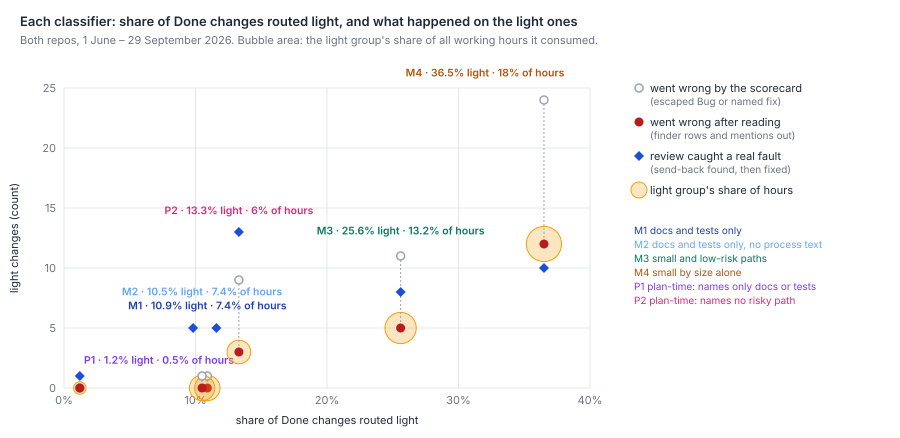
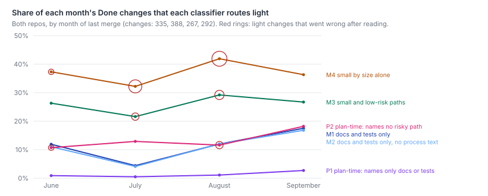

# Had a simple size-and-risk classifier sorted Harbour's past tickets, how many could have taken a lighter process, and what would have escaped among them?

Between a tenth and a third of them, depending on the rule. Very little escaped in any light
group, but the full process did catch things there. It caught them almost all at plan review, and
almost all on changes whose paths looked safe. Six rules were fixed and committed before any
outcome was read. They were run over the 1,282 Done changes merged since 1 June in both repos. The
two docs-and-tests-only rules route 11% light. Not one of those changes went wrong after merge
once the scorecard's failures were read (95% interval 0 to 4 in 100). The small-and-low-risk-path
rule routes 26% light. Five of its 249 mature changes went wrong after reading (2 in 100). Its
light group used 13% of the working hours. On the price side, a plan review or code review caught
a real fault before merge on 5 of the docs-only changes and on 8 of the small-and-low-risk ones.
In both groups most of these came from plan review. The docs-only catches were not in docs: two
were parent tickets whose code shipped under child tickets, one was a runbook whose commands could
not run, and two were prompt text served to agents. The plan-time rule reads only the ticket's
text. It is the cheapest to apply and the least safe to trust: 3 of its 116 mature light changes
went wrong, and review caught 36 real faults on its light group. Among them were agent reads that
would have widened to the whole workspace, and one ticket with 15 faults. The light groups were
already cheaper to run, at about half the dispatches and hours and a third of the tokens of the
heavy groups. So the effort a lighter process could save is capped by what they cost now. That is
at most 18% of working hours (M4) and 13% for the small-and-low-risk rule, not the 77% that a per-ticket cost ratio might suggest.



*Changes* are the throughput scorecard's (`measuring-throughput.md:41`). A change is a ticket
whose id names a first-parent merge on `origin/main` since 1 June, in LinearViewer (Harbour) or
simple-dispatcher (the runner). Here only changes that reached Done count: 1,282 in all. 1,076
touched Harbour only, 187 the runner only and 19 both. *Mature* changes merged at least 30 days
before 30 September, so an escape or fix had time to show: 984 of them. *Went wrong* uses the
scorecard's own tests, an escaped Bug naming the change or a later fix commit naming it
(`:42`). *After reading* removes two kinds of false positive. The first is escapes that name the
ticket whose review found an older fault (`survey-check-2.md:301-312`). The second is named fixes
that only mention the change. *Review caught a real fault* means a plan review, code review or
close-out hold sent the change back over a defect that would otherwise have shipped on main, and
the defect was then fixed before merge. Every number covers both repos unless a repo is named.

## Findings

**The six rules, fixed before any outcome was read.** Four apply at merge time, from the paths
and lines a change touched. Two apply at plan time, from the ticket's title and description and
the repository paths that text names.

| Rule | Light when… |
|---|---|
| M1 docs and tests only | no production lines |
| M2 … without process text | M1, and no CLAUDE.md, AGENTS.md, `docs/architecture/` or `.claude/` file |
| M3 small and low-risk paths | ≤ 49 production lines in ≤ 3 files; no auth, data-store, prompt/template or CI path; no path a CLAUDE.md invariant names; no process text |
| M4 small by size alone | ≤ 49 production lines in ≤ 3 files, any path |
| P1 plan-time, docs or tests named | the text names a path, every named path is docs or tests, and no risk word appears |
| P2 plan-time, nothing risky named | the text names a path, none is risky, invariant or process text, and no risk word appears |

**How many go light, and what they used.** The light groups are small, cheap changes already.
None of them used more than 18% of the working hours.

| Rule | Light | Harbour | runner | Share of dispatches | of working hours | of tokens | Median dispatches, light / heavy | Median working hours | Median tokens (M) |
|---|--:|--:|--:|--:|--:|--:|--:|--:|--:|
| M1 | 140 (10.9%) | 12.2% | 4.8% | 12.1% | 7.4% | 7.9% | 7 / 12 | 1.0 / 1.5 | 24 / 70 |
| M2 | 134 (10.5%) | 11.7% | 4.3% | 12.0% | 7.4% | 7.9% | 8 / 12 | 1.1 / 1.5 | 24 / 68 |
| M3 | 328 (25.6%) | 26.8% | 21.4% | 21.3% | 13.2% | 12.9% | 7 / 13 | 0.9 / 1.7 | 28 / 74 |
| M4 | 468 (36.5%) | 37.3% | 34.2% | 29.7% | 18.0% | 17.0% | 8 / 14 | 1.0 / 1.8 | 30 / 78 |
| P1 | 16 (1.2%) | 1.3% | 1.1% | 1.0% | 0.5% | 0.5% | 1 / 11 | 0.4 / 1.5 | 5 / 63 |
| P2 | 170 (13.3%) | 14.0% | 9.6% | 8.6% | 6.0% | 9.6% | 7 / 13 | 1.0 / 1.5 | 42 / 64 |

- **Shares by repo.** The Harbour and runner columns give each repo's own share routed light.
  The 19 changes that touched both repos go light only under M4 (3) and P2 (1).
- **Coverage of the effort columns.**
  - Dispatches come from the runner's run logs and cover 734 changes. June is mostly missing.
  - Working hours come from its oplog, from 12 July, and cover 665 changes.
  - Tokens come from local transcripts and cover 171 changes, almost all in September. They
    count only claude-code sessions, and only for a change whose every session left a transcript.
- **The light group still gets reviewed.** Going by comment headings, a docs-and-tests-only
  change was code-reviewed 58% of the time and sent back 16% of the time, against 70% and 19% for
  its heavy group. M3's light group was code-reviewed as often as its heavy group (69% and 68%),
  and sent back half as often (11% and 21%). The heavy figures are weighted from the 1-in-4
  sample.
- **Why the saving is bounded.** A docs- or tests-only change costs about a third of a heavy
  change in tokens, and three-fifths to two-thirds in dispatches and hours. So the "77%" in
  `docs/steady-base.md:25` is not the saving on offer: it compares a docs-only ticket with the
  median ticket, from a sample of 87 (`where-the-effort-goes.md:155-163`). The most any light lane
  could save is what its group costs now: 7% (M1) to 18% (M4) of working hours, less whatever
  the light process still spends.

**Almost nothing escaped in the light groups, and the escapes that did were visible in the
code.** Every mature light change that the scorecard counts as not correct was read.

| Rule | Mature light | Not correct, scorecard | After reading | Per 100 (95% interval) | Heavy group, scorecard, per 100 |
|---|--:|--:|--:|--:|--:|
| M1 | 89 | 1 | 0 | 0 (0–4.1) | 11.1 |
| M2 | 85 | 1 | 0 | 0 (0–4.3) | 11.0 |
| M3 | 249 | 11 | 5 | 2.0 (0.9–4.6) | 12.1 |
| M4 | 360 | 24 | 12 | 3.3 (1.9–5.7) | 12.2 |
| P1 | 8 | 0 | 0 | 0 (0–32) | 10.2 |
| P2 | 116 | 9 | 3 | 2.6 (0.9–7.3) | 10.5 |

The heavy column is the scorecard's rate before reading, so it is not directly comparable with
the light column after reading. Both fall on reading, because both carry finder rows and mere
mentions (Limits). On the scorecard's own terms, every light group fails a third to a tenth as
often as its heavy group.

Every escape in a light group, by name:

- **M1 and M2.** One on the scorecard: LIN-2331, named by LIN-2414. That is a finder row, a
  pre-existing fault the change's review found and routed out (`survey-check-2.md:311`). None
  after reading.
- **M3.** Five after reading, all in Harbour.
  - Escaped Bugs:
    - LIN-1447 (23 lines, `routes/dispatch.js`). Its compat lane issued ownerless broker
      tokens, and every workspace verb returned 503 (LIN-1576). The path names no auth word; the
      change was about tokens.
    - LIN-2252 (5 lines of CSS). The padding fix was inert (LIN-2272).
    - LIN-2355 (17 lines). It left the proxy preamble half unfixed for non-Linear workspaces
      (LIN-2804).
  - Named fixes that blame the change:
    - LIN-1485: a `length === LIMIT` truncation test (LIN-1494).
    - LIN-2123: a resume-marker fix that never fired (LIN-2268).
  - Removed on reading: three finder rows (LIN-2037, LIN-2291, LIN-2331) and three named fixes
    that only mention the change (LIN-805, LIN-1492, LIN-2262).
- **M4.** M3's five, plus seven changes on risky paths:
  - LIN-1318, kickoff prompt wording that defeated push wake;
  - LIN-1471, runner `dispatcher.js`, duplicate wakes;
  - LIN-2227, a data store, old rulings resurfacing;
  - LIN-811, a close-out gate that missed the bug path;
  - LIN-1239, a grounding layer reverted as inert;
  - LIN-1982, a sibling selector it declined to fix;
  - LIN-2124, a wording clause that stalled sessions.

  LIN-1471 is the one runner change. So M3's path rules removed seven of M4's twelve for 140
  fewer light changes.
- **P2.** Three after reading:
  - LIN-442 (343 lines): a toggle desync after lazy-loading (LIN-525).
  - LIN-1736 (574 lines): a cross-workspace `decision_id` collision in the KPI join, blamed by
    LIN-2291.
  - LIN-2252, as above.

Two of the five M3 failures, LIN-2123 and LIN-2252, were found by a review sweep of work already
merged, not by the change's own review. None of the five involved auth or data loss, except that LIN-1447's fault
was in token handling behind an innocuous path. Of the seven named fixes that blame a light change, the coder judged five could have been caught
by reading the diff (`reviewCouldCatch` in `proportional-process-backtest-codes.json`).

**The full process did catch real faults on light changes, mostly at plan review.** Every light
change that a plan review, code review or close-out sent back was read: 72 changes, 116 genuine
send-backs, 369 findings. Of those findings, 170 changed only wording, 76 only tests, 37 were
filed as follow-ups and 84 changed production code. 50 were real faults, on 21 changes; three
more were found only after merge, and those are counted above as escapes or fixes, not here.
This is what each light group would have put at stake:

| Rule | Light changes with a real fault caught | Real-fault findings | By plan review / code review / close-out |
|---|--:|--:|--:|
| M1, M2 | 5 of 140 (3.6%) | 12 | 9 / 3 / 0 |
| M3 | 8 of 328 (2.4%) | 15 | 11 / 4 / 0 |
| M4 | 10 of 468 (2.1%) | 17 | 13 / 4 / 0 |
| P1 | 1 of 16 | 2 | 2 / 0 / 0 |
| P2 | 13 of 170 (7.6%) | 36 | 15 / 18 / 3 |

The tickets, and what the full process caught on each:

- **Docs-and-tests-only changes (M1, M2), five changes.**
  - Parent tickets whose code shipped under their children:
    - LIN-2994 (Harbour). Plan review found the halt routes colliding with `/dispatch/:id` and a
      UUID guard, which would have given a proxy 404 and a dashboard 400.
    - LIN-2995 (runner). Plan review found five faults: a stop sweep that missed held sessions
      the failsafe would refire, a resume hold that starved aborts, and three more.
  - LIN-3001 (Harbour), a docs-only runbook. Review found an inverted rollback rule and two
    `mongosh` commands that could not reach the database.
  - Agent-facing prompt text:
    - LIN-2175. Plan review found a Runner prompt contradicting its own hard rule, and a launch
      goal the kickoff's first act would override.
    - LIN-1812. Plan review found a false budget claim (low confidence).
- **Small and low-risk paths (M3), those five plus three small code changes.**
  - LIN-1801: a title rendered into the label column on mobile.
  - LIN-2353: a missed sibling dispatch producer that would still have told workers "Linear".
  - LIN-2701: a sync-to-async Express handler that would hang on a render throw.
- **Small by size (M4) adds two more.**
  - LIN-2333: a gate that never fired for the parked anchors it targeted.
  - LIN-2511 (runner): an unbounded guard that would have left dead-hook sessions stuck.
- **Plan-time (P2) routes large changes light when their text names little.** Ten of its 13
  are over 100 lines.
  - LIN-2934 (700 lines) had 15 real faults caught. Among them: the feed's "n of N" would have
    been served stale for 30 days, a duplicate count, and an off-by-one.
  - LIN-2025 (245 lines). Plan review stopped agent proxy reads silently widening to the whole
    workspace on an unmatched team id.
  - LIN-2719 (848 lines): a model picker that would have dispatched its placeholder as the model.
  - LIN-2872 (Harbour, 122 lines): a change that would have removed the duplicate-dispatch
    guard for every failed opencode dispatch.
  - LIN-1963 (993 lines): a research baseline diluted 45×.
  - LIN-2253 (452 lines): a 12.5× dilution of cost figures on the public `/kpis` page would
    have come back.
  - Others: LIN-1358, LIN-1908, LIN-1958, LIN-2717, LIN-2830.

Most of the rest of what the process bought on light changes was evidence and wording. On 51 of
the 72 sent-back changes it caught no real fault, and on 44 it changed no production code.
`which-rules-pay.md` coded review consequences on 83 recent tickets and overlaps here.
- **M1 and M3.** Its codes find no production change on M1's light tickets, and one on M3's
  (LIN-2787, not a fault).
- **P2.** On P2's light tickets they find 24 production changes and 15 real faults across 8
  tickets. Those include LIN-2760 and LIN-2771, which no send-back reached: their faults were
  caught under an approving review's ledger. So the table above undercounts catches (Limits).

For scale: across its 100 code-reviewed September tickets, review fixed 44 real faults in 18
tickets (`which-rules-pay.md:55`). That is 18 in 100 there, against 2 to 4 in 100 on the
merge-time light groups here. The populations differ, since which-rules-pay excluded docs-only
and research tickets.

**The merge-time rules are stable month to month; the docs-only rule is not; the plan-time
rules drift up.**



- **M3 and M4 are stable.** M3 routes 26%, 22%, 29% and 27% light in June to September, and M4
  37%, 32%, 42% and 36%.
- **M1 is not.** It routes 12%, 4%, 12% and 18%. July's dip follows the regime change
  `why-throughput-halved.md:67-68` describes, when docs- or tests-only changes fell. September's
  rise is partly this survey series: 18 of its 51 docs/tests-only changes touch `docs/papers/`,
  against none in June.
- **The plan-time rules drift up.** P2 routes 11%, 13%, 12% and 18%, and P1 routes 1–3%.
  That is consistent with ticket text growing longer and naming more paths (`writing-length.md`).
- **Where the misses fall.** M3's five went-wrong changes fall in July (2) and August (3), and
  M4's twelve in June (1), July (5) and August (6). September changes are not yet mature.
- **Whether each rule catches what later went wrong.** Of the 100 mature changes the scorecard
  counts as not correct:

  | Rule | Sent heavy |
  |---|--:|
  | M1, M2 | 99 |
  | M3 | 89 |
  | M4 | 76 |
  | P1 | 100 |
  | P2 | 91 |

  After reading, M3 lets through 5 true failures and M4 lets through 12. The size rule alone
  (M4) misses a quarter of what went wrong. The path rules in M3 halve that at the cost of
  routing 140 fewer changes light.

## Method

```
# reuse the scorecard's same-day snapshots (measuring-throughput.md's Method: survey-effort-git,
# -runner, -fleet, survey-reliability-github, -tracker, survey-scorecard), and survey-rules-fetch's
# data/survey/rules-tickets.json (which-rules-pay.md), then:
node scripts/survey-proportional-classifiers.mjs  # per-change paths and text features, the six rules → data/survey-proportional/features.json
node scripts/survey-proportional-tokens.mjs       # per-change transcript tokens → data/survey-proportional/tokens.json
node scripts/survey-proportional-fetch.mjs        # comments for every light change + 1 in 4 heavy (proxy, 4.5 s a call)
node scripts/survey-proportional-backtest.mjs     # the join, every table above → data/survey-proportional/backtest.json
node scripts/survey-proportional-digests.mjs      # reading digests of light changes a review sent back
node scripts/survey-proportional-codes.mjs        # assemble the committed hand codes
node scripts/survey-proportional-backtest.mjs     # re-run with the codes
node scripts/survey-proportional-chart.mjs        # the two SVGs
```

- **The rules came first.** `survey-proportional-classifiers.mjs` was committed as `bff7e149`
  before the backtest joined any outcome, and not changed afterwards.
  - The risk path patterns extend `survey-effort-git.mjs`'s.
  - Invariant paths are the files each repo's CLAUDE.md invariants govern, at the scorecard's
    heads.
  - The risk words are a fixed list: auth, credential, token, secret, security, permission,
    grant, encrypt, revoke, login, password, migration, schema, database, mongo, data loss,
    state-store, sessions.json, invariant, meta-prompt and prompt template.
  - Paths are read from git at the scorecard's heads with `survey-effort-git.mjs`'s attribution
    rule. They reproduce its production-line count for all 1,311 changes with no mismatch.
- **Population and outcomes.** These are the scorecard's per-change fields, from
  `data/survey/scorecard.json` (cut 30 September, window 30 days), filtered to Done. The escape
  list is recomputed with its window and checked equal to its count. Named fixes are recovered
  from git with its rule, so they can be named.
- **Effort.**
  - Dispatches and working hours are the scorecard's, from `survey-effort-runner.mjs`.
  - Tokens are input, cache and output tokens over each claude-code session the run logs map to
    the change, from `~/.claude/projects`, with message ids counted once and subagents included.
  - Review rounds come from comment headings, using `survey-rules-timeline.mjs`'s `legOf` and
    `verdictOf`.
  - Comments come from three sources: the tracker and rules snapshots already on disk, and 560
    proxy fetches. The fetches cover every change any rule routes light (558, a census) and a
    systematic 1-in-4 sample of changes every rule routes heavy (184, weighted 4).
- **Reading.** `docs/papers/harbour/proportional-process-backtest-codes.json` holds every hand
  code.
  - *Finder rows* are `survey-check-2.md`'s eight changes named only by them.
  - *Named fixes*: all 25 pairs on light changes were coded blames, unclear or mention against a
    written rubric. 7 blame.
  - *Review catches*: every light change with a heading-labelled send-back (72) was coded. Each
    send-back finding was followed to what it changed, against a rubric fixed before reading.
  - The ten coders were given the same conventions. The last six had them written into their
    brief, after the first four applied them independently.
  - The author set `realFault` false on three findings made by a review *after* merge. Those
    faults had shipped, and are counted as escapes or fixes (LIN-2123, LIN-2124, LIN-2252;
    `adjustments` in the codes file).
- **Proxy.** 560 calls at one per 4.5 s, under the survey's shared 15 a minute. The only writes
  were the ticket's status and its closing comment.

## Limits

- **Selection: the full process ran on every change here.** A light-group escape is a fault the
  heavy process also missed. What a lighter process would have missed is shown only by what the
  heavy one caught (the catches table). Its effect on the escape counts is unknown, and they
  understate a light lane's risk.
- **The catches are undercounted.** Only send-backs were coded. Faults fixed under an approving
  review's ledger (LIN-2760 and LIN-2771 in `which-rules-pay`), or caught by an implementer
  before any review, are missing. This biases the price of a light lane down. The size of the
  bias is unknown, but which-rules-pay's overlap suggests it is largest for P2.
- **Attribution noise.**
  - A parent ticket whose code landed under its children looks docs-only (LIN-2994, LIN-2995).
    This makes docs-only rules look riskier than a docs change is, and hides that the parent's
    plan review shaped code elsewhere.
  - A change whose risk is in its content, not its path names, looks low-risk (LIN-1447: tokens
    in `routes/dispatch.js`). This makes merge-time path rules look safer than they are.
- **The escape and fix tests are text matches.**
  - Only about 31 of 190 escaped Bugs name a change at all (`measuring-throughput.md:228-231`),
    so escapes are undercounted in both groups. `reliability-baseline.md:82-86` also finds
    attributed escapes rarer on small changes (0.7 against 2.5 in 100), so the pattern here is not
    new. Whether faults in small changes are less often attributed is unknown.
  - The reading removed false positives only in the light groups. So the light-versus-heavy gap
    before reading is the fair comparison, and the gap after reading is overstated.
- **The send-back heuristic mislabels.** Coders found plan revisions, shadow reviews and
  orchestrator overrides headed "request changes". The review-round and send-back shares in the
  effort table come from the heuristic and run high. The coded counts do not.
- **The plan-time rules read today's ticket text.** Descriptions are edited after planning, and
  scope amendments add paths. The plan-time rules are better informed here than they could have
  been at plan time, which biases them to look safer.
- **Maturity and coverage.**
  - September's 292 changes are in the shares but not the rates. They have the most docs-only
    changes, and their outcomes are unknown.
  - The effort columns cover subsets. Dispatches start in late June and hours on 12 July. Tokens
    are September claude-code sessions only: 30 changes in M1's light group and 17 in P2's. So
    the token medians are indicative only.
- **Small counts.** Every light-group rate rests on 0 to 12 events. The intervals are printed;
  P1's is 0 to 32 in 100.
- **One coder per item, not second-read.**
  - LIN-2934's codes overlap `which-rules-pay`'s. Here it has 15 real faults and 18 production
    changes; there it has 10 and 15, with plan review excluded. The direction agrees.
  - Marginal calls are listed in each batch's codes: docs errors as real faults, and
    approve-conditional items as close-out findings.

## Next

What John would need to decide, not what to build:

- **What price is acceptable.** Under M3, a lighter process would have put at stake the faults
  review caught on 8 of 328 changes, to save at most 13% of hours. It also carries the 5 escapes
  that happened anyway. Is that the right trade, and is it the same for Harbour and the runner?
- **Whether "light" means fewer legs or lighter legs.** On merge-time light changes, most real
  faults came from plan review, not code review. Which legs a light lane keeps decides most of
  its risk.
- **Whether a merge-time rule can be applied at plan time.** The plan-time rules are either
  near-empty (P1) or route large, faulty changes light (P2). The merge-time rules need the
  finished diff. Where the decision sits is a question in itself.
- **What counts as docs.** Runbooks, served prompt text and parent tickets whose code ships under
  children behave like code. Should a rule treat them so?

Proposal line added to `proposals.md`: *after the same reading, what share of the heavy group's
scorecard failures survive?* Without it, light and heavy cannot be compared on the same footing.
