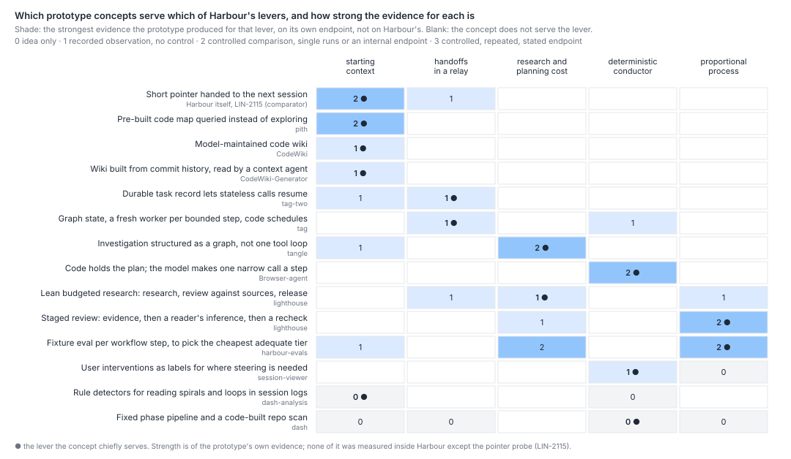
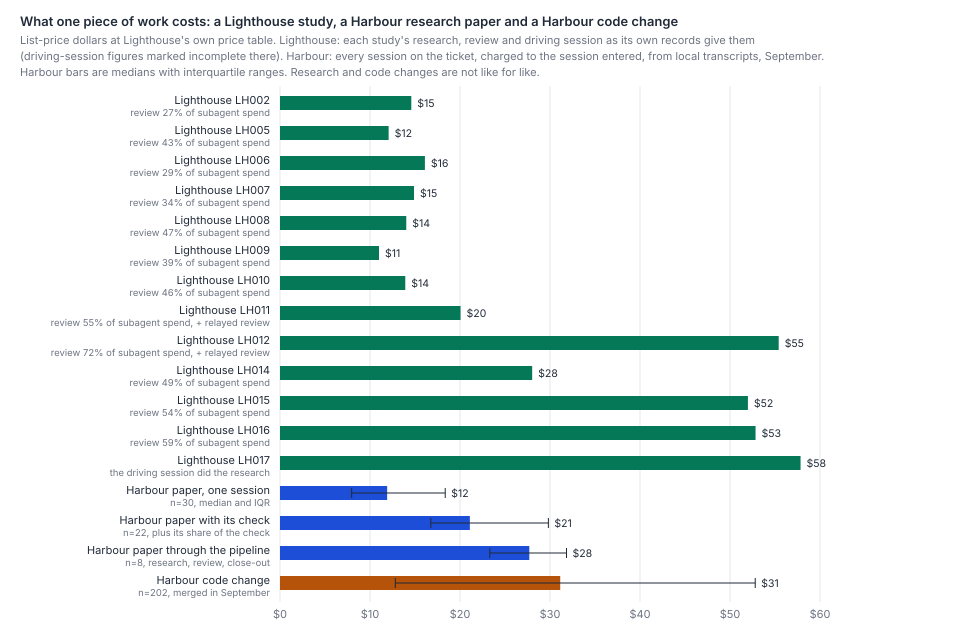

# Which ideas from John's prototypes would serve the levers the fifth wave found, and what does a lean research process like Lighthouse's cost and catch next to a Harbour ticket?

**Nearly every lever has a prototype concept behind it, but none of the evidence is strong.** No prototype produced a
repeated controlled comparison on an endpoint it was not tuned on. Where the evidence points, it agrees with the fifth
wave:
- **Starting context.** A short pointer beats a maintained map or wiki. Pith's map lost to fresh exploration on 14 of 15
  tasks and tied one, and CodeWiki's answers did not improve as it grew.
- **The conductor.** Code that holds the sequence around a narrow model call is the best-supported concept
  (Browser-agent: 3/20 to 19/20), but only on a small model, on the tasks it was tuned on.
- **Relay handoffs.** A durable record lets a fresh worker resume, but it did not stop repeated work: given the record,
  tag-two's planner re-proposed done work for about half its nodes (24 of 47). Its smaller run without the record
  (4 of 14) was on another commit, and tag-two itself calls that contrast not established.

**Lighthouse.** A study costs about **$16 at list rates** (median of 13, from its own records), **1.35 times a one-session
Harbour paper** ($12, median of 30), **0.76 times one with its share of the independent check** ($21) and about half a
Harbour code change ($31, median of 202; a code change is 2.6 times a paper). In weighted tokens a study costs about what
a one-session paper does (1.0×): its premium in dollars is its top-tier review. Its studies cost $14 before 28–29
September and $52 after, when four of six added a second, reader-and-inference review, but most of that rise was larger
driving sessions and review overall; the reader pass itself cost $4–13 a study.

Both review processes catch mostly figures and how sure a sentence sounds, and both kept finding things:
- **Lighthouse.** Every correction to a released piece came from review the keeper relayed after release, or from rounds
  the keeper commissioned, in which its review agents made 15 of the 35. Three of its twelve earlier articles had their
  main claim corrected.
- **Harbour.** 23 of 24 checked Harbour documents had a claim corrected that their check found did not hold; about 20 by
  the checks' own word "load-bearing".

So the lean shape is not cheaper than Harbour's lean paper shape. Its lesson is where the check sits (before release)
and that each added reader finds what the last one passed.



## Findings

**1. The prototypes supply a concept for every lever, but at most a controlled comparison run once or tuned on its task.**
The matrix above codes each concept against the five levers by the strongest evidence the prototype produced on its own
endpoint:
- 0: an idea only;
- 1: a recorded observation with no control;
- 2: a controlled comparison with single runs or an internal endpoint;
- 3: a controlled comparison, repeated, with a stated endpoint.

Fourteen concepts, from twelve prototype repositories plus Harbour's own pointer probe as a comparator, reach 2 at most. Six
repositories hold nothing relevant: memory-monitor, yap-agents, Herd, harbour, opencode-lite-js and mangodb. Two more,
doc-maker and ma-test, are empty.

The five projects `what-should-an-agent-leave-behind.md` read are still at the commits it pinned, so nothing new has
landed in them since 20 September. The new evidence here is:
- Lighthouse;
- harbour-evals (three cheap models over sixteen Harbour step fixtures, one run each);
- tag (the first TAG, a fresh worker per bounded step chosen by a code scheduler);
- session-viewer and dash-analysis (observations or ideas only).

Every concept's evidence, endpoint and citation is in [`prototype-concepts-matrix.json`](prototype-concepts-matrix.json).

| Lever | Concepts | Best evidence, and which way it points |
|---|---|---|
| Starting context | Pointer (Harbour, LIN-2115); code map (pith); maintained wiki (CodeWiki, CodeWiki-Generator) | **A pointer, not a pack.** The 93-token pointer: 18 turns against 51, one task, one no-pointer run (strength 2). Pith's map answers scored 236 of 300 rubric points against 286 for direct exploration, 0 wins, 14 losses and a tie in 15, judged against the exploring agent's own answer as ground truth; about 14 earlier runs point the same way (2, against). CodeWiki's fully accurate answers went 6, 3, then 4 of 15 as pages grew from 30 to 53 to 62, in one run the project blames partly on parsing bugs (1, no gain). |
| Handoffs in a relay | Durable task record (tag-two); graph state with a fresh worker per step (tag) | **A record is necessary, not sufficient.** Stateless readers answered questions about three closed episodes correctly, but a planner given the record re-proposed done work for 24 of 47 nodes. The run without it, 4 of 14 on three graphs at another commit, is a contrast tag-two calls not established (1). tag's one self-run resumed from the graph; no live model dispatch ever succeeded (1). |
| Research and planning cost | Graph investigation (tangle); fixture evals per step (harbour-evals); Lighthouse | **More coverage costs more tokens.** Tangle's graph found more topics in 14 of 18 single-run comparisons, at a median 1.44 times the tokens on those 14 (2.7–5.4 times on five of them) (2). harbour-evals passed 11–14 of 16 step fixtures on cheap models; review and research failed for every model, which its own report puts down to fragile fixtures, not the models (coded 2 in the matrix; a stricter reading is 1, since nothing here measures research cost). |
| Deterministic conductor | Code holds the plan and the model makes one narrow call per step (Browser-agent); code scheduler (tag); intervention labels (session-viewer) | **The best-supported concept, on the smallest model.** A chain driver took a two-hop task from 3/20 to 19/20, then 20/20, and a title-resolving tool took URL tasks from 29/40 to 39/40. Both are development before-and-after comparisons on a cheap small model, tuned on it, with 20 trials an arm; the title tool also carried over to a 1.7B model (2). |
| Proportional process | Staged review (Lighthouse); a tier per step (harbour-evals) | **Review layers keep finding things; nothing yet says which to drop.** Lighthouse's coded changes and replays, below: a tally of who changed what, with no comparison process (coded 2 in the matrix; a stricter reading is 1). |

The strengths are of each prototype's own endpoint: rubric points, keyword coverage, task pass rates and internal
grades. None of these is Harbour's correct, complete change at a cost. The one figure measured inside Harbour is the
pointer probe, which the fifth wave already counts (`starting-context.md` v2).

**2. Read against the levers, the prototypes confirm the fifth wave's direction and add no new size.** The fifth wave
found three things:
- re-finding costs 4.9–12.1% of tokens, and a short pointer beats a big pack (`starting-context.md` v2);
- a lean relay pays only with a small handoff, −19% as a bound (`held-or-fresh.md` v2);
- judgement concentrates at the gates, while 77–86% of supervision is mechanical (`where-judgement-happens.md` v2,
  `what-supervisors-do.md` v2).

The prototypes agree in each case:
- **No maintained map paid.** Both map projects lost to fresh exploration.
- **A durable record carried state but not judgement.** tag-two's planner repeated done work with it, and stateless
  readers still re-ran passing verifications and built one conclusion on empty output.
- **Code-led sequencing worked where the call was narrow.** That is the anchor's row 3 in miniature. An earlier wave put
  27% of fleet tokens in supervision steps that observable state decides (`what-supervisors-do.md` v2); Browser-agent
  shows code can carry such steps, on a 0.6B model.

What each would need to pay inside Harbour is in the trial table under Options.

**3. A Lighthouse study costs less than a checked Harbour paper, and its review now costs more than its research.**
Lighthouse prices each dispatch with `harbour/usage.py` and `harbour/prices.json`. All 16 dispatches with committed token
records re-price to their recorded cost to the cent, but that only re-applies the same formula, and just three of the 16
belong to a costed study (LH002's). The other twelve costed studies carry only the dollar figures the agents transcribed
from their transcripts, with the later driving sessions marked incomplete.

| | n | Median, list-price dollars | Range or IQR | Median, weighted tokens | Against a one-session paper |
|---|---:|---:|---|---:|---:|
| Lighthouse study, LH002–LH010 (one evidence review) | 7 | $14.03 | $11.00–16.10 | about 3.6M | 1.18× |
| Lighthouse study, LH011–LH017 (four of the six with a reader review) | 6 | $52.42 | $20.06–57.84 | about 13.5M | 4.40× |
| Harbour paper, one session | 30 | $11.91 | $7.96–18.36 | 4.5M | 1 |
| Harbour check (one session, checks 1–3 papers) | 11 | $17.39 | $15.24–19.66 | 6.2M | 1.46× |
| Harbour paper with its share of its check (21 papers, 1 essay) | 22 | $21.10 | $16.76–29.82 | 8.1M | 1.77× |
| Harbour paper through the pipeline (research, review, close-out legs) | 8 | $27.70 | $23.31–31.84 | 6.1M | 2.33× |
| Harbour code change merged in September | 202 | $31.13 | $12.81–52.80 | 7.7M | 2.61× |

The ratio column is in dollars. Lighthouse's weighted tokens are estimates: its dollars divided by what its own dispatches
with token records cost per weighted token, at each price row.



Over 13 studies, Lighthouse's research cost $109, review $128 and driving sessions $125. Review was 27–47% of subagent
spend for LH002–LH010 and 49–72% for LH011–LH016. This was by design: its working rules say "the review is where money
buys the most" (lighthouse `AGENTS.md:18`). From the early studies to the late ones the medians rose by about $2 in
research, $13 in review and $13 in driving sessions, whose early figures were taken at commit time. Subagent spend alone
rose 2.1 times; the reader pass itself cost $4–13 in each of the four studies that had one.

Its stated bound of about $20 of subagent spend a session was exceeded three times: $30.33 in the improvement round,
which was not held to it, $36.75 against a raised $50 in LH015 and $38.55 in LH016. A $43.66 driving session went over
too, which the bound does not count. The bound is a measurement, not a cap.

On the Harbour side:
- **The checks.** A Harbour check is a third of what a checked paper costs (median 33%). The papers that were checked
  cost more than the rest ($14.34 at the median, against $11.91), so the step to $21.10 is partly which papers were
  checked.
- **The two charging rules.** The figures are charged to the session entered. Charged to the child the log names, they
  barely move: one-session papers $11.68, code changes $31.48.
- **The repos.** LinearViewer's code changes cost $31.49 at the median (163), and simple-dispatcher's $28.66 (39).
- **Size.** By size band, code changes cost $16.27 under 50 production lines, $32.20 at 50–299 and $50.48 at 300 or
  more.
- **Price rows.** The fleet ran on two frontier price rows in September and moved from the older, dearer one to the newer
  one in the week of 22 September. The one-session papers and the checks ran 90–100% on the newer row, the pipeline
  papers 77% on the older one, and the code changes half their dollars on it. Priced wholly on the newer row, a code
  change's median is $23.49, about twice a paper rather than 2.6 times.

**4. Both review processes mostly fix figures and certainty, and in both the uncaught problems came from a later
reader.** Lighthouse's own study of itself, LH016, coded 66 public-claim changes over six rounds of 28–29 September:
- **Where they happened.** 42 were made before release and 24 after, plus 21 more after release in its secondary frame
  (45 after release in all; `studies/LH016/data/tally.txt:77`).
- **The evidence review** made 23: certainty 8, figure 5, unit 4, scope 3, consistency 2, post hoc 1.
- **The reader review** that followed made 17 at its second stage, and the recheck of its resolutions 10.
- **What later steps caught.** 15 of the reader review's 17 were in passages an evidence review had already read and
  passed (lighthouse `studies/LH016/LH016.md:63`).
- **After release.** Every correction to a released piece came from review the keeper relayed after release, much of it
  by an outside reviewer, or from work the keeper commissioned: 18 directly, and 17 in the rounds those opened, which
  Lighthouse's own review agents made (15) and its driving session (2) (`LH016.md:20,69`).
- **Replays.** Three fresh reader reviews replayed on released pieces found 5 of 16 known problems, 7 in part, and
  missed 4. The replay prompts were written after the corrections they replay.

Of 15 released articles:
- 3 carry revisions after release;
- 2 carry 3 correction notices, and 5 carry 10 later-evidence notices;
- no released figure changed in a revised piece, though figures were added. The corrections were to meaning.

Harbour's checks ran after the paper merged in 23 of 24 cases, so nearly all of what they find is a correction after
release. The exception, the check of `what-should-an-agent-leave-behind.md`, read the uncommitted draft and found nothing
to correct.
- **Corrections.** 23 of 24 checked documents (22 papers, 2 essays) had at least one claim corrected that their check
  found did not hold: 95 in all, a median of 4 a document, and a median of 9 changed figures. The coding counts every
  claim that failed. By the checks' own word "load-bearing", about 20 of 24: `survey-check.md` names four load-bearing
  failures across three papers, none of them `growth-atlas`'s; `survey-check-6.md` calls the five it corrected in
  `why-legs-repeat` secondary; and the check of `learning-while-the-tools-change` ran in the session that filed the essay
  and found failures "of reach and of position, not of fact".
- **Answers.** The headline answer held in 20 and changed in 4: `where-the-effort-goes`, `what-doubled-the-dispatches`,
  `browser-flakes` and `cost-mix`.
- **Revisions.** 23 of the 24 are now at version 2 or later, most revised in the check's own commit
  ([`prototype-concepts-checks.json`](prototype-concepts-checks.json)).
- **Code tickets.** For comparison, code review on a Harbour ticket led to production fixes of 44 real faults in 18 of
  the last 100 reviewed tickets, concentrated in a few (`which-rules-pay.md` v2). Escapes run at 5.7 per 100 merged PRs
  in LinearViewer and 27.3 in simple-dispatcher in September, without residue; the second's interval, 15–45, overlaps
  June's (`reliability-baseline.md` v2).

**5. The comparison is unfair in six named ways, and the unfairness runs both ways.**
- **Research against code.** A Lighthouse study and a Harbour paper both end in prose with figures. A Harbour code change
  ends in a merged diff that a later Bug can name. The $31 code change pays for CI, review rounds and close-out that no
  paper needs. That makes code look dearer than its research-shaped share, so the bias is against code.
- **Different stakes.** A wrong Lighthouse claim is a public correction. A wrong Harbour figure enters the anchor that
  steers the steady-base epic. A wrong merged change can break a credential cutover. Harbour's heavier review on risky
  code is priced for that (`cost-mix.md` v2).
- **Different price tiers.** Lighthouse reviews on its top-priced tier. Its list rate is 2.5 times the newer frontier
  row's for input and output but 1.25 times for cache reads, so its three review dispatches with token records cost
  2.2–2.3 times what the same tokens cost at the frontier row. Harbour's checks ran wholly on the newer frontier row. A
  Lighthouse review dollar buys fewer tokens, which favours Harbour on cost per token.
- **Different price rows.** Half of a Harbour code change's dollars, and three-quarters of a pipeline paper's, were on
  the older frontier row, which costs about 1.8 times the newer one per weighted token. Lighthouse ran wholly after the
  switch. This biases the Harbour code and pipeline figures high.
- **Self-reported costs.** Lighthouse's dollar figures are the agents' own transcriptions for every costed study but
  LH002. Its later driving-session figures are marked incomplete, and it estimates output tokens as characters over
  four. In Harbour's own transcripts that estimate comes to about a third of the recorded output, which would put
  Lighthouse's studies about a quarter low, though this was not measured on Lighthouse's transcripts. Harbour's are read
  from every transcript and subagent. This biases Lighthouse low.
- **Small and young.** Lighthouse is 153 commits over five days, with 13 costed studies, one shared keeper and the same
  model family coding and reviewing. Harbour's figures are a month of a fleet.

## Options

Each option is sized from the evidence above and from the fifth wave. None is a change; John decides. Effects are shares
of the fleet's weighted tokens unless stated. They overlap the anchor's map rows and each other, so they do not add.

| # | Option | Estimated effect | Evidence | Risk to correctness | How the scorecard would measure it |
|---|---|---|---|---|---|
| A | **Hand later sessions a short pointer, never a maintained map or wiki** (the anchor's row 14 and `starting-context.md` option B, chosen over building a map) | ~1.5–2% as sized there, bounded by re-finding at 4.9–12.1%. Building a map adds its upkeep, unpriced in any prototype | Pointer: 51 → 18 turns, one task (strength 2). Map: 0 wins in 15 against exploration (2). Wiki: accuracy fell as pages grew (1) | Low as a pointer; a stale one misleads, so it carries the commit it was read at | Repeat-read share and tokens per correct change, before and after |
| B | **Code holds the sequence around a narrow model call** in supervision: the completion gate, re-arms and liveness (the anchor's row 3) | Up to ~27% with rows 1–2, as the anchor sizes it; the prototypes add no Harbour size | Browser-agent 3/20 → 19/20 and 29/40 → 39/40 on a small model (2); tag's code scheduler, one run (1) | Lost wakes and stale state are where supervisors fail today (`what-supervisors-do.md` v2); the plumbing moves, it does not vanish | Tokens and wakes per correct change; supervisor failures per week |
| C | **A relay handoff that carries a "done and answered" list as well as the record** (inside the anchor's row 16) | Inside −9% to −19%; the list is what tag-two lacked | tag-two: 24 of 47 re-proposed with the record (1; its contrast with 4 of 14 without is not established); 0 of 48 acted wakes needed memory alone (`held-or-fresh.md` v2) | Medium: a fresh step that repeats done work or misses a verdict; the one held-memory recovery (LIN-2078) | Repeat legs and tokens per judgement step; send-backs per correct change |
| D | **Check a Harbour paper before it merges, not after** (Lighthouse's order) | About cost-neutral: a check is ~$8 a paper today (2.95M weighted), a third of a checked paper. Papers were 10% of September's tokens (`cost-mix.md` v2) | 23 of 24 checks corrected a claim after merge, about 20 a load-bearing one; the one check run before merge found nothing; Lighthouse's pre-release reviews made 42 public-claim changes before release | Positive for the anchor: fewer wrong figures cited in the meantime. The check stays independent of the author | Load-bearing corrections found after merge per paper |
| E | **Add a reader-and-inference pass to Harbour's checks** | A cost, not a saving: the reader pass itself cost Lighthouse $4–13 a study, about 0.2–0.8 times a Harbour check, and subagent spend doubled (2.1×) as it came in. The 3.7× rise in a study's total ($14 → $52) is mostly larger driving sessions and evidence reviews | Lighthouse's stage 2 found 15 problems in passages an evidence review had passed; it still missed 4 of 16 known problems in replay | Positive for correctness, negative for budget | Corrections after release per paper, against the check's cost |
| F | **A per-step fixture eval with at least three runs per arm before a step changes tier** (harbour-evals' method, applied to close-out) | Enables `where-judgement-happens.md` option 3 (2–5% of ticket cost at a cheaper close-out) without the scorecard's eight-week wait | harbour-evals: one run per arm; one model scored 7–14 of 16 across harness revisions, not repeat runs; review and research failed for all three models on fixtures its report calls fragile (2) | Low as a measurement; tier alone is not the cost lever (`model-choice.md` v2) | Agreement with the frontier close-out on held-out tickets; then holds overturned |
| G | **Not recommended: a graph-structured investigation for research legs** | Probably a cost: more coverage at a median 1.4× the tokens (2.7–5.4× on 5 of 14). Research legs are 5.3% of tokens (`starting-context.md` v2) | tangle: 14 of 18 single runs found more topics, at a median 1.44 times the tokens (2) | Low for correctness | n/a |

**What a small trial of each would look like** (Part 4 of the brief):

| Concept | Smallest version | What it would measure | Risk |
|---|---|---|---|
| Pointer (A) | On ten tickets with a prior session, add one line to the next session's prompt naming the files the last session edited, at its commit | Turns and tokens to first edit; repeat reads; correct rate | Low; a wrong file anchors the session |
| Code holds the sequence (B) | Answer one supervisor role's completion gate in code, in shadow, beside the model, for a week | Agreement with the model's reply; the tokens the reply cost | None in shadow; shadow measures agreement, not cost (`how-process-changes-land.md` v2) |
| Done list in a handoff (C) | Replay 20 acted wakes as fresh sessions in a sandbox (`held-or-fresh.md`'s Next): record only, against record plus a done-and-answered list | Re-proposed done work; decisions matching the held session; tokens | None; local and unpushed |
| Check before merge (D) | Run the next wave's checks on the paper's branch before its PR merges | Load-bearing errors found before merge; days a wrong figure stands in the anchor | Low; a slower merge |
| Reader pass (E) | Add Lighthouse's stage-2 reader review to two checks and code what it adds | Load-bearing corrections the evidence check passed; weighted tokens per correction | Spend only |
| Fixture eval (F) | Freeze 16 close-out cases from Done tickets, run frontier and cheaper tiers three times each | Agreement on hold and Done decisions; variance across runs | None; offline |
| Lean pipeline for code | Already running: `replay-small-work.md` (LIN-3189) replays small finished tickets as one agent, a review and a close-out | Correctness and cost against what shipped | Its own pre-registration |

## Method

**Prototype survey.** Twenty public repositories under `JKershaw` were cloned read-only to a git-ignored path, two of
them empty. Each is cited at its HEAD sha, which the matrix file records. For the five that
`what-should-an-agent-leave-behind.md` already read, HEAD equals its pins, and this paper cites its register. Lighthouse
had a pass of its own, and the other twelve were read for a relevant concept and its evidence. The account's product,
fixture and site repositories (LinearViewer, harbour-acceptance-fixture, yap, market-accurate, LocalHarbor,
jkershaw.github.io), the empty claude-linear-session-viewer, and repositories last pushed before November 2025 were not
read. An in-session subagent read each repository's evaluations and build logs and reported endpoint, result,
comparator, repeats and citations. The author coded each concept against the five levers on the 0–3 scale fixed in the
matrix file before the chart was drawn. Strength is the prototype's own evidence on its own endpoint.

**Lighthouse.** `scripts/survey-protoconcepts-lighthouse.mjs` reads every file with `git show 7828bb8b:<path>`, so the
checkout's state does not matter:
- **Studies' spend** comes from `studies/LH016/data/costs.csv`. Twelve driving-session and subagent figures that file
  leaves out are each checked against the commit message or close-out note that states them.
- **The 26 September token records** are re-priced with `usage.py`'s formula as a check.
- **LH016's coded change files** are tallied by step, type and release.
- **Each released article's front matter and notices** are counted.

Steps are grouped as follows:
- research: research, writing, reanalysis;
- review: every evidence, blind, reader and recheck step, and the keeper's relayed review, whose cost is unrecorded;
- driver: the driving session.

**Harbour.** The cost-mix census is re-run unchanged on transcripts from 1 September to 1 October 10:00Z
(`survey-costmix-tokens.mjs`, 2,004 fleet sessions, 3,575M weighted tokens). `survey-protoconcepts-dollars.mjs` is the
same census priced in dollars at Lighthouse's price table:
- three models with no row are priced at the nearest row of the same tier;
- 2,004 sessions come to $12,850, plus $787 in sessions with no ticket.

`survey-costmix-classes.mjs` classes changes from 1 August by the paths they touched. It reads origin/main as it stands, so
re-run it in a clone at d88e2216: at a later head this wave's own papers join the one-session population (n 33, $11.50).
`survey-protoconcepts-harbour.mjs` then sets these populations before reading any cost:
- **one-session paper:** a docs-only ticket that touched `docs/papers/`, worked in at most two custom, research or wake
  sessions, and is not a check;
- **check:** one of those that is a check;
- **pipeline paper:** three or more sessions;
- **code change:** production lines merged 1–30 September.

The V1 passage's own ticket is excluded. Every cost is given by the session entered and by the child the log names. A
checked paper's cost adds its check's cost divided by the papers that check covered.

**Harbour's checks.** An in-session subagent read all 13 checks and coded each of the 24 (check, document) pairs:
- whether the headline held, held with a load-bearing claim changed, or changed;
- how many load-bearing claims were overturned;
- how many figures changed.

It coded from the check's own words, took the less favourable code on a tie and quoted the check's lines. The author
re-read the four "changed" codes against their quoted lines.

**Re-running.** All snapshots go under the git-ignored `data/survey-protoconcepts/`:

```
git clone https://github.com/JKershaw/lighthouse data/survey-protoconcepts/repos/lighthouse
node scripts/survey-costmix-tokens.mjs --since 2026-09-01 --until 2026-10-01T10:00:00Z --out data/survey-protoconcepts/tokens.json
node scripts/survey-protoconcepts-dollars.mjs
node scripts/survey-costmix-classes.mjs --since 2026-08-01 --sd ../simple-dispatcher --out data/survey-protoconcepts/classes.json
node scripts/survey-protoconcepts-lighthouse.mjs
node scripts/survey-protoconcepts-harbour.mjs
node scripts/survey-protoconcepts-figures.mjs
```

No proxy call feeds any number.

## Limits

- **The evidence-strength codes are one reader's**, a subagent's reading checked by the author, not a blind recode. A
  stricter reader would lower two 2s to 1s: Lighthouse's staged review, a tally with no comparison process, and
  harbour-evals on research cost, which it does not measure. Pith's and tangle's single runs are controlled, so 2 is
  their code on this scale; Pith's weakness is that its judge takes the exploring agent's answer as ground truth, and that
  agent's model is not recorded. Browser-agent's 2 is if anything harsh: 20 trials an arm and a repeated after-arm, kept
  from 3 only by tuning on the task. No code reaches 3, so the headline does not depend on it.
- **Prototype endpoints are not Harbour's.** Rubric points, keyword coverage and a small model's pass rate say nothing
  about a correct, complete change at a cost. Translating any of them into Harbour savings would be an assumption, and
  none is made here. The Options' sizes come from the fifth wave's measurements, not from the prototypes.
- **Selection is John's own public repositories.** Private work (simple-dispatcher's own experiments among it) and
  failed experiments that were never pushed are invisible, as are the unread product and older repositories. yap, a
  chat room for humans and agents, may hold a coordination idea this paper does not score. Pushed failures were kept: Pith, CodeWiki and tag's dispatches are all against or empty.
- **Lighthouse's costs are self-reported and partly incomplete.** Driving sessions are marked incomplete, the keeper's
  relayed review has no cost, and output tokens are estimated from characters (about a quarter low, if its transcripts
  behave as Harbour's do). Its study costs are therefore low, and its place below a checked Harbour paper may overstate
  the gap.
- **Lighthouse's catch counts are its own coding**, by agents of the same model family that wrote and reviewed the
  pieces, and LH016 says its costs per change "do not rank the steps". Five days and 13 studies cannot show a steady
  correction rate. Pieces released in the last day have had hours in public, which biases the after-release count low.
- **Harbour's paper populations mix eras.** The one-session papers span early-September research legs (LIN-2788 to
  LIN-2826, eight papers at $4–24) and the steady-base waves (22 papers at $4–35). The 8 pipeline papers are all from
  early and mid September, on different questions. The pipeline-against-one-session gap is therefore partly content,
  not process.
- **Dollars and weighted tokens differ by price row, not by the shape of the work.** The weighted unit charges every
  frontier row at 1, but the older frontier row costs $5.00 per million weighted and the newer one $2.65–2.76, because
  the newer row is cheaper and charges a cache read at a twentieth of input where the older one charges a tenth. The fleet
  moved to the newer row in the week of 22 September. A one-session paper is cheap in dollars for its weighted tokens
  ($2.6 per million weighted) and a pipeline paper dear ($4.6) because the first ran 90% on the newer row and the second
  77% on the older one. Within one row, a paper, a check and a code change cost the same per weighted token to within
  about 3%. So the gap between one-session and pipeline papers, 2.3× in dollars against 1.3× in weighted tokens, is
  mostly the price change: on the newer row alone it is 1.5×, on the older 1.2×. Three models with no row
  in the price table are priced at a neighbouring row: the newer mid tier at the older mid row, and two older models,
  which carried 374 messages across every transcript read, at their tier's row.
- **Code-change costs are not cost per correct change.** September's 30-day correctness window has not closed. The
  anchor's 11–16M weighted tokens per correct change (`steady-base.md` v2) is the scorecard's figure; this paper's
  per-ticket median is a different measure.
- **Charging rules.** Both rules give nearly the same per-ticket medians here, because one-session papers take no wakes
  and code-change medians sit away from the passage's children. The rule matters more for fleet totals than for these
  medians.

## Next

- **Does the scorecard's weighted unit hide September's change of frontier price row?** The weighted unit charges both
  frontier rows at 1, but per weighted token the newer row costs about 0.55 of the older one, and the fleet moved to it
  in the week of 22 September. Version 1 of this paper read the resulting gap as fresh sessions costing more per
  weighted token; within one row they do not. Re-price September's cost per correct change by week at each session's
  own row, and say how much of any fall after 22 September the weighted series credits to the process when it was the
  price. Added to `proposals.md`.
- **Does a check run before a paper merges find what the post-merge checks found?** Option D's trial, on the next wave.
  Added to `proposals.md`.
- **What does a done-and-answered list in a fresh step's handoff change?** Option C's trial, folded into
  `held-or-fresh.md`'s replay of acted wakes.
- `replay-small-work.md` (LIN-3189) draws the lean shape's point for code, and `what-hides-between-sessions.md`
  (LIN-3188) sizes "code detects, the model decides". The second is the deterministic-conductor concept applied to
  failures, and session-viewer and dash-analysis are its unevaluated prototypes.
