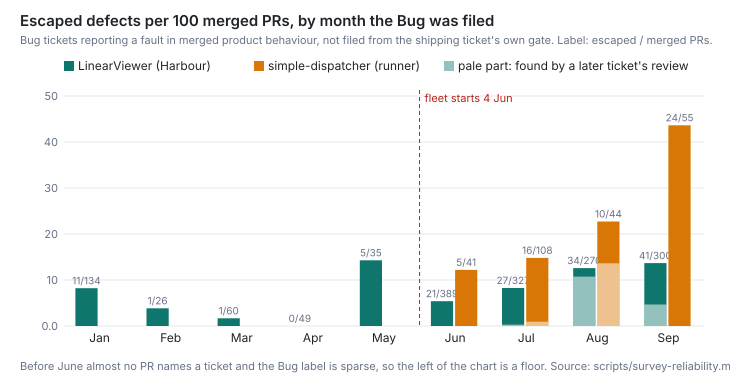
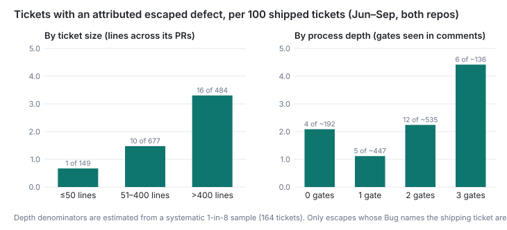
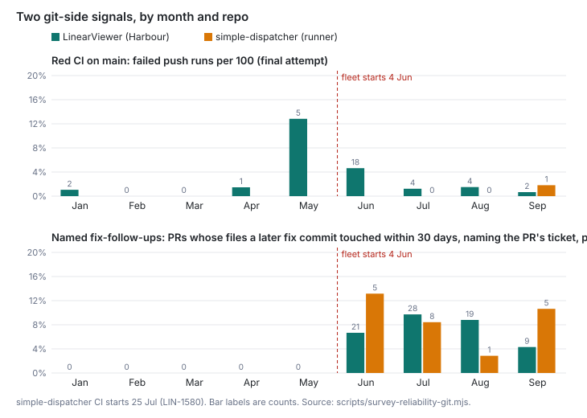

# How reliable is Harbour's output today, and has that changed as the process grew?

In September about one merged PR in six was followed by a Bug ticket reporting a fault in
shipped behaviour: 17.2 per 100 across both repos. That was 13.7 escaped defects per 100
merged PRs in LinearViewer (Harbour) and 43.6 in simple-dispatcher, against 5.4 and 12.2 in
June when the fleet started. So the count has risen with the process. In LinearViewer most of
that rise is a change in who finds faults and files them, not clearly a change in how many
are made; simple-dispatcher's September rise is not explained that way. Since August the
fleet's own reviews find faults in older code and file them as residue: 47 of the 103
August–September escapes. Before July the operator found most escapes. By August agents
found nearly all of them. Where a Bug names the ticket that shipped the fault, the fault
surfaces within days (median 1.4). The rate climbs with change size, and more gates do not
come with fewer escapes. Code review stops a comparable number of bugs before merge: an
estimated 38–48% of the bugs visible from June to September never reached main. Everything
git sees is quiet: red CI on main at 1–5% of runs after June, three reverts all year (none of
them for a defect) and no hotfix PRs.

## Findings

**Escaped defects per 100 merged PRs rose after the fleet started, in both repos.** A Bug
counts as *escaped* when it reports a fault in behaviour already on main (code, prompt text,
config or UI) and was not filed from the review or close-out of the ticket that shipped it.
265 Bug tickets were read, of which 190 are escaped, 39 routed, 11 test-only, 23 not a
defect and 2 unclear. Counted in the month the Bug was filed:

| Month | LinearViewer (Harbour) | per 100 PRs | simple-dispatcher | per 100 PRs |
|---|---|---|---|---|
| Jan | 11 / 134 | 8.2 | — | — |
| Feb–Apr | 2 / 135 | 1.5 | — | — |
| May | 5 / 35 | 14.3 | — | — |
| Jun | 21 / 389 | 5.4 | 5 / 41 | 12.2 |
| Jul | 27 / 327 | 8.3 | 16 / 108 | 14.8 |
| Aug | 34 / 270 | 12.6 | 10 / 44 | 22.7 |
| Sep | 41 / 300 | 13.7 | 24 / 55 | 43.6 |

Eight Bugs report faults spanning both repos and count in each. simple-dispatcher's rate is
the higher one because it merges a fifth as many PRs while carrying the substrate that most
Bugs are about (hook, launch, reaper, resume).

**Most of the August–September rise is later reviews finding older faults.** 33 of August's
42 escapes carry `kind:review-residue`: a review on another ticket noticed a fault in older
code, left it out of scope and filed it. Without those, LinearViewer's August is 1.9 per 100
and September 9.0. simple-dispatcher's September has no residue in it, and 24 of 55 stands.
Who finds escapes moved the same way. The operator found 10 of January's 11, 18 of June's 26
and 18 of July's 43, but only 2 of August's 42 and 7 of September's 61; agents found the
rest. The labelling moved as well: Bug is 1% of tickets numbered LIN-2000 to LIN-2249 and
15–22% of those from LIN-2250 to LIN-2999. Together these mean the rate measures the
fleet's finding and filing at least as much as the fault rate. A reader cannot separate the
two from this data.

**Where the shipping ticket is named, escapes surface fast, and more in bigger changes.** 30
of the 190 Bugs name a shipped ticket as the source of the fault and were not filed as
residue. They were filed a median 1.4 days after that ticket's first merge (interquartile
range 0.1–6.4), and all within 30 days. Across the 1,310 tickets shipped from June to
September, the rate of these attributed escapes climbs with the lines changed across a
ticket's PRs. This is the same order as `ticket-record-and-quality.md`'s 7 genuine misses in
184 Done tickets (`:106-107`).

| Ticket size, lines across its PRs | Tickets | With an attributed escape | per 100 |
|---|---|---|---|
| ≤50 | 149 | 1 | 0.7 |
| 51–400 | 677 | 10 | 1.5 |
| >400 | 484 | 16 | 3.3 |

**More gates do not come with fewer escapes.** Process depth counts the gates a ticket's
comments show (plan-review, code review, close-out), in a 1-in-8 systematic sample of
shipped tickets (164 from June to September). Tickets with three gates have the highest rate:
4.4 per 100 against 2.1 with none. This is observational. Gates are given to larger and
riskier work, as `ticket-record-and-quality.md` found (`:169-171`), and each depth bucket
holds only 4 to 12 escapes.

| Gates | Sample | Est. tickets | With an attributed escape | per 100 |
|---|---|---|---|---|
| 0 | 24 | ~192 | 4 | 2.1 |
| 1 | 56 | ~447 | 5 | 1.1 |
| 2 | 67 | ~535 | 12 | 2.2 |
| 3 | 17 | ~136 | 6 | 4.4 |

**Code review stops roughly as many bugs as escape, but the catches cluster.** Of the 164
sampled tickets, 104 went through code review, and 18 of those were sent back with blockers.
The blockers were 24 real bugs, 11 coverage gaps, 11 record corrections, 3 scope and 1
process. The 24 bugs sit in 10 tickets, and one credential ticket, LIN-2081, holds 8: PEM
handling that rejected working keys and leaked key material into error messages. That is
23.1 bugs stopped per 100 reviewed tickets, or 15.5 without LIN-2081, which scales to about
129–192 across the roughly 831 reviewed tickets of June to September. The same months
produced 172 escaped Bugs and 39 routed ones. Review therefore stopped an estimated 38–48%
of the bugs that are visible at all. The rest reached main, either unseen (escaped) or seen
and filed (routed). `fleet-complexity-read.md` (`:217-228`) shows the same clustering on
LIN-3124: one PR, eight blockers, seven of them bugs.

**Everything git and CI can see is quiet, and quieter since June.** The table below is from
`scripts/survey-reliability-git.mjs`.

| | LinearViewer (Harbour) | simple-dispatcher |
|---|---|---|
| Red CI on main, final attempt of push runs | Jan–May 8 / 394; Jun 18 / 388; Jul–Sep 10 / 890 | 1 / 107 since CI began on 25 Jul |
| Reverts on main | 3, none for a defect: 20 Jan (a process change), 28 Jun (PR #670, built without its spec), 12 Jul (PR #903, an inert layer) | 0 |
| Hotfix PRs | 0 | 0 |
| Named fix-follow-ups, 30 days, per 100 PRs touching production code | 0 before June; 7, 10, 9, 4 from June to September | 13, 8, 3, 11 from June to September |

June's 18 red runs are the fleet's first month. After it, main is red on about 1% of pushes.
`cheap-implementer.md` (`:103`) saw the same on its thirteen merges. A *named fix-follow-up*
is a later commit on main, within 30 days, that touches one of the PR's production files,
says fix or regression, and whose subject or ticket names the PR's ticket or number. Before
June it is zero because PRs did not name tickets, not because nothing was fixed.

**Incidents are recorded unevenly, too unevenly for a rate.** Two written records exist,
both LinearViewer and both since the fleet started:
- The proxy's 401 flood on 8–9 August: about 12 hours degraded, root cause not found.
- The database-backed reads that hung on 22 September (LIN-2993).

Tickets name four more, with no written record:
- LIN-430 (12 June): a merge on red CI.
- LIN-1345: uncapped spend on a shared key.
- LIN-2077 (August): simple-dispatcher sessions left idle.
- LIN-2446 (2 September): simple-dispatcher launches wedged overnight, with fixes merged by
  the operator under incident.

None of the six predates June.

**Two candidate measures are not supportable.** *Reopened tickets*: the proxy exposes no
state history, and where fetched comments mention reopening it is prose, not a state
change. The house habit is to file a new ticket instead ("Follow-up filed (separate,
not reopened work)", LIN-493). The *broad fix-follow-up*, as the ticket words it, is any fix
commit to the same files within 30 days. It ranges from 2% to 85% of PRs by month in
LinearViewer and moves with how often the hottest files change. It measures churn, not
defects.

## Method

**Populations.**
- Every LinearViewer-team ticket (3,092, which tracks both repos) was paged over the local
  proxy on 30 September by `scripts/survey-reliability-tracker.mjs`. Full detail (dates,
  comments) was fetched for all 265 Bug-labelled tickets, for incident-titled tickets, for a
  systematic sample of every 8th shipped ticket by number (169, of which 164 first merged
  from June to September) and for the 22 tickets that Bugs name as introducers.
- Merged PRs (1,590 LinearViewer, 248 simple-dispatcher) and every push-to-main CI run of the
  `Tests` and `CI` workflows (1,672 and 107, paged one month at a time because the API caps a
  filtered query at 1,000) come from GitHub through `gh`, in
  `scripts/survey-reliability-github.mjs`.
- Commits come from `origin/main` first-parent history in both clones.
- All snapshots are written under the git-ignored `data/survey/`.

**Classes.** Each Bug was read once against the rubric recorded in
`reliability-baseline-defects.json`. The rubric was fixed before reading and is built on
`ticket-record-and-quality.md`'s defect, inert, record, context and routed classes. Each
verdict names the repo, whether a human or an agent found the fault, and the introducing
ticket if the text names one. The author re-read a 1-in-13 systematic sample of 20 verdicts
and agreed with 19. Review send-backs in the sample were read against the rubric in
`reliability-baseline-review-blockers.json`. Ticket size is the added plus deleted lines
across a ticket's PRs. Process depth is the number of distinct gates whose heading appears in
the first three lines of a comment: plan-review, review or verdict, close-out.

**Re-running.**
- `node scripts/survey-reliability-github.mjs`
- `node scripts/survey-reliability-tracker.mjs`
- `node scripts/survey-reliability-tracker.mjs data/survey/reliability-depth.json --list-from data/survey/reliability-tracker.json --only-extra --sample data/survey/reliability-github.json`
- The same command with `--also` and the introducer list.
- `node scripts/survey-reliability.mjs` for every number here.
- `node scripts/survey-reliability-figures.mjs` for the three figures.

The proxy calls ran at about 6 a minute, under the survey's 15/min share. **Fleet start** is
4 June 2026, when simple-dispatcher's Stop-hook substrate began (its February commits were a
four-commit stub). The Autopilot design followed on 5 June and its kickoff on 14 June (PR
#462). `steady-base.md` dates the fleet to June (`:95`).

## Limits

- **Unfound and unfiled defects are invisible.** Every defect number here is a Bug someone
  filed. A fault in a path nobody runs, a fault fixed quietly, or one filed without the Bug
  label is missing. All the rates are floors, and the gap is widest wherever finding was
  weakest.
- **The instrument changed with the process.** Before June, PRs rarely named tickets, the
  operator was the only finder, and Bug labelling was steadier but sparser. From August, the
  fleet's reviews file residue and label it Bug. The rise in the headline therefore
  overstates any rise in faults made. How much it overstates cannot be told apart from a
  real rise.
- **Filing month is not the month the fault was made.** A Bug filed in September can report
  a fault from January. Only the 30 attributed escapes carry the merge month, and those are
  too few to stand as their own series.
- **The verdicts are one reading each.** Five subagents read one batch each, and nobody else
  read them. Residue tickets sit on the escaped/routed line. The rubric counts a fault found
  in older code by another ticket's review as escaped, following `what-the-reviews-checked.md`.
  Reading those as routed would move up to 49 Bugs from escaped to routed and cut
  August–September sharply.
- **Depth and size are observational and small.** The depth denominators come from a
  164-ticket sample, and each bucket holds 4 to 12 escapes. Bigger and riskier work gets
  more gates, so this data cannot show whether a gate prevents escapes.
- **The review-catch share rests on 10 tickets.** It uses one reading of truncated review
  comments (6,000 characters), and the send-back detector over-selects. An estimate of
  38–48% could plausibly be ±15 points.
- **CI and PR data are GitHub's.** They are not one of the ticket's four named sources, and
  are used only for merged PRs and runs on main. simple-dispatcher had no CI before 25 July.

## Next

- Do escapes that later reviews find in older code (49 so far) come mostly from before the
  fleet started, or from the fleet's own first months? The introducing commit for each can be
  found with `git blame` on the fix. This question goes into `proposals.md`.
- Is simple-dispatcher's September (24 escapes on 55 PRs) a real change in fault rate, or one
  cluster found by one campaign? That needs the Bugs grouped by the file each fix touched.
- Would a second, independent reading of the 265 verdicts, especially the residue ones,
  change the headline? The paper is owed a check (`standard.md`, rule 2).
