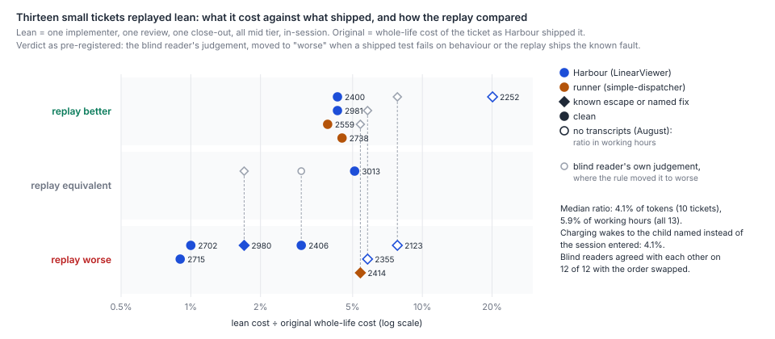
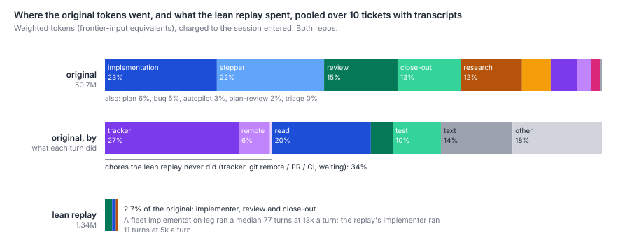

# For small changes, how does a lean pipeline compare with what Harbour's full process shipped, in correctness and in cost?

The lean pipeline cost about a twenty-fifth as much. It shipped work no worse, except that it missed
the same faults the full process missed. Thirteen Done tickets were replayed, ten from Harbour
and three from the runner. Each was small and low-risk, merged between August and late September,
and five had a known escape or a named fix. Each replay was one implementer, one review and one
close-out, all mid tier, in a local worktree at the original merge's parent.

- **Cost.** The replay cost a median 4.1% of the original's whole-life weighted tokens (0.9–5.4%,
  ten tickets with transcripts). That figure is the same whether wakes are charged to the session
  entered or to the child named. In working hours the replay cost 5.9% (all thirteen).
- **Blind comparison.** A blind frontier-tier reader judged the replay better than what shipped on
  8, equivalent on 3 and worse on 2. A second read with the diffs swapped agreed on every one of
  the 12 it completed.
- **Known faults.** These are where the lean pipeline did no better. On three of the five known
  faults the replay shipped the same fault as the original. On one, its own review caught the
  fault that the full process had shipped: the inert CSS fix on LIN-2252. On the fifth, it avoided
  the fault by declining to attempt the fix, which the ticket's constraint allowed.
- **The pre-registered verdict.** This moves a replay to "worse" whenever it shares a known fault,
  even one the original also shipped. On that rule the count is 5 better, 2 equivalent and 6 worse.

The sample is small and the replay had hindsight. Seven of the thirteen descriptions carry a
post-merge "Shipped" section, and the replay skipped the PR, CI and tracker chores that take a
third of the original's tokens. Even so, on these tickets the full process's extra legs bought no
correctness that this experiment could detect. Its cost is mostly heavier legs, not more of them.



## Findings

**Per ticket.** Columns:
- **Hindsight**: what the final description carries beyond the pre-implementation spec. *shipped*
  means a post-merge section; *plan* means an approved plan or research recommendation.
- **Same**: the author's coding of whether the replay's production change behaves like the
  original's.
- **Review**: the replay's own reviewer.
- **Blind / swapped**: the replay judged against the original, by the first blind read and by the
  read with A and B swapped.
- **Shipped tests**: the original change's unit tests, run on the replay.
- **Fix tests fail**: the named fix's tests, run on the replay against the original (failures).
- **Tokens and Hours**: lean ÷ original. Tokens are charged by session entered; hours are the
  replay's wall-clock ÷ the original's working hours.

| Ticket | Repo | Stratum | Hindsight | Same | Review | Blind / swapped | Verdict | Shipped tests | Fix tests fail | Tokens | Hours |
|---|---|---|---|---|---|---|---|---|---|--:|--:|
| LIN-2123 | Harbour | escape | none | different | approve | better / better | worse (test) | 40/42 | 4 vs 4 | – | 7.8% |
| LIN-2252 | Harbour | escape | none | different | **changes** | better / better | better | none | (e2e) | – | 20.1% |
| LIN-2355 | Harbour | escape | shipped | same | approve | better / better | worse (fault) | 25/25 | 35 vs 35 | – | 5.8% |
| LIN-2414 | runner | escape | plan | same | approve | better / better | worse (fault) | 40/40 | 7 vs 7 | 5.4% | 9.8% |
| LIN-2980 | Harbour | escape | shipped | same | approve | equivalent / equivalent | worse (fault) | 4/4 | (read) | 1.7% | 2.1% |
| LIN-2406 | Harbour | clean | plan | same | approve | equivalent / equivalent | equivalent | 13/14 | | 3.0% | 3.7% |
| LIN-2400 | Harbour | clean | none | partial | approve | better / better | better | 15/15 | | 4.3% | 5.9% |
| LIN-2702 | Harbour | clean | shipped | partial | approve | worse / worse | worse | 30/34 | | 1.0% | 1.6% |
| LIN-2715 | Harbour | clean | shipped | same | approve | worse / worse | worse | none | | 0.9% | 1.2% |
| LIN-2981 | Harbour | clean | shipped | same | approve | better / better | better | 5/5 | | 4.3% | 8.7% |
| LIN-3013 | Harbour | clean | shipped | same | approve | equivalent / equivalent | equivalent | 170/170 | | 5.1% | 5.4% |
| LIN-2559 | runner | clean | shipped | partial | **changes** | better / – | better | 86/86 | | 3.9% | 6.0% |
| LIN-2738 | runner | clean | none | same | approve | better / better | better | 87/87 | | 4.5% | 11.6% |

**What lean cost.**
- **Per ticket.** A replay took three legs, a median 24 turns, 103k weighted tokens and 1.9 minutes
  of wall-clock.
- **The originals.** The same tickets took a median 9 dispatches, 0.7 working hours and 3.6M
  weighted tokens.
- **Across the sample.** The replays used 1.67M weighted tokens for all thirteen tickets. The ten
  originals with transcripts used 50.7M.
- **By repo.** Harbour's seven costed tickets range from 0.9% to 5.1% of their originals. The
  runner's three range from 3.9% to 5.4%.
- **By stratum.** The escape stratum's median is 3.6% in tokens (two tickets) and 7.8% in hours.
  The clean stratum's is 4.1% and 5.7%.
- **Charging rule.** The two rules (child named, session entered) differ by at most 13% on any one
  ticket: LIN-2414 is 6.1% against 5.4%, and LIN-2715 is 0.8% against 0.9%. The median is 4.1%
  under both.
- **Not counted.** The blind reads are measurement, not lean cost. They cost 2.36M, more than all
  thirteen replays together.

**Most of the gap is lighter legs, not fewer legs.**
- **Like for like.** The replay's implementer cost a median 6.3% of the original's implementation
  sessions. Its reviewer and close-out together cost 5.2% of the original's review and close-out
  sessions.
- **Fewer legs alone would save far less.** Taking away every leg that is not implementation,
  review or close-out removes about half the original's tokens. Those legs are the stepper beats
  inside sessions (22%), research (12%), plan, bug, autopilot, plan-review and triage.
- **What the original's turns did.** We charged each turn's tokens to the action it took. 27% went
  on tracker calls to the proxy, 6% on git remote, PR and CI work, 20% on reading files, 10% on
  tests and 4% on edits. The rest was reasoning text and other tools (`where-the-gap-is.svg`).
  - So the chores the replay never did come to 34% of the original's tokens.
  - In close-out alone, tracker calls are 41% and remote work 12%.
- **Leg shape.** A fleet implementation leg ran a median 77 turns at about 13k weighted tokens a
  turn. The replay's implementer ran 11 turns at about 5k. Review and close-out legs ran 38 turns
  at about 15k a turn, against the replay's 7 and 4 turns at about 5k.
  - Removing every chore would still leave the original about 25 times the replay.
  - `steady-base.md` puts the dispatched prompt at about 2% of a leg's context, so the weight is
    in what the legs do: more turns, each carrying more.



**On ordinary small work the replay was as good or better about as often as it was worse.** In the
clean stratum the blind reader judged it better on 4, equivalent on 2 and worse on 2.
- **The two worse.** Both are partial deliveries, not defects:
  - LIN-2702 kept a function private that the next phase needed exported.
  - LIN-2715 shipped the identical one-line fix, but with an end-to-end test whose overlap
    measurement cannot see the bug.
- **The better ones.** These were better on substance, mostly in tests:
  - LIN-2400 used `font-size: inherit` where the original's `1rem` enlarged every login button on
    phones, and added the exit link the ticket asked for.
  - LIN-2559's review caught a regex that would have counted a finished foreground sub-agent as
    still running. That would have deferred a real DONE for thirty minutes, and the close-out
    fixed it.
- **Shipped tests.** Eight of the eleven tickets with unit tests pass all of the original's own
  tests. LIN-2406 and LIN-2702 fail on interface only: a warning's wording, and the missing
  export. LIN-2123 fails on behaviour, by design (below).

**On known faults the lean pipeline matched the full process, mostly by missing the same thing.**
- **Same fault.** Three replays ship the original's fault:
  - LIN-2355 left the proxy preamble pointing at reads that 422. LIN-2804's tests fail 35 of 475
    on the replay, exactly as on the original.
  - LIN-2414's re-park drops an undelivered follow-up. LIN-2468's tests fail 7 of 53 on both.
  - LIN-2980 makes an unguarded dereference stream-aborting. The production change is identical
    to the original's.

  Their reviews approved all three. LIN-2980's reviewer named the dereference as a nit and
  deferred it to LIN-2983, a ticket the final description names.
- **Caught.** On LIN-2252 the replay's implementer wrote the same inert bottom padding as the
  original. Its reviewer rejected it, and the close-out applied the horizontal reservation that
  LIN-2272 later shipped as the fix.
- **Avoided.** On LIN-2123 the replay obeyed the description's constraint ("do not widen the
  derivation … it lands in simple-dispatcher, not here"). It documented and pinned the residual
  instead of attempting a fix. So it ships no production no-op, but the residual stays live, and
  LIN-2268's tests fail 4 of 45 on it, as on the original. Both blind reads preferred the replay.
  The pre-registered rule makes it "worse" because a shipped test fails on behaviour.

The pre-registration predicted the replay would reproduce at most two of the four code faults. It
reproduced three. A cheaper review is not catching what the full one missed. It is missing the
same faults, at a twenty-fifth of the cost, and once catching one the full process did not.

**Hindsight does not explain the favourable judgements.** The replay read each description as
finally written:
- Seven of the thirteen carry a post-merge section ("Shipped", "Outcome", "Landed").
- Three more carry an approved plan or research recommendation.
- LIN-2980's names the very bug that later escaped.

If hindsight drove the result, the shipped group should score best. It scores worst. The four
tickets with no hindsight were judged better on all four, and the seven with a shipped section
better on 3, equivalent on 2 and worse on 2. Hindsight may still have helped the replay match
what shipped: eight of thirteen production changes are the same as the original's. Matching is
not the same as finding faults, though, and on the known faults it found one in five.

**The predictions, scored.**

| Pre-registered prediction | Result |
|---|---|
| Lean costs a tenth to a half of the original, median | **Wrong, low:** 4.1% (tokens), 5.9% (hours) |
| At least 9 of 13 equivalent or better | **Met** by the blind reads (11 of 13); **not met** by the verdict rule (7 of 13), which charges the replay for faults the original shared |
| The replay reproduces at most 2 of the 4 code faults | **Wrong:** 3 |

## Options

Each option is a choice for John, not a change made here.

| Option | Estimated effect | Evidence | Risk to correctness | How the scorecard would measure it |
|---|---|---|---|---|
| **1. A lean lane for M3-light tickets.** One implementer, one review and one close-out, chosen by a path check in code (the backtest's M3), and no research, plan, stepper or supervision legs. | M3's light group is 12.9% of tokens and 13% of hours (backtest). Lean in production must add PR, CI, merge and a closing comment, so allow 5–40% of today's cost there, against 4% measured here. That saves 8–12% of tokens: **1.08–1.14× correct work per budget**, close to `cost-mix.md`'s 1.1× for its light-lane option | The 13 replays here: equivalent or better on 11 by blind reading; the same known faults as the full process, and one fault the full process missed | Review caught real faults on 8 of the backtest's 328 M3-light changes, 11 of its 15 findings at plan review. This replay cannot see those catches, because the descriptions already carried the plans. Escapes in the M3 light group run 2.0 in 100 (0.9–4.6) under the full process | Escapes and named fixes per 100 lane changes, against the M3 light group's 2.0 in 100; weighted tokens per correct change in the lane. At 2 in 100, about 400 lane changes are needed to see a doubling |
| **2. Lighter legs, everywhere.** Fewer tracker reads and writes per leg, and a turn budget per leg kind. | Tracker calls are 27% of the original's tokens and remote work 6%. Halving them saves about 16%, **1.1–1.2×** on all work, not just small work | `survey-replay-chores.mjs` over 50 sessions of these tickets. Fleet legs run 5–10 times the replay's turns, at 2.4–3.4 times the tokens per turn | Low for reads. Moderate for writes, because later legs read what earlier ones wrote (see `step-overlap.md`, `what-hides-between-sessions.md`) | Per-leg turns and tokens from transcripts, by kind (`survey-replay-chores.mjs` run monthly); correct changes per week unchanged |

The two options overlap: the lean lane is option 2 taken to its limit on a fifth of the work. Neither
removes the risk the known faults show. The full process missed them too, so they argue that the
current legs are not what stands between Harbour and those faults.

## Method

**Before anything ran.**
- **Pre-registration.** `replay-small-work-preregistration.md` fixed the selection, protocol,
  metrics and predictions. It was committed alone as d2fa2773 and pushed before the first replay.
- **Selection.** `scripts/survey-replay-select.mjs` reads the scorecard's snapshot and applies
  `survey-proportional-classifiers.mjs`'s rule M3, unchanged.
  - 75 Done changes were eligible, 74 of them with exactly one merge to replay from.
  - The escape stratum is all five that survive the backtest's readings.
  - The clean stratum is a systematic sample by last-merge date: six of the eleven Harbour
    changes with full transcripts, and both of the runner's two.

**The replay.**
- `scripts/survey-replay-prepare.mjs` built 13 detached worktrees at each original's parent and
  holds the fixed prompts. `scripts/survey-replay-emit.mjs` renders the reviewer, close-out and
  blind prompts from those templates.
- Each role was a fresh in-session subagent at the mid tier. Every original implementer whose
  transcript survives was also mid tier, so no tier was changed.
- **Fences.** `scripts/survey-replay-fences.mjs` checked all 327 tool calls the roles made: no
  git history past HEAD, no remote, no proxy or HTTP call, no read of the live clones, and no
  subagents. It found no breach. Its four pattern hits are route strings inside code the agents
  wrote.
- Nothing was pushed. No comment touched a source ticket, nothing was dispatched, and the
  worktrees were removed afterwards.

**Measurement.**

```
node scripts/survey-proportional-classifiers.mjs --out data/survey-replay/features.json   # rule M3, unchanged
node scripts/survey-replay-select.mjs                       # the pre-registered selection
node scripts/survey-replay-prepare.mjs --root <dir>         # worktrees and implementer prompts
node scripts/survey-replay-emit.mjs <role> LIN-n --root <dir> --subagents <dir>   # later prompts
node scripts/survey-costmix-tokens.mjs --since 2026-08-01 --until 2026-10-01 --out data/survey-replay/costmix-tokens.json
node scripts/survey-replay-cost.mjs --subagents <dir>       # lean per role; original whole-life, both charging rules
node scripts/survey-replay-tests.mjs --root <dir>           # shipped and fix tests on replay, original and fix trees
node scripts/survey-replay-chores.mjs                       # what the originals' turns did
node scripts/survey-replay-fences.mjs --subagents <dir>     # fence check
node scripts/survey-replay-analyse.mjs --subagents <dir>    # verdicts and every table above
node scripts/survey-replay-figures.mjs                      # the two SVGs
```

- **Inputs.** The scorecard snapshot (`data/survey/`, cut 30 September) is the one the wave's
  other papers used. It was taken that morning by `measuring-throughput.md`'s scripts and copied
  into this branch's git-ignored `data/`.
- **Tokens.** Weighted as `survey-costmix-tokens.mjs` weights them: frontier-input equivalents,
  with mid ×0.6. Each message id counts once.
- **Tests.** Every test run happened in a throwaway worktree, never the replay's own.
- **Hand codes** are in `replay-small-work-codes.json`, with their rubric.
- **Proxy.** The only proxy calls were the dispatch item, the brief, the ticket, and at the end one
  comment and one status change on LIN-3189.

**Deviations from the pre-registration.**
- The first blind reader for LIN-2702 hung on an interactive `patch` prompt for ten minutes. It
  was stopped and re-run with the same prompt, plus one sentence forbidding interactive commands.
- The swapped-order second read, the chore split and the fence check were added after the
  pre-registration. None of them feeds the verdict.
- The swapped read for LIN-2559 hung in a test run that never returned. It was stopped after ten
  minutes without a judgement and was not re-run, so the swapped read covers 12 tickets.
- The test script's first run read no counts until it was switched to the TAP reporter. That
  changed no outcome.
- The runner's `test/isolate-local-halt.js` does not exist at these parents, so the runner's tests
  ran under plain `node --test`.
- Some implementers committed the worktree's `node_modules` symlink. Every diff and judgement here
  excludes it.

## Limits

- **Hindsight favours the replay.** The descriptions are final. Seven carry what shipped, three
  carry the plan, and LIN-2980's names its own later escape. That is why the replay matched what
  shipped on eight of thirteen, and it makes the replay look closer to "same" than a cold start
  would be. It does not explain the blind preferences (above). Only a forward trial removes it.
- **The plan legs' output came free, which favours lean.** Where a description carries an approved
  plan or research recommendation, the replay got the product of legs whose cost sits in the
  original's total. The cost ratio counts those legs against the original. The correctness
  comparison quietly assumes them.
- **The chores were skipped, which favours lean on cost.** The replay never opened a PR, waited on
  CI, merged, or wrote to the tracker. Those chores are 34% of the original's tokens. Option 1
  allows for them. The 4.1% headline does not.
- **Not the fleet's harness; direction unknown.** In-session subagents have their own smaller
  system prompt, no Stop hook, no meta-prompt-written worker prompt and no proxy. Each role was
  one turn of delegation inside a frontier-tier session, and was free to run tests but not
  browsers. A fleet leg might do better (more context) or worse (more to do).
- **No browser checks, which biases UI verdicts either way.** Playwright and visual specs were not
  run. LIN-2252, LIN-2400 and LIN-2715 were judged by reading CSS and tests.
- **The blind readers were not blind to style, which probably favours the replay a little.** They
  saw diffs without commit messages, but the originals' comments cite tickets and plan labels more
  heavily, and a reader could guess. The swapped read rules out position bias: the first position
  was preferred 9 times and the second 10. It does not rule out a shared reader taste, since both
  reads used the same tier and prompt.
- **The verdict rule is harsh on shared faults, which biases against the replay.** It counts a
  fault against the replay even when the original shipped the same one. On the blind reads alone
  the replay is worse on only 2 of 13.
- **The sample is small.** 13 tickets: 10 from Harbour and 3 from the runner, 5 with known faults.
  One caught fault in five has a 95% interval of about 4 to 62 in 100. The clean stratum is the
  September changes with full transcripts. August's escape tickets have only hours, and their
  scorecard dispatch counts (1 each) look incomplete.
- **Only M3-light.** Every ticket is under 50 production lines on low-risk paths. Nothing here
  says anything about credential, data or prompt work, or about anything larger.

## Next

What John would need to decide, or have measured, next:

- **Whether to try the lean lane forward.** That means in the fleet's own harness, on new M3-light
  tickets, with the plan not written first. That trial is the only way to remove the hindsight and
  free-plan biases above. Its escape rate needs about 400 changes to show a doubling of the full
  process's 2 in 100.
- **What a leg should cost.** The fleet's legs take five to ten times the replay's turns, at two
  and a half to three and a half times the tokens a turn. This paper did not measure which of those turns change the outcome.
  `what-hides-between-sessions.md` and `prototype-concepts.md`, running alongside, look at the
  sessions from other sides.
- **What catches the faults both pipelines miss.** Three of the four code faults here passed every
  review, full or lean. Each was found by a later sweep or by use.

Proposal line added to `proposals.md`: *on the three faults both the full process and the lean
replay shipped (LIN-2355, LIN-2414, LIN-2980), what kind of check (test, sweep, reviewer prompt or
use) found each one, and would any check that runs before merge have found it?*
