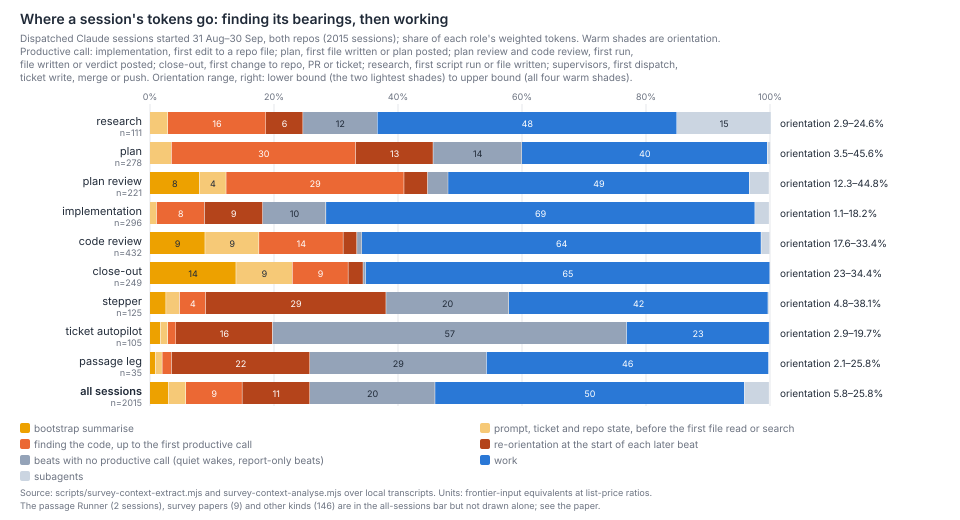
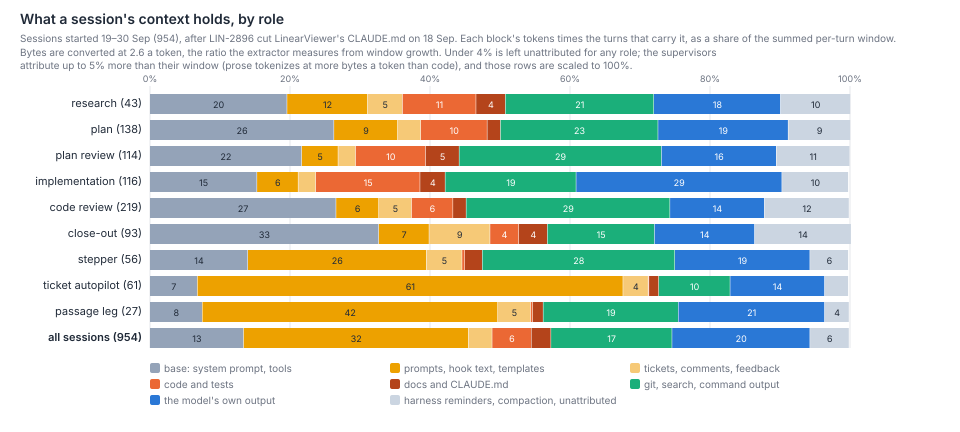
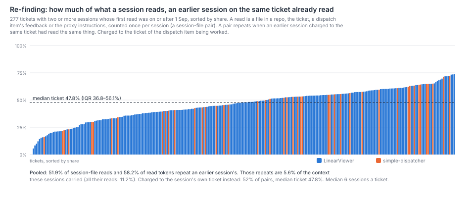
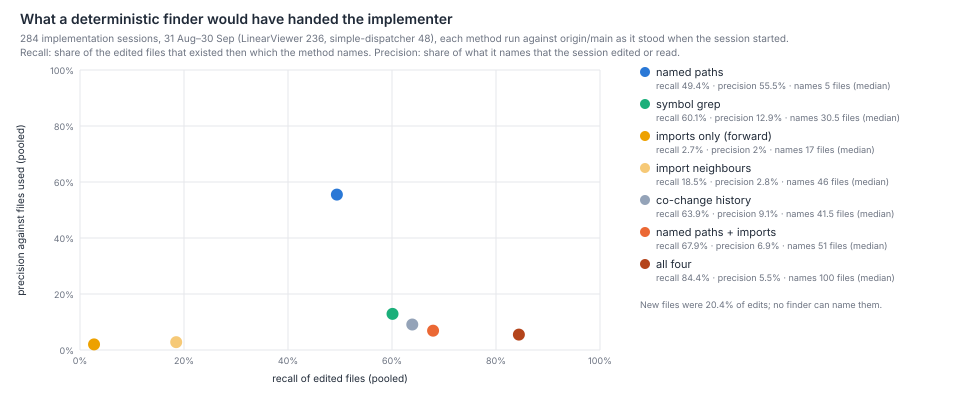

# How much of a Harbour session goes on finding its starting context, and how much of that is re-finding?

Between a twentieth and a quarter of the fleet's tokens. Over the 2,015 dispatched Claude
sessions that started between 31 August and 30 September, in both repos, a session spent
**5.8% of the fleet's weighted tokens** on the bootstrap summarise and on reading its prompt,
ticket and repo state before it opened its first file, and **25.8%** on everything up to its
first productive call, counting the start of every later beat. The range is a matter of
definition, and both ends are given throughout. **Up to half of that orientation is
re-finding:** 53% of what sessions read while orienting, an earlier session on the same ticket
had already read. Re-finding comes to **4.9–12.1% of all weighted tokens**, a fifth to a half
of orientation. The low figure
counts only repo files that nobody had changed in between; the high one counts every repeated
file, ticket and feedback read. It sits where the ticket's later sessions start: 82–85% of what
plan-review, code review and close-out sessions read while orienting was already read,
62% for implementation, and 18% for research legs, which come first. Implementation spends
the least on orientation (1–18% of its tokens), and plans and plan-reviews the most (up to 45%).
A simple deterministic finder, the file paths the plan names, would have handed the implementer
about half the existing files it went on to edit, and 55% of what it named was used. Adding
symbol grep and import neighbours finds more, but most of what they add is never used. So the
opportunity John named is real and bounded. Removing the re-found half would save about 5–12%
of tokens directly. LIN-2115's pointer experiment shows the larger prize lies in the turns a
missing pointer causes, not in the reads themselves, and this census cannot price that.



## Findings

**Orientation is 6–26% of the fleet's weighted tokens, and its size depends on the role.** The
productive call is defined per role (Method). The lower bound counts the bootstrap summarise and
the turns spent on the prompt, the ticket and repo state before the first file read or search.
The upper bound adds the turns spent finding the code up to the first productive call, and the
same at the start of every later beat. All sessions, 31 Aug–30 Sep:

| Role | Sessions | Share of fleet tokens | Orientation (lower–upper) | Of which re-finding (strict–broad) | Median to first productive call |
|---|--:|--:|--:|--:|--|
| research | 111 | 5.3% | 2.9–24.6% | 0.8–4.0% | 28 calls, 2.8 active min |
| plan | 278 | 6.2% | 3.5–45.6% | 15.7–31.5% | 30 calls, 4.5 min |
| plan-review | 221 | 6.1% | 12.3–44.8% | 26.2–36.4% | 29 calls, 4.0 min |
| implementation | 296 | 22.6% | 1.1–18.2% | 6.0–9.7% | 24 calls, 2.4 min |
| code review | 432 | 9.9% | 17.6–33.4% | 4.0–26.3% | 20 calls, 2.1 min |
| close-out | 249 | 5.2% | 23.0–34.4% | 6.0–27.7% | 23 calls, 2.4 min |
| stepper | 125 | 10.9% | 4.8–38.1% | 1.2–3.8% | 20 calls, 2.8 min |
| ticket autopilot | 105 | 13.4% | 2.9–19.7% | 0.2–3.5% | 14 calls, 1.3 min |
| passage leg | 35 | 6.6% | 2.1–25.8% | 0.6–4.4% | 15 calls, 2.0 min |
| **all sessions** | **2,015** | 100% | **5.8–25.8%** | **4.9–12.1%** | |

By repo, orientation is 5.3–25.0% of LinearViewer sessions' tokens and 8.5–30.9% of
simple-dispatcher's. In the weeks after LIN-2896 cut CLAUDE.md (19–30 Sep, 954 sessions) it is
4.9–22.7%, and re-finding 4.1–10.2%. A further 20% of tokens go to beats with no productive call
at all: quiet supervisor wakes (57% of a ticket autopilot's tokens) and plan or research beats
that end in a written report rather than a file or ticket write. The upper bound treats a plan's
reading as orientation and its report as the output, so it overstates orientation for the
reading roles. Implementation, where the first edit is an unambiguous line, is the clean case:
1–18% of its tokens, 24 calls and about 2½ active minutes to the first edit at the median.
`where-the-effort-goes.md`'s 3.5–5.6% re-orientation is this paper's lower bound: its
bootstrap plus cold-resume handshakes, against 5.8% here.

**The bootstrap summarise is 3.0% of all tokens, and it weighs most on the short sessions.**
Broker-armed research, plan and implementation launches already skip it (LIN-2116). Every other
role still runs it: 1,313 of 1,998 sessions with a task. A median bootstrap is 6 calls and about
77k weighted units. It reads the same four files nearly every time: LinearViewer's CLAUDE.md
(987 reads) and README (985), simple-dispatcher's README (967) and CLAUDE.md (695). That is 13.9%
of a close-out's tokens, 8.9% of a code review's and 8.0% of a plan-review's. These are the
short sessions, where a fixed cost weighs most.

**Later beats re-orient, and much of what they read the same session already had.** The turns at
the start of each later beat, before its first productive call, are 10.9% of all tokens: 29% of a
stepper's and 22% of a passage leg's. 42% of later-beat reads are files or tickets the same
session read in an earlier beat. Some of this is legitimate: the file changed, or the context
was compacted. `held-or-fresh.md`, which landed alongside this paper, measures the other side:
a fresh supervisor spends 116–238k tokens orienting to its first decision, plus a 60–80k
bootstrap, and orientation is 62% of a fresh step's price. That agrees in size with the medians
in the table above.

**What sessions read is a small part of what they carry.** Context shares are each block's tokens
times the turns that carry it, over the summed per-turn window (Method). Between 19 and 30 September,
over all sessions: code and tests are 5.6%, tickets, comments and dispatch feedback 3.4%, and docs
and CLAUDE.md 2.8%. Prompts, hook text and templates are 32%, mostly in the supervisors (the
passage Runner 85%, a ticket autopilot 61%). The system prompt, tools and resident CLAUDE.md are
13%, and the model's own output 20%. For an implementation session, code and tests are 15%, the base
15% and its own output 29%.



Until 18 September the biggest single block in an implementer's context was not one the agent chose. Working in
LinearViewer made the harness load its CLAUDE.md on demand, at about 53k tokens a load. That file
was 15.2% of an implementation session's context and 7.4% of a plan's over the month. LIN-2896 cut
it to about 9 KB on 18 September (3.7k tokens a load afterwards). LIN-2115 had already found that
dropping it changed no verifier result. That lever has been pulled. The proxy's
`/instructions` catalog is read in 87% of sessions (3,738 reads) and is 1.4% of the carried
context.

**About half of what a session reads on a ticket, an earlier session on that ticket already read.**
A read is counted once per session and thing read (a session-file pair). It repeats when an
earlier session charged to the same ticket read the same file, ticket, dispatch item or the
proxy instructions. Over the 277 tickets with two or more sessions that began after 1 September,
**52% of session-file pairs repeat an earlier session's**, and they carry 58% of the read tokens.
The median ticket repeats 48% (interquartile range 37–56%). Charging the reads to the session's own ticket instead
of the dispatch item's gives 52.0% against 51.9%: in this census the two rules agree, because
supervisors read little. By repo, 51.5% for LinearViewer (230 tickets) and 55.0% for
simple-dispatcher (45). Within a session, each pair is read 2.05 times, mostly by paging through
a file in pieces. Docs (41% of reads repeat across sessions) and the proxy instructions (37%) are
the most re-read; then come code (25%), tests (24%) and the ticket itself (16%), which changes as
comments land.



**Most repeated file reads are of files that had not changed.** Of repo-file pairs, 49.5% repeat
an earlier session's. 42% repeat one that no session on the ticket had edited and no commit to
main had touched since the earlier read: 85% of the repeats. Those unchanged repeats carry
3.5% of the sessions' context. That is 12.6% for plan-review, which re-reads the plan's ground,
5.6% for implementation and 5.7% for close-out.

**Re-finding is concentrated in the sessions that come after the first.** Of the reads a session
makes before its first productive call:

| Role | Orientation reads | Already read by an earlier session on the ticket |
|---|--:|--:|
| close-out | 1,406 | 85% |
| code review | 2,986 | 82% |
| plan-review | 3,940 | 82% |
| plan | 5,392 | 68% |
| implementation | 4,915 | 62% |
| research | 2,537 | 18% |
| supervisors (stepper, autopilot, leg) | 7,036 | 15–19% |

Supervisors read prompts and dispatch feedback, which are new each time. Research legs open a
ticket, so there is little before them to repeat. Every later role re-reads the ground the
research and plan already covered. Some of that is the point of the role: a code review that
took the implementer's word for which files matter would not be independent. The table cannot
separate re-reading for independence from re-reading for want of a pointer.

**A deterministic finder would hand the implementer about half its files, and the cheap methods add mostly noise.**
Each method was run on 284 implementation sessions (LinearViewer 236, simple-dispatcher 48).
Its input was what the session was handed: its dispatched prompt and its own ticket as the proxy
returned it. It ran against origin/main as it stood when the session started. A median session
edited 3 files that already existed and read 7. A fifth of edited files were new, which no
finder can name.

| Method | Files named (median) | Recall of edited files | Precision against files used |
|---|--:|--:|--:|
| named paths: the prompt's and ticket's paths, resolved to files | 5 | 49% | 55% |
| symbol grep: backticked identifiers, 20 hits at most | 31 | 60% | 13% |
| co-change history: three or more of a named path's last 20 commits | 42 | 64% | 9% |
| import neighbours, one hop both ways, beyond the named paths | 46 | 19% | 3% |
| named paths and import neighbours | 51 | 68% | 7% |
| all four | 100 | 84% | 5.5% |

Named paths alone found every edited file in 92 of 263 sessions; all four together found them in
202, at the price of naming a hundred files. By repo, named paths reach 50% recall at 54%
precision in LinearViewer and 45% at 64% in simple-dispatcher. The plan already names most of
what can usefully be named. The methods that find more do so in a pile twenty times larger, and
nothing here says a session handed a hundred paths would read fewer.



**Research legs spend their tools on finding things, and a few question kinds dominate.** The 111
research legs made a median 72 calls. By share of calls (and of result tokens):

| What the call does | Calls | Result tokens |
|---|--:|--:|
| read files | 24% | 38% |
| search | 24% | 16% |
| git and GitHub history | 17% | 16% |
| read tickets, comments and feedback | 10% | 13% |
| run scripts and tests | 6% | 5% |
| inline computation | 5% | 6% |
| write files, the tracker, dispatch | 9% | 2% |

Per research leg, the questions most asked are repo-wide searches for every caller, reader or
definition of a symbol (10.4 calls; 35 calls include a symbol search of some kind), diffs (9.7),
the history of a path (5.8), repo state (4.6) and the ticket with its relations and brief (4.8).
Inline computation that re-derives a number comes to 6.9. The survey papers, the nine custom
research sessions in the window, differ: they re-derive numbers (34 calls each), run code (30)
and analysis scripts (14), and search less. Three kinds of question have answers a tool could
give directly, with no judgement: every caller or reader of a symbol at a commit; the commits,
PRs and dispatches of a ticket or path; and, for the survey papers, counts over dispatches and
transcripts. Judging what the answer means is the research leg's own work.

## Options

Each option is sized from the findings above. The estimates overlap, so they do not add, and
none is a change: John decides. Effects are shares of the fleet's weighted tokens unless stated.

| # | Option | Estimated effect | Evidence | Risk to correctness | How the scorecard would measure it |
|---|---|---|---|---|---|
| A | **Stop the bootstrap summarise for the roles that still run it** (review, plan-review, close-out, supervisors, other), as LIN-2116 already does for research, plan and implementation | Up to 3.0% (2.3% in 19–30 Sep); 8–14% of a close-out's, review's or plan-review's tokens | Bootstrap finding; it reads the same four files; LIN-2115 found CLAUDE.md not load-bearing for a localized change | Low: the task prompt arrives either way. A session that needs the README can still read it | Tokens per correct change by role; the correct rate per role before and after |
| B | **Hand each later session the earlier sessions' file list for its ticket**: which files and tickets they read and edited, as pointers, not conclusions | Bounded by re-finding: 4.9–12.1% (strict–broad); most of it in plan-review, close-out, code review and implementation | Re-reads and re-finding findings; LIN-2115's 93-token pointer: 18 turns against 51, about half the cost, one task, same verifier | Medium for reviews: a reviewer steered to the implementer's files may not look elsewhere, and that independence is what catches faults (`which-rules-pay.md`). Low for implementation and close-out. 15% of repeats were of changed files, so a list must carry the commit it was read at | Tokens to first productive call and per correct change, by role; review findings per round and escaped defects, held to the baseline |
| C | **Put the plan's named paths, resolved to files that exist, at the top of the implementation prompt** | Implementation orients for 1–18% of its tokens, which is 0.2–4.1% of the fleet's. Named paths point at half its edited files, so the direct saving is perhaps a third to a half of that, about 1–2%. LIN-2115 suggests the saving in turns can be larger on a localized task | Finder finding; LIN-2115's pointer probe; implementation is 22.6% of fleet tokens and orients for 1–18% of them | Low if it is a pointer: 45% of named paths go unused, and a wrong pointer can anchor a session on the wrong file; paths must be resolved at the session's base commit, and stated as where to start, not as the scope | The implementer's tokens and calls to first edit, and per correct change |
| D | **Carry a beat's file list into the next beat's prompt** in stepped and held sessions | Up to 10.9% (later-beat re-orientation), of which the 42% re-read share is the reachable part, so about 4–5% | Later-beat finding; `held-or-fresh.md` on whether to hold at all | Low: stale only if the file changed, which the beat's own diff says | Re-orientation tokens per later beat |
| E | **Answer the deterministic research questions with a tool**: callers and readers of a symbol at a commit, a ticket's or path's commits, PRs and dispatches | Small fleet-wide: research legs are 5.3% of tokens and their searching and history calls about 40% of their calls; perhaps 1–2% | Research-session finding; John's research-tool projects (`what-should-an-agent-leave-behind.md`) show conditional gains and are not evaluated here | Low: the answers are facts at a commit; misuse is reading a stale index | Research legs' calls and tokens per leg; the plan-review send-back rate on research-fed plans |

LIN-2115 and LIN-2961 bear on option C more than on B. LIN-2115's probe gave a localized
implementation task a single hindsight pointer, and turns fell from 51 to 18 and cost by about
half. Its other tasks did not repeat the easy success, and the pointer came from hindsight, not
from a finder. `what-should-an-agent-leave-behind.md` reads the same result with those limits and
adds that, across John's projects, keeping more material did not reliably make agents more
dependable. So a short, correct pointer is the evidenced form; a large pack is not. This
paper's census adds the base rates the probes lacked: how often the later sessions re-read, and
how often a cheap method names the right files. It does not show that a session handed the files
would skip the reading. Only a trial on live tickets can show that.

## Method

**Population.** Every main transcript under `~/.claude/projects/-Users-work-development-simple-dispatcher-workspaces-*`
on the runner machine (2,047 transcripts; Claude Code keeps them for the project's life since
30 Sep), with their subagent transcripts. A session is in the window if its first entry falls
between 31 Aug and 30 Sep, giving 2,015 sessions. Its repo is the checkout most of its reads and
edits fall in: 1,573 LinearViewer, 368 simple-dispatcher, 74 neither. opencode sessions leave
no Claude transcript and are absent.

**Role.** The transcript's `# LIN-n · kind` header, or the fetched dispatch item's kind. An
autopilot is the passage Runner, a passage leg, a stepper or the ticket's own autopilot, by
`survey-effort-fleet.mjs`'s rules. A custom session whose prompt name says paper, survey, check or
research is a survey paper. Everything else is "other" (blocked, triage, breakdown, design …; 146 sessions, 135 of them with a task beat).

**Beats and the productive call.** A task beat starts where a task arrives: the fetched
`/dispatch/{id}/prompt` result, or the Stop hook's "is ready. Fetch it now". Turns before the first
beat are the bootstrap. Every tool call is classed from its command (a Read, a `cat`/`sed`/`head`
of a path, a grep or listing, a git or `gh` read or write, a proxy GET or write, a run of a script
or test, inline `node -e`/`python3 -c`, an edit or file write). The first productive call of a beat
is, by role:
- implementation: the first edit to a file in a repo checkout;
- plan: the first file written or a substantive write to the ticket (a body of 500 characters or
  a file);
- plan-review and code review: the first run, file written or verdict posted;
- close-out: the first change to the repo, the PR or the ticket, or a run;
- research and survey papers: the first script run or file written;
- supervisors: the first dispatch, ticket write, merge or push;
- other: any of these.

The uniform alternative, the first call that is not reading, searching or navigating, is printed
by the analysis script. It gives smaller orientation (a median of 7–14 calls) because a status
PATCH or an inline parse counts as productive.

**Units and context.** Weighted units are `survey-effort-fleet.mjs`'s: frontier-input
equivalents at list-price ratios (input 1, output 5, cache read 0.1, cache write 1.25 or 2), with
the mid tier at 0.6 and the small tier at 0.2. A beat's orientation is the units of the turns
before the turn that makes its productive call. The context shares are carried tokens: a block of
T tokens entering before turn i is carried by every turn to the end of its compaction segment,
over the summed per-turn window. Bytes are converted at 2.6 a token. The extractor measures that
ratio from the window's growth between turns (median 2.58, interquartile range 2.41–2.96, over 39,376 turns), and it
counts attachment lines (hook text, CLAUDE.md files loaded on demand, harness reminders). What is
left unattributed is under 4% for every role.

**Re-reads.** A read is a repo file (Read, or `cat`/`sed`/`head`/`tail`/`nl` of a path, or
`git show ref:path`), a ticket (`/issues/LIN-n`, `/brief/`, `/relations/`), a dispatch item's
feedback, or the proxy instructions. Harness-loaded CLAUDE.md files are excluded. Each read is
charged two ways: to the session's own ticket (the session entered) and to the ticket of the
dispatch item the session was working when it read (the child the log names). The tickets are
those with two or more sessions whose first read was on or after 1 Sep. A file is unchanged since
an earlier read if no session charged to the ticket edited it and no commit reached origin/main
touching it in between. Re-finding in units is each beat's orientation units times the share of
that span's read tokens that repeat. It is broad when every repeat counts, and strict when only
unchanged repo files count.

**The finder.** Every implementation session in the window that edited a repo file (284). Its repo
is the one most of its edits fall in. Its base is origin/main at the session's first entry
(`git rev-list -1 --before`). Its input is its first dispatched prompt and its first read of its
own ticket, as the transcript holds them. The four methods:
- named paths: path-like tokens resolved to a file at the base, exactly, by suffix, or by a
  basename unique in the repo;
- import neighbours: the named files' relative imports, and the files that import them (one hop;
  `git grep`, then parse);
- symbol grep: identifiers in backticks, or called as `fooBar(`, that look like code (camelCase,
  snake_case or CONSTANT), searched with `git grep -w` at the base, dropping any symbol found in
  more than 20 files;
- co-change history: files changed in at least three of a named path's last 20 commits before
  the base (`--full-diff`).

Edited is the code-like files the session or its subagents wrote. Recall is over those that
existed at the base. Used is edited or read, and precision is over everything a method names.

**Research sessions.** Every call of the research legs and survey papers, classed as above. A
call is also tagged with the question it answers from its command: a symbol search, a diff, a
path's history, a ticket's commits, repo state, a ticket or its brief, dispatch history, CI
state, an inline computation, a run. Each tag is counted once per call.

Re-run (needs this machine's transcripts):

```
node scripts/survey-context-extract.mjs                       # → data/survey-context/sessions.json (git-ignored)
node scripts/survey-context-analyse.mjs                       # 31 Aug–30 Sep → analysis.json
node scripts/survey-context-analyse.mjs --since 2026-09-19 --out data/survey-context/analysis-late.json
node scripts/survey-context-finder.mjs                        # → finder.json (git only; about 8 minutes)
node scripts/survey-context-figures.mjs                       # → docs/papers/harbour/figures/starting-context/
```

## Limits

- **The productive call is a definition, not an observation.** For plan, plan-review and
  research, reading is the work, so the upper bound counts a plan's analysis as orientation and
  overstates orientation for those roles. The lower bound, the turns before the first file read,
  understates it everywhere. The truth is in the range, nearer the lower end for the reading
  roles and nearer the upper end for implementation and close-out.
- **Command classing is by pattern.** A write done by a Python or Node script (`urllib`,
  `fetch`) reads as a run, and a file read through `awk` or a script is not counted as a read.
  Both bias orientation up slightly for plan sessions and re-reads down.
- **Paths are resolved heuristically** from `cd` and absolute paths. A relative read with no
  `cd` in the same command is resolved against the session's last directory. Reads it cannot
  place are dropped, which biases re-reads down.
- **"Unchanged" sees only the ticket's own sessions' edits and main's commits.** A feature
  branch changed by another ticket's session, or a file changed by a script, is missed, which
  biases the unchanged share up. A ticket read is never counted as unchanged, which biases the
  strict figure down.
- **Re-finding units assume a span's tokens follow its reads.** A span that reads one repeated
  file and thinks hard about it is charged as re-finding. This biases the broad figure up.
- **The window is one month,** started mid-ticket for tickets begun in August. Their first
  sessions are missing, which biases re-reads down. 1 October's sessions are excluded.
- **Supervisor wakes are not charged to tickets here.** Orientation is per session and role.
  Re-reads are charged both ways and agree, because supervisors make few file reads; the wake
  papers own the charging question.
- **One bytes-a-token ratio fits code better than prose.** Prose tokenizes at nearer 4 bytes a
  token, so prompt-heavy supervisor sessions attribute 2–5% more than their window. Those rows are
  scaled to 100%, and their prompt share is still a little high.
- **The model's own output is counted as carried.** Thinking blocks may be dropped from later
  turns, so the 20% share may be high. If so, every other share is slightly low.
- **`scripts/steady-base-carry.mjs` converts at 4 bytes a token.** The measured ratio is 2.6,
  so its absolute block sizes are low by about a third. Its 17.9% file-read share is a share of
  the measured window, so it is low by a similar factor. This paper's categories differ from
  its, and the two are not directly comparable.
- **The finder's ground truth is shaped by the plan.** A session reads what its plan names because
  the plan names it, so "used" favours named paths. This biases their precision up and the other
  methods' down. Edits made through scripts or `git apply` are missed, which biases recall either way.
- **No outcome is measured.** Whether a session handed a pointer or a file list would skip the
  reading, and keep its correctness, is what Options B–D propose to measure. LIN-2115's probe is
  the only direct test and covers one task.

## Next

- Run option C as a trial: for a week's implementation dispatches, put the plan's resolved paths
  at the top of the prompt for every second ticket. Compare tokens to first edit, tokens per
  correct change and the review's findings with the other half. (Into `proposals.md`.)
- Separate re-reading for independence from re-reading for want of a pointer in code review: code
  a sample of review orientation spans for whether the reviewer looked beyond the implementer's
  files, and whether that found anything.
- Price the 10.9% of later-beat re-orientation against `held-or-fresh.md`'s fresh-start costs. A
  beat that re-reads 42% of what its own session already read is the held case's version of the
  same cost. `cost-mix.md` (sibling) covers how the shares above price out.
