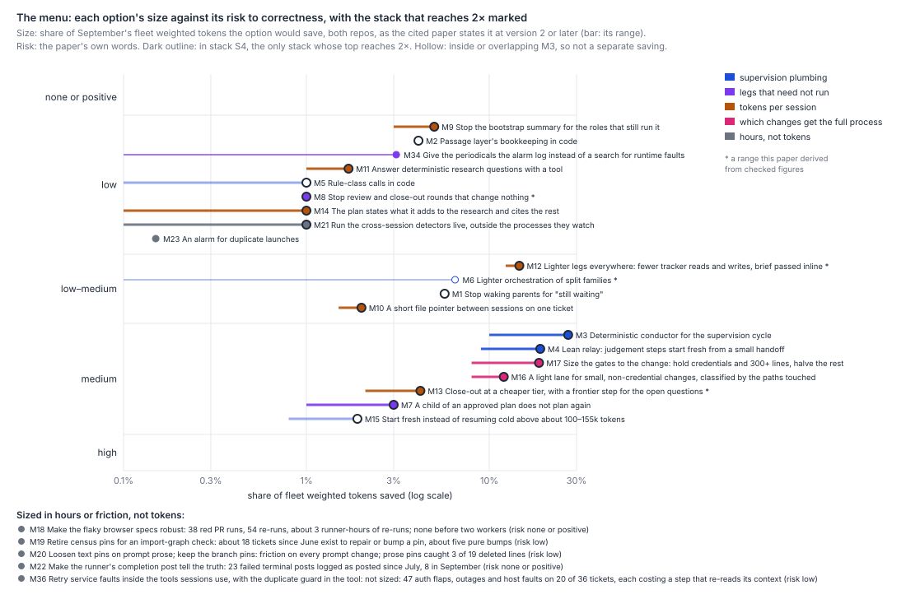
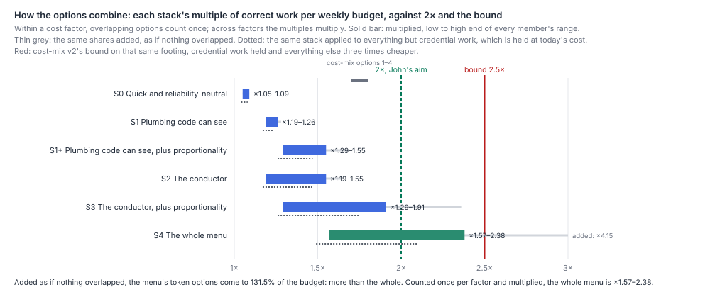

# Taken together, what did the steady-base expedition find, and what is the menu of changes John can choose from?

The expedition found that Harbour's cost rose while its quality held, and that the cost sits in
the process around each change rather than in the change: supervision that observable state
could decide, wakes that change nothing, sessions finding their bearings, and a full pipeline run
on work that review rarely faults. Model tier is not the lever. The menu that follows merges the
anchor's seventeen map rows and the Options sections of nine papers into 17 token-sized options,
6 sized in hours, 11 enablers and 7 things not to do, with every overlapping saving counted once.
Added as if nothing overlapped, the options' top figures come to 129% of the budget, more than the
whole. Counted once per cost factor and multiplied across factors, the stacks John can build run
from ×1.05 (the quick, reliability-neutral wins) through ×1.19–1.34 (the plumbing code can see
today) to ×1.55–2.44 for the whole menu. Only that last stack reaches 2×, and only at the top of its
range: it needs the deterministic conductor to take nearly all of the 27% of fleet tokens that
supervision spends on bookkeeping, a lighter path for small work, and lighter legs everywhere, each
at the high end of its checked size. Applied on the same footing as `cost-mix.md`'s bound, with
credential work held at today's cost, the whole menu's top is ×2.1 against the bound's ×2.5. So
John's 2× is reachable on the evidence, but it is not comfortable, and the one figure it turns on,
how much of the supervision cycle code can decide, is the one the expedition did not measure. Each
option below carries its size as a range, its risk, its trial design and charging rule, its effort,
its dependencies, a finish line and a retirement condition; Part 4 recommends a landing order, and
Part 5 ranks what is still unknown, with the scorecard's charging rule and census as the
prerequisite for all of it.



## Findings

### 1. What we found, in one page

**The cost rose while quality held, and it rose around the change, not in it.** Net product code
has held near 2,800 lines a week since the fleet started on 1 June; test lines grew 10.6×,
production comments 7.1×, a unit-suite CI pass 8–10×, and the fleet's own machinery fastest of all
(`growth-atlas.md` v2; anchor point 1). Escaped defects did not move: LinearViewer's September
without review residue is 5.7 per 100 merged PRs against 5.4 in June, and simple-dispatcher's 27.3
is within noise of its June (`reliability-baseline.md` v2 §Findings; anchor point 5). June was a
different regime, not a lost level: a correct change kept its size, and most of the fall from 113
to 65 merged tickets a week is fewer tickets, the rest a lower correct-and-complete share
(`why-throughput-halved.md` v3; point 11).

**Where the cost sits.** September's 3.6B weighted tokens, both repos, child-named
(`cost-mix.md` v2 §Findings, the mix table): proxy, dispatch and fleet machinery 27.1% (about 10
points of it rulings, Flight Companion and scan work); work that merged no change of its own 22.5%
(parents 13.0%, unmerged 4.6%, no ticket 4.9%); docs and tests 18.0%, of which the survey papers
10.0%; credentials and auth 9.7%; simple-dispatcher's own production code 8.2%. By layer, the
supervision layers take 35% of weighted tokens (`where-the-effort-goes.md` v2 §Findings), and 77%
of that is steps fully determined by observable state, about 27% of the fleet's tokens; a blind
recode puts the mechanical share at 86% (`what-supervisors-do.md` v2 §Findings; `survey-check-2.md`).
Implementation is about 24%. A change of a few lines still costs about 4.2M weighted tokens, ten
dispatches and an hour; a change of a few hundred lines costs two to three times that, so at least
half of a standalone change's cost is fixed and the linear fit puts the size-independent share
near nine-tenths (`cost-mix.md` v2 §Findings, the fixed part; `survey-check-9.md`).

**What raised it.** Fresh sessions per correct change have been flat at about 11 since August;
wakes went 8, 10, 16 and 18 per correct change by the session entered, or 29 by the child the log
names (`what-doubled-the-dispatches.md` v2 §Findings; `survey-check-4.md`). On the wake inventory's
cohort that is 18.9 wakes per correct change by the child and 14.9 by the session entered, 6.9 and
3.4 of them changing nothing (`wake-inventory.md` v2 §Findings). 31% of wakes change nothing and
are 25% of the supervision bill; 35% of all wakes are a supervisor relaying its own "still waiting"
upward, 97% of those quiet (`what-supervisors-do.md` v2; `wake-inventory.md` v2). A held
supervisor's wake costs a few thousand tokens plus 0.11 of its accumulated context, so the cost
of holding rises with history; a fresh one reads 116–238k tokens to its first decision after a
62–82k bootstrap (`held-or-fresh.md` v2 §Findings). Orientation before a session's first productive
call is 6–26% of tokens, 4.9–12.1% of it re-finding what an earlier session on the ticket read
(`starting-context.md` v2 §Findings). Repeat legs are 3.1 dispatches per correct change, 7.8% by
the log's line and 9.0% by the session entered, and 10% of tokens (`why-legs-repeat.md` v2
§Findings).

**What was ruled out.** Cheaper implementers: a correct, complete change costs about the same
whole-life hours at frontier (2.9–3.0 h) and mid tier (3.2–3.3 h), and the step at 12 July raised
dispatches per correct change about two-and-a-half-fold at every tier (`model-choice.md` v2
§Findings). A lighter path as a large lever: light work is not already cheaper for its size, and the
most a lighter process can save is what the light groups cost now, 13–18% of hours and 21–30% of
dispatches (`proportional-process-backtest.md` v2 §Findings), about 1.1–1.2× in correct work per
budget (`cost-mix.md` v2 §Options). Starting every judgement step fresh: the relay as proposed is 0%
(−17% to +9%) while fresh sessions orient as they do today (`held-or-fresh.md` v2 §Options D).
Writing less: ticket text is 1.3–2.4% of carried context (`step-overlap.md` v2 §Options E). More
effort for a change's size does not go with fewer wrong changes within any class (`cost-mix.md` v2
§Findings, the curve). And the claim that escapes had quadrupled did not survive re-derivation
(`survey-check-3.md`).

**The ceiling.** Holding credential work at today's cost, everything else three times cheaper
gives 2.5×, ten times cheaper 5.3×, free about 10×. Holding fleet machinery too, the ceiling is
2.7×, or about 3.7× if its rulings and Flight Companion work need not stay rigorous
(`cost-mix.md` v2 §Findings, the bound; `survey-check-9.md`). Cost-mix's own options 1–4 come to
1.7–1.8× together, not their product, because they cut the same spend. Reliability is steady, so
the baseline is clean: this is cost removal, not a quality fix, and the scorecard will say if that
is wrong (anchor, what this implies).

### 2. The menu

Every candidate from the anchor's map rows 1–17 and the nine papers' Options sections, merged.
Where two options are one lever measured twice they appear once, with both measurements cited.
Sizes are shares of September's fleet weighted tokens, both repos, as the cited paper states them;
"derived" marks a range this paper computed from checked figures, which is not itself checked. The
cost factor names the pool an option draws on; options in one factor overlap and are counted once
in Part 3. Repo says where the change would be built: LinearViewer (LV), simple-dispatcher (SD) or
both. The charging rule follows `how-process-changes-land.md` v2 §Findings 5: pooled or lineage
spread for savings that land above a ticket, session entered for savings inside its own sessions.

**Factor F1, supervision plumbing: tokens in supervisor sessions that observable state decides.**
Measured by the pooled scorecard (hours and tokens per correct change) with lineage spread beside
it; the session-entered rule is blind to it and reads zero.

| # | Option (map row or paper option) | Repo | Size | Risk to correctness | Trial | Effort | Depends on | Finish line | Retire if |
|---|---|---|---|---|---|---|---|---|---|
| M1 | **Stop waking parents for "still waiting"** (map 1; `held-or-fresh` v2 A; `where-judgement` v2 1) | both: SD delivers, LV mints in `addFeedback` | 5.7% by the class code can see (`held-or-fresh` v2 §Options A); quiet wakes are 7–10% of dispatches per change, by charging rule (`what-doubled` v2) | Low–medium: lost wakes are the most common supervisor failure (15 of 25; 11 of 15 lost in the runner's delivery), and 27 were lost in September by the wait graph (`wake-inventory` v2; `what-hides` v2). Code must still pass the 39% of progress wakes that lead somewhere | Shadow, then cutover between passages; pooled | S–M | M22 (a truthful completion post) and a lost-wake detector first | Relayed re-arms stop reaching parents; the old prose path deleted | Lost-wake incidents or hours waiting rise on the scorecard |
| M2 | **The passage layer's bookkeeping in code** (map 2; the Runner part of `held-or-fresh` v2 A) | LV (Runner prompt, passage routes); SD delivery | 4.1% of the month's fleet tokens; 5–15% during passages (anchor row 2); the passage layer is 8–15% of dispatches per change by rule (`what-doubled` v2) | Low: the Runner keeps its role, only its polling moves | As M1, measured across a passage | M | M1's delivery path | The Runner is invoked only on events that need judgement | Its wakes per worker event (3.0 inside a passage) do not fall |
| M3 | **A deterministic conductor for the supervision cycle**: completion gate, re-arming, restating, liveness clocks and detectors in the runner and dispatch code; contains M1, M2, M5 and the detectors M21 (map 3; `prototype-concepts` v2 B; `what-hides` v2 A in mechanism) | both | 10% by class, 14% if code could tell which wakes change nothing, up to 27% if every mechanical supervision token moves (`held-or-fresh` v2 §Options A; `what-supervisors-do` v2 §Findings). How much of the answering is already in code is unmeasured (anchor point 3) | Medium: the largest change; the plumbing moves rather than vanishes, and 21 of 25 supervisor failures on record were bugs in that plumbing (`what-supervisors-do` v2) | Shadow mode on one role's gate for a week (agreement on about 1,450 follow-ups), cutover as a before-and-after between passages, old path deleted in the same series (`how-process-changes-land` v2 §Options 3); pooled | L, in slices | M1, M2 landed; the charging rule and census chosen (Part 5) | No supervisor prompt asks a model to answer the completion gate, re-arm or poll; the slices' switches deleted | Agreement under the shadow's bound, or the correct rate or lost-wake count moves against the baseline at a slice |
| M4 | **A lean relay: judgement steps start fresh from a small handoff**, mechanical steps in code (map 16; `held-or-fresh` v2 B; `prototype-concepts` v2 C) | both | −9% to −19%, overlapping M1–M3 (`held-or-fresh` v2 §Options B: a further 0–9 points on top of A at a 20k handoff; break-even 21k, `survey-check-7`) | Medium: the handoff must carry verdicts, plan text, code and a done-and-answered list, since a planner given only the record re-proposed done work for about half its nodes (tag-two); one recovery on record needed held memory (LIN-2078) | Sandbox replay of 20 acted wakes first (`held-or-fresh` v2 §Next), then one role behind the scorecard; pooled | L | M3; the replay's result | One role runs as a relay with the handoff under 40k tokens | Tokens per judgement step above the held cost, or send-backs and escapes rise |
| M5 | **Rule-class calls in code**: escalate at the loop bound, retry once after a harness failure, proceed when a blocker is Done, merge on green where the brief says so (`where-judgement` v2 2) | both | Under 1% of ticket cost; removes the engine's 9 misroutes on 6 tickets | Low, if the rule reads current state: every engine misroute came from a stale hold comment | Inside M3's shadow; session entered | S | Nothing | Each rule has a test and the matching prompt line is removed | Overrides of the engine per ticket rise |
| M6 | **Lighter orchestration of split families**, parents at half their spend (`cost-mix` v2 2) | LV | 1.1× alone, 1.2× with a light lane; parent-only spend is 13% of the budget and a family costs 1.8× its children's standalone equivalent (`cost-mix` v2 §Findings). Its mechanical part is inside M3; what remains is the parent's judgement, which the papers say to keep (`where-judgement` v2 5). Derived: 0–6.5% | Low to moderate: parents hold the cross-child checks | Family spend over children's standalone equivalent, monthly; lineage spread | M | M3 (to see what is left after the bookkeeping goes) | A family costs under 1.4× its children's standalone equivalent | Escapes on children of split families rise |

**Factor F2, legs that need not run.** Savings inside a ticket's own sessions; session entered,
with lineage spread as a check.

| # | Option | Repo | Size | Risk | Trial | Effort | Depends on | Finish line | Retire if |
|---|---|---|---|---|---|---|---|---|---|
| M7 | **A child of an approved plan does not plan again** (map 15; `step-overlap` v2 A) | LV | 1–3%; ceiling 3.9% of tokens, 4.3% weighted. Half the implemented children of a planned parent ran their own plan, a third their own plan review | Medium: plan review's real finds all came in repeat rounds, and none of 24 sampled children carried the inherited "plan-review due: no" line; what a child's own plan changes is unmeasured (Part 5) | Holdout by lineage, 4 weeks; session entered | S | The proposals.md question on what children's plans change | Planned children run a plan only when their slice has drifted, by a rule in code | Escapes on split families rise, or plan-review send-backs on children rise |
| M8 | **Stop review and close-out rounds that change nothing**: close-out finishes wording and test-only items; text-only fixes do not re-trigger review (map 8; `fleet-complexity-read` §5.4) | LV | Derived 1–3%: repeated close-outs changed nothing in 20 of 20 and are 44 of 430 repeat dispatches, repeats hold 10% of tokens, so about 1% (`why-legs-repeat` v2 §Findings); the mutation check led about 36 of 88 extra legs, 97 test-or-wording changes, unsized in tokens (`which-rules-pay` v2 §Findings) | Low: CI still gates, and a repeated code review changed production code in only 5 of 36 | Holdout by lineage; session entered. Rounds per ticket and the correct rate | S | Nothing | A text-only fix merges without a review round; a close-out never repeats on its own hold | Escapes on tickets whose last round was skipped |
| M34 | **Give the periodicals the alarm log** instead of a search for runtime faults (`what-hides` v2 C) | LV | Up to 3.1% of September's tokens per batch spent where no cross-session instance was found first; 0 first finds of the nine patterns | Low: their code-quality findings are untouched | Periodical findings naming a runtime incident, per batch | S | M21 | Each periodical reads the alarm log before any search | Runtime findings per batch fall |

**Factor F3, tokens per session.** Measured per role from transcripts, which see shifts the
scorecard cannot (`starting-context.md` v2 §Findings gives the per-role baseline); session entered.

| # | Option | Repo | Size | Risk | Trial | Effort | Depends on | Finish line | Retire if |
|---|---|---|---|---|---|---|---|---|---|
| M9 | **Stop the bootstrap summary** for the roles that still run it (map 13; `starting-context` v2 A) | SD (`NO_BOOTSTRAP_KINDS`, a partial rollout 46 days old, `how-process-changes-land` v2 §Findings 2) | 3.0% in its own turns plus up to 2.4% carried: up to about 5% (`survey-check-8`) | Low: the task prompt arrives either way | Before and after per role, two weeks each, on tokens to first productive call | S | Nothing | Every kind launches without a bootstrap and the switch is deleted | Orientation per role rises above today's, or the correct rate per role falls |
| M10 | **A short file pointer between sessions on one ticket**: the earlier sessions' read and edited files with the commit they were read at, and the plan's named paths at the top of the implementation prompt; never a maintained map or wiki (map 14; `starting-context` v2 B, C, D; `prototype-concepts` v2 A) | LV | About 1.5–2% as sized, bounded by re-finding at 4.9–12.1%; C 0.1–2% and D about 1.4% sit inside that bound (`survey-check-8`). One probe cut a task from 51 turns to 18 (LIN-2115) | Low for implementation and close-out; medium for reviews, since a reviewer steered to the implementer's files may not look elsewhere, and that independence is what catches faults (`which-rules-pay` v2) | Ten tickets with a prior session, every second implementation prompt (`prototype-concepts` v2's trial table); tokens and calls to first edit; review findings per round | S–M | Nothing | The pointer is generated by code from the record, not written by a session | Repeat-read share does not fall, or review findings per round fall |
| M11 | **Answer deterministic research questions with a tool**: callers and readers of a symbol at a commit, a path's commits, PRs and dispatches (`starting-context` v2 E) | LV | Perhaps 1–2%: research legs are 5.3% of tokens and about 40% of their calls are searching and history | Low: the answers are facts at a commit; a stale index misleads | Research legs' calls and tokens per leg; plan-review send-backs on research-fed plans | M | Nothing | Research prompts name the tool and stop asking for the search | The send-back rate rises |
| M12 | **Lighter legs everywhere**: fewer tracker reads and writes per leg, prompt and brief passed inline, a turn budget per leg kind (map 17; `replay-small-work` v2 2) | both | About 15% as sized: tracker calls are 25% of tokens and remote work 4%, halving them saves about 15%; about 15 points of the replay's skipped chores were truly avoidable (`survey-check-11`). Derived low end 10%: nets out the 35% of tokens in supervision sessions that M3 removes, assuming an even spread | Low for reads; moderate for writes, since later legs, relays, rescues and the scorecard read what earlier legs wrote (`step-overlap` v2) | Per-leg turns and tokens by kind from transcripts, monthly (`survey-replay-chores.mjs`); correct changes a week unchanged; session entered | M | M3, so that the chores it would cut are not the ones code has already taken | Each leg kind has a turn budget and a named list of the tracker writes it must make | The record a relay or rescue needs is missing on any ticket, or the correct rate falls |
| M13 | **Close-out at a cheaper tier**, with a frontier step for the open questions (`where-judgement` v2 3; `prototype-concepts` v2 F) | LV routing | 2–5% of ticket cost; close-out is 5.2% of fleet tokens, so derived 1–3% of the fleet's. 17 of close-out's 23 consequential decisions were calls a rule or a cheaper step could make | Medium: a cheaper close-out that misreads a ledger lets an undischarged item through | A frozen fixture eval first, three runs per arm (M33); then close-out holds overturned | S | M33 | The eval agrees on holds and Done decisions; the routing row changed | Any undischarged item passes a cheap close-out |
| M14 | **The plan states what it adds to the research and cites the rest** (`step-overlap` v2 B) | LV | Under 1%: a quarter of a plan's units restate the research, about 440 words at the median plan | Low: a cited finding stays checkable | Plan words per ticket; plan-review rounds | S | Nothing | The plan prompt asks for additions and citations | Plan-review rounds rise |

**Factor F4, which changes get the full process.** Savings inside a ticket's own sessions;
session entered, with lineage spread beside it. The light group must be classified by the paths
actually touched, never by ticket text, which routes large, faulty changes light
(`proportional-process-backtest.md` v2 §Findings).

| # | Option | Repo | Size | Risk | Trial | Effort | Depends on | Finish line | Retire if |
|---|---|---|---|---|---|---|---|---|---|
| M16 | **A light lane for small, non-credential changes**: one implementer, one review, one close-out, chosen by a path check in code (map 7; `cost-mix` v2 1; `replay-small-work` v2 1; the backtest's M3 rule) | both | 8–12% of tokens, 1.08–1.14× (`replay-small-work` v2 §Options 1; `cost-mix` v2 §Options 1); at most 13–18% of hours and 21–30% of dispatches (`proportional-process-backtest` v2). On the work itself the replay cost 4.1% of the originals' session tokens, 5–10% in a lean harness with chores priced, 18–24% with today's per-leg habits | Medium: the light group escapes at 2.0 in 100 (0.9–4.6); review caught a real fault on 8 of the backtest's 328 small low-risk changes, 11 of 15 findings at plan review, which the lane would lose; correctness without hindsight is unmeasured, since 8 of 13 replayed descriptions carried what shipped (`survey-check-11`) | The forward trial in `proposals.md`: new M3-light tickets routed by path to the lane in the fleet's own harness, from the description as filed; escapes and named fixes at 30 days against 2.0 in 100, tokens per correct change in the 1–49 band, which shows first; about 400 lane changes to see a doubling of the escape rate; holdout by lineage, session entered | M | The scorecard's charging rule; M9 and M12 shape what a lean leg costs in production | The lane runs by a path rule in code with no per-ticket choice | Lane escapes exceed 2.0 in 100 by their interval, or review findings per lane change show the lost plan-review catches shipping |
| M17 | **Size the gates to the change**: keep today's process for credentials, auth, migration, security and 300+ line changes; halve the rest. Contains M16 (`cost-mix` v2 4; `fleet-complexity-read` §5.1) | both | 1.2× on the 0–299-line changes it touches, which is a 17% cut; 1.5× only if the papers', parents' and unmerged spend halve too (`survey-check-9`) | Moderate: the 50–299 band holds 11 of 43 real catches and escapes at 2.1–3.7% | Catches per 100M review tokens by band (today 0 at 0–49); escapes by band; holdout by lineage | M | M16 running for its first eight weeks | Every ticket's gate set is chosen by a path-and-size rule in code | Catches in the 50–299 band fall while its escapes rise |

**Sized in hours or friction, not tokens.** These do not enter Part 3's multiples. They change
hours per correct change, red-CI rounds and idle time, which the scorecard also tracks.

| # | Option | Repo | Size | Risk | Trial | Effort | Finish line | Retire if |
|---|---|---|---|---|---|---|---|---|
| M18 | **Make the flaky browser specs robust**, never skip (map 5; `browser-flakes` v2) | LV | 38 red PR runs, 54 re-runs, about 3 runner-hours of re-runs; seven specs carry every flake; three causes read from source | None: flakes hide real failures | CI red-E2E attempts per week, and first-attempt pass rate on green runs (80% of sampled greens passed only on retry) | S–M | No spec retries on a green run for four weeks | n/a: a fix |
| M19 | **Retire census pins for an import-graph check** (map 6; `test-estate` v2; `fleet-complexity-read` §5.5) | LV | About 18 tickets since June exist to repair or bump a pin, about five pure bumps; bumps match catches | Low: the import graph still guards drift | Pin-bump tickets per month | S | No census pin remains | A drift the pin would have caught escapes |
| M20 | **Loosen text pins on prompt prose**, keep the branch pins (map 9; `test-estate` v2) | LV | Prose pins caught 3 of 19 deleted lines; branch pins kill mutants | Low, if branch pins stay | Pin edits per prompt change | M | Prose pins removed; branch pins listed | A prompt-branch regression ships |
| M21 | **Run the cross-session detectors live, outside the processes they watch**: shared-error bursts and stopped or circular waits, one alarm to a person or the Flight Companion (`what-hides` v2 A; inside M3's liveness clocks) | both, outside the dispatcher | Hours, not tokens (under 1%): 42 hours of supervisors waiting on lost wakes and 165 hours of stalls in September; the two rules caught 7 of 19 incidents on record a median 5 hours early (`survey-check-10`) | Low, if alarms never act on their own; alarm fatigue (16 of 42 burst alarms were 4xx request mistakes), so a duration or harm threshold | Shadow run for four weeks logging alarms only, read weekly against the tracker (`proposals.md`) | M | Alarms acted on per week; median hours from onset to filing falls from about 16 | Fewer than half of alarms are real after the threshold |
| M22 | **Make the runner's completion post tell the truth**: retry a failed terminal post and write `hook.done_posted` only on success (`what-hides` v2 B) | SD | 23 failed terminal posts logged as posted since July, 8 in September | Positive | Lost terminal posts per month to zero | S | Zero in a month | n/a: a fix |
| M23 | **An alarm for duplicate launches** (`what-hides` v2 E) | SD | 0.15% of tokens, 5 pairs a month | Low | Duplicate pairs per month | S | Zero in a month | n/a |

**Enablers and landing rules.** No saving of their own; they make the savings measurable or
keep them from un-landing.

| # | Option | Repo | What it does | Source |
|---|---|---|---|---|
| M24 | **Keep the evidence for the project's lifetime**, phase C remaining | LV | Enables every before-and-after read; in progress, LIN-3157 | map 10 |
| M25 | **Freeze prompt sizes; new lessons land as code first** | both | Stops the ratchet: adds outnumber removals about six to one (2:1 to 21:1); rule text is 3–5% of carried context, so the cost is in what the rules make agents do | map 11; `how-process-changes-land` v2 §Findings 3 |
| M26 | **Every process change names its read and its retirement before it lands** | both | 2 of 27 changes were measured before and after by design, 0 named a retirement condition, 5 measured-before changes never got their after-read | `how-process-changes-land` v2 §Options 1 |
| M27 | **One process change at a time, between passages, with nothing else in its four weeks** | both | Makes ×2 visible in four weeks a side; every past change shared its window with 5–16 others | §Options 2 |
| M28 | **Shadow mode for the mechanical supervision rows**, cutover and deletion in the same series | both | Agreement on 1,000 decisions in under a week; the saving is read at cutover | §Options 3 |
| M29 | **Holdout by lineage for ticket-level changes** | both | Sees ×1.8–2.7 in dispatches and ×1.5–1.9 in hours in four weeks, inside a ticket's own sessions | §Options 4 |
| M30 | **Burn down what is half-finished before a new trial** | both | 47 items in process code (21 switches, 19 dual paths, 7 parked experiments), 100 open follow-ups and 114 review-residue tickets at a median 53 days | §Options 5 |
| M31 | **Report the pooled headline and one per-change rule side by side** | both | Prevents a saving above the ticket reading as zero, or the 13 September log change reading as a step | §Options 6 |
| M32 | **Check a Harbour paper before it merges, not after** | LV | About 20 of 24 checks corrected a load-bearing claim after merge; a check is about a third of a checked paper | `prototype-concepts` v2 §Options D |
| M33 | **A per-step fixture eval, three runs per arm, before a step changes tier** | LV | Enables M13 without the scorecard's eight-week wait | §Options F |
| M35 | **Retire vigilance text where a detector takes over** | both | Inside M25; only after M21 has run a month, since a defence's worth is invisible until removed | `what-hides` v2 §Options D |

**Already done**, as ordinary tickets on 30 September: the four idling test files (map 4,
LIN-3158: serial unit suite 266 s to 175 s), simple-dispatcher's hygiene (map 12, LIN-3160) and
the unit flakes (part of map 5, LIN-3159).

**Not recommended, on the papers' own evidence:** the relay as proposed with today's orientation
(`held-or-fresh` v2 D: 0%, −17% to +9%); plan review re-deriving less (`step-overlap` v2 C: at most
2%, and its finds are new); writing less for tokens' sake (`step-overlap` v2 E); a graph-structured
research leg (`prototype-concepts` v2 G: a median 1.44× the tokens); a reader-and-inference pass on
every check (`prototype-concepts` v2 E: a cost); switching model tiers as the cost lever
(`model-choice` v2); and any lighter plan review or review on the strength of the judgement paper
(`where-judgement` v2 5: gates and makers make 158 of 260 consequential decisions).

**One lever measured twice.** `held-or-fresh` v2's option A and `where-judgement` v2's option 1
are the same change, over the fleet and per ticket, and both sit inside map rows 1–3
(`survey-check-7`). The prototype papers' options A, B and C are map rows 14, 3 and 16. The
detectors (M21) overlap row 3 in mechanism, not in tokens (`survey-check-10`). The lean lane (M16)
is lighter legs (M12) taken to its limit on a fifth of the work (`replay-small-work` v2 §Options).
`cost-mix` v2's option 3, cutting the fixed part by half everywhere, is not a separate option: it is
what F1 and F3 together would do.

### 3. How the options combine

Within a factor, options draw on one pool, so their savings overlap and count once: M1 and M2 are
inside M3, M4 overlaps M1–M3, M17 contains M16, and M10's three forms share the re-finding bound.
Across factors the multiples multiply, because each later factor's share is spread over what the
earlier factor leaves: removing a supervisor's mechanical steps also removes the bootstrap and the
tracker reads those steps carried, so adding the shares would count them twice. Each factor's
multiple is 1 ÷ (1 − its saved share), assuming the same correct output, as `cost-mix.md` v2's bound
does. The arithmetic is in `scripts/survey-menu-analyse.mjs`.

| Stack | Members | F1 | F2 | F3 | F4 | Multiple (multiplied) | If added | Credential work held |
|---|---|--:|--:|--:|--:|--:|--:|--:|
| S0 Quick and reliability-neutral | M9, M10, M14, and the hours items | – | – | 4.7–8% | – | ×1.05–1.09 | ×1.05–1.09 | ×1.04–1.08 |
| S1 The plumbing code can see | S0 + M1, M2, M5, M7, M8 | 10–14% | 2–6% | 4.7–8% | – | ×1.19–1.34 | ×1.20–1.39 | ×1.17–1.30 |
| S1+ with proportionality | S1 + M16, M17 | 10–14% | 2–6% | 4.7–8% | 8–17% | ×1.29–1.62 | ×1.33–1.82 | ×1.26–1.53 |
| S2 The conductor | S0 + M3 (with M21), M7, M8 | 14–27% | 2–6% | 4.7–8% | – | ×1.25–1.58 | ×1.26–1.69 | ×1.22–1.50 |
| S3 The conductor with proportionality | S2 + M16, M17 | 14–27% | 2–6% | 4.7–8% | 8–17% | ×1.35–1.91 | ×1.40–2.38 | ×1.31–1.75 |
| S4 The whole menu | S3 + M12, M13, M11, M4 | 14–27% | 2–6% | 16.7–28% | 8–17% | ×1.55–2.44 | ×1.69–4.55 | ×1.47–2.14 |



**Which stacks reach 2×.** Only S4, and only at the top of its range. Its low end, ×1.55, is what
the menu gives if code can route only the wakes it can tell apart by class (14%), small work goes
light at the replay's lower estimate, and lighter legs net of the conductor save 10%. Its top,
×2.44, needs the conductor to take nearly all of the 27% that supervision spends on mechanical
steps, the gates sized to the change at cost-mix's 1.2×, and lighter legs at the full 15%. The
geometric middle of S4 is about ×1.9. S3, the conductor with proportionality but without lighter
legs, tops out at ×1.91; S1+, the plumbing code can see today plus proportionality, at ×1.62. So
the gap between "reachable on today's class-visible evidence" and 2× is the conductor's unmeasured
ceiling (Part 5, question 2) and the chores question (M12's overlap with M3).

**Against the bound.** `cost-mix.md` v2 holds credential work at today's cost and cuts everything
else; three times cheaper gives 2.5×. The stacks above cut mechanical overhead on credential
tickets too, which keeps their gates but not their bookkeeping, so they are not strictly below the
bound. On the bound's footing, with the 9.7% of credential spend held entire, the whole menu's top
is ×2.14 and its low end ×1.47. Three times cheaper everywhere else is a 67% cut; the whole menu's
top is a 59% cut. The plausible top is therefore a little under the bound, and it clears 2× only if
every structural row delivers at its high end. Cost-mix's own options 1–4 at 1.7–1.8× are
the proportionality and fixed-part rows alone; the menu adds the structural rows, which is where
the rest comes from, as the anchor said it must.

**What adding would have said.** Added as if nothing overlapped, the whole menu's shares come to
78% at the top and the multiple to ×4.55, and the token options' individual high ends sum to 129%
of the budget. That is the arithmetic behind the fifth wave's warning that its options do not add.

### 4. A landing order

Principles from `how-process-changes-land.md` v2 §Findings 4 and §Options: each change gets a
number before, a read date after and a retirement condition (M26); one change at a time, or a few
independent groups measured on different rules (M27); the losing arm deleted on a date (M29); the
shadow's cutover and the old path's deletion in one series (M28). What the scorecard can see: a
before-and-after sees ×2.1 at four weeks a side on the weekly ratio and ×2.8 (dispatches) or ×2.0
(hours) on the per-change series; a holdout by ticket ×1.8–1.9 in dispatches and ×1.5–1.9 in hours;
nothing under ×1.3 within eight weeks (`measuring-throughput.md` v2 §Findings;
`how-process-changes-land.md` v2 §Findings 4). So no option under about a 23% saving is visible to
the scorecard on its own, and the order below pairs each group with the instrument that can see it.
This is a recommendation; John decides.

**Step 0, before any change is measured: one charging rule and one census.** Reconcile the two
censuses of the same runner logs (47.1 against 33.6 dispatches per correct change for code changes
merged 14–28 September, by the child named), then adopt a rule per candidate kind as in
`how-process-changes-land.md` v2 §Findings 5, and report pooled beside it (M31). Finish M24's phase
C. Freeze the baseline: four weeks of the scorecard with the half-finished items burned down (M30)
and nothing else landing. This is measurement, not a change, and it can run during V1.

**Group A, now, as ordinary tickets, read by their own instruments.** M22 (truthful completion
post), M18 (browser flakes), M19 and M20 (pins), M9 (stop the bootstrap and delete the switch), M10
(the pointer, on ten tickets), M14, M23, M25 (the freeze). None changes how the fleet works, each
is reliability-neutral or positive, and each has a finish line that is a count reaching zero or a
per-role token read from transcripts. Expect ×1.05–1.09 in tokens and a visible fall in red-CI
rounds and idle hours; the scorecard will not see the tokens, and should not be asked to.

**Group B, the structural series, between passages.** M1 in shadow, then M2, then M3 in slices,
with M21's detectors as the liveness half of M3 and M5 inside it. Each slice: shadow for a week
on about 1,450 follow-ups until agreement is bounded, cut over as a before-and-after between
passages, delete the prose path in the same PR series, read pooled and lineage-spread at four
weeks. Expect ×1.19–1.34 from the class-visible slices and up to ×1.58 if the conductor reaches
its ceiling; the first is at the edge of what the scorecard sees at eight weeks, the second is
visible at four. M4 (the relay) waits for M3 and for the sandbox replay in Part 5.

**Group C, ticket-level, in parallel with Group B, on a different rule.** M16's forward trial as
a holdout by lineage, session entered: it saves inside a ticket's own sessions, where Group B
saves above them, so the two can run at once without one reading as the other
(`how-process-changes-land.md` v2 §Findings 5's table). M8 and M7 in the same holdout, M7 after
the proposals question on children's plans is answered. M17 after M16's first eight weeks. Expect
×1.08–1.14 from the lane on the scorecard's session-entered series, which is below its detection
floor fleet-wide; the lane's own measure is tokens per correct change in the 1–49 band and its
escape rate against 2.0 in 100, which needs about 400 lane changes to see a doubling.

**Group D, after Group B lands.** M12 (lighter legs), because what a leg must still write depends
on what the conductor reads; M13 after M33's fixture eval; M6 once the parent's bookkeeping has
gone and what is left can be seen; M11 and M34 whenever convenient. M35 a month after M21.

**What this order buys.** A, B and C together are S3 at ×1.35–1.91 within about three months,
if each lands whole. D takes the stack to S4. The order puts the reliability-neutral and the
largest changes first, keeps every altitude (the decision of 30 September), and leaves the
correctness question of the light lane to a trial with a written finish line rather than to a
backtest.

### 5. What we still don't know

Ranked by how much the answer moves the menu. The first is the prerequisite for measuring any of
the rest; all are in `proposals.md`, where the detail of each sits.

1. **Which charging rule, and which census.** Two censuses of the same runner logs give 47.1 and
   33.6 dispatches per correct change by the child named for the same fortnight
   (`survey-check-9`), and the rule moves September's figures by about a third on wakes. Until one
   census and a rule per candidate kind exist, no per-change saving can be read fairly.
2. **How much of the supervision cycle code can decide.** The conductor's size runs from 10% by
   class to 27% if every mechanical token moves; "much of the answering is already in code, how
   much unmeasured" (anchor point 3). The replay of September's gate replies and quiet-wake cycles
   against the runner's own state, counting how many a reader of that state would have written
   identically, is the single measurement that decides whether 2× is in reach.
3. **Which deliveries into a held supervisor code can tell are quiet in advance.** 938 quiet
   wakes, 4.5% of fleet tokens, are indistinguishable by class from the ones that act
   (`survey-check-7`). This is the gap between 10% and 14% in F1.
4. **Is a lean lane as correct without hindsight.** The replay cannot say; the forward trial can
   (`survey-check-11`). This gates M16 and M17, the whole of F4.
5. **How many steps a fresh session takes to reach a held supervisor's decision**, from the
   record and a short handoff, in a sandbox. This decides whether M4 adds anything to M3.
6. **What a child's own plan changes against the parent's slice**, and whether its plan review
   finds something real. This decides M7's risk.
7. **Does a session handed the plan's named paths reach its first edit cheaper, at the same
   correctness**, and is a reviewer re-reading the implementer's files checking independently or
   re-finding. Together these set M10's size and its risk to review independence.
8. **Can a signal visible before review tell the fleet-machinery changes whose review catches a
   real fault from those whose review catches nothing.** This decides whether the ceiling is 2.7×,
   3.7× or 10×.
9. **Does the scorecard's weighted unit hide September's change of frontier price row**, and how
   many weighted tokens is one point of the weekly meter. Both bear on the instrument every
   option is read by.
10. **Would a mid- or cheap-tier close-out make the same holds and filings as a frontier one.**
    M13's fixture eval.
11. **What the added supervision buys**, tickets flown under a Runner against a lone autopilot at
    fixed size and risk; and **how many of the wakes a worker event sends up the stack change what
    any supervisor does**. These would turn M2's "5–15% during passages" into one number.
12. **Did LIN-2323's second read ever disagree, and should its sunset have retired it.** Small, but
    the first test of M26's retirement rule on a real case.

### 6. A note on method

**How the research ran.** Thirty-nine documents in three days, 29 September to 1 October: 26
papers and 13 checks, 187,711 words, with 164 scripts added under `scripts/survey-*` and
`scripts/steady-base-*` (19,511 lines) and the anchor rewritten through 13 commits to 9,479 words
(`scripts/survey-menu-analyse.mjs`, from git). Each paper was one bounded session with no research,
plan, review or close-out legs, with in-session subagents for parallel reading and blind coding,
followed by one independent check in the same form; 25 of the 26 papers are at version 2 or later.
A one-session paper cost about $11.68 at list prices and a check about $8, a third of a checked
paper; the papers were 10.0% of September's weighted tokens (`prototype-concepts.md` v2 §Findings;
`cost-mix.md` v2 §Findings). A Lighthouse study costs about the same per piece in weighted tokens
(`survey-check-10`). This paper ran the same way: one session, no subagents, two scripts, and no
new measurement beyond arithmetic over checked figures and a count of the archive from git.

**What the checks changed.** Every committed script re-ran and nearly every printed number
reproduced; the corrections were in what the numbers were taken to mean. About 20 of 24 checked
documents had a load-bearing claim corrected (`survey-check-10`). The corrections fall into six
kinds, each more than once:

- **Attribution.** Finder rows and review residue counted as escapes (`survey-check`,
  `survey-check-3`); commit trailers naming the finisher as the implementer; wakes charged to the
  child from 13 September reading as a doubling (`survey-check-4`); a July undercount read as a
  doubling at every size.
- **Sizing by what code cannot see.** Quiet wakes to code sized by outcome at −14%, routed by
  class −10% (`survey-check-7`); the rule class of decisions at 8%, reproduced at 2–4%.
- **Double counting.** A fresh step's first decision charged twice in the relay model, turning
  +2% into 0% (`survey-check-7`); 0.9 points of re-fire tokens inside map row 1 (`survey-check-10`).
- **Hindsight.** Two of the three faults the lean replay "shared" with the full process were
  written into the descriptions it read; replayed from the pre-implementation text, two of four
  verdicts moved from better to worse (`survey-check-11`).
- **Comparisons not like for like.** A price-row change read as multi-session work costing 1.7×
  per weighted token (`survey-check-10`); two censuses of the same logs compared as if they were
  one (`survey-check-9`); a per-ticket ratio (77%) read as a saving (`survey-check-4`).
- **Option sizes stated high.** Of the fifth and sixth waves' option sizes the checks moved, most
  moved down (−14% to −10%; 4–5% to 1.4%; 1.5× to 1.2×; 9 of 19 to 7 of 19; about 90 real alarms to
  about 40; 23 of 24 to 20 of 24), and a few up (the bootstrap 3% to 5%; the mechanical share 77%
  to 86%; the dispatch step 2× to 2.5×).

**Where the process drifted.** Towards complication: four charging rules where the brief asked
which of two to adopt, and two unreconciled censuses of one log; 164 scripts for 39 documents, so
that "every script re-runs" is a sentence in every check; a map that grew from 12 rows to 17 and
papers whose Options sections re-measure one lever under new names, which this paper has had to
merge. Towards overconfidence: option sizes printed to the point and corrected downward more often
than up; findings quoted into the anchor at version 1 while their checks were still running
(`survey-check-3`), so that the anchor carried wrong figures for a day; a replay whose headline
rested on hindsight until a check re-ran it from the earlier text. The checks caught these because
they were independent of the authors and read the sources rather than the papers. The lesson the
papers themselves draw, in `prototype-concepts.md` v2 §Options D and `how-process-changes-land.md`
v2 §Options 1, is to check before merge and to write the read and the retirement condition before
a change lands. This paper will be checked after it merges, as the others were, which is the
ordering it says is wrong.

## Method

**Sources.** `docs/steady-base.md` at 01277614 and every document in its evidence table except
the "Earlier" row: 39 documents, listed with word counts in `data/survey-menu/menu.json`. Every
figure is read from a paper at version 2 or later (version 3 for `why-throughput-halved.md`),
or from a check, and cites paper and section. Only `fleet-complexity-read.md` is at version 1; it
is cited for two of its ranked simplifications, which map rows 7, 8 and 6 already carry.

**The menu.** Each option is a row in `scripts/survey-menu-analyse.mjs` with its size as the cited
paper's range, its risk in the paper's own words on a five-step scale (none or positive, low,
low–medium, medium, high), its factor, and its source. Four ranges are derived from checked figures
and are marked so: M6 (0–6.5%, overlap with M3 unknown), M8 (44 of 430 × 10% ≈ 1%, plus the
unsized mutation rounds), M12 (15% as sized; 10% nets out the 35% of tokens in supervision under
an even spread), M13 (2–5% of ticket cost × close-out's 5.2% of fleet tokens).

**The stacks.** Within a factor, the union is the largest option that contains the others (F1:
M3 at 10–27%, with M1 and M2 as its class-visible 10% and 14% if code could tell quiet wakes in
advance; F4: M17 at 8–17% containing M16) or the sum of pools the source says are disjoint (F2:
M7 and M8; F3: M9, M10, M11, M12, M13, M14). A stack's multiple is the product over its factors of
1 ÷ (1 − share), at the low and high end of every member's range. "If added" is 1 ÷ (1 − the sum
of shares). "Credential work held" applies the stack to the 90.3% of the budget outside the
credential class, with that 9.7% held at today's cost, the footing of `cost-mix.md` v2's bound.

**The archive count.** From git at 01277614: the documents named in the anchor's evidence table,
their frontmatter versions and dates, word counts from the files, scripts matching
`scripts/survey-*.mjs` and `scripts/steady-base-*.mjs` with the date of the commit that added
each, and the commit count on `docs/steady-base.md`.

```sh
node scripts/survey-menu-analyse.mjs          # data/survey-menu/menu.json: the menu, the stacks, the archive count
node scripts/survey-menu-figures.mjs          # docs/papers/harbour/figures/steady-base-menu/
```

No proxy call was made for this paper beyond reading its own ticket and brief.

## Limits

- **The sizes are the papers', with their limits.** Every range here inherits the limits of the
  paper it cites: one month of tokens (transcripts begin 31 August), a survey wave and a passage
  both running in September, and escapes that are floors. *Bias:* the September budget is heavier
  in papers and parents than a quiet month, so the shares F1 and F4 draw on are, if anything, high
  for a month with no passage and no survey; the multiples run high with them.
- **The factors are a reading, not a measurement.** No paper measured the overlap between
  mechanical supervision (F1) and tracker chores or orientation (F3); multiplying assumes an even
  spread. *Bias:* if chores and orientation concentrate in supervisor sessions, the multiplied
  figures are high; if they concentrate elsewhere, low. The "if added" column is the no-overlap
  bound.
- **Four ranges are derived here and unchecked** (M6, M8, M12's low end, M13). *Bias:* M8's 1% is
  a lower end because the mutation rounds are unsized; M12's 10% rests on an even spread; M13
  assumes close-out's share of fleet tokens is its share of ticket cost.
- **The multiples assume the same correct output.** As in `cost-mix.md` v2, a cut that moves
  catches into escapes is invisible to the arithmetic. *Bias:* every multiple is a best case; the
  risk column is the only place that cost appears.
- **"Risk to correctness" is the paper's wording mapped to five steps by one reader.** *Bias:*
  options whose papers wrote "low to medium" or "moderate" are placed by judgement; a different
  reader would move a few by one step, not more.
- **Hours-sized options do not enter the multiples.** M18–M23 change hours per correct change
  and idle time, which the scorecard counts separately. *Bias:* the stacks understate what the
  menu does to hours.
- **Both repos are pooled.** Every fleet-wide share covers both repos' workspaces; only the
  credential, simple-dispatcher and escape figures are per repo. *Bias:* none in direction; a
  per-repo menu would need per-repo token shares, which `cost-mix.md` v2 gives only for
  simple-dispatcher's own class (8.2%).
- **The ranking in Part 5 is one reader's.** It orders proposals by how far the answer moves the
  stacks, which rewards questions about F1. *Bias:* questions about correctness (4, 8) may deserve
  the top place on John's measure rather than on this paper's.
- **The archive count is a census of the anchor's table, not of everything written.** Scripts are
  counted by name pattern and may include a few written for earlier papers under the same prefix;
  164 is all that match, every one added on or after 29 September. *Bias:* the script count is
  exact for the pattern and may be high for the expedition by a handful.

## Next

The research stage closes with this paper and its check. New questions go to `proposals.md`.
One line goes there from here: whether the menu's cost factors overlap as assumed, measured on the
transcripts the scorecard already reads, so that the stack arithmetic can be checked rather than
reasoned. The check of this paper should re-run both scripts, re-read every cited range against its
source, and move any option whose risk step it reads differently.
