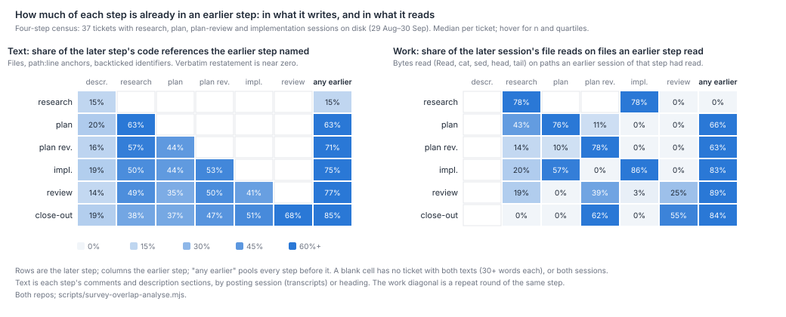
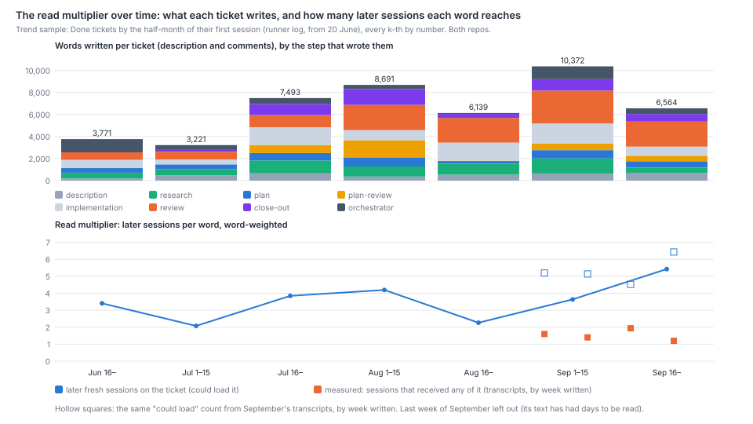

# How much does each Harbour step redo the one before it, and how much of what one session writes does the next one use?

Less than John suspects in what the steps write. More in what they read. And not where the value
is. This paper takes the 37 tickets in the transcripts (29 August to 30 September, both repos) that
ran research, plan, plan review and implementation. Two blind readers coded 535 units from 13 of
them. About a quarter of a plan restates the research and 7% re-verifies it; two-thirds extends it
or is new (κ 0.81). About a third of a plan review re-establishes facts the plan or research already
stated, and the prompt asks it to. A third checks a claim without re-deriving it, and a fifth is new
(κ 0.88). Later steps act on three-quarters of what research writes, but cite it one time in nine.
The steps paraphrase rather than copy, and they talk about the same code: 63–85% of a later step's
code references were already named before it. Their sessions mostly re-read files an earlier session
on the ticket read: 56–71% of their file-read bytes, or 5% of their carried context. The written
text is cheap to carry. Ticket reads were 1.6% of all the context September's sessions carried, and
a word of ticket text reached 1.4 later sessions on average, against 5.4 that could have loaded it,
because sessions read tickets in part. Since late June the words written per ticket have roughly
doubled to tripled, while the later sessions that could read each word held at two to five. So the
read load grew with the writing, not with the readers. The overlap is not where the gates earn
their keep. Of 44 real faults that code review caught, the research or plan had named 3. None of
plan review's 30 real finds was in the research. Splitting does duplicate process: half the
implemented children of a planned parent ran their own plan and a third their own plan review.
Those children's planning took 4.5% of all tokens on disk. Siblings share about a fifth of their
code references, so the duplication is of process more than of content.



## Findings

**The plan mostly adds to the research, and the research is mostly used.** Two readers coded
535 units (paragraphs and list items) from 13 of the census's 37 tickets without seeing each
other's codes. Per ticket, averaged over both readers:

| Step | Restates an earlier step | Re-verifies it from fresh evidence | Extends it, or new | Other | Agreement (κ) |
|---|--:|--:|--:|--:|--:|
| Plan, against the research and description (127 units) | 25% | 7% | 65% | contradicts 2% | 0.81 |
| Plan review, against the research and plan (133) | checks a claim 32% | 35% | new 21% | verdict and bookkeeping 12% | 0.88 |
| Implementer's comments, against the plan (145) | 41% (restates or re-verifies) | | 58% | departs from the plan 1% | 0.67 |

So John's first suspicion, that research does most of the plan, does not hold: about a third of a
plan restates or re-verifies the research, and two-thirds is design, steps, tests and scope the
research did not have. His second does: about a third of a plan review re-establishes facts the plan
or research already stated, and that is by design. The prompt tells plan-review to "independently
re-run the plan's grounding claims" (`lib/prompt-template-defs.js:840-844`, `:868-874`). A fifth of
it is new. Of the research's own units, later steps acted on 75% (followed 67%, cited 8%). 3% were
contradicted, 3% ignored, and 18% were background with nothing to act on (κ 0.73). The research is
used, but it is rarely named: a later step that takes up a research finding says so one time in nine.
The plan step is told to work from research's classes (`:282`, `:589`), and it does.

**In text, the steps paraphrase rather than copy, and they talk about the same code.** On all 37
census tickets the share of a later step's word 6-grams found verbatim in the steps before it is
under 1% for every step but close-out (3%), and almost no paragraph overlaps an earlier one by
half its content words. What they share is the code they talk about. Of the files, path:line
anchors and identifiers a plan names, the research had already named a median 63% (quartiles
50–71%). For a plan review it is 71% of what the earlier steps named, for the implementer's comments
75%, for code review 77% and for the close-out 85%. The ticket as filed names few of them (a
median 15% of research's). The matrix on the left of the figure above gives every pair.

**In work, later steps re-read the files earlier steps read, and most of that is the same step
going round again.** A file read here is a `Read`, `cat`, `sed -n`, `head` or `tail` of a path,
from the transcripts of the census tickets' 296 later sessions. By bytes:

| Later step | Its file reads on files any earlier session of the ticket read | First round only: on files a different step read | Those re-reads, as a share of the session's carried context |
|---|--:|--:|--:|
| Plan (62 sessions) | 56% | 43% | 3.0% |
| Plan review (75) | 57% | 37% (median 3%) | 3.2% |
| Implementation (67) | 71% | 67% | 6.5% |
| Code review (49) | 67% | 68% | 2.9% |
| Close-out (43) | 70% | 75% | 2.7% |

Pairwise, a plan re-reads a median 43% of its bytes from the research's files, an implementer 57%
from the plan's, and a repeat round of the same step 76–86% from the round before (the figure's
right-hand matrix). A first-round plan review mostly reads other files: its median cross-step re-read
is 3%. A few long plan-review sessions carry the pooled 37%. Its re-verification is mostly queries re-run (`git
log`, `rg`), which this count does not see. Over all 296 later sessions, re-reads of files an
earlier session read are 5.1% of their carried context, 4.2% across steps, out of 11.1% for all file
reads. By repo it is 4.6% on LinearViewer's 25 tickets, 7.3% on simple-dispatcher's 8 and 5.3% on
the 4 in both. An implementer has to read a file to change it, and a reviewer has to read the code
it checks, so this is a ceiling on what a hand-over could save, not a saving.

**The overlap is not where the value is: what review and plan review find is new.** The value
readers took every real fault that code review led a fix for in `which-rules-pay.md` (44 in 18
tickets) and every real, new plan-review find in `why-legs-repeat.md`'s two samples (30 in 28
tickets). For each, they read the research and plan written before it and asked whether either had
named that failure.

| Finding | Findings | Named before, both readers | in the research | Tickets with no research or plan text before it | Agreement |
|---|--:|--:|--:|--:|--:|
| Real fault fixed after code review | 44 | 3 (2 plan, 1 both) | 1 | 15 findings, 8 tickets | 44 of 44 |
| Real, new plan-review find | 30 | 0 | 0 | 0 | 29 of 30 |

Of the 29 review faults on tickets that had a plan or research before them, the plan or research
had named 3. One example is LIN-2974's repo guard: its plan said it "fails open" on an 8-second
timeout, and review found that it usually did. None of plan review's 30 real finds was in the research. One
reader called one of them in both research and plan, and the other reader did not. So the gates are
not re-finding what research already knew. They find things that no earlier step wrote down. That is
consistent with `why-legs-repeat.md`: repeat plan reviews earn their keep.

**The written text is read in part, and costs little to carry.** Every fetched ticket's comments
and description sections written from 30 August (1,707 pieces of text, 1.4 million words, 98
tickets) were traced through every later ticket read in the transcripts. A session received any of
a piece if any 120-character chunk of it came back to it. It received the piece fully if half or more
of its chunks did.

| Text written by | Pieces | Words | Later sessions that received any of it | that received half or more | Later fresh sessions on the ticket (could load it) |
|---|--:|--:|--:|--:|--:|
| Ticket as filed (description) | 85 | 53,921 | 8.0 | 3.4 | 9.6 |
| Research | 91 | 175,564 | 1.5 | 0.3 | 8.2 |
| Plan (comments and description section) | 290 | 215,466 | 1.2 | 0.2 | 7.9 |
| Plan review | 207 | 252,975 | 1.2 | 0.3 | 6.7 |
| Implementation | 378 | 175,388 | 1.0 | 0.4 | 4.2 |
| Code review | 167 | 280,649 | 1.2 | 0.3 | 2.8 |
| Close-out | 199 | 118,336 | 0.5 | 0.1 | 0.8 |
| Autopilots and other supervisors | 290 | 123,347 | 1.1 | 0.3 | 5.3 |
| All | 1,707 | 1,395,646 | **1.4** | 0.4 | 5.4 |

Word-weighted, a word reaches 1.4 later sessions, about a quarter of the 5.4 that could have
loaded it. By repo it is 1.3 of 5.1 on LinearViewer's 79 tickets, 2.0 of 5.4 on simple-dispatcher's
10 and 1.4 of 8.0 on the 8 in both. 15% of the loads were by a session working on another ticket,
mostly a supervisor reading its child. Most sessions take the ticket through a filter or a
`head -c`, or take the brief. The ticket as filed is the exception: most later sessions get it. Over
all 2,022 sessions on disk, ticket reads were **1.3% of carried context** and brief reads 0.3%. That
matches `steady-base.md`'s 1.6% for 24–29 September. Writing the text is small too. On the census
tickets, the words posted are about 4% of the sessions' output tokens, and output tokens are under
1% of all tokens. September's measured multiplier did not move by week (1.2–1.9; the figure's
orange squares).

**Since June the words grew and the readers did not.** In the trend sample, ten Done tickets a
half-month by first session:



| First session | Tickets | Words per ticket (mean) | Later fresh sessions per word | Word-reads per ticket | Later dispatches per word, by the log's line | by the session entered |
|---|--:|--:|--:|--:|--:|--:|
| 20–30 June | 3 | 3,771 | 3.4 | 12,857 | 3.4 | 3.4 |
| 1–15 July | 10 | 3,221 | 2.1 | 6,683 | 10.3 | 10.3 |
| 16–31 July | 10 | 7,493 | 3.8 | 28,830 | 26.7 | 26.7 |
| 1–15 August | 10 | 8,691 | 4.2 | 36,472 | 10.9 | 10.9 |
| 16–31 August | 10 | 6,139 | 2.3 | 13,903 | 4.3 | 4.3 |
| 1–15 September | 10 | 10,372 | 3.6 | 37,759 | 28.7 | 28.7 |
| 16–30 September | 10 | 6,564 | 5.4 | 35,609 | 21.4 | 19.8 |
| The four-step census | 37 | 17,830 | 7.1 | 127,463 | 22.1 | 23.1 |

Words per ticket roughly doubled to tripled from early July, which is `growth-atlas.md`'s finding
again. The later fresh sessions that could read each word stayed between two and five. So the word
reads a ticket could cause rose from 7,000–13,000 in late June and early July to 14,000–38,000 after,
carried by the writing. Counting every later
dispatch instead of fresh sessions gives a much noisier series. The two charging rules agree on this
sample except in late September, because few sampled tickets are parents that receive their children's
wakes. On the census they differ by a dispatch per word. If September's ratio of received to possible
loads (about a quarter) held earlier, a June word reached about one later session and a September word about one and a
half.

**Splitting duplicates the process more than the content.** Among the transcripts, 27 parents
had two or more children with sessions on disk, and 22 of those parents had run their own plan or
breakdown. Of the 65 implemented children of those 22, 32 ran their own plan session (49%), 23
their own plan review (35%) and 18 their own research (28%). Children of parents with no plan on
disk did about the same: 15 of 26 planned and 8 plan-reviewed. So a parent's plan barely reduced
its children's planning. The breakdown step is meant to copy an approved plan's slice, with a
"plan-review due: no" line, into each child (`lib/prompt-template-defs.js:439`, `:485`). None of
the 24 children in the split sample carried that line. The research, plan and plan-review sessions
of planned parents' children took 1.26 billion tokens, 4.5% of all 28.0 billion on disk. In the
sample's text, a median 42% of a child's research and plan code references were already named by the
parent (quartiles 29–48%), and 21% by earlier siblings (17–30%). Of a later sibling's research and
plan file reads, a median 14% fell on files an earlier sibling's research or plan had read (11
children; quartiles 0–74%). Siblings mostly plan different surfaces. What repeats is the step,
not what it says.

## Method

**Populations.** *The four-step census*: every ticket with a research, a plan, a plan-review and an
implementation session among the dispatched Claude Code transcripts on disk. Those transcripts
begin 29 August 19:15Z, and the cut is sessions begun before 1 October 06:00Z: 2,022 sessions.
A session's step is the kind of the first dispatch item it fetched, or its `# LIN-n · kind`
header. 37 tickets qualify: 25 LinearViewer, 8 simple-dispatcher, 4 both, by which repo's
`origin/main` merges name them. 36 are Done; the median ticket changed 255 production lines. It is
the whole of that window, so no strata were drawn; it is stratified only in the sense that both
repos and every size from 0 to 10,398 lines are in it. *The coded sub-sample*: every third census
ticket by number, from the first (13: 8 LinearViewer, 2 simple-dispatcher, 3 both), fixed before
any digest was read. *The value set*: every ticket with a real fault in
`which-rules-pay-codes.json` (18) and every plan-review repeat coded real in `why-legs-repeat-codes.json` or
`survey-check-6-codes.json` (30 finds on 28 tickets). *The read-multiplier set*: every ticket
fetched for this paper, counting only text written from 30 August, when every later session is on
disk. *The trend sample*: Done tickets by the half-month of their first fresh session in the
runner log (from 20 June), every k-th by number, 10 a bin (3 in late June, all there are).
*The split set*: the eight parents with the most children that had a research or plan session on disk, three children each, lowest-numbered (24). The split census is every parent in the ticket list with two or more children with a session on disk.

**What this paper leaves to its siblings.** Five papers in this wave ran at the same time.
`starting-context.md` measures what a session loads before it starts work, and `held-or-fresh.md`
whether a step should resume a held session or start fresh; this paper counts only ticket text and
file reads. `where-judgement-happens.md`, `cost-mix.md` and `how-process-changes-land.md` are not
re-measured here.

**Which step wrote what.** A comment belongs to the step of the session that posted it. The
transcript shows the `POST …/comments` and the id that came back, which covers 2,342 of 2,781 posts.
For other comments the step is read from the heading, using `survey-rules-timeline.mjs`'s `legOf`.
On the census, 401 comments were attributed by transcript and 246 by heading. The plan step writes its plan into the
description (`lib/prompt-template-defs.js:180`). Research and close-out often add sections there
too. So the description is split at its level-2 headings, and each section goes to the step its
heading names: research, plan (including scope, strategy-framing and gate sections), or close-out
(including shipped and deviations). The rest is the ticket as filed.

**Text overlap.** A unit is a paragraph or list item with at least eight content words.
Headings, verdict lines, rules of tables and code fences are dropped. For each ordered pair of steps
on a ticket where both have 30 words or more, the script counts three things. *Restated* is the share
of the later step's words in units whose content-word set overlaps some unit of the earlier step by
Jaccard ≥ 0.5. *Verbatim* is the share of its word 6-grams found in the earlier step. *References* is
the share of the code references it names (file paths, path:line, backticked identifiers) that the
earlier step named. The figure shows references, because the first two are near zero everywhere.

**Coding.** Each digest holds the description as filed and four blocks of text. The research block is
its description section and its first session's comments. The plan block is its description section,
which is the latest revision, and its first session's comments. The plan-review block is its first
session's comments, and the implementation block is the implementer's comments. Units are numbered
and capped at 12 per block, every k-th from the first, so both readers code the same units. The rubric
was fixed before any digest was read. It is in `step-overlap-codes.json`, with every code. Reader A
read the digests in order and reader B in reverse, each split across sessions. Neither saw the
other's codes. Shares are per ticket, averaged over the two readers and then over tickets, and were
not adjudicated. Value digests show each finding beside the description as filed, the description's
research and plan sections as they stand now, and the research and plan comments dated before the
finding. Readers marked whether a quote came from a dated comment or from the description as it
stands now. All four flagged quotes came from dated comments.

**Work overlap.** For each census session, the script takes every file read (a `Read`, or a `cat`,
`sed -n`, `head`, `tail` or `nl` of a path) and reduces the path to its path inside the repo. It
then counts the bytes that fall on paths an earlier session of the ticket had read, by the earlier
session's step. Carried tokens are `steady-base-carry.mjs`'s rule: a block of B bytes received
before turn i of an N-turn session counts as (B/4) × (N − i), set against the session's summed
per-turn context.

**Read multiplier.** For each comment and description section, the script takes every later read of
its ticket (`GET …/issues/LIN-n`, or `…/comments`) in any session. It checks which of the comment's
120-character chunks appear in what came back. A session that saw any chunk counts as a load; one
that saw half or more counts as a full load. The read multiplier is words × sessions that loaded the
text, over words. The figure it is set against, "could load", is words × later fresh sessions on the
ticket, over words. Token shares are every ticket read's carried tokens over all 2,022 sessions'
summed context. Brief reads (`/brief/LIN-n`, a digest of the ticket) are counted apart. The trend
counts, for each word, the later sessions and dispatches on its ticket in the runner log. Dispatches
are charged two ways: by the ticket the log's `Issue:` line names, and by the ticket of the session
each one entered.

```sh
node scripts/survey-doubling-runner.mjs                      # the runner log snapshot (what-doubled-the-dispatches.md's script)
node scripts/survey-overlap-transcripts.mjs                  # sessions, posts, ticket reads and file reads (no proxy)
node scripts/survey-overlap-fetch.mjs --list                 # the ticket list (proxy, 7.5 s a call)
node scripts/survey-overlap-select.mjs                       # census, value, trend and split tickets
node scripts/survey-overlap-fetch.mjs --ids-file data/survey-overlap/want.json
node scripts/survey-overlap-digests.mjs                      # the coders' digests; then two blind readers per digest
node scripts/survey-overlap-codes.mjs                        # merges the codes into step-overlap-codes.json
node scripts/survey-overlap-analyse.mjs && node scripts/survey-overlap-figures.mjs
```

## Limits

- **The census is September's four-step tickets, and they are not typical tickets.** Only 37
  tickets in the month ran all four steps. They are bigger and riskier than the median Done ticket,
  and most tickets skip research. Overlap on tickets with fewer steps is not measured. This biases
  the overlap shares towards tickets where the steps had most to say. Which way that moves the
  restated share is unknown.
- **The plan the readers saw is its latest revision.** The description holds only the current
  plan, and plan revisions replace it (`lib/prompt-template-defs.js:250`). A plan revised after
  plan review can carry text that answers the review. That biases the plan's NEW and EXTEND shares
  up, and plan review's NEW share down, against what the reviewer actually saw.
- **The heading split of the description is a heuristic.** A research or plan section under an
  unusual heading stays with the ticket as filed. That biases "the ticket as filed" up, and its
  overlap with later steps up with it.
- **Text measures see wording, not meaning.** Restated and verbatim are near zero because the steps
  paraphrase, so they understate restatement. References overstate it, because two steps naming the
  same file can be saying different things about it. The coded sample is the measure of
  restatement. The automated ones bound it from both sides.
- **The readers share the author's tier, read the same digests, and were not adjudicated.** Agreement
  shows consistency, not correctness. Implementation codes agree least (κ 0.67): readers split
  EXTEND from NEW differently. The value readers agreed on all 44 review faults. Nearly all are
  NONE, so κ is uninformative there, and the 3 found is a floor if both readers were too strict.
  The rubric's "named the mechanism" test leans that way. A looser test, counting any caution in
  the same area, would raise the 3.
- **File reads miss queries and subagents.** `grep`, `rg` and `git log` re-runs are not counted as
  re-reads, and neither are files read inside a subagent, whose transcript is separate. Both bias
  the work overlap down, most for plan review, which re-runs queries by design.
- **Paths lose their repo.** A relative path does not say which repo it is in, so files with the same
  path in both repos (`README.md`, `package.json`, `docs/…`) can match across repos. This biases
  the work overlap up, a little, on the 4 tickets in both repos.
- **The read multiplier counts sessions that received text, not text that was used.** A session
  that piped a ticket through `head -c 8000` received only its start. A session that printed
  comment bodies through a filter received what it printed, and that is counted. Text received is an
  upper bound on text used. Reads inside subagents and through the brief are not counted as loads
  of a comment. This biases the multiplier down by an unknown amount for the brief: brief carry is a
  fifth of ticket-read carry.
- **A revised plan's earlier readers are not matched.** The plan's description section is matched
  in its latest revision, so a session that read an earlier revision counts as not loading it. This
  biases the plan's multiplier down (1.2 against 7.9 that could load it), and the description's
  too, wherever a later step rewrote a section.
- **Transcripts begin on 29 August.** The measured multiplier and token shares are September's only.
  The June-to-August trend is the "could load" multiplier from the runner log, scaled by
  September's ratio of measured to possible loads. If sessions read tickets more fully before
  briefs existed, the scaled trend understates those months.
- **The runner log has few June tickets.** Its earliest file is 20 June, and many early items carry
  no `Issue:` line, so the late-June bin has three tickets.
- **Splitting is judged from transcripts and the ticket list.** A child's planning session on disk
  is counted as duplicated planning whether or not the parent's approved plan reached it. Whether a
  breakdown copied the plan into a child is read from the child's description, on the split sample
  only.

## Options

Each option is an estimate from this paper's evidence, to be confirmed by the scorecard
(`measuring-throughput.md`). They overlap, and none is a recommendation. On the census tickets,
sessions took these shares of the tickets' tokens: implementation 37%, the tickets' own autopilots
25%, plan 10%, plan review 8%, code review 7%, research 7% and close-out 5%. That bounds what any
step-level change can save on a four-step ticket.

| Option | Estimated effect | Evidence | Risk to correctness | How the scorecard would see it |
|---|---|---|---|---|
| **A. A child of an approved plan does not plan again.** The breakdown already copies the approved slice and a "plan-review due: no" line into each child (`lib/prompt-template-defs.js:439`, `:485`); the child's own plan and plan-review sessions would run only when the slice has drifted | Up to 4.5% of all tokens on disk, the planning sessions of planned parents' children. The real figure is lower, because some children need their own plan; perhaps 1–3% | Half the implemented children of a planned parent ran their own plan, a third their own plan review; none of 24 sampled children carried the breakdown's inherited-plan line; siblings share about a fifth of their code references | Medium. A child whose slice has drifted needs its own plan, and none of plan review's 30 real finds was in the research, so a skipped plan review may skip a find. The sample has no measure of what the children's own plans changed (see Next) | Planning dispatches and tokens per child; the correct rate of children with and without their own plan |
| **B. The plan states what it adds to the research and cites the rest.** It would not restate it | A quarter of a plan's units restate the research. At the median plan of 1,763 words, about 440 words. Under 1% of a four-step ticket's tokens, because plans are 10% of them and ticket text is 1.6% of what sessions carry | Coded sample: plan restates 25%, re-verifies 7%; research is cited one time in nine when it is used | Low. A cited finding stays checkable, and plan review still re-runs the claims | Plan words per ticket; plan-review rounds; correct rate |
| **C. Plan review re-runs a bound the plan made reproducible, and re-derives only what it left unbounded.** That is the prompt's own instruction (`:874`); how often it is followed is unmeasured | Re-verification is 35% of plan-review units, and plan review is 8% of these tickets' tokens, so at most about 3%. Likely much less, since much of it is already a re-run query | Coded sample; plan review re-reads few of the research's or plan's files in its first round (median 3% of its bytes) | High. Plan review's finds are new: none of its 30 real finds was in the research, and checking by re-deriving may be how it finds them | Plan-review NEW findings per round; escapes on plan-reviewed tickets |
| **D. Each step leaves a file map for the next** (paths read, at which sha, and why), so a later session reads only what changed | Re-reads of files an earlier session read are 5.1% of later sessions' carried context, 4.2% across steps (implementation 6.5%). A map would save a fraction of that: perhaps 1–3% of later steps' tokens | Transcripts of 296 later sessions on the census | Low to medium. A stale map misleads; an implementer still reads what it edits | Carried tokens per change; correct rate |
| **E. Writing less, for tokens' sake.** Listed so that it can be ruled out | Small. Ticket text is 1.6% of carried context, and a word reaches about 1.4 later sessions | Read multiplier and token share, September | Unknown; the text is how steps hand over | Not worth measuring on token grounds; the case for shorter writing is the human reader's (`writing-length.md`) |

## Next

- **When a child of an approved plan runs its own plan, what does that plan change?** This paper
  found that about half the implemented children of a planned parent ran their own plan session, and
  a third their own plan review, and none of 24 sampled children carried a copied slice. For each,
  set the child's plan against the parent's plan for that surface. Say whether the child's plan changed substance, and whether its plan review found something
  real. That measures option A's risk. (Claude, 2026-10-01)
- **What does plan review's re-verification find that a re-run of the plan's own query would not?**
  A third of plan-review units re-establish a fact already stated, and its real finds are new. For the
  re-verified units, say how often the re-derivation turned up the finding and how often it confirmed
  the claim and found nothing. That separates option C's saving from its risk. (Claude, 2026-10-01)
