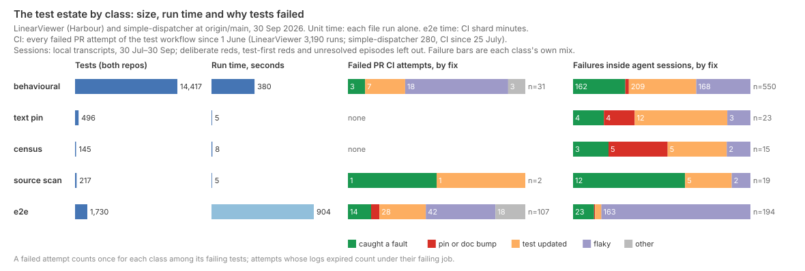
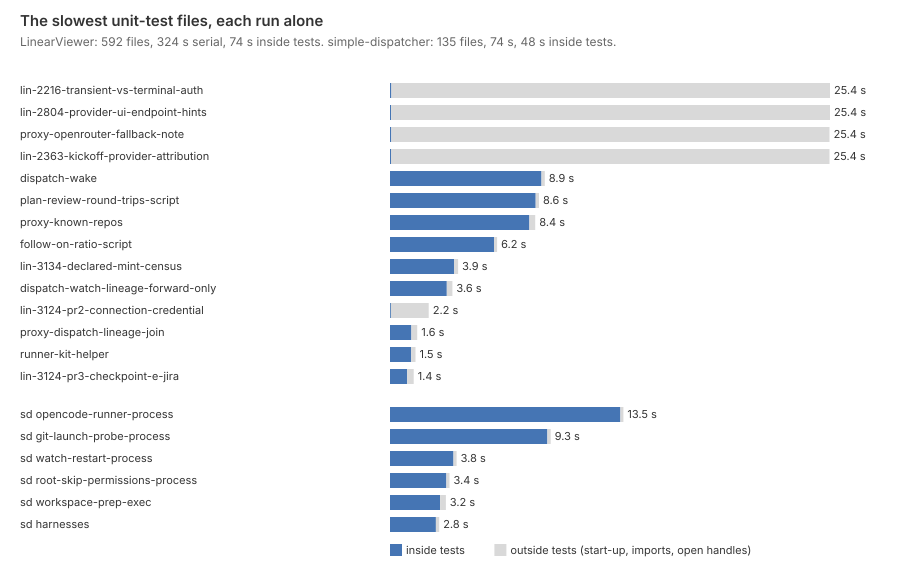
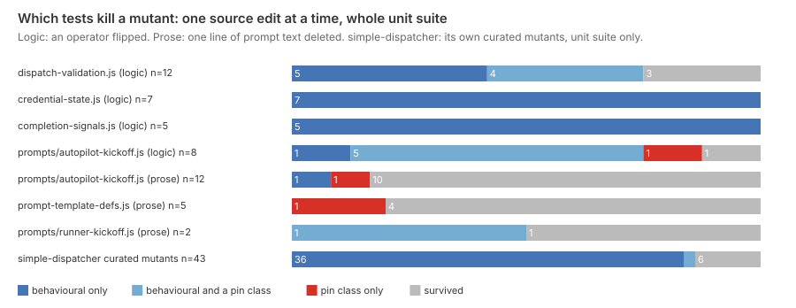

# Which of Harbour's tests earn their keep, and what does the rest cost?

The behavioural tests earn their keep, and so do the browser tests that catch interface
faults. The pins cost less than they look. Behavioural tests are 93% of Harbour's unit tests and nearly all of
simple-dispatcher's. They make almost every catch that survives: the production fixes inside agent
sessions, and most of the sampled mutants they alone kill. Harbour's 851 pin-class tests
(text pins, census pins and source scans) take about 5% of the unit suite's serial run time.
They have turned CI red on a pull request only twice. Their cost shows up as
friction instead. Inside sessions, a census or text pin was about as likely to demand a bump
as to catch a fault. Pin edits are 2.8% of changed test lines, rising to 4.9% in September.
Eighteen tickets since June exist mainly to bump a count or a pin, and ten of those came in
September. Two costs are larger than the pins. The first is flakiness: browser specs that
fail and then pass on the same commit are the largest single cause of red CI. The second is
per-file overhead. Most of the unit suite's time is spent outside any test, and a third of
Harbour's serial time is four files idling for 25 seconds each after their tests have
finished. simple-dispatcher has almost no pins (seven tests). Its costs are process-spawning
tests, one flaky reaper test, and one test that fails on the fleet's own machine every time.

## Findings

**The estate is overwhelmingly behavioural, and pins are a small, separate slice.** Every
`it()`/`test()` block at HEAD was classified by what it asserts and what it reads. A blind
hand-coding of 85 of them agreed with the classifier on 22 of 25 pin-class calls and 35 of 36
behavioural ones (Method).

| Class | LinearViewer (Harbour) | lines | serial run time | simple-dispatcher |
|---|--:|--:|--:|--:|
| behavioural | 11,600 | 153,241 | 306 s | 2,817 |
| text pin (a prompt or doc contains a string) | 490 | 5,097 | 5 s | 6 |
| census (a total or inventory) | 145 | 2,307 | 8 s | 0 |
| source scan (greps production source) | 216 | 3,390 | 5 s | 1 |
| e2e / full-system | 1,646 | 29,371 | ~15 CI job-minutes | 84 (not in CI) |

The 14,097 Harbour test cases match `growth-atlas.md`'s count. That paper counts 6,234
"text pins" by assertion shape: every `.includes(` or `assert.match(` call. Most of those
are behavioural checks on rendered HTML, messages and return values. Only about 1,400
assertions in 490 tests pin the wording of a prompt or a doc. That is close to the 493
`steady-base.md` counted in the prompt test files.

**Run time is start-up and one open handle, not assertions.** Harbour's unit suite takes 45 s
in parallel. Run one file at a time, it takes 324 s, and only 74 s (23%) of that is spent
inside a test. The median file takes 0.28 s, most of it start-up and imports. Four
behavioural files finish their tests in under 0.1 s, then wait about 25.4 s each before the
process exits. Those four files are 101 s, or 31% of the serial total. With
`--test-force-exit`, `lin-2363-kickoff-provider-attribution.test.js` takes 0.54 s instead of
25.4 s, so an open handle is holding the process. The 25-second wait matches the default
delay of `armKeepalive` (`lib/http-keepalive.js:21`). All four files were added between
3 August and 12 September. In simple-dispatcher, 65% of the 74 s serial time is inside
tests, and the top five files carry 45% of it: four `*-process` tests that spawn child
processes, and `workspace-prep-exec`. The pin classes take 18 s of
Harbour's 324.

**In CI, the browser suite fails and the unit suite rarely does.** Every failed attempt of each
repo's test workflow since 1 June was classified by what made its branch green next:

- **LinearViewer:** 181 failed attempts in 3,190 runs. 144 were in the E2E shards and 42 in
  the unit job.
- **On pull requests (133 attempts):** 54 flaky (the same commit passed on re-run), 34
  fixed by changing the test, 19 fixed in product code, 5 pin bumps, 10 never went green.
- **Failing tests by class:** among PR attempts with named failing tests, e2e specs carry
  107, behavioural unit tests 31, source scans 2, text pins and census tests none.
- **What the e2e specs catch:** 14 attempts fixed in interface code, among them navigation CSS,
  `public/next-run.js` and `public/observation.js`. They also cause 42 of the flakes, led by
  `session-page`, `observation-rulings`, `dispatch-presets` and the reduced-motion livebar in
  `observation.spec`.
- **Unit-suite reds in CI:** these are mostly flakes (`tree.test.js` 6 times,
  `prompt-trace-store.test.js` 4).
- **simple-dispatcher:** CI started on 25 July, and 8 attempts in 280 runs failed. Seven of
  the eight were one test, `completion-unconfirmed-reaper-handoff-runtime.test.js`, and it
  was flaky in practice.
- **Accuracy of the "fault" label:** the mechanical label was right 10 times in 11 on pull
  requests, but only 2 in 9 on pushes to main. There the next green commit is just the next
  merge, so push rows are left out of the headline.

**Inside agent sessions, where the unit tests actually fail, a catch is the rare outcome, and
pins bump about as often as they catch.** Transcripts from 1,219 sessions (30 July to 30
September) contain 11,088 test runs and 6,169 failure episodes. Most reds are intended:

- 3,267 are deliberate: a mutation probe, a stashed fix or a baseline run.
- 1,386 are tests written first, before the code that makes them pass.

Of what remains, 225 episodes ended with a production edit before the next green run, which
is the most a test could have caught. By class, per thousand tests:

| Class (both repos) | production fix | pin or doc bump | test rewritten | flaky |
|---|--:|--:|--:|--:|
| behavioural (14,417) | 11 | 0.8 | 14 | 12 |
| text pin (496) | 8 | 8 | 24 | 6 |
| census (145) | 21 | 34 | 34 | 14 |
| source scan (217) | 55 | 0 | 23 | 9 |
| e2e (1,730) | 13 | 0.6 | 4 | 94 |

A census test demanded a bump more often than it preceded a fix. A text pin did each equally
often, and was rewritten three times as often as either. Source scans have the highest
fix rate per test. But a scan fails when source stops matching a pattern, so the "fix" may be
editing source back into the shape the scan expects. `cheap-implementer.md` found the same
of that repo's witnesses: they proved the tests pinned the code. One simple-dispatcher test,
`build-launch-applescript.test.js`, failed in 109 sessions and was left red almost every
time. It needs `osacompile` to resolve iTerm's terms, and it fails on the fleet machine
itself. `opencode-runner.test.js` fails whenever the dispatched session's own
`HARBOUR_LOCAL_BASE` is set, and passes without it.

**Mutants: behavioural tests kill the logic; text pins catch prompt branches but seldom a
deleted line of prompt prose.** Mutants were sampled as small source edits, one at a time, each run against the
whole unit suite:

- **Harbour logic mutants:** 32 operator flips across four modules. 28 were killed: 27 by
  behavioural tests (18 by behavioural tests alone), 10 by a text pin and 1 by a census test.
  In the prompt builder, text pins killed 6 of 8 branch mutants (a flag that selects which
  sentence renders), and one of those was caught only by a text pin.
- **Surviving logic mutants:** three `>` → `>=` flips on the length limits in
  `dispatch-validation.js`, and one `&&` → `||` in the kickoff's goal line.
- **Harbour prose mutants:** 19 deletions of one line of prompt text, across the autopilot
  kickoff, the runner kickoff and the template definitions. 15 survived the whole suite. Of
  the 4 killed, text pins caught three, two of them alone, and a behavioural test caught the
  other.
- **simple-dispatcher curated mutants:** simple-dispatcher keeps a curated mutation gate of
  47 mutants, each paired with a full-system killer. Its unit suite alone kills 37 of the 43
  that still apply. Behavioural tests kill all 37, and a text pin also kills one. Two mutants no longer apply: the
  code they target has changed shape (`reapers.js:689`, `dispatcher.js:180`), so the gate
  would now report two errors. Neither the gate nor the system suite runs in CI; that runs
  only `npm test`.

**Pin friction is small in volume but rising, and it is concentrated in Harbour's census pins.**

- **Commits:** since June, 5 of Harbour's 1,771 non-merge commits consist only of
  literal-only test edits. 181 commits (14% of those touching tests) edit at least one
  assertion literal.
- **Pull requests:** in 1,280 Harbour PRs, pin edits are 2.8% of changed test lines. New
  tests are 83%. The share rose from 1.0% in June to 4.9% in September, and PRs touching a
  pin file went from 15 a month to 130.
- **PRs made mostly of pin edits:** pin edits are more than half the test change in 32 PRs
  (11 on a strict rule). Ten PRs change only pins while touching at most ten production lines.
- **Tickets:** of 2,835 tickets since LIN-304, 18 exist mainly to bump a count or repair a
  pin. Four of them are pure count bumps: LIN-2985, LIN-2988, LIN-2989 and LIN-3133, the
  DI-parameter census `fleet-complexity-read.md` described. Ten of the 18 came in September.
  Another 61 tickets did real work but also had to move a pin.
- **simple-dispatcher:** one PR of 246 is pin-dominated, and no ticket.

**Candidates, described only.**

- **Evidence says these rarely or never catch a real fault, while costing friction or time:**
  - Harbour's census tests: no CI failure, and more bumps than fixes in sessions. They are
    the main subject of the bump tickets.
  - Harbour's text pins on prompt prose: no CI failure, as many bumps as fixes, rewritten
    most often of any class. They caught 3 of 19 deleted lines in the prose sample.
  - The e2e specs that fail mostly as flakes: `session-page`, `observation-rulings`,
    `dispatch-presets`, `task-chat`, `ship-biscuit` and the livebar case in `observation`.
  - The unit flakes: `tree.test.js`, `prompt-trace-store.test.js`, and simple-dispatcher's
    reaper-handoff runtime test.
  - Two environment-bound simple-dispatcher tests: AppleScript compile and `opencode-runner`'s
    fetch list.
  - The four files that idle for 25 s. Their tests are behavioural and may well earn their
    keep; the cost is the open handle.
- **Evidence says these clearly earn their keep:**
  - Behavioural unit tests on logic modules. They make most local production fixes and are
    the only killers of most logic mutants: `credential-state`, `completion-signals`,
    `dispatch-validation`, and simple-dispatcher's reapers, claim and feedback paths.
  - The e2e specs that caught interface faults in CI: `header-nav`, `next-run`, `ship`,
    `observation-rulings` and `dispatch-page`.
  - Text pins on prompt *branches*. They are the only killer of one kickoff-builder mutant,
    and a co-killer of five more.
  - Source scans on wiring, which have the highest fix rate per test, read with the caution
    above.

## Method

- **Classes.** `scripts/survey-tests-shape.mjs` splits each test file at `it(`/`test(`/`t.test(`
  and classifies each body. The first matching class wins:
  1. e2e: `tests/e2e`, `tests/visual`, or simple-dispatcher's `test/system`.
  2. census: a file named census, inventory or roster, or a number literal asserted on the
     size of an exported inventory or a read doc.
  3. source scan: the body reads production source as text.
  4. text pin: all but at most one assertion are text matches, and their subject is a
     prompt, instruction or doc.
  5. behavioural: anything else with an assertion.

  Tests with no `assert` call (101 in Harbour, 9 in simple-dispatcher) are folded into
  behavioural, because the hand-coding found 11 of 12 of them behavioural.
- **Validation.** `--sample 70 --seed 3151` drew a stratified sample of 85 tests, weighted
  three to one towards behavioural. It was shuffled and hand-coded blind by a separate
  subagent (`test-estate-validation.json`); `--validate` prints the confusion. Raw agreement
  was 64 of 85. By class:
  - behavioural 35 of 36;
  - e2e 12 of 12;
  - source scan 6 of 7;
  - text pin 8 of 12, with 2 of the misses really census;
  - census 2 of 6, with 3 really source scans.

  The pin family as a whole is right 22 times in 25, but the lines between its three
  members are rough.
- **Timing.** `survey-tests-timing.mjs` runs each unit-test file alone under `node --test`
  with a JSON-lines reporter (`survey-tests-reporter.mjs`), on the operator's machine at
  origin/main. A file's time outside its named tests is spread over its tests by line count.
  e2e minutes are the latest week's four E2E shard jobs, from `survey-growth-ci.mjs`
  (container start-up included).
- **CI.** `survey-tests-ci-runs.mjs` snapshots every run of `test.yml` and `ci.yml` since
  1 June, paged by half-month. `-ci-fetch.mjs` pulls jobs and failed-test lines for every
  failed attempt, plus the first attempt of every green re-run. `-ci-classify.mjs` finds the
  next green run on the branch and diffs the branch's own commits between the two, then
  classifies the change:
  - flaky: the same sha passed later;
  - fault: product code changed;
  - pin bump: only literal-only edits to the failing test;
  - doc/prompt: only doc or prompt text changed;
  - test updated: any other test change;
  - unresolved: the branch never went green.

  Logs had expired for 57 of the 181 Harbour attempts; those count under their failing job.
- **Sessions.** `survey-tests-local.mjs` reads every dispatched-session transcript still on
  the machine. It finds test runs and their failing tests, then classifies each (session,
  test) episode by what the session edited before the same test next passed. Deliberate reds
  and test-first reds are detected by command and text cues.
- **Mutants.** `survey-tests-mutate.mjs` applies one edit at a time in a throwaway worktree
  and records every test that fails beyond the unmutated baseline. It draws two kinds of
  edit:
  - operator flips, evenly spaced over `dispatch-validation`, `credential-state`,
    `completion-signals` and the autopilot kickoff;
  - one deleted line of template prose, with `--prose-only` drawing only these.

  For simple-dispatcher it runs the curated `MUTANTS` from `run-mutations.js` against the
  unit suite only.
- **Friction.** `survey-tests-friction-git.mjs` pairs removed and added lines per diff hunk
  and calls a pair a literal edit when the two lines match after normalising strings,
  numbers and regexes. `-friction-proxy.mjs` pulled the ticket list at 7.5 s a call, 39 calls
  in all. `-friction-tickets.mjs` holds the hand classification of 119 candidate tickets.
- **Join.** `survey-tests-analyse.mjs` joins everything by (repo, file, test name) and prints
  every number above. `survey-tests-figures.mjs` draws the three figures. Snapshots live in
  the git-ignored `data/survey-tests/`.

## Limits

- **The classifier is a heuristic.** Census and source scans blur into each other, and about
  3% of "behavioural" may be unrecognised pins. So the pin counts are a floor, but the pin
  family's total is sound.
- **Timing comes from one machine at one moment, and not an idle one:** sibling sessions were
  running. Absolute seconds are high, but the shares, and the four 25-second files, reproduce.
- **CI sees only what was pushed.** Agents run the unit suite before pushing, so CI
  under-states unit-test catches and over-states the e2e share. The session data exists to
  correct that.
- **The "fault" label is generous.** In sessions, any production edit before the next green
  counts. On main, the next merge counts. Both over-state catches, and the session figures
  most for source scans.
- **The pin-bump labels are strict.** Any structural edit makes a failure a "test rewrite",
  so bumps are a floor in every source, and the bump-to-catch ratio for pins is
  understated.
- **Deliberate-red detection is keyword-based.** A probe it misses becomes a false "fix" or
  "unknown".
- **Sessions are retained for about 30 days,** so the session data covers August and
  September only, when pins were most numerous.
- **Squash merges hide branch commits** for about 60% of Harbour PRs. The per-commit pin
  count is therefore a floor; the per-PR diffs are not affected.
- **The mutant sample is small** (32 logic and 19 prose in Harbour, 43 curated in
  simple-dispatcher) and drawn from modules chosen for testability. It says which classes *can* kill a mutant, not the estate's
  mutation score.
- **"Rarely catches" is not "never matters."** A census test that has never failed may still
  be the only thing guarding an invariant nobody has broken yet. This paper cannot see that
  value.

## Next

- **Which of the 851 Harbour pin-class tests have never failed for any reason?** Joining each
  test's age to every failure record here would separate pins that bump often from pins that
  sit silent. That is the population a loosening would actually touch.
- **When did the four 25-second files start holding the suite open, and what holds them?**
  They arrived between 3 August and 12 September. One run per month-end of
  `survey-tests-timing.mjs` would say how much of `growth-atlas.md`'s eightfold slowdown they
  explain.
- **Are the flaky e2e specs flaky in the product or in the harness?** Six specs carry most of
  the flakes. Reading their retry traces would say whether a real race is hiding among them.
- **Does a deliberate red find anything?** Half of all in-session failures are probes the
  house rule asks for. Sampling them for a probe that surprised its author would show
  whether the rule buys catches or only certainty.
