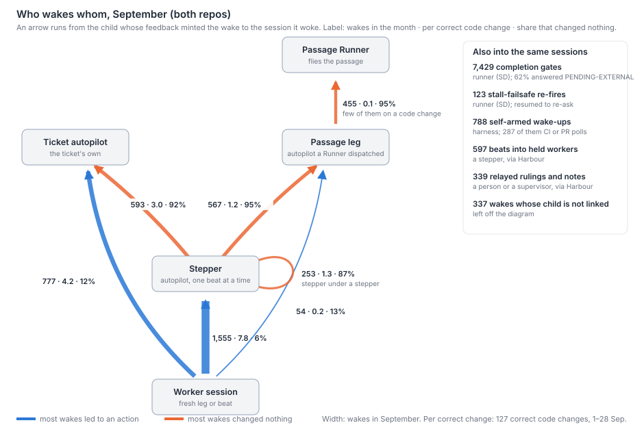
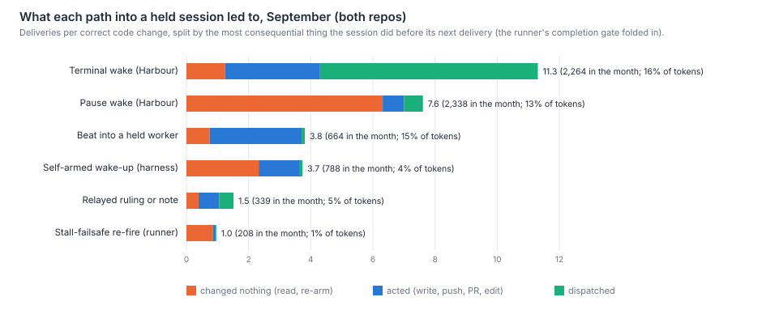

# What are all the paths that wake a Harbour supervisor, and what does each wake lead to?

Harbour creates every wake at one point: `addFeedback`, when a child's feedback begins with
a wake marker. The runner, simple-dispatcher, then delivers each wake in one of two ways. It
unblocks a Stop hook that is holding the session open, or it resumes a closed session with a
handshake. The runner also adds its own turns to the same sessions: the completion gate at a
Stop, and stall re-fires. September's traffic splits cleanly by what woke the session.
Terminal wakes, where a child finished, led to an action 94% of the time. Pause wakes, where a
child paused or said it was still waiting, changed nothing 80% of the time. Most pause wakes are
relays: a supervisor that has just re-armed posts `[pending] Not done — waiting on …`, and
that post wakes its own parent. 1,749 wakes (38% of September's 4,602) were such relays, and
94% of them changed nothing. That is why one event climbs the whole stack. A worker event
under a stepper sends 1.6 wakes up the chain under a ticket autopilot, and 3.0 inside a
passage, where it reaches the Runner 0.8 times. In September, both repos took 18.9 Harbour
wakes per correct code change, and 5.8 of those changed nothing. Wakes took 29% of the
weighted tokens in dispatched sessions, and wakes that changed nothing took 11%. Of the 25
supervisor failures on record, 18 are on a wake path. Fourteen of the 18 lost a wake, and
nine of those 14 were lost on the runner's side (the hold, the resume, the gate, the stall
failsafe or a session's own poll), not where Harbour creates the wake.



## Findings

**There are seven Harbour paths into a held session, and nine runner paths that deliver them
or add turns of their own.** Line numbers are at `e308b871` (LinearViewer, "LV") and
`3366748` (simple-dispatcher, "SD").

| # | Path | Code | Trigger | Who is woken | What it carries |
|---|---|---|---|---|---|
| H1 | Terminal wake | LV `lib/dispatch-store.js:2162` (`addFeedback`), `:2077` (`_mintWake`); `lib/dispatch-wake.js:151`; markers `lib/dispatch-terminal.js:53` | A child's new feedback begins `[done]`, `[complete]`, `[failed]` or `[aborted]`, and its edge names a parent | The dispatching parent: stepper, ticket autopilot, leg, Runner or coordinator | "A child session reached a terminal outcome — resume your cross-check." plus `Child:` and `Outcome:` (the child's line verbatim). Once per producing item (`dispatch-store.js:2320`, LIN-1357) |
| H2 | Blocked wake | same seam, key `id#blocked` (`dispatch-store.js:2300`) | `[blocked]` | as H1 | as H1 |
| H3 | Pause wake | `dispatch-wake.js:194`; `dispatch-store.js:2457-2461` | `[pending]` on an edge declared `subscription: 'everything'` | as H1 | "A child session reached a pause boundary — paused (pending), not done." No guard: every post mints a wake |
| H4 | Aborted child | SD `dispatcher.js:560-584` (LIN-1471) posts `[aborted]` on the child's row, which then goes through H1; the abort row itself is excluded (`dispatch-wake.js:164`, LIN-2078) | An abort of a live child | as H1 | as H1 |
| H5 | Grant refusal | `dispatch-store.js:2416-2419` | A structural grant refusal during H1–H3 | as H1 | A prefix on H1–H3, not a separate wake |
| H6 | Beats and follow-ups from a supervisor | `routes/proxy-dispatch.js:220`, recommend-and-dispatch (`:811`); the kickoff's liveness nudge (`lib/prompts/autopilot-kickoff.js:369-370`) | A supervisor POSTs with `followUpTo` | A held worker, or a child | `beat N/M: …`, or a corrective beat. The duplicate guard skips follow-ups (`lib/dispatch-factory.js:272`) |
| H7 | Relays from a person | reply box, ruling reply, Task Chat and Flight Companion, all ending in a follow-up dispatch (`routes/dispatch.js:235`, `public/observation.js:3332`, `lib/chat-tools.js:2032`, `routes/flight-companion.js:883`) | A person answers | The session that owns the loop | The person's text verbatim |
| S1 | Warm signal | SD `followup.js:86`; `dispatcher.js:768-777`; `hook.js:1027-1051` | A follow-up for a session parked in its hold (`AWAITING_FOLLOWUP`, up to 60 min, `config.js:1088`) | The held session, in-process | "Your task (dispatch item X) is ready. Fetch it now …" (`hook.js:1062`) |
| S2 | Cold resume | `followup.js:95`; `dispatcher.js:860-1020` | A follow-up for a session that is closed or parked | A `--resume` relaunch | First "This session is being resumed to handle a follow-up … reply 'ready'" (`dispatcher.js:50`), then S1's line. Since LIN-1219 a DONE session is never held, so a follow-up after DONE always comes this way |
| S3 | Busy target | `followup.js:61-72`, `:107-111`; `dispatcher.js:662-673` | A follow-up for a running session | Nobody yet: the item is left unclaimed if it carries `queueIfBusy` (every wake does, `dispatch-wake.js:199`), otherwise rejected | — |
| S4 | Completion gate | `hook.js:418`, `:1278` | The first Stop in a working phase, with no background wait outstanding | The same session | "Before this task is marked complete, confirm its true state." A `PENDING-EXTERNAL:` answer parks the session (`:1427`) and posts `[pending] Not done — <detail>. Awaiting completion...` (`:1441`). **That post is H3's trigger** |
| S5 | Zero-tool challenge | `hook.js:467`, `:1324` | DONE with no tool calls | The same session | "You declared DONE, but no tool calls were recorded …" |
| S6 | Stall failsafe | seven selectors in `reapers.js:1575-2504`; silence clock `config.js:50` (60 min) | A session silent for 60 minutes in a non-terminal phase | A `--resume` relaunch | "This session is being resumed by a failsafe …" (`reapers.js:1226`), then "This session went silent while its completion was still unconfirmed …" (`:1207`). Capped at three PENDING-EXTERNAL re-fires (`config.js:112`, `reapers.js:877`) |
| S7 | Hold expiry | `hook.js:1007-1018`, `:1452` (LIN-1260) | A hold lapses with no follow-up | Nobody: the session is parked `AWAITING_EXTERNAL`, and its next follow-up comes by S2 | — |
| S8 | The session's own wake-ups | Claude Code's background command, Monitor and scheduled wake-up; the hook lets the Stop through while one is outstanding (`hook.js:1254`) | The session armed a wait itself | The same session | A task notification. **This is the only path CI and PR results take**: neither repo has a CI or PR webhook or a poller that wakes anyone |
| S9 | opencode holds | `reapers.js:1882-1905`; `opencode-runner.js:642-675` | as S1, S6 for opencode sessions | A native relaunch | The follow-up prompt, or the re-fire text |

Some things are not wakes. The heartbeat only reports (`heartbeat.js:335-441`), and so do the
fast-fail watchdog, abort, halt and cleanup. Scheduled check-ins exist only as periodicals,
and a periodical starts a fresh session, never a held one. The rescue sweep that would
re-deliver lost wakes (LIN-1717) is referenced but not built (`dispatch-wake.js:161`).

Two dated changes shape the traffic. LIN-1357 (LV `170fa88f`, 15 July) moved the once-only
guard from the edge to the producing item, so every beat now sends a terminal wake: 1,221
worker→stepper terminal wakes in September. LIN-1219 (SD `ac55263`, 10 July) stopped holding
a session after DONE, so any later follow-up to a finished session takes S2, with its
handshake. The runner's log records 5,098 warm signals, 684 cold resumes and 711 rejections
in September.

**Terminal wakes do work; pause wakes mostly do not.** Every path into a dispatched session,
1–28 September. The first four columns count the path's own deliveries. The outcome columns
give the most consequential thing the session did before its next delivery, counting the
completion gate its Stop triggered.

| Path | Inventory | Deliveries | Per correct code change (LV / SD) | Changed nothing | Acted | Dispatched | Share of tokens |
|---|---|--:|--:|--:|--:|--:|--:|
| Terminal wake | H1, H2, H4 via S1/S2 | 2,264 | 11.3 (11.1 / 14.8) | 6% | 32% | 62% | 16% |
| Pause wake | H3 via S1/S2 | 2,338 | 7.6 (7.6 / 6.9) | 80% | 11% | 8% | 13% |
| Beat or follow-up into a held worker | H6 | 664 | 3.8 (4.0 / 2.6) | 18% | 79% | 3% | 15% |
| The session's own wake-ups | S8 | 788 | 3.7 (4.2 / 2.0) | 58% | 38% | 3% | 4% |
| Relayed ruling or note | H7, H6 | 339 | 1.5 (1.4 / 2.3) | 21% | 49% | 31% | 5% |
| Stall failsafe (123 re-fires, 85 re-asks) | S6 | 208 | 1.0 (1.0 / 1.0) | 81% | 17% | 2% | 1% |



The completion gate (S4) is not a row of its own, because it follows other deliveries rather
than starting anything. It asked 7,429 times, and 62% of the answers were `PENDING-EXTERNAL`.
The Runner answered that way 619 times out of 623, stepper and ticket autopilots 86–87% of the
time, and workers mostly answered DONE. The gate is 9% of all tokens, and it is a third (34%)
of what a wake that changed nothing costs. Such a wake typically costs 146k weighted units:
fetch the item, say "still waiting", answer the gate.

In total, Harbour wakes ran at 18.9 per correct code change (LV 18.7, SD 21.6), and 5.8 of those
changed nothing. They took 29% of September's weighted tokens in dispatched Claude sessions.
Wakes that changed nothing took 11%.

**Who wakes whom.** Harbour wakes, 1–28 September, by the layer of the child that caused
the wake and the layer it woke:

| Edge (child → woken) | Wakes | Terminal / pause | Per correct code change (LV / SD) | Changed nothing | Were relays of the child's own wake |
|---|--:|--:|--:|--:|--:|
| worker → stepper | 1,555 | 1,221 / 334 | 7.8 (8.0 / 5.7) | 3% | 0% |
| worker → ticket autopilot | 777 | 777 / 0 | 4.2 (3.7 / 10.2) | 4% | 0% |
| stepper → ticket autopilot | 593 | 57 / 536 | 3.0 (3.0 / 2.9) | 88% | 91% |
| stepper → leg | 567 | 37 / 530 | 1.2 (1.2 / 0.7) | 93% | 91% |
| leg → Runner | 455 | 3 / 452 | 0.1 (0.1 / 0) | 95% | 97% |
| stepper → stepper | 253 | 28 / 225 | 1.3 (1.3 / 1.5) | 79% | 84% |
| worker → leg | 54 | 43 / 11 | 0.2 (0.2 / 0) | 11% | 0% |
| child not linked | 337 | 93 / 244 | 1.0 | 72% | — |

The Runner's edge is small per correct change because few of its legs fly code changes: 617
wakes reached the two Runners in the month. The edges from workers carry news: a beat or a
worker's session ended, or a worker paused for a decision. The edges from supervisors carry progress. On
those edges, 84–97% of wakes were caused by the child's handling of a wake of its own: the
child was woken, judged or sent a beat, and re-armed. Its re-arm posted `[pending]`, and
that post woke the parent.

**One worker event climbs the whole stack.** Each wake a worker's event caused is followed
up the chain through every wake it in turn caused:

| Where the worker's parent sits | Worker events | Wakes per event | At the stepper | At the ticket autopilot | At the leg | At the Runner | Changed nothing |
|---|--:|--:|--:|--:|--:|--:|--:|
| Ticket autopilot, no stepper | 777 | 1.00 | — | 1.00 | — | — | 4% |
| Stepper under a ticket autopilot | 1,057 | 1.59 | 1.13 | 0.46 | — | — | 34% |
| Stepper inside a passage | 498 | 2.97 | 1.11 | — | 1.08 | 0.78 | 62% |

Inside a passage, 340 of those 498 events reached a third or fourth layer. The stepper figure
is above one because steppers nest.

**Most of what the relays carry is state the code already holds.** A relayed re-arm tells a
parent that the child it dispatched is waiting on the grandchild that child dispatched.
Three records hold that fact before the wake is sent:

- Harbour holds each child's rows and latest wake marker: `listItems(urlKey, { sessionId,
  followUpTo, rootItemId })` (`lib/dispatch-store.js:817`), and `feedbackDigest` keeps `wake:
  {marker, waitingMessage}` for every row (`lib/digest-feedback.js:336`). Its own comment says
  a wake "carries the same text the dashboard would show — no new lookup"
  (`dispatch-wake.js:60-62`).
- The runner records each child's parent at launch (`parentSessionId: item.sessionId`,
  `dispatcher.js:1175`) and knows when a parent has live subscribed children:

  ```js
  const anchors = new Set([session.rootItemId, session.itemMetadata?.itemId].filter(Boolean));
  ...
  if (!isSubscribed(meta)) continue;
  if (!anchors.has(meta.parentSessionId)) continue;
  if (TERMINAL_PHASES.includes(child.phase)) continue;       // terminal child self-clears
  return true;
  ```
  (`reapers.js:1009-1021`). It uses this to keep the stall reaper off the parent, and does not
  pass it to the parent.
- The parent dispatched the child and holds its id.

There are 1,749 of these relays in September: 38% of all wakes and 75% of pause wakes. 94% of
them changed nothing, and they took 10% of all tokens. 211 pause wakes (9%) repeated, digits
aside, the last outcome the same session had heard from the same child; all 211 changed
nothing, and 195 of them went to a Runner. Terminal wakes also carry text Harbour holds,
since `Outcome:` is the child's own last line. But the parent acts on them 94% of the time, so
they carry news to it even though they repeat a record.

**Where two paths wake the same session for one event.** From the code, and counted where the
transcripts can see it:

- **A child's result, pushed and polled.** H1 pushes it. Supervisors' own background tasks and
  monitors (S8) also woke them 72 times. LIN-1323 is the case where such a poll raced the push
  for the same child.
- **A silent session, re-asked twice.** The runner re-fires after 60 minutes (S6, 123 times). The
  kickoff also tells supervisors to send their own liveness nudge after about 30 minutes (H6,
  `autopilot-kickoff.js:369-370`). Only a handful of September's follow-ups are named as such.
- **A re-fire that mints a wake.** A stall re-fire makes a waiting child answer PENDING-EXTERNAL
  again. S4 posts `[pending]` again, and H3 mints a new pause wake, because it has no guard: 27
  in September.
- **Pause, then done.** 97 times a child's pause wake was followed within five minutes by its
  terminal wake into the same session.
- **An abort.** An abort posts on two rows, and before LIN-2078 both minted a wake. The abort row
  is now excluded (`dispatch-wake.js:164`).

**Most failures on record lost a wake, and most of those losses were in delivery, not in
minting.** The 25 are
`what-supervisors-do.md`'s list as corrected by `survey-check-2.md`, placed on the inventory by
hand in `wake-inventory-failures.json`:

| Path | Failures | Tickets | Effect |
|---|--:|---|---|
| H1 terminal wake | 5 | LIN-1059, LIN-1165, LIN-1355, LIN-1357, LIN-1816 | 4 lost, 1 duplicated (a self-loop) |
| H3 pause wake | 1 | LIN-881 | lost (no `everything` edge) |
| H4 aborted child | 1 | LIN-2078 | duplicated |
| S1 warm signal | 1 | LIN-870 | lost (the woken session zombied) |
| S2 cold resume | 1 | LIN-1698 | lost, never re-delivered |
| S4 completion gate | 2 | LIN-1280, LIN-2145 | 1 lost (sentinel swallowed), 1 misdelivered (the gate's turn overwrote the report the wake carried) |
| S6 stall failsafe | 4 | LIN-1451, LIN-1697, LIN-2511, LIN-2517 | lost: a hung child never reaped, or a waiting parent killed |
| S8 the session's own wake-ups | 2 | LIN-1323, LIN-2932 | 1 duplicated (poll against push), 1 lost (a worker held behind its own CI monitor) |
| S9 opencode hold | 1 | LIN-2720 | lost |
| Not a wake path | 7 | LIN-353, LIN-366, LIN-384, LIN-1656, LIN-2974, LIN-2975 (dispatch); LIN-430 (merge) | — |

Of the 18 on wake paths, 14 lost a wake, 3 duplicated one and 1 delivered the wrong content.
Nine of the 14 lost wakes were lost on the runner's side, in S1, S2, S4, S6, S8 and S9; the
other five where Harbour mints them (H1, H3). Nine of the 18 sit where two paths touch the same
session or event: the stall failsafe acting on a session that was waiting to be woken (4), the
completion gate beside the Stop hook's guard or the wake's payload (2), a session's own poll
beside the push (2), and the abort's two rows (1).

## Method

- **Population.** Every main transcript under `~/.claude/projects/*simple-dispatcher-workspaces*`
  modified since 29 August: 2,009 dispatched sessions, both repos' tickets. Figures cover 1–28
  September.
- **Deliveries.** A delivery is any user-role turn that is not a tool result: a launch, a Stop-hook
  injection, a handshake, a task notification, a scheduled wake-up. Each is classed by the
  runner's or harness's fixed text (the S rows above). A dispatch item's kind, and a wake's
  `Child:` and `Outcome:` lines, are read from the session's own fetch of the item. There are
  17,778 deliveries on 1–28 September.
- **Episodes and outcomes.** An episode is a delivery, plus the resume handshake just before it
  and the completion gates after it. Its outcome is the highest of: nothing, arm a wait, read,
  act (a proxy write, push, PR action, file edit or subagent), dispatch (POST `/dispatch`,
  kickoff, recommend-and-dispatch). "Changed nothing" means read or less.
- **Tokens.** Weighted units as `fleet-complexity-read.md`: input 1, output 5, cache read 0.1,
  1-hour cache write 2, 5-minute cache write 1.25, with the mid tier at 0.6. Only shares are
  reported.
- **Edges.** Each wake's child session is found first through the parent link in the child's own
  dispatch item (1,586 wakes). Failing that, it is the session whose gate reply carried the
  wake's PENDING detail, or a DONE on the `Child:` issue, in the 15 minutes before (2,415). A
  beat named as such, or an outcome ending "(opencode)", is a worker with no transcript (264);
  337 stay unlinked. Layers follow `survey-effort-fleet.mjs`, with one change: a leg is an
  autopilot whose linked parent is a Runner. A wake's *cause* is the child's latest episode
  before it; that gives the relay column and the chains.
- **Per correct change.** A wake belongs to its child's ticket (for a Runner wake, the leg's
  ticket), else its own issue line, else the woken session's. The denominator is changes
  (`survey-scorecard.mjs`, same-day snapshot) whose last merge fell on 1–28 September and whose
  first runner dispatch was on or after 30 August, so their whole history is in the
  transcripts. Passage epics LIN-3099 and LIN-2888 are excluded. The code cohort is 185
  changes, 127 of them correct and complete: 108 LV and 22 SD, and a change in both counts in
  both. The all-changes cohort adds docs-only work: 168 correct.
- **Failures.** By hand, in `docs/papers/harbour/wake-inventory-failures.json`. LIN-353, LIN-430,
  LIN-870 and LIN-1451 were re-read over the proxy (four calls); the rest rest on the check's
  reading.
- **Scripts.** `scripts/survey-doubling-runner.mjs --out data/survey-wake/runner.json`, then
  `scripts/survey-wake-extract.mjs`, `scripts/survey-wake-analyse.mjs` and
  `scripts/survey-wake-figures.mjs`. Snapshots go to the git-ignored `data/survey-wake/`. Every
  number above is in `data/survey-wake/analysis.json`, printed by the analyse script.

## Limits

- **The wake-id gap before 13 September (LIN-2121).** In the runner's log, only 23% of follow-ups
  carried their own ticket line before 13 September, against 85% after. This paper does not
  use the log for attribution: it reads the ticket from the child session, and only 2 of 4,602
  wakes go unattributed. *Bias:* where the child is not linked and the item carries no issue,
  the wake falls to the woken session's ticket. For a Runner that is a passage epic, which is
  excluded, so the Runner's per-change figure runs low. A count that takes each wake's ticket
  from its own log line before 13 September (`model-choice.md`'s, as
  `what-doubled-the-dispatches.md` showed) runs low on wakes.
- **30-day retention.** Transcripts start on 29 August. The cohort keeps only tickets first
  dispatched on or after 30 August, which drops the longest-lived tickets, and those are the
  ones with the most wakes. *Bias:* per-change figures are understated. September changes are
  also young, and their verdicts may fall, which would raise the per-change figures further.
- **opencode sessions leave no Claude transcript.** Their own turns, and any wake into an
  opencode supervisor, are invisible. The transcripts see 5,605 of the 5,782 follow-ups the
  runner's log delivered in September (97%). *Bias:* counts are slightly low, most at the worker
  layer.
- **Sampling and linking.** The traffic is a census of the transcripts, not a sample. 7% of
  wakes are unlinked and left off the edges. 52% are linked by matching text, which can pick
  the wrong sibling when two children post the same wait within 15 minutes. *Bias:* edge counts
  are low by up to 7%. The direction of mis-linking is unknown, but it cannot change a wake's
  terminal or pause class or its outcome.
- **"Changed nothing" is read from tool calls.** A supervisor that judged a report and then
  re-armed counts as quiet. One that appended a line to its own `RUN.md` counts as acted, and
  so, occasionally, does a shell command matching the write pattern. `what-supervisors-do.md`
  classed steps by hand and found 31% of supervisor cycles quiet. *Bias:* terminal wakes' 6% is
  a floor, since some "acted" wakes only noted progress. Pause wakes' 80% may be high, since
  some judged without writing.
- **The failures are the filed ones.** Judgement failures are rarely filed against a
  supervisor, and a lost wake that nobody noticed is not filed at all. *Bias:* this overstates
  the share on delivery paths relative to judgement, and understates the total. The placement is
  one reader's.
- **Dispatches are not effort, and deliveries are not dispatches.** A wake re-reads a long
  context, and the gate after it re-reads it again. The token shares weigh this, but only for
  Claude sessions.

## Next

- **Which edges were declared `everything` because a layer wanted progress, and which inherited
  it?** The stepper needs every beat (`autopilot-kickoff.js:94-105`). The coordinator→child
  autopilot edge (`autopilot-operating-manual.md:319`) and the Runner→leg edge
  (`passage-runner-prompt.md:130-131`) carry the same level. Relays on those two edges are
  88–95% quiet. A question for John: were they meant to report progress, or only results?
- **Does a parent ever use a relayed re-arm?** For each of the 1,749 relays, find the parent's
  next episode that acted and check whether it cites anything the relay alone carried.
- **Which path does each layer actually act on when two report the same event?** Compare the
  72 self-armed polls, the 27 re-fire wakes and the 97 pause-then-done pairs with what the
  woken session did next.
- **What do wakes look like inside opencode supervisors?** They are invisible here. The runner's
  opencode logs might show them.

The first goes into `proposals.md`.
