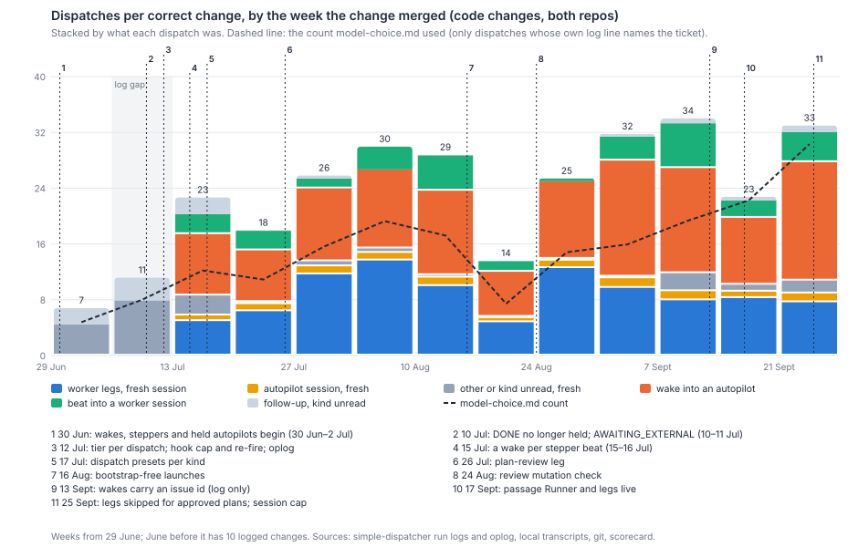
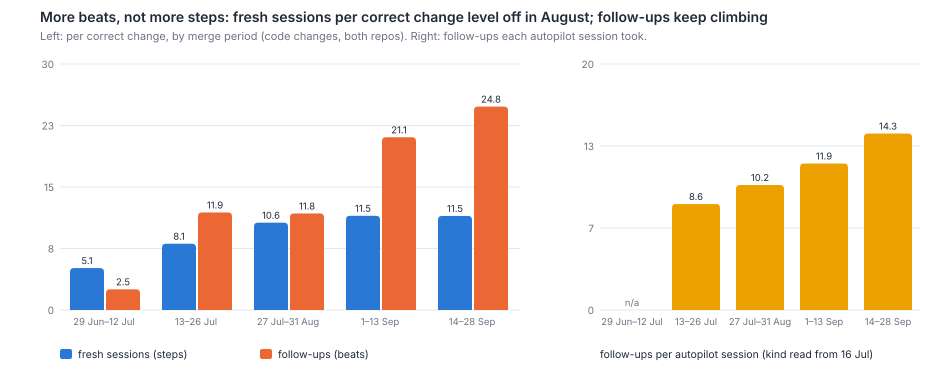
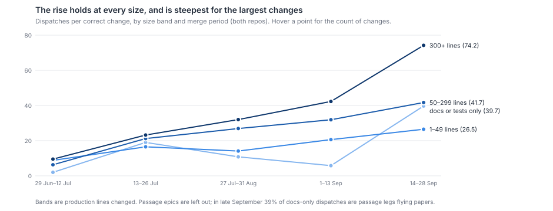
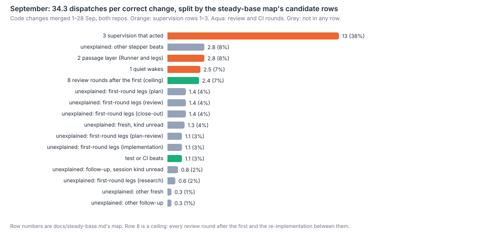

# What doubled dispatches per correct change at 12 July, and what keeps them climbing?

Mostly wakes: follow-ups that wake a held autopilot when one of its children reaches a
boundary. Fresh sessions per correct change rose once, in July, and have been flat since
August. Counting every dispatch rather than only those whose log line names the ticket, a
correct code change took 7.6 dispatches in the fortnight before 12 July and 20.0 in the
fortnight after (both repos). Of that rise, +3.0 is fresh sessions and +9.4 is follow-ups;
8.0 of the later fortnight's follow-ups are wakes. The step came in two stages. Fresh
sessions rose at 10–12 July, when finished sessions stopped being held open (LIN-1219) and
several runner changes landed on the same days; this data cannot separate them. Follow-ups per held session rose from 15–16 July, when
every stepper beat began to wake its parent rather than only the first (LIN-1357). Since then
the climb is almost all wakes: 8.0 per correct change in late July, 9.5 in August, 16.1 in
early September and 28.8 after the passage layer went live on 17 September. Fresh sessions
stayed at 10.6–11.5. Part of the climb that `model-choice.md` reported is an artefact of its
count. Wakes began carrying an issue id in simple-dispatcher's log only on 13 September
(LIN-2121), so from July until then its count left out 40–47% of each ticket's dispatches. For
September, the steady-base map's supervision rows cover 59% of the dispatches: quiet wakes
10%, the passage layer 15%, and wakes and autopilot launches that acted 34%. Review rounds
after the first and test or CI beats are at most 9%. The remaining 32% is the ordinary run of
legs and stepper beats, which no candidate row names.

## Findings

**The count `model-choice.md` used sees only part of each ticket, and the part it sees changed
twice.** That paper counted a dispatch only when its own block in the runner's log names the
ticket (`model-choice.md:170`). The runner prints `Issue:` only when the dispatch item carries an
issue id. Follow-ups began inheriting one from their anchor on the evening of 12 July
(LIN-1292, `2c9eec3d`). Wakes began inheriting one on 13 September (LIN-2121, `8372d336`). The
share of follow-up items with their own `Issue:` line was 9% in early July, 16–24% from mid-July
to mid-September, and 82% from 16 September. Following each follow-up back to its root instead
(this paper's count):

| Merge period (code changes, both repos) | Changes | Correct | model-choice.md count | All dispatches | Fresh sessions | Follow-ups |
|---|--:|--:|--:|--:|--:|--:|
| 29 Jun–12 Jul | 80 | 63 | 5.4 | 7.6 | 5.1 | 2.5 |
| 13–26 Jul | 118 | 84 | 11.5 | 20.0 | 8.1 | 11.9 |
| 27 Jul–31 Aug | 251 | 165 | 13.3 | 22.4 | 10.6 | 11.8 |
| 1–13 Sep | 125 | 74 | 17.2 | 32.6 | 11.5 | 21.1 |
| 14–28 Sep | 85 | 66 | 47.0 | 47.1 | 11.5 | 35.7 |

All figures are per correct, complete change. The first column of figures reproduces
`model-choice.md`'s 5.3 → 10.4 (frontier) and 7.1 → 12.9 (mid) at the step
(`model-choice.md:144`). By the full count, the step was 2.6-fold, not two-fold, and from July to
early September the climb was steeper than that paper's weeks show. In the last fortnight the two counts agree,
because wakes now name their ticket. So some of the model-choice count's rise from 17 to 47
is the log catching up, and some is the real rise.

**At the step, the new dispatches were mostly follow-ups, and they came in two stages.** Only
tickets whose whole runner history falls inside one logged window are counted here. That keeps
out the thin June logs and the 6–11 July gap:

| Cohort (first dispatch and last merge inside the window) | Correct | Per correct change | Fresh | Follow-ups | Median per ticket |
|---|--:|--:|--:|--:|--:|
| 1–5 Jul | 51 | 6.8 | 4.5 | 2.4 | 4 |
| 12–15 Jul | 18 | 12.9 | 7.9 | 5.0 | 8 |
| 16–26 Jul | 73 | 20.2 | 7.8 | 12.4 | 13 |

Every ticket in the later cohorts lived five days or fewer, so the short first window is
not what makes the first cohort cheaper. Among all fresh sessions, the share later held open for
follow-ups was 19% in 1–5 July and 20% in 12–15 July, then 33% in 16–26 July. Each held session
took 4.8, then 4.7, then 7.4 follow-ups. So follow-ups per held session did not change on
12 July itself. They changed from 15–16 July. Wakes and held autopilots were not new then: both
began on 30 June–2 July (LIN-826 `5fc2bdd7`, LIN-886 `f261380`, LIN-906), before the first
cohort.

**What lines up with each stage, and what is only coincidence.** Dates are first-parent merges
on `origin/main` (`scripts/survey-doubling-git.mjs`).

| Date | Repo | Change | What it did to the count |
|---|---|---|---|
| 30 Jun–2 Jul | both | Wakes into subscribed parents; held-and-woken autopilots; steppers; hold on by default (LIN-826, LIN-886, LIN-791, LIN-906) | Present in both cohorts, so they cannot explain the step. They are the machinery the later rise runs on |
| 10 Jul | SD, LV | A DONE session is no longer held: its window closes (LIN-1219, LIN-1100, LIN-1206) | Lines up with fresh sessions rising from 4.5 to 7.9. The mechanism is plausible, since work that once went warm into a finished session now needs a session of its own, but it is not verified: kinds before 16 July cannot be read |
| 11 Jul | SD | AWAITING_EXTERNAL: follow-ups to a session waiting on another party land instead of being rejected (LIN-1260) | Lines up with follow-ups rising 2.4 → 5.0. PENDING-EXTERNAL pauses per correct change later track the wakes (below) |
| 12 Jul | SD | Sessions run at the dispatch's tier (LIN-1285); Stop-hook cap 9 → 1000 and a re-fire for silent sessions (LIN-1266, LIN-1280); the oplog starts | The tier switch is coincidence for this question. `model-choice.md` found both tiers doubled, and the 12–15 July cohort's held sessions behave like 1–5 July's. Stall re-fires stay near one per correct change throughout |
| 12 Jul | LV | Follow-ups inherit the anchor's issue id (LIN-1292) | Log only: the step in the model-choice count |
| 15–16 Jul | LV | A wake for every stepper beat, not only the first (LIN-1357, LIN-1343) | Lines up with the second stage: held share 20% → 33%, follow-ups per held session 4.7 → 7.4, follow-ups 5.0 → 12.4 per correct change |
| 17 Jul | LV | Dispatch presets per kind (LIN-1390) | Same fortnight. It sets models, not legs; no count mechanism found |
| 26 Jul | LV | Plan-review leg (LIN-1602) | Arrives as a new component: plan-review 0 → 1.1 fresh sessions per correct change in August |
| 13 Sep | LV | Wakes inherit the issue id (LIN-2121) | Log only: the model-choice count jumps to meet the full count |
| 13–17 Sep | LV | Passage Runner and legs live; single-anchor legs run as steppers (LIN-2872) | Lines up with wakes 16.1 → 28.8 per correct change |

**Which components stepped, which ramped, and which arrived later.** In the stacked series,
wakes stepped in mid-July, at about 8 per correct change. They held near 10 through August,
ramped to 16 in early September, and stepped again, to 29, with the passage layer. Fresh worker
legs ramped through late July and early August: research, plan, plan-review, implementation,
review and close-out together went from 5.8 to 9.3. They have since stayed between 8.1 and 9.3.
Within them, review sessions held at 1.8–2.5, which matches the rise in review rounds from
0.86 in June to 1.82 in July (`survey-check-3.md:248-249`). Plan-review arrived on 26 July and
has run at 1.0–1.2 since. Autopilot launches ran at 0.9 per correct change until September and
1.3–1.4 after. Beats into worker sessions ran at 2–3, then 4.5–4.8 in September. Of the
595 such beats a transcript read (29 August on), 544 (91%) are stepper beats ("beat N/M"). Before 16 July no kind can be read, because the bootstrap header that names it
did not exist yet.

**Tickets did not need more steps after August. Each step was cut into more beats, and more
supervisors were woken by each beat.** Fresh sessions per correct change went 8.1, 10.6,
11.5 and 11.5 by period, and the per-ticket median went 5, 7, 6, 8. Follow-ups went 11.9, 11.8,
21.1 and 35.7, with a median of 6, 3, 9 and 17. That is `where-the-effort-goes.md`'s finding
(`:25`, `:135`), now split by kind. The follow-ups each autopilot session took went 8.6, 10.2, 11.9
and 22.8. Worker phases took few: after July a plan session took 0.4–0.9 beats, an
implementation session 0.4–1.2, and review and close-out under 0.3. The number of wakes per
worker event (a fresh worker session or a beat) is the clearest single measure:

| Period | Wakes per worker event | Wakes into a passage leg or Runner | Wakes into a stepper | Quiet share of wakes read |
|---|--:|--:|--:|--:|
| 13–26 Jul | 0.93 | – | – | not readable |
| 27 Jul–31 Aug | 0.83 | – | – | not readable |
| 1–13 Sep | 1.19 | 0 | 672 of 1,191 | 22% |
| 14–28 Sep | 2.24 | 826 of 1,900 | 448 | 40% |

Every layer above a worker wakes once per boundary it is subscribed to. In September a beat
can wake a stepper, the stepper wakes the ticket's autopilot or a passage leg, and the leg
wakes the Runner. So the passage layer doubled the wakes each unit of work sends up.

**Re-beats inside a dispatch follow the wakes, not the gates.** These are Stop-hook turns that
are not dispatch items, counted per correct change from the oplog:

| Period | Stop-hook turns | "Not done yet" verdicts | PENDING-EXTERNAL pauses | Stall re-fires |
|---|--:|--:|--:|--:|
| 13–26 Jul | 56 | 5.1 | 8.4 | 1.2 |
| 27 Jul–31 Aug | 60 | 4.0 | 9.4 | 0.6 |
| 1–13 Sep | 78 | 2.7 | 14.5 | 0.8 |
| 14–28 Sep | 126 | 4.1 | 28.7 | 1.1 |

PENDING-EXTERNAL pauses track the wakes almost one for one: a woken supervisor that has
nothing to do says it is still waiting and parks again. The completion gate ("not done yet")
and the stall machinery are flat or falling. Compaction is negligible: 15 compaction
markers in the 2,012 transcripts kept since 29 August.

**Holding size fixed, the rise holds at every production-size band, and it is steepest for the
largest changes.** Dispatches per correct change, both repos:

| Production lines | 29 Jun–12 Jul | 13–26 Jul | 27 Jul–31 Aug | 1–13 Sep | 14–28 Sep |
|---|--:|--:|--:|--:|--:|
| 0 (docs or tests only) | 2 (2 correct) | 19 (6) | 10.8 (28) | 5.8 (18) | 39.7 (24) |
| 1–49 | 8.8 (18) | 16.5 (27) | 14.1 (68) | 20.6 (16) | 26.5 (19) |
| 50–299 | 6.3 (32) | 21.2 (45) | 26.9 (72) | 31.9 (36) | 41.7 (27) |
| 300 and over | 9.5 (13) | 23.2 (12) | 32.0 (25) | 42.3 (22) | 74.2 (20) |

Every band with more than a handful of changes nearly doubled or more at the step (1–49 lines
1.9-fold, 50–299 3.4-fold, 300 and over 2.4-fold). From August to late September the 300-line
band more than doubled again, and the 1–49 and 50–299 bands rose by about nine-tenths and a
half. Docs-only work fell back in August and early
September. In late September it rose to 40, and 39% of those dispatches are passage legs
flying papers. The passage epics themselves (LIN-3099 and LIN-2888, whose own dispatches are
the Runner's) are left out of every figure.

**Both repos show it.** LinearViewer went 8.5 → 22.1 → 23.0 → 30.7 → 49.5 dispatches per
correct change over the five periods. simple-dispatcher went 4.1 → 15.6 → 19.3 → 45.9 → 41.4,
on 10–29 correct changes a period. In both, wakes carry the September rise: 30.2 and 23.9 wakes
per correct change in the last fortnight. A change that touched both repos counts in both.

**September by the steady-base map.** Code changes merged 1–28 September, both repos: 5,520
dispatches over 140 correct changes, 39.4 each. Each dispatch goes to one bucket, in this order:

| Bucket (`docs/steady-base.md` map row) | Per correct change | Share |
|---|--:|--:|
| 2. Passage layer: every dispatch in a Runner's or leg's lineage | 6.0 | 15% |
| 1. Quiet wakes: the supervisor wrote nothing before its next wake | 4.0 | 10% |
| 3. Supervision that acted: autopilot launches and wakes followed by a write, dispatch, push or PR action (a ceiling for row 3) | 13.4 | 34% |
| 8. Review rounds after the first, and the re-implementation between them (a ceiling) | 2.4 | 6% |
| Test or CI beats: stepper beats named for tests, CI, push or PR | 1.1 | 3% |
| Not in any row: first-round legs (research, plan, plan-review, implementation, review, close-out) | 7.0 | 18% |
| Not in any row: other stepper beats | 2.8 | 7% |
| Not in any row: kind unread and other | 2.8 | 7% |

Row 7 (size the process to the change) is a lens across these buckets, not a bucket. Changes of
1–49 production lines outside the high-risk paths took 15% of September's code dispatches, at 23.8
per correct change against 39.4 for all code. Docs-only changes took 25.1 per correct change. Row
3's 34% is a ceiling. "Acted" here means any outward write, and `what-supervisors-do.md` found most
of a supervisor's actions mechanical (`:23`, `:81`). The quiet share outside the passage layer, 25%,
is close to that paper's 31% of wakes that change nothing. Inside the passage layer it is much
higher. Row 8 is also a ceiling, because this data cannot tell a round that changed only tests
from one that changed code.

## Method

- **Population.** A change is `survey-model-git.mjs`'s: a ticket whose id names a first-parent
  commit on `origin/main` in either repo, dated by its last merge. *Correct* and *complete* come
  from the same-day scorecard snapshot (`survey-scorecard.mjs`). A change counts only if the
  runner logged at least one dispatch for it, as in `model-choice.md`. Code changes (production
  lines above zero) are the main series. Docs-only changes are shown by size. Passage epics are
  left out.
- **Dispatches.** Every item in `simple-dispatcher/state/dispatcher*.log` (20 June on; nothing for
  6–11 July) that opened a fresh session, was resumed cold, or was signalled warm into a held one.
  Aborts, rejects and busy re-queues are not counted. A follow-up belongs to the ticket named on
  its own `Issue:` line, or else to the root of its `followUpTo` chain. A dispatch is dated by its
  first oplog event (12 July on) or by its position in its log file. There are 19,450 dispatches,
  and no proxy calls were made.
- **Kind.** It is exact where a local transcript fetched the item: 29 August on, 3,408 items. Before
  that, a fresh session's kind is decoded from the logged length of its bootstrap prompt. The
  `# LIN-n · kind` header (16 July on, LIN-1361) adds the kind's length to one of three fixed
  bases (`dispatcher.js:1250-1266`). On September's exact launches the decoder is right 172 of 188
  times for autopilot, 151 of 155 for close-out, and 282 of 319 for review (the rest are custom,
  triage or design, which are also six letters). It is right every time for plan, plan-review,
  research and implementation. Autopilot and close-out share a length; a session that later
  took a follow-up is read as an autopilot. A follow-up takes the kind of the session it
  enters: a wake if that is an autopilot, a beat if it is a worker.
- **Passage layer, quiet wakes.** A Runner is an autopilot session carrying the passage prompt. A
  leg is an autopilot on an issue a Runner dispatched, from 17 September. A wake is *quiet* when
  the supervisor's transcript shows no proxy write, dispatch, kickoff, push or PR action before
  its next task arrives. Wakes whose transcript is missing are split by the measured quiet share,
  and beats whose name is unread by the measured test/CI share.
- **Re-beats.** Stop-hook entries, "not done yet" verdicts and PENDING-EXTERNAL posts come from the
  oplog; stall re-fires come from the run logs; compactions come from the transcripts.
- **Scripts.** `scripts/survey-doubling-runner.mjs`, `survey-doubling-transcripts.mjs`,
  `survey-model-git.mjs --since 2026-05-01 --out data/survey-doubling/git.json`,
  `survey-doubling-git.mjs`, `survey-doubling-analyse.mjs` and `survey-doubling-figures.mjs`.
  Snapshots go to the git-ignored `data/survey-doubling/`; the scorecard is the same-day
  `data/survey/scorecard.json`. Every number above is printed by `survey-doubling-analyse.mjs`.

## Limits

- **July's run-log undercount (`survey-check.md:146`).** The logs have nothing from 6–11 July and
  are thin before 1 July, so tickets merged in those weeks lose part of their history. *Bias:*
  this lowers the pre-step figure and so overstates the step. The fully observed cohorts avoid it
  and still show 6.8 → 20.2, so the direction holds. The size of the step rests on 51 and 73
  correct changes.
- **Kinds before 16 July cannot be read.** The pre-step fresh sessions and follow-ups have no
  kind. *Bias:* none on the totals. It does prevent a kind-by-kind account of the step's fresh
  sessions, so the LIN-1219 mechanism is a coincidence of dates, not a measurement.
- **The decoder mislabels a few launches.** Twelve per cent of decoded "review" launches are
  other six-letter kinds, and 6% of autopilot/close-out calls are swapped. *Bias:* review and
  autopilot are slightly high before 29 August. The totals and the fresh/follow-up split are
  unaffected.
- **30-day retention.** Transcripts, and so exact kinds, quiet wakes and the passage layer, exist
  only from 29 August. *Bias:* direction unknown for the period split. September's attribution
  measures what August's cannot, so this paper cannot say whether August's wakes were as quiet.
- **September is immature.** Late-September changes are young, and their correct and complete
  verdicts may fall as faults are found, which would raise the per-correct-change figures. Tickets
  still open on 30 September are missing entirely, and their dispatches are the long-running ones.
  *Bias:* September's figures are understated.
- **Quiet is read from actions, not outcomes.** A supervisor that only re-armed a wait, or wrote
  a note, counts as acted if it posted anything. *Bias:* row 1 is understated and row 3
  overstated.
- **Row 8 is a ceiling.** It counts every review round after the first, and every
  implementation launched after the first review, whether or not the round changed only tests.
  *Bias:* row 8 is overstated.
- **Dispatches are not effort.** A wake re-reads a long context. A beat is short. `where-the-effort-goes.md`
  weighs them in tokens. *Bias:* none on the count, but a share of dispatches is not a share
  of cost.

## Next

- **How many wakes could the runner have held back without changing what any supervisor did?**
  By September each worker event sends 2.2 wakes up the stack, and PENDING-EXTERNAL pauses track
  them one for one. A question for John: is one wake per layer per boundary the design, or an
  artefact of subscribing every layer?
- **Did LIN-1219's closing of finished sessions add the fresh sessions at 10–12 July?** Read
  Harbour's dispatch reasons for July's re-launches, if any record survives, against the tickets'
  earlier sessions.
- **Is the quiet share in August what it is in September?** Only if some wake-level record from
  before 29 August can be recovered. Otherwise the answer waits for LIN-3157's longer retention.

The first goes into `proposals.md`.
