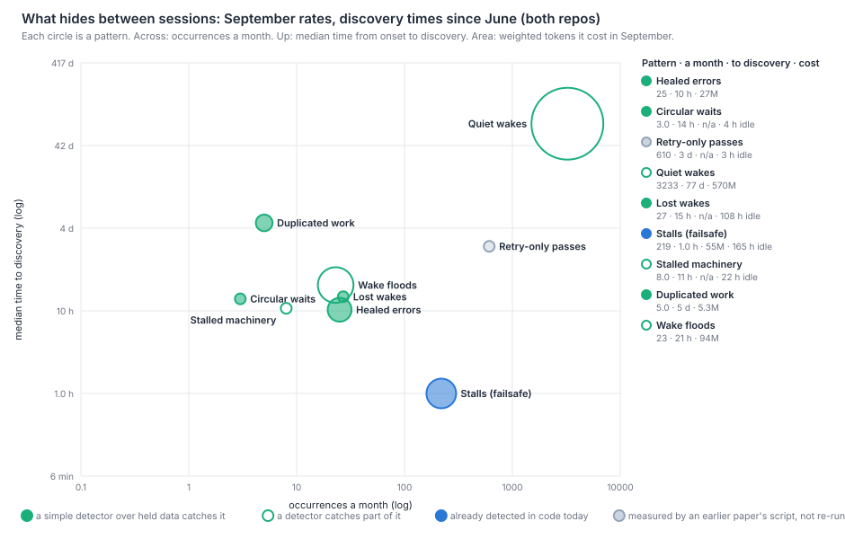
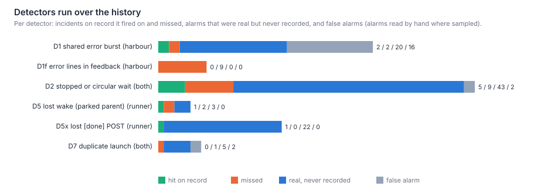

# Which failures in Harbour are invisible to any single session, how often did each happen, what did it cost, and would a detector in code have caught it?

Most of them, often, and yes for about half of those on record. The tracker holds 107 incidents of
nine cross-session patterns since June, and 92 of them were invisible to any one session that met
them. They surfaced a median of 16 hours after they began. Supervisors found 28, the worker that
hit one 26, John 19, a review or measurement 13, a Flight Companion 9 and code 3. **No periodical
found one**: the periodicals' only first find was their own four-week outage. Simple rules over
data Harbour and the runner already hold were run over the history. They caught 9 of the 19
incidents on record inside their windows, a median of 5 hours before anyone filed them, and raised
about 90 real alarms that nobody ever recorded. Together they take about 40 seconds of CPU a month
and no model tokens. The dead credential of LIN-3181 would have alarmed 1.5 hours after onset
instead of 10. The 1 October circular wait would have alarmed 5 minutes before the Flight
Companion broke it. The overnight death of the dispatcher on 26 September would have alarmed
9 hours before John found it. The rules miss sessions that leave no transcript (the opencode
harness, launches that never start), single-session events, and failures of the process that
hosts the watcher. By token cost the largest pattern is the one already on the map: wakes that
change nothing, 16% of September's tokens, found as an aggregate only after about 11 weeks. By
idle wall-clock the largest are lost wakes (108 hours in September) and stalls (165 hours, already
caught in code, after 60 minutes). The detectors save time to discovery far more than tokens.
**Code detects, the model decides** fits this record: the instruments that exist today are
self-scoped by construction, and the agents' vigilance that the prompts ask for sees each
instance but never adds them up.

## Findings

**Nine patterns, 107 incidents on record, nearly all cross-session.** A hand-coded register
(`what-hides-between-sessions-register.json`) keeps every ticket since about 1 June that records an
instance of a pattern happening, from 468 regex candidates in a snapshot of all 3,132 tickets. It
adds the 25 supervisor failures on record, the 8–9 August 401 flood and the 1 October circular
wait. Two buckets were added to the brief's seven: P8, loops and wake floods; and P9, collisions
over shared state between concurrent sessions (3, all in the runner).

| Pattern | On record | Harbour / runner / both | Median hours to discovery (n) | Found by, most often |
|---|---|---|---|---|
| P1 Healed or masked errors (auth, retries) | 10 | 9 / 1 / 0 | 10.3 (9) | a worker that hit it 4, Flight Companion 3 |
| P2 Circular or orphaned waits | 10 | 3 / 5 / 2 | 13.9 (8) | mixed: John 2, review 2, unknown 3 |
| P3 Tests that pass only on retry | 20 | 18 / 2 / 0 | 60.4 (11) | the worker that hit it, 16 of 20 |
| P4 Wakes that change nothing | 3 | 2 / 1 / 0 | — (an aggregate, see below) | measurement |
| P5 Lost wakes | 20 | 4 / 11 / 5 | 14.8 (10) | supervisor 9, John 5 |
| P6 Stalled sessions | 22 | 2 / 19 / 1 | 10.7 (14) | John 8 |
| P7 Duplicated work | 4 | 4 / 0 / 0 | 116 (2) | — |
| P8 Loops and wake floods | 9 | 7 / 2 / 0 | 20.5 (2) | — |
| All, with P9 and 6 others | 107 | 54 / 44 / 9 | 15.8 (65; 0.1–210) | supervisor 28, worker 26, John 19 |

"Repo" is where the fault lived and was fixed. Harbour's faults are credentials, flakes and
minting. The runner's are delivery, holds and stalls, as `wake-inventory.md` v2 found for lost
wakes (11 of 15 in the runner). The median fix landed 9.7 hours after filing. Discovery, not
repair, is the slow step.

**What the patterns cost in September.** Each row's rate comes from the instrument that measured
the month (`survey-hides-analyse.mjs` names it). Tokens are weighted as in the earlier papers, out
of September's 3,497M.

| Pattern | September | Weighted tokens | Idle wall-clock | Detector |
|---|---|---|---|---|
| P1 Healed errors | 25 bursts of one error across 3+ sessions in an hour; 487 proxy errors seen by sessions (Harbour 417, runner 70), 68% healed by a retry | 26.6M retrying (0.76%, an upper bound) | a few hours per burst | D1 caught |
| P2 Circular waits | 1 cycle (1 Oct) and 2 recorded orphaned waits | none | 3.5 h | D2 caught the cycle |
| P3 Retry-only passes | about 610 green CI runs a month hid a retried test (`browser-flakes.md` v2: 80% of a 1-in-8 sample) | not measured | 54 re-runs, about 7½ h since June | cited, not re-run |
| P4 Quiet wakes | 3,233 deliveries into held supervisors (`held-or-fresh.md` v2) | 570M (16.3%) | none | partly: 2,295 visible by class |
| P5 Lost wakes | 27 waits on a child that had finished, never woken; 14 more woken 24–50 min late; 8 terminal posts lost | not measured | 108 h (capped at 6 h each), plus 18 h late | D2, D5, D5x |
| P6a Stalls the failsafe sees | 219 failsafe fires on 149 sessions | 54.8M of re-fires (1.57%) | 165 h silent in execution before a fire | in code since July |
| P6b Stalls of the machinery itself | 8 incidents (the dispatcher killed, a driver wedged, a login expired, a database link degraded) | not measured | 22 h stated in the tickets, and every in-flight session frozen | D2 caught 3 of 8 |
| P7 Duplicated work | 5 pairs of the same leg running twice at once; 13 more refused by the existing guard | 5.3M (0.15%) | none | D7 |
| P8 Wake floods | 23 hours with more than 30 deliveries into one session (worst: the passage Runner and an autopilot, about 150 an hour each on 26 Sep) | 94M (2.7%), mostly inside P4 | none | partly (threshold only) |

These are fleet totals for the month, so the charging rule does not move them. Charged per
correct change, quiet wakes are 6.9 per change by the child the log names and 3.4 by the session
each entered (`wake-inventory.md` v2).

**The headline cost is time, not tokens.** Outside P4, which map rows 1–3 already hold, the token
cost of what hides between sessions is small: retries 0.8%, failsafe re-fires 1.6%, duplicates
0.15%. What it costs is waiting. A ticket whose supervisor never hears from its child sits until
the failsafe re-asks after 60 minutes, or until a person looks. The worst cases idle overnight.
On 26–27 September the dispatcher was killed at 21:50 by an agent's `pkill`, which also killed
the failsafe running inside it. Every in-flight session froze for 9 h 20 min until John found it
in the morning (LIN-3118, LIN-3122). That is latency per ticket and lost overnight capacity. It
shows in hours per correct change, not in weighted tokens.

**A detector over data already held catches about half of what is on record, hours earlier.**
Six rules were written as committed scripts and run over everything their data reaches. The
calls were made by hand against each incident's text
(`what-hides-between-sessions-detector-eval.json`); an ambiguous alarm counts as a miss.

| Detector | Data | Rule | On record: hit / miss | Alarms nobody recorded | False alarms |
|---|---|---|---|---|---|
| D1 shared-error burst | transcripts, Sep | the same error signature in 3+ sessions within 60 min | 2 / 2 | 20 auth and transient bursts | 16, all repeated 4xx request mistakes; none if 4xx are excluded |
| D1f error lines in feedback | runner oplog, from 12 Jul | auth or outage words in 3+ sessions' feedback within 6 h | 0 / 9 | 0 | 0 |
| D2 stopped or circular wait | transcripts, Sep | every 30 min, any declared wait whose awaited chain has stopped, or a cycle | 5 / 9 | 43 | 2 |
| D5 lost wake | oplog and transcripts, Sep | parent parked, child posts terminal, no delivery within 15 min | 1 / 2 | 3 | 0 |
| D5x lost terminal post | oplog, from 12 Jul | a `[done]`/`[failed]` line whose POST failed | 1 / 0 | 22 | 0 |
| D7 duplicate launch | transcripts, Sep | same ticket and kind launched twice, overlapping | 0 / 1 | 5 | 2 |

Combined, the rules caught 9 of the 19 incidents on record in their windows (8 of 18 events: LIN-3118
and LIN-3122 are one night). Their alarms came a median of **5.1 hours** before the record's
discovery, and 7 of the 9 more than 15 minutes ahead:

- LIN-3181 (dead credential): 8.8 h ahead.
- LIN-3118/3122 (the dispatcher killed overnight): 9.0 and 9.3 h ahead.
- LIN-2446 (driver wedge): 4.9 h ahead.
- LIN-2511 (a wake destroyed by the reaper): 5.1 h ahead.
- LIN-2879 (a lost `[done]` post): 21 h ahead.
- LIN-2473 (the Linear lane flapping): 0.8 h ahead.

At no gain were the 1 October cycle (5 minutes ahead of the Flight Companion) and LIN-2932, whose
supervisor filed it within a minute of the alarm. The misses fall into five groups:

- **Sessions with no transcript:** opencode (LIN-2720, LIN-2876, half of LIN-2874), and launches
  that never started (LIN-2515).
- **A single-session event:** LIN-2933.
- **A failure no session sees as an error:** the runner silently stopped deploying merged fixes
  (LIN-2451), and a bootstrap re-fire never ended with nobody waiting on it (LIN-2510).
- **Waits the rules do not model:** in-session subagents (LIN-2559), and subtasks duplicated
  across different launches (LIN-2898).
- **An alarm that could not be tied to the incident:** LIN-2993 (D1's 503 burst came two hours
  after a person had filed it).

D1f is the clearest negative. The runner's oplog keeps 60 characters of each feedback line, and a
session that parks on an error rarely posts it, so the rule never fired. The 8 August flood, which
three sessions each saw and parked on, was found from its tail about 22 hours after onset
(`2026-08-09-proxy-401-flood.md`). It left one matching line in the oplog.

**The record is a fraction of what happens.** About 90 of the alarms are real and on no ticket:

- **D1:** 20 bursts. Besides the two on record (LIN-2473 and LIN-3181), 19 more `LINEAR_AUTH`
  bursts reached three or more sessions in September, the largest with 62 sessions over 7.6
  hours on 24–25 September. Whether they share LIN-3181's cause is not known from this data.
- **D2:** 43. Mostly lost and late wakes, each idling a supervisor. Of September's 27 lost wakes,
  5 were rescued by nothing at all.
- **D5x:** 22 `[done]`/`[failed]` lines lost for good since July. The runner's `sendFeedback` does
  not retry (`feedback.js:41-70`). In 22 of the 23 cases the runner still wrote `hook.done_posted`,
  "the positive proof the completion propagated" (`hook.js:2062-2065`), because that line follows
  the attempt, not its success.
- **D5:** 3, two of them on no ticket. On 23 September an autopilot was never woken and sat 23.7
  hours.
- **D7:** 5 true duplicates (two plan-review verdicts on LIN-3125; doubled close-outs on LIN-2667
  and LIN-2718).

**The instruments that exist are self-scoped by design.** Three examples:

- **Credential health is bounded to one token.** Harbour's `/credential-health` read is "bounded to
  the token it authenticated with" and returns `unknown` until the same failure repeats
  (`routes/proxy-reads.js:68-104`). It is a careful answer to "is my credential dead?", and by
  construction it cannot say "every session has seen this for an hour".
- **The stall failsafe runs inside the process it watches.** The runner's failsafe fires after 60
  minutes of silence (`config.js:50`). It does real work: in September 130 of 142 re-fires got the
  session working again. But because it runs inside the dispatcher, it died with the dispatcher
  on 26 September.
- **A prompt rule tells each session to absorb the error.** "Don't park on one 401 … retry over
  10–15 minutes" (`lib/proxy-instructions.js:1110`, LIN-1938, 5 September) is the locally right
  behaviour. Applied in every session, it is what kept LIN-3181's 203 rejections quiet for 10
  hours.

**The periodicals did not find these patterns.** Since June there have been 42 periodical reports
from 13 of the 15 templates, 67 run tickets and 109 follow-ups.

- **First finds:** one, Recent Headwinds on 26 September (LIN-3104), and what it found was that the
  periodicals themselves had run nothing for four weeks.
- **Aggregations after the fact:** three grouped bugs others had already filed (LIN-896,
  LIN-1166, LIN-2364).
- **Built in response:** two invariant suites followed (LIN-1169, LIN-1490).
- **A miss on record:** one report missed a five-bug cluster (LIN-899).
- **A gap raised and not acted on:** Integration & Surface Maturity said three times (17 July,
  29 August, 26 September) that Harbour has no stuck-session detection for a taken item. A
  `silentSince` read landed in August (LIN-2079), and nothing reads it.

This is by design. The templates read code and tracker history, never runtime logs or session
state (`lib/periodicals.js:1-60`). The 26 September batch cost about 112M weighted tokens, 3.2% of
September, against 40 seconds of CPU for the detectors. Their worth on the other questions they
ask is not measured here. In passing, the adversarial second read added by LIN-2323 disagreed
with 9 of the 12 reports that carry a verdict. Its own retirement condition, "near zero", was
not met.

**The prompts ask for vigilance, and agents give it, one session at a time.** 38 rules in served
text across both repos watch for, or handle, the patterns, about 36 KB in all
(`what-hides-between-sessions-prompt-rules.json`). The most text goes to stalls (9 rules,
10 KB) and lost wakes (3 rules, 7.6 KB). The earliest rule is from 6 June.

- **No rule asks for a wait-cycle check.** The operating manual says the mutual-wait deadlock
  "doesn't apply under push" (`docs/autopilot-operating-manual.md:274`, LIN-826), and the
  1 October cycle is a counter-example.
- **What September's sessions said:** they mentioned a pattern 1,479 times in 710 sessions. In a
  systematic sample of 40, 20 were only the words; 14 were real and the agent acted (a note to
  its parent or in its report, one escalation, no ticket); 6 were real and quietly retried past.
- **On the record, agents found half the incidents:** 54 of 107 (worker 26, supervisor 28).
- **Nothing gathers what they see:** seven sampled sessions reported `LINEAR_AUTH` failures between
  2 and 25 September, one calling it "worth a separate look". Nothing added those reports up,
  and D1 would have counted 21 bursts.

**Quiet wakes are the exception that took longest to see.** Each quiet wake is a no-op to the
session it enters. Only the sum is a problem. The per-beat wake landed on 16 July (LIN-1357).
The cost was first measured on 30 September (`what-supervisors-do.md`, then `wake-inventory.md`
and `held-or-fresh.md`), about 11 weeks later. Code can see the class of 2,295 of the 3,233
September quiet wakes before a model reads them. The other 938 cannot be told apart by class
(`held-or-fresh.md` v2). This is map rows 1–3, and this paper does not re-size it.

## Method

**Population.**
- **Tracker:** every issue from LIN-300 onward (about 1 June), snapshotted over the workspace proxy
  in 13 list pages and 110 detail reads at no more than 6 a minute (`survey-hides-tracker.mjs`).
- **Transcripts:** dispatched Claude Code sessions from 29 August to 1 October (2,076 sessions:
  1,738 Harbour, 338 runner by the clone they edited; `survey-hides-transcripts.mjs`).
- **The runner's oplog:** 12 July to 1 October, 315k lines.
- **The runner's run logs:** 236 since June, with no per-line timestamps
  (`survey-hides-runner.mjs`).
- **Git:** both repos.
- **The periodicals' registry:** read once over the proxy.

**The register.**
- **Candidates:** `survey-hides-register.mjs --candidates` lists tickets with a failure word in the
  title and a pattern regex in the text (the regexes are in its header).
- **Coding:** each candidate's title and first 1,500 characters were read and coded for pattern,
  repo, whether the instance was invisible to a single session, onset, and who found it, from the
  ticket's own words.
- **Timing:** discovery is the filing time. The fix is the first commit on main naming the ticket
  that touches more than docs.

**Detectors.**
- **The rules:** each is a few lines in `survey-hides-detect-sessions.mjs` (D1, D2, D7) or
  `survey-hides-detect-runner.mjs` (D1f, D5, D5x, D8), stated in the table above and in each
  script's header.
- **Coding D2's incidents:** `survey-hides-code-waits.mjs` reads the transcripts after each alarm
  to code what each D2 incident really was: a lost wake, a late wake, a stalled child, a usage
  limit, a child working in the background (false) or a cycle.
- **Scoring:** `survey-hides-analyse.mjs --near` lists every alarm from 2 hours before to 24 hours
  after each incident's onset (30 hours for a date-only onset). The hit or miss calls in
  `what-hides-between-sessions-detector-eval.json` were made from that list.
- **Unrecorded alarms:** an alarm more than an hour before or 12 hours after any hit counts as one,
  if its class is real.

**Rates and costs.**
- **Rates:** `survey-hides-analyse.mjs` takes each pattern's September count from the instrument
  that measured it, else the register's count over four months.
- **Tokens:** weighted with `survey-wake-extract.mjs`'s tier weights.
  - Retry cost is everything a session did from an error to the call that then succeeded.
  - Failsafe cost is the weighted tokens of the re-fire deliveries.
  - Flood cost is the deliveries inside a flood hour.
- **Idle:** D2's minutes from the alarm to the waiter's next activity, capped at 6 hours, and the
  runner's silence before each failsafe fire.

**Periodicals and prompts.**
- `survey-hides-periodicals.mjs` matches reports in `docs/reviews` to templates, run tickets and
  follow-ups, and costs the 26 September batch from transcripts.
- `survey-hides-prompts.mjs` locates 38 rules in served text by exact anchor and dates each by
  its first commit.

**Re-run.**
- Run the transcripts, runner, detect, code-waits, analyse and figures scripts in order, about 40
  seconds of CPU.
- The tracker, prompts and periodicals scripts are separate; the tracker and periodicals scripts
  call the proxy.
- Snapshots go to the git-ignored `data/survey-hides/`.

## Limits

- **One month of transcripts.** D1, D2, D5 and D7 see September only, a month with a passage
  layer. Wake-related rates (P5, P8) are higher than in a month without one. Rates run **high**
  for a typical month.
- **No opencode transcripts.** Sessions on the opencode harness leave no transcript, and launches
  that never start leave none either. The detectors' counts and hit rates run **low** by their
  share.
- **The register is what got filed.** About 90 real alarms are on no ticket. Record-based
  frequencies run **low**, and the record's discovery mix leans to whoever files.
- **Filing time stands in for discovery.** People notice before they file, and 47 of the 65 onsets
  are dates read as midnight. Time to discovery runs **high** (by up to a day for those), and
  the detectors' lead over discovery runs **high** with it.
- **Hindsight.** The rules were written knowing LIN-3181 and the 1 October cycle. A rule written
  beforehand might be tuned differently, so hit rates run **high** for a rule written blind.
  Against that, every ambiguous alarm was called a miss, which runs **low**. The net is unknown.
- **"Real" is by class or by one reader.** D1's unrecorded bursts are real errors, but some may
  be harmless blips. D2's codes, the register and the vigilance sample are one reader's (no blind
  second read was possible in one session). The value of unrecorded alarms may run **high**.
- **Costs are bounds.** Retry cost counts everything between an error and the retry, so it runs
  **high**. D2's idle is capped at 6 hours, so it runs **low** for the overnight cases.
- **The periodicals' cost is one batch.** Earlier batches predate the transcripts, and the 45M
  orchestrator that dispatched them is excluded, so it runs **low**. Their record is judged only
  on cross-session patterns. Their value on code quality and drift is not measured here, so the
  verdict is narrow, not low.
- **The Flight Companion's record runs low.** In-page chats are not readable over the proxy, so
  its share of discoveries runs **low**.
- **P3 and P4 are cited, not re-measured.** Their rates carry `browser-flakes.md` v2's and
  `held-or-fresh.md` v2's limits. P4's discovery time is an aggregate's onset to its first
  measurement, a different measure from a ticket's filing.

## Options

Options, not changes. John decides.

| Option | Effect, with range | Evidence | Risk to correctness | How the scorecard would measure it |
|---|---|---|---|---|
| **A. Run the cross-session detectors live, outside the processes they watch:** D1 (shared-error burst, 4xx excluded) and D2 (stopped or circular wait), raising one alarm to a person or Flight Companion, not to every agent | Time to discovery for P1, P2, P5 and P6b from a median of 10–15 h to about the detector's lag (0–2 h). On the record, 9 of 19 incidents 0–21 h sooner. Idle: up to the 108 h of lost-wake waiting and the overnight freezes. Tokens: under 1% | D1 and D2 scores; the 26 September night; LIN-3181 | Low if alarms go to a decider and never act on their own. Alarm fatigue if the 4xx class stays in (16 of 42). It must not run inside the dispatcher | Median hours from onset to filing for P1–P6, before and after; idle hours per waiting supervisor; alarms per week acted on |
| **B. Make the runner's completion post tell the truth:** retry a failed terminal post, and write `hook.done_posted` only on success | Removes the D5x class: 23 lost wakes since July, about 8 a month, each a supervisor waiting until the failsafe or a person | D5x; `feedback.js:41-70`; `hook.js:2062-2065` | Positive: a lost `[done]` is a correctness gap today | Lost terminal posts per month (D5x) to zero |
| **C. Give the periodicals the alarm log instead of asking them to find runtime faults from code** | Up to 3.2% of September's tokens per batch is spent where no cross-session instance was found first. Pointing a periodical at D1 and D2's alarms makes it a reader of evidence, not a searcher | 0 first finds of P1–P8; the "no stuck-session detection" gap flagged three times | Low for this class; their code-quality findings are untouched | Periodical findings that name a runtime incident; their cost per batch |
| **D. Retire vigilance text where a detector takes over** | A few KB of the 36 KB of rule text, and the turns agents spend noticing alone. Small in tokens | 38 rules; 14 of 40 sampled mentions acted, none gathered | Medium: Rasmussen's warning, since a defence's worth is invisible until removed. Retire only after A has run a month | Rule bytes per pattern; the discovery time of each pattern stays flat or falls |
| **E. An alarm for duplicate launches** (D7) | 0.15% of tokens, 5 pairs a month | D7 | Low | Duplicate pairs per month |

Option A is the principle "code detects, the model decides" at its smallest. It changes no
supervisor's role and keeps every altitude. It does not overlap map rows 1–3, which route quiet
wakes; it watches what goes wrong between them. In correct work per budget it is worth little
directly, a percent or two of tokens. What it buys is latency and the overnight capacity that a
silent failure loses: hours per correct change, not tokens.

## Next

- What were September's 19 other `LINEAR_AUTH` bursts across three or more sessions? Were they
  LIN-3181's dead credential re-selected earlier, or other faults? Join D1's episodes to the
  server's credential-selection log, now retained (LIN-3157).
- If D1 and D2 ran live for four weeks and alarmed to a Flight Companion, how many alarms would it
  act on? And does the median time from onset to discovery fall from about 15 hours?
- Sibling papers this wave: `prototype-concepts.md` (John's concepts, with Lighthouse as a
  comparator) and `replay-small-work.md` (the pre-registered replay). This paper does not
  overlap either.
