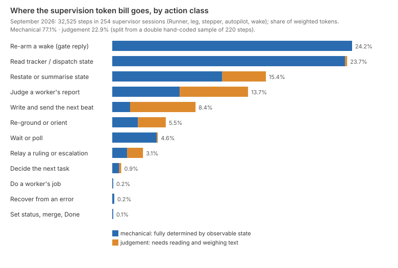
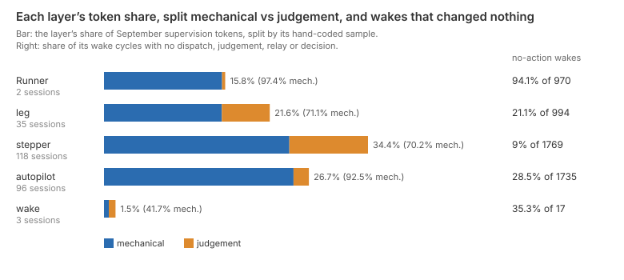

# What do Harbour's supervision layers actually do, and how much of it needs a model?

Mostly bookkeeping. About three-quarters of September's supervision tokens went to steps
whose action was fully determined by observable state: taking delivery of a wake, reading a
row, answering the runner's completion gate, noting progress. The model's reading and weighing
is concentrated in two places, judging a worker's report and writing the next beat, and those
two take about a fifth of the bill. Across 32,525 steps in 254 supervisor sessions, two blind
hand-codings of a 220-step sample put **77% of supervision tokens** in mechanical steps (80% by
a second estimate), and 61% of supervisors' working time. The independent check's blind recode
of a fresh 160 steps, drawn in proportion to their tokens, puts it at 86% (81–91%). Nearly a
third of wakes (31%) change nothing: the supervisor fetches the wake, says it is still waiting
and re-arms. For the passage Runner that is 94% of its wakes. Much of what those steps work out
is already held in deterministic code in one repo or the other, though how much has not been
measured. The failures on record are overwhelmingly in the mechanical actions, and most of
those were bugs in the plumbing rather than choices a model got wrong. Applying the split to
`where-the-effort-goes.md`'s 35% supervision share, which that paper measured over a slightly
wider set of sessions from 31 August, puts about 27% of the fleet's weighted tokens in
mechanical supervision.

## Findings

**Supervision is a fixed cycle, and most of its steps carry no decision.** Every layer runs
the same loop. The runner wakes the session with "Your task (dispatch item X) is ready"
(`hook.js:1062`). The supervisor fetches that item, reads the child's result, maybe
spot-checks it and writes and sends the next beat. Then it reports to the operator, and the
runner's completion gate asks for a sentinel line (`hook.js:418`). The supervisor answers
`PENDING-EXTERNAL: waiting on <the child it just sent>` and is parked until the next wake. All
supervisor tokens are frontier tier. The census, all from LinearViewer's local transcripts of
September sessions covering both repos' tickets:

| Action class | Steps | Share of tokens | Mechanical share of the class | Share of working time |
|---|--:|--:|--:|--:|
| Re-arm a wake (answer the completion gate) | 5,907 | 24.2% | 100% (n=42) | 8% |
| Read tracker or dispatch state (incl. taking delivery of a wake) | 8,863 | 23.7% | 99% (n=62) | 20% |
| Restate or summarise state | 3,475 | 15.4% | 72% (n=22) | 11% |
| Judge a worker's report | 5,108 | 13.7% | 50% (n=31) | 17% |
| Write and send the next beat | 2,926 | 8.4% | 22% (n=11) | 25% |
| Re-ground or orient | 3,485 | 5.5% | 48% (n=26) | 8% |
| Wait or poll | 1,180 | 4.6% | 97% (n=16) | 3% |
| Relay a ruling or escalation | 1,009 | 3.1% | 48% (n=5) | 4% |
| Decide the next task | 411 | 0.9% | pooled (n=3) | 4% |
| Do a worker's job, recover, set status or merge | 161 | 0.5% | pooled (n=2) | 1% |

A step's price is mostly the context it re-reads, not what it writes. The median gate reply
costs 34k weighted units, more than the median step that sends a beat (30k). In the 56 sessions
with at least twenty gate replies, the median reply cost 24k units in the session's first tenth
and 71k in its last. The same one-line answer gets three times dearer as the session ages.
Time runs the other way. Supervisors were at work for 82 hours in September and held open for
1,459. Writing a beat prompt is a quarter of the working time on 8% of the tokens.

**The mixed classes split along a clear line: checking against state is mechanical, checking
against text is not.** Judging a worker's report is half and half. One half confirms a
comment id exists, a PR merged, or a status moved. That verifies the report against a field
that could have been read directly. The other half weighs the report itself. Examples coded
J by both coders: greps a worker's callers to test its beat-2 claims; checks relations to
verify a blocking-subtask claim and finds it reversed; checks out a commit in a worktree to
test beat-3 claims. Writing the next beat is mostly judgement, 22% mechanical. The mechanical
part sends the engine's recommendation unchanged: the three dispatches both coders marked M are
all `recommend-and-dispatch` calls. The rest carries corrections or new scope, for example a
revision autopilot carrying a plan-review verdict's corrections. Restating is 72% mechanical:
appending "verified" to its own run-state file is M, while an operator report on findings it
only partly confirmed is J. Relay is half and half by the rules' class, on a small sample. A
gate line pointing at a decision already open is M; relaying a ruling, or framing a decision for
John, is J. By the coders' own class, relay is 15% mechanical.

**Wakes that change nothing are nearly a third of all wakes and a quarter of the supervision
bill.** A wake cycle runs from one wake to the next. In 1,639 of 5,342 cycles, 30.7%, the
supervisor only read, polled, re-armed, restated or oriented. There was no dispatch, no
judgement, no relay and no decision. Those cycles are 25% of the bill. A median quiet cycle is
three steps and 157k units: fetch, "still waiting", gate reply. Most of them, 87%, are the
progress wakes that `lib/dispatch-wake.js:151` sends a parent on an `everything` edge, using the
"paused (pending), not done" text (`:75`); the rest are terminal wakes, task notifications and
other messages. A progress wake does not always change nothing: 39% of them led to an action.

The layers differ as their roles would predict:
- **Runner** (2 sessions, 15.8% of the bill, 97% mechanical). 94% of its 955 wakes change
  nothing, and it re-arms on nearly all of them. It costs the most per step (56k units), because
  its context is the longest.
- **Leg and stepper** (21.6% and 34.4%, 70–71% mechanical). They carry most of the judgement,
  in the beat-by-beat check and the beat they write next. Only 7% of a stepper's wakes are quiet.
- **Ticket autopilot** (26.7%, 92% mechanical). It mostly parks on children it has already
  dispatched.

**Most of what the mechanical steps work out is already held in code, and prose asks the
model to hold it again.** Deterministic machinery in the two repos:
- **The completion gate** (simple-dispatcher). The runner asks for the sentinel
  (`hook.js:418`), parses it (`:491`), holds a PENDING-EXTERNAL session warm and parks it in
  `AWAITING_EXTERNAL` when the hold expires (`:1437`). The runner also knows when a parent has
  live subscribed children (`reapers.js:1009`). It uses that to exempt the parent from the stall
  reaper, the expired-hold fail path and the inactivity reap (`reapers.js:2169`, `:2905`), and
  never tells the parent. So the PENDING-EXTERNAL gate replies, 20% of the bill, reconstruct in
  prose a fact the runner already holds.
- **Wake delivery** (Harbour). `buildWakeFollowUp` (`lib/dispatch-wake.js:151`) decides who is
  woken and when. It already guards against self-wakes, wake loops and aborts.
- **Stall and liveness** (simple-dispatcher). The stall failsafe re-asks a silent session after
  60 minutes (`reapers.js:1207`, `config.js:50`). It fails a session that re-declares PENDING-EXTERNAL too often
  (`reapers.js:877`, `config.js:112`). The kickoff prompt still tells the model to keep its own
  roughly 30-minute liveness clock per child (`lib/prompts/autopilot-kickoff.js:392-393`) and to
  hold "the live child-set" (`:198`).
- **The dispatch factory** (Harbour). It inherits lineage from `followUpTo`. Its refusals are
  narrower than a supervisor's checks: a duplicate only within five minutes, for the same issue
  and kind, without `followUpTo` or `force` (`lib/dispatch-factory.js:62`, `:272`); over budget
  only when the run declared a bound (`:389-393`); a closed ticket only on the composed-run path
  (`:513-567`). An ordinary dispatch against a closed ticket is not refused.
- **Recommend** (Harbour). It is itself a model call (`lib/openrouter.js:1799`), wrapped in
  deterministic parsing and defer-following (`lib/recommend-recurse.js:106`).

Several rules live only in prose, with no code behind them: the plan → plan-review → plan
bound (`autopilot-kickoff.js:469-472`), the Approve-and-ledger half of the merge-and-Done gate,
and the ~30-minute liveness clock. The other halves of that gate are in code: GitHub refuses a
merge to `main` without green CI, and the proxy refuses Done on periodical tasks
(`routes/proxy-writes.js:309-316`; `steady-base-check.md`). `phases.js`' transition table is
documentation that nothing calls at run time (`isLegalTransition`, `phases.js:131`). The
kickoff forbids polling a subscribed child (`autopilot-kickoff.js:136`, `:384`); the passage
prompt asks for polling only where there is no dispatch row to be woken on
(`docs/passage-runner-prompt.md:132`, `:139`), so instead of a wake, not alongside one. The
passage prompt asks supervisors to re-read the passage each cycle rather than trust their notes
(`docs/passage-runner-prompt.md:56`). The notes are `autopilot-state.md` or `RUN.md` files that
repeat the dispatch rows, and they are much of the restate class.

**The failures on record are mechanical, and mostly in the plumbing.** 25 supervisor failures
are filed as tickets. They come from 82 search candidates classed on their titles and
descriptions, plus LIN-2145, all re-read with their comments by the independent check. The
reading sets aside six that are not supervisor failures (LIN-1884 and LIN-2899, worker
sessions; LIN-1591, a measurement; LIN-2754, a feature gap; LIN-2229 and LIN-2468, latent with
no incident), and takes in five the search classed out (LIN-353, LIN-430, LIN-870, LIN-1280,
LIN-1451).
- **By type:** 15 are missed or lost wakes, 4 loops, 4 wrong routings and 2 lost inputs.
- **Mechanical or judgement:** 22 happened in mechanical actions.
- **Code or model:** 21 were in code. Examples: a healthy session failed 27 ms after its wake
  (LIN-2511), a completion sentinel swallowed by the hook's re-entry guard (LIN-1280), a
  dispatch that passed validation and was then refused (LIN-2974). Two were a supervisor's own
  mechanical slips: a wake that relied on the model setting `subscribe` (LIN-881), and an
  autopilot that merged two red-CI PRs (LIN-430, June). Two more were the recommend engine,
  itself a model call, choosing the wrong next phase (LIN-366, LIN-384).
- **Judgement:** the three judgement failures were those two recommend-engine choices and a
  stepper judging a beat whose report the runner had overwritten (LIN-2145).

The transcripts show more of the same: 108 failsafe re-confirms, 40 silence nudges and 27
refused duplicate dispatches. 47 other proxy errors are mostly outages: 34 are HTTP 503s from
tracker authentication or the AI service, and 8 are failed reads. The coders flagged three sessions:
- the one clear case of leaving altitude: a wake on 5 September (1.5% of the bill) that wrote
  and tested code itself for most of its 322 steps;
- two repeated reads or polls.

None of the 220 coded steps showed a wrong accept or a mis-routed verdict. Where a
supervisor's judgement goes wrong, it shows up downstream as review rounds.
`review-loops.md` found 83 of 94 tickets that reached plan-review sent back at least once.

## Method

Scripts run in this order: `scripts/survey-supervise-extract.mjs`,
`scripts/survey-supervise-classify.mjs`, `scripts/survey-supervise-sample.mjs`,
`scripts/survey-supervise-failures.mjs`, `scripts/survey-supervise-analyse.mjs`,
`scripts/survey-supervise-render.mjs`. Snapshots go to the git-ignored `data/survey-supervise/`.
`survey-supervise-analyse.mjs` prints the census, class, layer, time and cost figures. The
candidate count and the 3% fallback come from the failures and classify scripts; the 5
September wake, the 35% and 27%, and the progress-wake share were read by hand, and the
corrected quiet-cycle figures and the failure re-reading come from the check
(`survey-check-2.md`).

- **Population.** It covers every Claude Code transcript under
  `~/.claude/projects/*simple-dispatcher-workspaces*` active between 1 September and 12:00 UTC on
  30 September, and so both repos' tickets. Layers follow `survey-effort-fleet.mjs`
  (`where-the-effort-goes.md`):
  - **Runner** carries the passage prompt.
  - **leg** is an autopilot a Runner dispatched onto its issue.
  - **stepper** carries the STEPPER disposition.
  - **autopilot** is otherwise the ticket's own.
  - **wake** is a session of kind `wake`.

  That gives 2 Runners, 35 legs, 118 steppers, 96 autopilots and 3 wakes, which is every
  supervisor session, not a sample.
- **Steps and cost.** A step is one assistant API message: its content blocks share a message
  id, and its usage is counted once. Weights follow `fleet-complexity-read.md`: frontier input
  1, output 5, cache read 0.1, 1-hour cache write 2, 5-minute cache write 1.25. Only shares are
  reported. Working time is the generation gap before a step plus the run time of its tools,
  counting only gaps of up to two minutes. Longer gaps before a tool call count as held time;
  longer generation gaps (1.3 hours in all) are counted as neither. In-session subagent
  tokens (0.6% of supervision) are counted to the session but not to any class.
- **Classes.** The twelve classes were defined before coding, in `CLASSES` of the classify
  script. They are the ten the brief lists, among them *recover from an error*, plus *do a
  worker's job*, and *set status, merge, Done*. The census coder is a fixed rule set over what woke the step, the tools it called and
  the text it wrote. A step with several actions takes the first class in a fixed priority
  order. An unmatched tool call goes to judge after the session's first dispatch and to orient
  before it; 3% of steps were coded this way.
- **Double coding.** A systematic sample was drawn: every k-th step per layer, from a fixed
  offset, 50 each from Runner, leg, stepper and autopilot and 20 from wakes. Two coders each
  coded all 220 cards blind to the rules and to each other, with class and M or J. The codebook
  is committed inside `what-supervisors-do-codes.json`, beside both codings. M means the action was
  fully determined by observable state; J means it needed reading and weighing text. Coder 2
  worked in reverse order. Agreement:
  - class: 93.6% between the two coders (κ 0.92);
  - M or J: 94.5% (κ 0.83);
  - the rules against the coders, where the coders agreed: 71.8% (κ 0.67). The largest
    confusion is gate replies the rules call *re-arm* and the coders call *poll*, when the reply
    acknowledges a progress wake. Both classes are mechanical.
- **The split.** A class's mechanical share is the unit-weighted share of its sampled steps that
  both coders marked M; a split verdict counts half. Classes with fewer than five sampled steps
  take the pooled share. The census's class shares times those fractions give the 77%. The
  second estimate, 80%, weights each sampled step by its layer's share of the bill and does not
  use the rules at all.
- **Wake cycles.** A cycle runs from a wake message ("Your task … is ready", a task
  notification) to the next. It is quiet if every step in it is read, poll, re-arm, restate or
  orient. The script also starts a cycle at a follow-up resume ("resumed to handle a follow-up
  … reply 'ready'"), which is a handshake just before the wake it announces. Counted that way
  there are 5,485 cycles, 1,782 quiet (32.5%, 30% of the bill), because the 142 handshakes make
  one-step quiet cycles that rewrite the whole context cache. The figures in the text merge each
  handshake into its wake; the layer chart is the committed script's and counts them apart. Leaving orient out of the quiet set changes them by less than 0.3
  points.
- **Failures.** Sixteen tracker searches were run through the workspace proxy at one call per
  4.5 s. A ticket is a candidate if it names a supervisor layer and its title a failure word.
  The candidates are hand-classed in `what-supervisors-do-failures.json` by type, by locus
  (model or code) and by the class of the action that failed, from each ticket's title and the
  start of its description. The check re-read each with its comments, and its reading is the
  one reported above. The transcript signals are
  counted from the runner's own injected messages and tool results.

## Limits

- **"Mechanical" means determined, not free.** A step is coded M if its action followed from
  observable state. That says nothing about whether code could reproduce what the model also
  noticed along the way. A gate reply occasionally carries a useful aside, so the M share is
  biased up as a measure of what a model adds, but not as a description of what the step did.
- **The coders are models of the tier under study, reading cards.** A card shows the step's
  tools, text, trigger and two prior steps, not the full context. Where the coders could not
  tell, the codebook told them to choose J. Both effects bias the M share down.
- **The rules are coarse.** The rules agree with the coders only 72% of the time. The class
  shares in the first table are the rules' shares, so the sizes of individual classes carry that
  error. Against the hand-weighted mix, re-arm is over-counted by about 9 points and poll
  under-counted by about 11. The check's token-weighted recode puts the largest over-count in
  restate instead (20% of its sample by rule, 11% by the coders), with re-arm over by about 4
  points and poll under by about 15; every one of those steps is mechanical either way. The 77%
  total is less exposed: the direct sample estimate that skips the rules gives 80%, and the
  per-layer shares in the layer list come from that direct estimate.
- **Rare classes are thin.** Relay, decide, work, recover and land have fewer than six sampled
  steps each, so their splits are loose or pooled. Together they are 4.5% of the bill.
- **September only, and September is the month passages began.** Transcripts are kept for 30
  days. Runner sessions are two, so the Runner's figures describe two voyages. The direction for
  the fleet is up for mechanical share, since Runners are the most mechanical layer.
- **Failures on record under-count judgement failures.** A wrong accept or a weak beat surfaces
  as a later review round or an escaped defect, and is rarely filed against the supervisor. The
  ticket search also finds what people chose to file. Both bias the mechanical share of failures
  up. Most of the failure tickets predate September, while the census is September's.
- **Working time counts the step's own tools.** A beat written into a heredoc and dispatched in
  one call is counted to dispatch, so dispatch's time share is inflated by tool run time.

## Next

- **How much of a gate reply is decided by state the runner already has?** Replay September's
  gate replies against the runner's own record of live subscribed children and outstanding
  dispatches at that moment. Count how many replies code would have written identically.
- **What does a progress wake tell a parent that its next terminal wake would not?** For each
  quiet wake cycle, find the next cycle that acted, and check whether anything in the quiet one
  was used.
- **What do judgement steps catch?** Of the judge steps that weighed a worker's report, how many
  changed what happened next: a correction in the next beat, a route-back, an escalation? How
  does that rate compare with what review later found on the same tickets?
