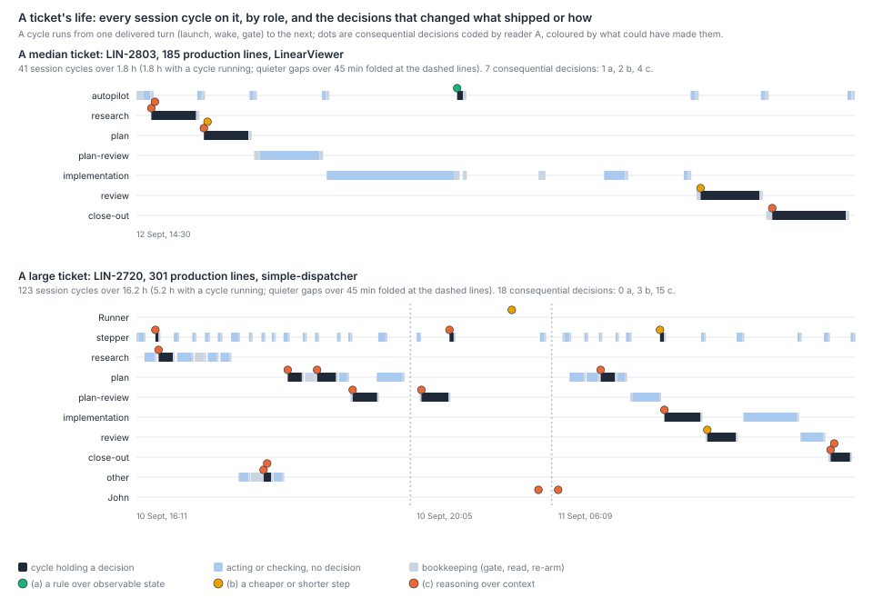
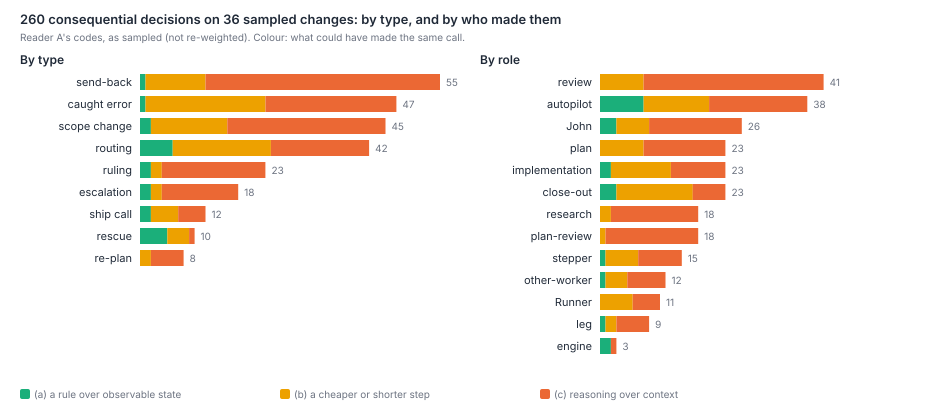
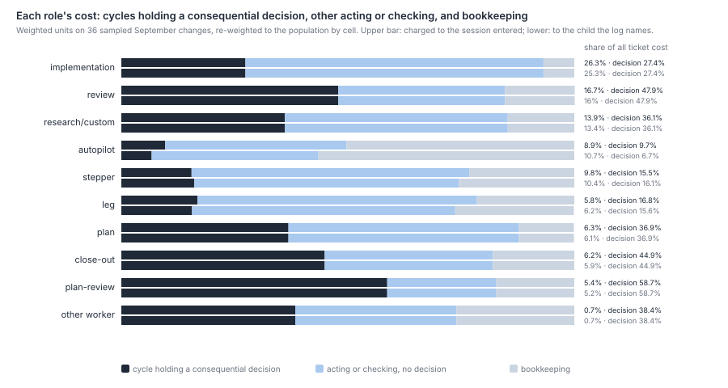

# Where in a ticket's life does a model's judgement change the outcome, and where could a program make the call?

At the gates and in the making, nearly always; in supervision, rarely, and then mostly where a
cheaper step would do. A September change carries about seven consequential decisions (median
five): a send-back, a caught error, a scope change, a re-route, a ruling and so on. Two readers
coded every such decision on 36 sampled Done changes from both repos, 260 in all. 61% needed
reasoning over the ticket's context, 31% could have been made by a cheaper or shorter step, and
8% by a stated rule over observable state. They agree on the class 85% of the time (κ 0.67).
Plan-review, review and close-out make the most decisions (82), then the makers (research, plan,
implementation, 76), the supervisors (73) and John (26). Per unit of cost the difference is
large. Plan-review spends 59% of its cost in sessions that changed the outcome, review 48% and
close-out 45%. The ticket's own autopilot spends 7–10% that way and half its cost on bookkeeping;
steppers and legs about 16%. Taken over the whole ticket, a third of the cost sits in cycles that
held a consequential decision. A quarter sits in ones that needed context, and under 1% in ones a
rule could have made. When things go wrong, one layer handles it 83% of the time, and the readers
judged that a fresh session holding only the record could have made the same call 82% of the time.
What needs more than one layer is a wrong premise in a plan or ticket, or a worker's report that
turns out false, and John is in half of those.

## Findings

**A change carries a handful of decisions that matter, and most of them need context.** 260
decisions on 36 tickets: 7.2 per ticket, median 5, 6.4 re-weighted to September's population.
Large changes carry more (median 9 at 300 production lines and over, 5 in every smaller band), and
so do simple-dispatcher's (median 7 on 9 tickets, against 5 on LinearViewer's 27; 101 and 159
decisions). One ticket had none: LIN-3147, a paper that ran by its brief.

| Type | Decisions | (a) rule | (b) cheaper step | (c) context |
|---|--:|--:|--:|--:|
| Send-back (a gate asked for changes) | 55 | 1 | 11 | 43 |
| Caught error outside a verdict | 47 | 1 | 22 | 24 |
| Scope change | 45 | 2 | 14 | 29 |
| Routing off the default path | 42 | 6 | 18 | 18 |
| Ruling | 23 | 2 | 2 | 19 |
| Escalation to John | 18 | 2 | 2 | 14 |
| Ship call (hold or merge where the record left it open) | 12 | 2 | 5 | 5 |
| Rescue | 10 | 5 | 4 | 1 |
| Re-plan | 8 | 0 | 2 | 6 |
| All | 260 | 21 (8%) | 80 (31%) | 159 (61%) |

Re-weighted to the population by cell, the mix is 8%, 33% and 59%. Among the 101 decisions the
reader marked high-confidence, 72% are class c. 108 decisions changed what shipped, 51 the scope
and 70 the sequence. Twenty only changed timing and eleven came to nothing in the end. The class
follows what a decision rested on. Code read at HEAD sits behind 95 of the context decisions, the
plan's text behind 44, a test run behind 44 and an earlier verdict behind 43. The rule-class
decisions rest on tracker state, a prior verdict or runtime state. Examples:
- an autopilot escalating at the plan loop's bound ("a second send-back counts as looping");
- a retry after `opencode exited with code 1`;
- a stepper dispatching research once the blocker was Done, though the engine still called it open;
- a session merging on green CI because its brief said so.

Half the rescues are rule-class. The repos do not differ: 60% of LinearViewer's decisions and 63%
of simple-dispatcher's are class c.

**Judgement concentrates at the gates and in the making, and is thinnest in supervision.** By who
decided:

| Who | Decisions | Class c | Class a |
|---|--:|--:|--:|
| Gates: plan-review 18, review 41, close-out 23 | 82 | 56 (68%) | 3 |
| Makers: research 18, plan 23, implementation 23, other workers 12 | 76 | 48 (63%) | 3 |
| Supervisors: autopilot 38, stepper 15, Runner 11, leg 9 | 73 | 37 (51%) | 10 |
| John, or the coordinator relaying him | 26 | 17 (65%) | 3 |
| The recommend engine | 3 | 1 | 2 |

Supervisors hold half the rule-class decisions on a quarter of the census. Their 37 context
decisions are mostly escalations framed for John (11), re-routes (9) and errors caught in a
worker's report (6), for example a worker that posted done with no commit, no branch and no PR.
22 of the 37 rested on a worker's report. Close-out is the gate most
open to a cheaper step: 14 of its 23 decisions are class b (holding on an undischarged ledger
item, filing an out-of-scope item as a follow-up) and 3 are class a. Plan-review is the opposite:
17 of 18 are class c, as `why-legs-repeat.md` found that a repeated plan-review finds something
real and new in 30 of 41. By tier, frontier sessions made 188 decisions (64% class c), mid-tier
31 (58%) and cheap-tier 12 (2 class c). Implementation decisions were mostly mid- and cheap-tier
departures from the plan (12 and 7 of 23).

**A third of a ticket's cost sits around decisions that mattered, and almost none around ones a
rule could make.** A cycle runs from one delivered turn (a launch, a wake, a gate) to the next. A
cycle holds a decision if reader A put one in it. Otherwise it is *acting or checking* if it wrote
or dispatched anything, and *bookkeeping* if it only read, re-armed or answered a gate. Weighted
units on the sampled tickets (310M), re-weighted to the population:

| Group | Share of ticket cost | Holding a decision | Acting or checking | Bookkeeping |
|---|--:|--:|--:|--:|
| Makers | 47% (45%) | 31% | 59% | 10% |
| Gates | 28% (27%) | 49% | 34% | 16% |
| Supervisors (without the Runner, see Limits) | 25% (27%) | 14% (12%) | 54% (50%) | 33% (38%) |
| All | 100% | 32% (31%) | 50% (50%) | 17% (19%) |

Figures are charged to the session entered, with the child the log names in brackets where it
differs. Supervision's 25–27% sits below `where-the-effort-goes.md`'s fleet-wide 35% because the
Runner is left out (see Limits). By the class of the decision a cycle holds, 24.5% of ticket cost is in cycles with a
context decision, 7.1% in cheaper-step ones and 0.6% in rule-class ones. Role by role (headline
chart below): plan-review 59% in decision cycles, review 48%, close-out 45%, plan 37%, research
36%, implementation 27%, leg 17% (16%), stepper 16% (16%), and the ticket's own autopilot 10%
(7%), with 50% (57%) of its cost bookkeeping. The figures are upper bounds on what the judgement
itself cost: a review leg that sent work back is counted whole, though most of its steps were
reading. The supervisors' 33–38% bookkeeping is what `what-supervisors-do.md` measured from the
other side (77% of supervision tokens mechanical), seen per ticket. Wakes on these tickets held a
decision in 30 of 325 cases, charged to the session entered (27 of 268 charged to the child the
log names). 118 (101) changed nothing, and wakes were 12.8% (9.4%) of the tickets' cost. Frontier
sessions are 75% of the cost and have 34% of it in decision cycles; mid-tier sessions are 25% and
28%.

**When things go wrong, one layer usually reacts, and a fresh session with the record could
usually make the call.** Reader A coded 163 wrong turns on 32 of the 36 tickets:

| What went wrong | Events (tickets) | Needed more than one layer | Fresh session could decide | Reaction class a / b / c |
|---|--:|--:|--:|--:|
| A worker's report found false or incomplete | 50 (23) | 12 | 42 | 5 / 22 / 23 |
| A tracker auth flap, outage or host fault | 47 (20) | 0 | 41 | 37 / 9 / 1 |
| A wrong premise in a plan, ticket or merged change | 32 (20) | 12 | 19 | 2 / 17 / 13 |
| The recommend engine choosing the wrong next step | 9 (6) | 0 | 9 | 4 / 5 / 0 |
| A stuck or silent session | 9 (6) | 1 | 9 | 9 / 0 / 0 |
| A failed session | 4 (3) | 3 | 2 | 3 / 0 / 1 |
| Merge conflict or stale branch | 4 (3) | 0 | 4 | 0 / 4 / 0 |
| Local test flake | 2 (2) | 0 | 2 | 0 / 2 / 0 |
| Lost wake | 1 (1) | 0 | 1 | 1 / 0 / 0 |
| Other | 5 (5) | 0 | 4 | 3 / 2 / 0 |
| All | 163 (32) | 28 (17%) | 133 (82%) | 64 / 61 / 38 |

The first layer to see a fault handled it in 135 cases, and only one model layer acted in 87. The
runner's own code met every stuck session first (its stall failsafe). Review was the first to
catch 23 of the false reports, plan-review 8 and research 5. Of the 28 events that needed more
than one layer, 17 needed a context reaction and John took part in 15. Examples:
- an approved plan's claim, passed by eight plan-reviews, that only the dispatcher reaches a route;
- a merge of another ticket that invalidated four surfaces of a plan in flight;
- an approved auto-pause that could never hold a fresh launch.

For those 28 the readers judged a fresh session with the record could have decided in 18, could
not in 2, and could not tell in 8. Red CI barely appears. The readers coded none, and GitHub shows
one red attempt in 84 CI runs on the 44 merged PRs: simple-dispatcher PR #255 (LIN-2995), re-run
green. Neither reader caught it, because the digests show only what the sessions said. Lost wakes
appear once, though `wake-inventory.md` finds 15 on record fleet-wide; a wake that never arrives
leaves little in a session's own text.

**The two readers agree on what matters and how to class it, less on the edges.** Reader B coded
ten tickets blind, in reverse order. Of A's 71 decisions there and B's 75, 58 match on the same
cycle (82% and 77%), and 51 of those match on type. Class agrees on 49 of 58 (84.5%, κ 0.67);
context against the rest on 51 (87.9%, κ 0.73). B put three more in class c and three fewer in
class b (a 2, b 16, c 40 against 2, 19, 37). Most unmatched decisions are conditional Approves,
which one reader coded as a send-back and the other did not. Of the wrong turns, 26 match (A 42,
B 45). The fresh-session test agrees on 85% (κ 0.50) and the more-than-one-layer call on 88%
(κ 0.61).

## Options

Each option's size is a share of the sampled tickets' cost, both repos, without the Runner. The
shares overlap the steady-base map's rows and each other; they do not add.

| # | Option | Estimated effect | Evidence | Risk to correctness | How the scorecard would see it |
|---|---|---|---|---|---|
| 1 | **Wake a supervising model only on events that carry a decision**: terminal reports, failures, human messages. Code takes the rest | Up to the supervisors' bookkeeping: 33–38% of their cost, 8–10% of ticket cost (inside map rows 1–3) | Supervisors make 2 decisions per ticket (73 of 260), in cycles that are 12–14% of their cost. 9–10% of wakes held a decision and 36–38% changed nothing | 22 of the supervisors' 37 context decisions rested on a worker's report, which arrives on a terminal wake. A filter that drops or delays a terminal report loses them | Supervisor decisions per ticket held; correct rate held; hours per change |
| 2 | **Put the rule-class calls in code**: escalate at the loop bound, retry once after a harness failure, proceed when a blocker is Done, merge on green where the brief says so | Under 1% of ticket cost directly (0.6% sits in these cycles); removes the engine's misroutes (9 on 6 tickets) | 21 decisions are class a; every engine misroute was corrected by one layer, 4 by a rule | Low. A coded rule acts when its state is stale (the engine's misroutes came from stale hold comments), so it must read current state | Overrides of the engine per ticket; misroutes |
| 3 | **Run close-out at a cheaper tier, keeping a frontier step for the open questions** | 2–5% of ticket cost (close-out is 6%; a mid tier costs 0.6 of frontier, cheap 0.2) | 17 of close-out's 23 decisions are class a or b; cheap-tier close-outs already made 5 of them, holds and a filing, on LIN-2891, LIN-2995 and LIN-3163 | Six close-out decisions needed context. A cheaper close-out that misreads a ledger lets an undischarged item through; `close-out-claims.md` | Close-out holds overturned; escapes on items the ledger named |
| 4 | **Retry service faults inside the tools sessions use**, with the duplicate guard in the tool | Not sized: each fault costs a step that re-reads its context, here on 20 of 36 tickets | 47 auth flaps, outages and host faults; none needed a second layer; 37 class a; one duplicate verdict post (LIN-3106) | Low, if the duplicate guard holds | Proxy error retries per ticket; duplicate writes |
| 5 | **Keep the gates and the makers' judgement whole**: no lighter plan-review or review on the strength of this paper | None: this is the limit on 1–4 | Gates and makers make 158 of 260 decisions, 66% class c; review and plan-review catch 31 of 50 false reports first; the multi-layer faults are wrong premises | n/a | The correct rate under any proportionality change (map row 7) |

## Method

Scripts run in this order:
1. `survey-doubling-runner.mjs`, `survey-doubling-transcripts.mjs` and `survey-wake-extract.mjs`,
   for the runner's rows and the cycles;
2. `survey-model-git.mjs --since 2026-05-01 --out data/survey-doubling/git.json`, for sizes and
   risk;
3. `survey-judgement-sample.mjs`, then `survey-judgement-fetch.mjs`, then
   `survey-judgement-sample.mjs --issues data/survey-judgement/issues.json`;
4. `survey-judgement-digests.mjs`, then the readers, then `survey-judgement-codes.mjs`;
5. `survey-judgement-ci.mjs`, `survey-judgement-analyse.mjs`, and `survey-judgement-figures.mjs
   --median LIN-2803 --large LIN-2720`.

Snapshots go to the git-ignored `data/survey-judgement/`. The proxy was called 47 times, at one call
every 8 seconds, for ticket records only; 10 calls answered 503 and were repeated.

- **Population.** Every change whose last merge to `origin/main` in either repo fell in September,
  and whose first runner dispatch was on or after 30 August, so that its whole life is in the local
  transcripts: 273 of 331. 54 had no runner dispatch at all and 4 began earlier.
- **Sample.** 36 changes in ten cells: production lines 0, 1–49, 50–299, 300 and over; high risk
  (credentials, auth, tokens, sessions, security, migration) or not; touching simple-dispatcher or
  not. simple-dispatcher and high risk are over-sampled (9 and 7). Within a cell, changes are
  ordered by ticket number and drawn every k-th from a fixed offset. The allocation was fixed in
  the script before any ticket was read. One draw, LIN-2944, was In Progress and was replaced by
  the next in its cell, LIN-3008. Re-weighted figures weight each ticket by its cell's population
  over its draws.
- **Digests.** One per ticket. Each lists every cycle in a session of the ticket and every cycle
  elsewhere whose fetched item or wake names it, with role, tier, time, weighted units and outcome.
  It gives what the session wrote (head and tail), the beats it dispatched, its writes and its git
  and PR actions. It also has the ticket's description and comments and its commits in both repos.
  Tier is read from each step's own model field. Units weight as `survey-wake-extract.mjs`:
  frontier 1, mid 0.6, cheap 0.2.
- **Coding.** The codebook (`scripts/survey-judgement-codebook.md`) was fixed before any digest
  was read. It defines a consequential decision as a choice that changed what shipped or how,
  against the step carrying on by default, and lists what is not one: a clean Approve, the engine's
  recommended next step, gate replies, writing the planned code. It gives the classes a, b and c,
  and the wrong-turn fields. Ties go to the higher class. Reader A coded all 36 digests across
  eight subagents; reader B coded every third or fourth draw (ten tickets) across two, blind to A,
  in reverse order. Both readers' codes are in `where-judgement-happens-codes.json`. Five role
  values outside the codebook (design legs) were mapped to other workers. Decisions match across
  readers on the same cycle and type, then on the same cycle. The census and every cost figure use
  reader A.
- **Cost.** A cycle is charged to the session entered when its session is the ticket's, and to the
  child the log names when its fetched item or wake names the ticket. The Runner's wakes name only
  "a child task" and its rows carry the passage's own issue, so neither rule puts them on a sampled
  ticket.
- **Wrong turns coded "other"** are split after coding: by the reader's cause (infra, real fault)
  and, for the engine, by its name in the evidence.
- **CI** is read from GitHub for each sampled ticket's merged PRs (head branch or title naming
  it), including the earlier attempts of re-run jobs.

## Limits

- **The readers see digests, not sessions.** Long cycles are cut to head and tail, so decisions
  inside them are missed; readers flagged cut cycles in their notes, and both missed the one red CI run.
  This biases the decision and wrong-turn counts down.
- **The readers are models of the tier under study, judging counterfactuals.** "A rule could have
  made it" is judged with hindsight of how it turned out, which pushes class a and b up. The tie
  rule pushes class c up. The net direction is unknown; the two readers' class mixes on the same
  tickets differ by three decisions in 58.
- **"Holding a decision" counts the whole cycle.** A review leg that sent work back is counted
  entire. The decision shares of cost are upper bounds on what judgement itself cost, most for the
  gates.
- **The Runner is out of the cost.** Neither charging rule can place its cycles on a sampled
  ticket, and its 11 decisions here are read from comments. The Runner is 97% mechanical
  (`what-supervisors-do.md`), so including it would lower supervision's decision share and raise
  its bookkeeping share.
- **Cheap-tier sessions leave no transcript.** opencode sessions add no cost, and their decisions
  are read from their comments. This biases the cheap tier's share of cost and of decisions down.
- **The population leans short.** It leaves out changes that began before 30 August, changes the
  runner never dispatched, and Done tickets with no merge, such as epics, where rulings and scope
  decisions gather. Decisions per ticket and John's share are biased down. September is also the
  month passages began and the tracker's auth flapped, so the service-fault count is
  period-specific.
- **The fresh-session test is a reader's judgement on a record richer than any live session gets.**
  The digest shows how things ended, which biases the "yes" share up. Agreement on it is the
  weakest here (κ 0.50).
- **Small cells.** Two cells hold one and two draws, and the re-weighted figures lean on them.
  Re-weighting moves the class mix by about two points, and the cost shares by under three.

## Next

- **Would a mid- or cheap-tier close-out make the same holds and filings as a frontier one?**
  Close-out's decisions are mostly class b here. Replay September's close-outs on frozen records at
  each tier, and count the verdicts that differ and which way. This goes into `proposals.md`.
- **What did the escalations to John carry that the record did not?** 18 escalations and 23
  rulings, most class c. For each, find what the ruling rested on (a standing rule, a fact only
  John had, a preference), and so how many a standing-rules file would have settled.
- **Do supervisors' context decisions arrive only on terminal reports?** That is option 1's
  premise. For each, read what woke the cycle; `wake-inventory.md` has the delivery classes.
  Siblings in this wave: `held-or-fresh.md` asks whether a held context earns its cost, which bears
  on the fresh-session finding; `cost-mix.md`, `starting-context.md`, `step-overlap.md` and
  `how-process-changes-land.md` take the rest.
