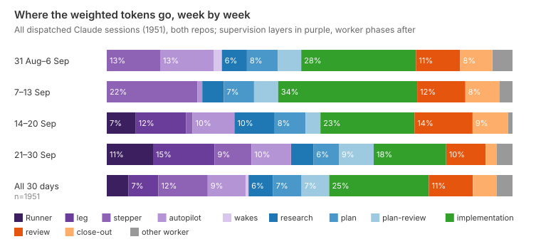
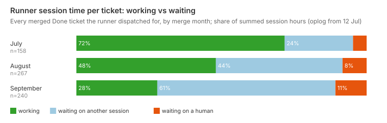
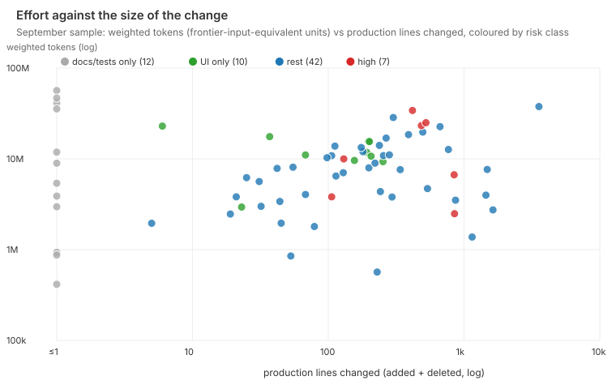
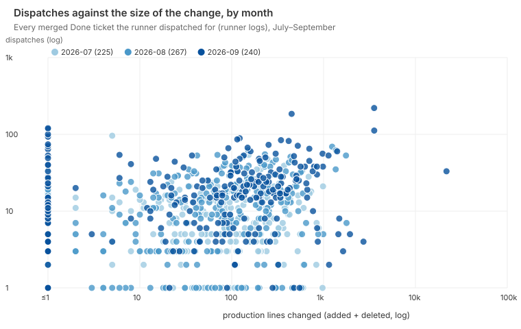

# Where does a ticket's effort go, and does it scale with the size and risk of the change?

Most of it goes to supervising and checking the work, not to writing it. The share going to
supervision rose in September with one new layer, and effort follows the size of a change only
loosely and shows no detectable response to its risk. Over the last thirty days, the only window with token records, the layers that
supervise a ticket took 35% of the fleet's weighted Claude tokens: the passage Runner,
its legs, the stepper, the ticket's own autopilot and its wakes. Their share rose from 28% in the first week of September to 45% in its last ten days, and
the whole rise is the passage Runner and its legs, which arrived on 17 September: without
them supervision was 28% in the first week and 26% in the last. Implementation took 24%,
falling from 28% to 18% as the Runner joined the total. Plan-review, review and close-out took
24% between them. Per ticket, the runner's own logs show median dispatches rising from 12 in
the second half of July, the part its logs see whole, to 17 in September. Almost all of the
rise is follow-up beats into sessions already open; fresh sessions went from 5 to 7. Working
hours on the runner's phase clock stayed near an hour and a half. Effort rises with production
lines only weakly in tokens and dispatches (rank correlation 0.19 and 0.21) and moderately in
working hours (0.41). It tracks test lines more closely than production lines. At a fixed size,
the data cannot tell whether a credential, auth or migration change gets more or fewer
dispatches than any other.

## Findings

**Supervision is the largest block of effort, and it is the part that grew.** The figure above
covers every dispatched Claude session whose transcript is still on the runner machine: 1,951
sessions from 31 August to 06:50 on 30 September, across both repos. Pooled, the supervision layers
take 35% of weighted tokens:

| Layer | Sessions | Weighted tokens | Session time spent working |
|---|--:|--:|--:|
| Runner (flies a passage) | 2 | 5.4% | 11% |
| leg (an autopilot a Runner dispatched) | 35 | 7.3% | 6% |
| stepper (an autopilot dripping beats into one session) | 123 | 12.2% | 9% |
| autopilot (a ticket's own) | 99 | 9.4% | 4% |
| wakes | 3 | 0.7% | 96% |
| research | 112 | 6.0% | 43% |
| plan | 276 | 7.0% | 76% |
| plan-review | 223 | 6.8% | 75% |
| implementation | 299 | 24.5% | 53% |
| review | 420 | 10.8% | 72% |
| close-out | 253 | 5.9% | 19% |
| other workers (custom, triage, breakdown, bug …) | 106 | 3.9% | 25% |

The Runner and leg layers do not appear in the first half of the month and were a quarter
of all weighted tokens in its last ten days. Supervision went from 28% to 45% of the week's
tokens, but not steadily: 28%, 24%, 32% and 45% by week, the last of them ten days long.
Without the Runner and its legs it was 28%, 24%, 15% and 26%. One Runner session, flying
LIN-3099 from 26 to 30 September, is 4.8% of the whole thirty days' tokens. Implementation went
from 28% to 18% of a total the Runner had joined; without it, 28% to 24%. The direction holds
at any cache-read weight from 0 to 0.25, but supervision's tokens are mostly cache reads of
long waiting contexts, so at fresh input and output alone its share is 23%, not 35%. This is the fleet-wide version of what
`fleet-complexity-read.md` found on three tickets, where the orchestrator was 36–59% of each
ticket's weighted tokens and "the biggest single cost". Across the whole fleet the orchestrator
is smaller than on those three, but it is growing. A supervisor is almost all waiting: an
autopilot session is working for 4% of its life and a leg for 6%. Every wake re-reads a
context that keeps growing, so its tokens are large while its working time is small. The per-ticket sample agrees. There a supervisor shared
across tickets is counted only inside the ticket's own window. On that basis a ticket's own
autopilot is 21.5% of its weighted tokens, and the parent, leg or stack-walk supervisor its work
woke is another 19%.

**Writing the code is a quarter of the tokens, checking it another quarter, and the cheap tier
is a rounding error.** In the fleet data, implementation is 24.5%. Plan-review, review and
close-out are 23.6%, research and planning 13%. In the per-ticket sample, the frontier tier
carries 76% of weighted units and the mid tier 24%. The cheap tier, which
runs through opencode, carries under 0.1%, even after allowing for `/cost` under-reporting it
by about 45%. `cheap-implementer.md` found the same shape from the other side: each review cost
about the same whatever the ticket's size, and the review, not the implementation, was the
cost.

**Re-orientation is small per session, and the number of sessions is what grows.** The
bootstrap turn a fresh session spends summarising the project before its task arrives is 3.5%
of weighted tokens fleet-wide. It is largest where sessions are short: 13% of close-out's
tokens, 9% of review's and 8% of plan-review's, against under 1% of implementation's. The
per-ticket sample also counts the handshake turn of each cold resume, and there it comes to 5.6%. The
"re-ground at HEAD" beat that opens most worker prompts is not in this number; it is counted
inside its phase. Per ticket, the runner logs show fresh sessions rising from 5 to 7 at the
median between July and September. Warm follow-ups, which reuse a live session and skip
re-orientation, went from 0 to 8. The fleet is avoiding re-orientation more often, but it
still opens more sessions per ticket.

**Harbour's own model calls are about 1% of a ticket's effort.** Recommend and brief calls
billed to a sampled ticket's identifier come to 1% of that ticket's worker-plus-app units.
The 30-day window of the app-call log is the same as for dispatches.

**Pooled over all session-hours, sessions mostly wait, and the waiting share rose from 28% in
July to 72% in September.** From the runner's phase clock, summed over every session filed
under a merged Done ticket:

| Merge month | Tickets timed | Working | Waiting on another session | Waiting on a human | Median working hours per ticket |
|---|--:|--:|--:|--:|--:|
| July (oplog from 12 Jul) | 158 | 72% | 24% | 5% | 1.41 |
| August | 267 | 48% | 44% | 8% | 1.39 |
| September | 240 | 28% | 61% | 11% | 1.56 |

The pooled share is carried by a few tickets. Ten hold 48% of September's waiting hours, and
the median ticket waited 40% of its session time in July and 47% in September. The work per
ticket barely moved. What grew is the time sessions spend held open, waiting for
a child session or for a follow-up, because a supervisor now parks between beats rather than
ending. In the per-ticket sample, a ticket's first dispatch to its last completion takes
2.5 hours at the median, of which 0.6 hours have a session at work. `review-loops.md`
found plan-review loops alone were a third of all session time in the thirty days to
12 September.

**Dispatches per ticket rose, most in the larger changes; working time barely moved.** Median
dispatches per merged Done ticket, from the runner's logs, were 8 in July, 10 in August and 17
in September. July's 8 is too low: the run logs have no record of 6–11 July, and 68 of July's
225 tickets merged before the oplog began on 12 July, so part of their history is missing.
Tickets merged from 12 July, the same ones the phase clock times, have a median of 12. The
table uses them for July and holds size fixed, with median working hours in brackets:

| Production lines changed | July | August | September |
|---|--:|--:|--:|
| 0 (docs or tests only) | 16 (0.98 h), n=7 | 7 (0.88 h) | 8 (1.14 h) |
| 1–49 | 11 (1.11 h), n=42 | 7 (0.81 h) | 13 (1.03 h) |
| 50–299 | 11 (1.53 h), n=85 | 13 (1.99 h) | 18 (1.68 h) |
| 300 and over | 14 (1.95 h), n=23 | 14 (2.20 h) | 25 (2.47 h) |

So a same-sized change is getting dearer in dispatches: 1.2× to 1.8× the late-July count in
the three bins with enough tickets, and more in the larger ones. The dispatch figure in the
chart below still uses version 1's full July. Nearly all the rise is warm follow-up beats: per
ticket, the median of fresh sessions went 5, 6, 7 and of warm follow-ups 0, 3, 8. A beat is a
message into a held session, so a dispatch in September is a smaller unit than one in July. It
is not clearly dearer in working time, though the largest bin rose 27%, and the phase clock is
the generous measure: on the same 71 September tickets the feedback-gap measure gives a median
of 0.62 working hours where the phase clock gives 1.57. Tokens cannot be
compared month on month (see Limits). Within September, the weekly shift of tokens towards
supervision points the same way as the dispatch count.

**Effort rises with size, but loosely, and it follows test lines more than production lines.**

| Rank correlation with… | Production lines | Test lines |
|---|--:|--:|
| Weighted tokens (sample, n=71) | 0.19 | 0.32 |
| Wall-clock span (sample) | 0.06 | 0.22 |
| Review rounds (sample) | 0.16 | 0.32 |
| Dispatches (census, n=732) | 0.21 | 0.36 |
| Working hours (census, n=665) | 0.41 | 0.49 |

A tenfold difference in production lines moves the tokens far less than tenfold. A ticket that
changes no production code at all still costs about 90% of the median ticket's weighted
tokens. In the sample, a docs- or tests-only ticket (median 7.2M units) costs twice a 1–49-line
change (3.6M). The five tickets over 1,000 lines have a lower median (4.0M) than those of
50–999 lines (9.8M and 11.0M). The sample figures move with the sample. It lost 52 tickets to
fetch errors that were cached as failures (Method), and 16 of the 17 that were re-read a few
hours later returned data. With those 16 added, the token correlations are 0.27 with production
and 0.37 with test lines, and a docs- or tests-only ticket costs about three-quarters of the
median ticket. Test lines still lead once production size is held fixed (partial correlation
with dispatches 0.32). Which way that runs is not known: reviews ask for tests, so more rounds
may produce more test lines. This matches `ticket-record-and-quality.md`, which found cost rising
from $13 to $79 across thirds of record length with no change in quality, and
`cheap-implementer.md`'s flat per-review cost.

**At a fixed size, no effect of risk on effort can be detected.** Risk classes come from the production
paths a ticket touched (Method). Across July to September:

| Production lines | UI only | Rest | High (credentials, auth, tokens, sessions, security, migration) |
|---|--:|--:|--:|
| 1–49 | 5 (0.98 h), n=31 | 9 (1.00 h), n=153 | 13 (1.33 h), n=9 |
| 50–299 | 13 (1.58 h), n=31 | 13 (1.79 h), n=248 | 9 (1.65 h), n=39 |
| 300 and over | 17.5 (3.13 h), n=4 | 15 (2.33 h), n=99 | 17 (2.17 h), n=29 |

Median dispatches, with working hours in brackets. The token sample is too small to split this way. Its seven
high-risk tickets had a median of 2 review rounds against 1 elsewhere, but also a median of
485 production lines. High-risk tickets cost more in total
(median 13 dispatches, 1.72 h), but that is because they are bigger: their median is 196
production lines, against 100 for the rest. In the middle bin, where most tickets sit, a
high-risk change gets fewer dispatches than an ordinary one, partly because half of those
tickets merged in July, the month whose dispatches are undercounted. The classes are small and
the intervals wide: bootstrapped, the difference in median dispatches between high risk and the
rest runs from −8 to +14 at 1–49 lines, −8 to +4 at 50–299 and −6 to +13 at 300 and over. The
data cannot tell equal effort from a difference of half either way. Nothing here shows that a
credential change of a given size gets more effort than any other change of that size.
`fleet-complexity-read.md` found the same mismatch from the other end: a full process applied
to an inert 8-line change.

**The runner repo behaves like the product repo.** For July to September, simple-dispatcher
tickets (n=145) have a median of 11 dispatches and 1.40 working hours, against 11 and 1.49 for
LinearViewer (n=604). Their median production size is smaller (74 lines against 92), and their
dispatches track size even less (rank correlation 0.15 against 0.22). A ticket that touched
both repos counts in both.

## Method

Scripts run in this order: `scripts/survey-effort-git.mjs`, `scripts/survey-effort-runner.mjs`,
`scripts/survey-effort-fetch.mjs`, `scripts/survey-effort-fleet.mjs`,
`scripts/survey-effort-analyse.mjs`, `scripts/survey-effort-render.mjs`. Snapshots go to the
git-ignored `data/survey-effort/`. Every number above is printed by `survey-effort-analyse.mjs`
or `survey-effort-fleet.mjs`.

- **Population.** A ticket is in if its LIN-id names a first-parent commit on `origin/main` since
  1 June, in LinearViewer or simple-dispatcher. The id comes from the branch name first, then
  from the merged subjects. The ticket's tracker state must also be Done. That gives 1,306
  merged tickets, 1,282 of them Done. The month is the month of the ticket's last merge.
- **Size.** Size is lines added plus deleted over the ticket's merges, split three ways:
  - tests: `test/`, `tests/`, `e2e/`, `fixtures/` and `*.test.js`;
  - docs: `*.md`, `docs/`, `plans/`, `prototypes/` and `content/`;
  - production: everything else, less lockfiles and images.
- **Risk class.** The class is the highest class of any production path the ticket touched.
  - **High:** the path matches `auth|credential|token|oauth|secret|crypto|security|permission|grant|session-store|connection|migrat|encrypt|revoke|refresh|login|account`.
  - **UI only:** every production path is under `public/`, `lib/components/` or `lib/render*.js`, or is CSS.
  - **Docs/tests only:** the ticket changed no production lines.
  - **Rest:** everything else.
- **Census (runner logs).** simple-dispatcher's `state/dispatcher.run-*.log`, from 20 June, map
  each claimed dispatch item to its issue. Each item is either a fresh session, a cold resume
  or a warm follow-up. Its `state/oplog.jsonl`, from 12 July, times each session's phases.
  SUMMARIZING, RESUMING and EXECUTING count as working. AWAITING_FOLLOWUP and
  AWAITING_EXTERNAL are waiting on another session. BLOCKED is waiting on a human
  (`phases.js`). Both waiting phases predate the oplog. No proxy calls were made for the census.
- **Fleet anatomy (local transcripts).** This covers every Claude Code transcript under
  `~/.claude/projects/*simple-dispatcher-workspaces*` last written on or after 31 August,
  subagent files included. Each message's usage is counted once. A session's kind comes from
  its `# LIN-n · kind` header or its fetched dispatch prompt. An autopilot's layer is decided
  in this order:
  - **Runner** if it carries the passage prompt ("flying a passage").
  - **leg** if a Runner session dispatched an autopilot onto its issue.
  - **stepper** if it carries the STEPPER disposition.
  - **autopilot** otherwise, meaning the ticket's own.

  Re-orientation is the turns before the task prompt arrives. Working time is the sum of gaps
  of at most two minutes between transcript entries.
- **Per-ticket sample (proxy).** Dispatch history was kept for 30 days when this sample was taken
  (`historyTtl`, since removed — evidence is lifetime-retained, LIN-3163), so the sample is the Done tickets merged in September. Every
  second one by ticket number was taken, 146 candidates. For each, the script read
  `GET /issues/{id}/cost` for its lineages and `GET /dispatch/{root}` for each lineage's
  feedback. That came to 724 cached responses, fetched over three runs, paced at one per 4.2 s.
  - 72 tickets had lineages and 71 are analysed. 52 `/cost` reads failed with HTTP 404, and
    `survey-effort-fetch.mjs` caches a failure as if it were an answer, so no later run
    retried them. 22 had no lineage. A re-read of a third of the failures hours later returned
    lineages for 16 of 17, so the sample could have held about 120 tickets.
  - Claude `[usage]` lines are cumulative per session and repeat. A lineage's total is the sum
    of each session's maximum; a drop in the running total marks a new session.
  - Cheap-tier lines are per beat and are summed.
  - A lineage rooted on another ticket, or on none, is a supervisor that the ticket's work woke:
    a parent autopilot, a leg or a stack walk. Only its usage between the ticket's first
    dispatch and its last completion counts.
    - 9 lineage reads failed with the same cached 404 and are left out. None had aged out:
    re-read later, all returned data.
  - Working time is the gaps of at most two minutes between feedback entries, since heartbeats
    come every 30 seconds or less.
  - Checked against the local transcript of one autopilot session, the last `[usage]` line was
    within 2% of the transcript's total, low by the final turn.
- **Weights.** Weights follow `fleet-complexity-read.md`, in frontier-tier input-token
  equivalents:
  - frontier input 1, output 5, cache read 0.1, 1-hour cache write 2, 5-minute cache write 1.25;
  - mid tier × 0.6;
  - spend reported in dollars (cheap tier, app calls) ÷ $5 per million, the frontier input
    price those ratios anchor to. The anchor reproduces a priced frontier lineage's `costUsd`
    exactly.

  Only shares and ratios are reported. The Claude lanes run on a subscription, so a share is a
  share of quota, not of cash.

## Limits

- **No monthly token series.** Dispatch history, local transcripts and the app-call log were each
  kept for 30 days when this series was built, so tokens exist only from 31 August. The monthly march is shown in
  dispatches and session time, and in tokens only week by week. September is the month
  passages started, so the supervision share it shows may be higher than the summer's. The
  direction of that bias is up for supervision. `fleet-complexity-read.md` found the
  orchestrator already dominant on single tickets, which limits how much higher.
  **Update (30 September 2026):** Harbour's evidence stores now retain their records for the
  life of the project (LIN-3157 B+D, LIN-3163), so the 31-August floor is a property of this
  historical series, not of future ones. Local Claude Code transcripts also carry a long
  retention now (`cleanupPeriodDays`). The June/early-July gaps below remain.
- **June is invisible, and early July is thin.** The runner's logs start on 20 June and its
  phase clock on 12 July, and the logs have no record of 6–11 July. The runner script also
  skips `dispatcher.log` and the `dispatcher.run-manual-*` logs of 1 July. Only 2 of June's 335
  Done tickets appear in the census. July's working times cover the second half of the month,
  and version 2 takes July's dispatch counts from the same tickets.
- **A dispatch is not a fixed unit.** In July most dispatches opened a fresh session; in
  September most are warm beats into a held one. A rise in dispatches is partly a change of
  style.
- **The sample lost a third of its tickets to fetch errors.** 52 of 146 candidates are cached
  404s, which are not selected by cost, and only 22 (15%) truly had no lineage. Those happen
  when a ticket was landed inside another ticket's lane (`review-loops.md` found 81 of 410
  in-window tickets with no lineage) or when its dispatches began before 31 August. Lane
  tickets are the cheap ones, so that part biases per-ticket effort up. A ticket whose early
  legs aged out is under-counted, which biases it down.
- **Per-ticket supervision is approximate.** A supervisor above the ticket appears in a ticket's
  `/cost` only if the ticket's work woke it, and it is counted only inside the ticket's window.
  Two errors pull in opposite directions:
  - a Runner the ticket never woke is missed, which biases supervision down;
  - a supervisor waking for two sibling tickets at once is counted in both, which biases it up.

  The fleet table has neither problem and is the better view of supervision.
- **The fleet table is Claude only.** opencode sessions leave no Claude transcript. Given the
  cheap tier's under-0.1% share this barely moves anything, and it biases the other layers up
  by at most that much.
- **Re-orientation is a floor.** It counts only the turns before the task arrives. The re-ground
  beat that opens most worker prompts is counted inside its phase.
- **Working time is generous.** The phase clock counts EXECUTING as working even while a
  session sits in a CI or Monitor poll, which biases working up. Summed session-hours count
    concurrent sessions twice, which inflates waiting shares when a supervisor waits on several
  children at once. On the September tickets both instruments cover, the phase clock gives 2.5
  times the working time of the feedback-gap measure, so "working time held flat" rests on the
  generous one.
- **The fleet table cannot be re-run after the day.** Transcripts are deleted after about 30
  days; a re-run eight hours later found 1,942 sessions, not 1,951. Weeks are the week a session
  started, and the Runner that flew LIN-3099 ran past the stated cut-off.
- **Size and risk are proxies.**
    - Lines include comments, and `steady-base.md` found half of new production lines are
    comments, so recent sizes are inflated. Leaving comment lines out moves every correlation
    by 0.02 or less, so this does not flatten the size relation. `scripts/` counts as
    production and is 19% of LinearViewer's production lines since June.
    - The risk regex reads file names only. It puts `lib/render-account-home.js` in high and
    misses credential handling in files with neutral names, such as `routes/proxy.js`,
    `server.js` and simple-dispatcher's `clones.js`, which copies `~/.ssh` and the `gh` token.
  - The high-risk class is small (77 census tickets, 9 of them under 50 lines).

## Next

- **What does the added supervision buy?** Compare tickets flown under a passage Runner and
  its legs with tickets run by a lone autopilot. Measure first-pass review approval, review
  rounds and later-found defects, with size and risk class held fixed.
- **Where do September's extra dispatches come from?** Split each ticket's dispatch count into
  stepper beats, gate rounds and wakes. The median rose from 12 in late July to 17 while
  working time held flat, and nearly all of the rise is warm beats.
- **Does effort follow risk at all?** At a fixed size, no difference between a credential
  change and any other can be detected, though the intervals are wide. Check whether a risk class is ever an input when a ticket's
  process is chosen, and whether high-risk tickets' reviews find more.
- **Is waiting cheap?** The pooled share of session time spent waiting went from 28% to 72%,
  most of it on ten tickets. Measure
  what a held-open supervisor costs per hour in tokens, since each wake re-reads its growing
  context.
