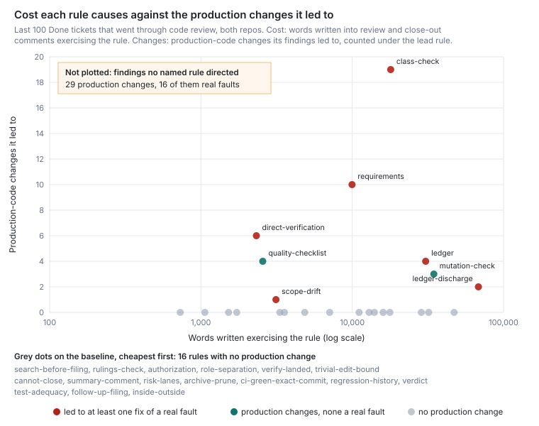
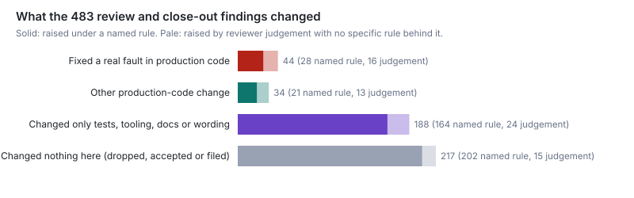

# Which review and close-out rules have ever changed a line of production code?

Eight of the 24 distinct rules have led a finding that changed production code. Most such
changes came from three of them and from reviewer judgement that no rule names. In the last 100
Done tickets that went through code review (completed 11 to 29 September), review and close-out
findings led to 78 production-code changes in 28 tickets. Forty-four of the changes fixed a real
fault, in 18 tickets, and 24 of those were in three tickets. By the rule that led each finding,
the changes came from four places:

- reviewer judgement that no rule names: 29 changes (16 faults);
- the class check: 19 (12);
- verifying against the requirements: 10 (7);
- looking at the running result: 6 (3).

Four more rules led to 10 changes and 6 faults, and the quality checklist led 4 more with no
faults. The other 16 rules led no finding that changed production code in these tickets. Twelve
of them did not appear on a production change even as a supporting rule: risk lanes, follow-up filing, archive and prune, the verdict, and the rules on
roles, authorization and holding the merge are among them. The mutation check is the busiest
rule. It led 107 findings, 97 of which changed only tests, and it accounts for about 36 of the 88
extra legs these tickets ran. Almost all of this is LinearViewer (Harbour). The ten tickets that
touched only simple-dispatcher got no production change from review, and the two that touched
both repos got seven fixes. Zero here does not mean a rule is worthless. Most of the zero rules
are gates, and a gate that works leaves no change behind (see Limits).



## Findings

**Review changed production code in about a quarter of tickets, and fixed a real fault in about
a fifth.** Each finding a review or close-out raised was followed to what it changed: 483 in all.

| What the finding changed | Findings | Tickets (of 100) |
|---|--:|--:|
| Fixed a real fault in production code | 44 | 18 |
| Changed production code, not a fault fix | 34 | |
| Changed only tests, tooling, docs or wording | 188 | |
| Changed nothing here (dropped, accepted or monitored) | 140 | |
| Filed as a follow-up ticket | 77 | |

The faults cluster. LIN-2934 had 10, most of them bugs its own fixes created elsewhere. LIN-3124
had 8 credential faults, and LIN-2837 had 6. `reliability-baseline.md` estimated that review
stops 35–45% of visible bugs before merge, clustered in a few tickets. This population agrees on
the clustering. Seventeen of the 100 tickets showed no activity after their first review: no
later commit, no send-back and no hold.



**Four sources give most of the production changes, and the largest has no rule behind it.**
The lead rule is the one that pointed the reviewer at the problem.

- **Reviewer judgement (29 changes, 16 faults).** A reviewer read the code and saw a bug, such
  as LIN-3124's "suspect lane … spends its refresh token when a Connection matched". No rule
  directed it.
- **The class check (19, 12).** It found the second instance: LIN-2934's null-anchor siblings
  and LIN-2837's unguarded sibling `FAILED` write.
- **Verifying against the requirements (10, 7).** For example, LIN-2758's completion summary
  over-reported what it had applied, against its stated requirement.
- **Direct verification (6, 3).** It led few changes but appears on 11 of the 44 faults. Several
  were only visible live: LIN-2830's clipped grid, LIN-3049's A/B routing run and LIN-2623's
  wrong model strip.

After those come the quality checklist (4 changes, no faults), the ledger (4, 3), the mutation
check (3, 0), ledger discharge (2, 2) and scope drift (1, 1).

**Sixteen rules led no production change, and twelve did not appear on one at all.** The first
list is by lead rule. Some rules are carriers rather than finders. The review ledger (`What CI
Did Not Prove`) appears on 16 of the 44 faults and ledger discharge on 7, because a fault found
by judgement or the class check often travels as a ledger item that close-out must discharge.
Counted as a supporting rule on any production change, only 12 rules score zero:

- search before filing;
- the rulings check;
- authorization;
- role separation;
- verify on the landed commit;
- the cannot-close branch;
- the summary comment;
- risk lanes;
- archive and prune;
- the verdict;
- test adequacy;
- follow-up filing.

Together they wrote about 123,000 words into these tickets' comments by the paragraph measure
below. They also carry about 1,300k prompt tokens across these tickets' review and close-out
sessions. Risk lanes alone carry 599k and trivial-edit-bound 366k.

**The mutation check changes tests, and it drives the most rounds.** It was exercised in 99 of
the 100 tickets and led 107 findings. Of these, 97 changed only tests, usually one surviving
mutant pinned per finding. Three changed production code, and none of those was a real fault.
Scaled to the 88 extra legs these tickets actually ran (review rounds after the first, plus
close-out holds), the mutation check's findings account for about 36. The class check accounts
for 10 and judgement for 16. Whether those pinned tests later catch a regression is outside this
window (see Next).

**Close-out found three real faults itself, all by running the thing live.** LIN-2837's
close-out ran a live bad-key 401 and a bogus-model launch, and found that neither relayed the
provider's words. LIN-2974's live check found the repo guard usually fails open. Close-out's
other rules changed no production code. Filing, prune and archive, and the summary left no code
behind, and the trivial-edit bound appears on only two production changes, as a supporting
rule.

**simple-dispatcher's own tickets got no production change from review.** The 10 tickets that
touched only simple-dispatcher raised 44 findings: 24 changed tests or wording and 20 changed
nothing. The 7 tickets that touched both repos had 7 fault fixes, 6 of them in LIN-2837. The
other 83 tickets touched LinearViewer only and hold 37 of the 44 faults.

**A quarter of the filed follow-ups later changed production code.** Findings filed 77
follow-ups, to 54 distinct tickets. On main, 12 of those 54 carry production-code commits. The
class check filed the most: 28 of its 67 lead findings went to a follow-up. The table does not
credit those later changes to the rule that filed them.

**Near misses: the class check's class of fault kept escaping after the rule, but mostly as
the rule's own output.** Each of the 201 escaped defects in `reliability-baseline-defects.json`
was matched to the rule, if any, written to prevent its class of fault, and 126 matched one. For
the class check, 61 of 63 were filed after LIN-313 wrote it. Thirty-two of those were filed by a
later review as residue, which is the class check finding old siblings. Nine name a ticket in
this population as the one that exposed them. All nine are older siblings that ticket left out
of its scope, and the text shows at least six were named by that ticket's own review or
close-out. LIN-2854 is one: LIN-2637's close-out dropped it in terms. Other
classes:

- **Mutation check.** The "tests green, code inert" class recurred after LIN-2274 wrote the rule:
  LIN-2329, LIN-2611 and LIN-2992 were found other than by review residue. None was shipped by a
  ticket in this population.
- **Direct verification.** Eleven of 23 defects followed LIN-872.
- **Quality checklist.** Twenty-four of 25 followed LIN-523. Three were exposed by population
  tickets, and none of those tickets' reviews had exercised the checklist.
- **Rules no escaped defect maps to.** Ledger discharge, the trivial-edit bound, archive and
  prune, and follow-up filing have none. That fits the rule working and it fits the class being
  rare. This method cannot tell the two apart.

### The table

One row per distinct rule, ranked by production changes per 10,000 words written exercising
it. Reviewer judgement is last because it has no rule text or signature to cost.

- **Production changes** are counted under the lead rule; "as any rule" also counts supporting
  rules.
- **The interval** is a Poisson 95% interval on the lead-rule count, and covers counting noise
  only.
- **Extra legs** are the coded rounds scaled to the 88 legs observed.
- **Words written** counts the review and close-out paragraphs that match the rule's signature.
- **Prompt carry** is the rule's bytes ÷ 4 × the sessions that render its template, taking one
  comment as one session.

| Rule | Earliest cited ticket | Exercised (tickets of 100) | Production changes, lead rule (real faults) | 95% interval | As any rule (real faults) | Tests, tooling or wording only | Changed nothing here (of which filed) | Extra legs | Words written | Prompt carry (k tokens) | Production changes per 10k words |
|---|---|--:|--:|--:|--:|--:|--:|--:|--:|--:|--:|
| direct-verification | LIN-872 | 16 | 6 (3) | 2.2–13.1 | 15 (11) | 1 | 3 (0) | 3.2 | 2,325 | 24 | 25.81 |
| quality-checklist | LIN-523 | 29 | 4 (0) | 1.1–10.2 | 4 (0) | 0 | 6 (4) | 0.8 | 2,561 | 9 | 15.62 |
| class-check | LIN-313 | 95 | 19 (12) | 11.4–29.7 | 26 (17) | 15 | 33 (28) | 10.4 | 17,957 | 35 | 10.58 |
| requirements | LIN-114 | 77 | 10 (7) | 4.8–18.4 | 16 (11) | 18 | 9 (3) | 9.2 | 9,976 | 32 | 10.02 |
| scope-drift | – | 39 | 1 (1) | 0.0–5.6 | 1 (1) | 1 | 0 (0) | 0.4 | 3,133 | 13 | 3.19 |
| ledger | LIN-550 | 100 | 4 (3) | 1.1–10.2 | 35 (16) | 18 | 118 (20) | 7.2 | 30,586 | 226 | 1.31 |
| mutation-check | LIN-2274 | 99 | 3 (0) | 0.6–8.8 | 7 (3) | 97 | 7 (4) | 35.8 | 34,620 | 41 | 0.87 |
| ledger-discharge | LIN-550 | 97 | 2 (2) | 0.2–7.2 | 12 (7) | 1 | 2 (0) | 1.6 | 68,260 | 93 | 0.29 |
| search-before-filing | LIN-2991 | 11 | 0 (0) | 0.0–3.7 | 0 (0) | 0 | 0 (0) | 0.0 | 730 | 63 | 0 |
| rulings-check | LIN-2991 | 8 | 0 (0) | 0.0–3.7 | 0 (0) | 0 | 0 (0) | 0.0 | 1,062 | 71 | 0 |
| authorization | LIN-810 | 21 | 0 (0) | 0.0–3.7 | 0 (0) | 0 | 0 (0) | 0.0 | 1,523 | 44 | 0 |
| role-separation | LIN-523 | 37 | 0 (0) | 0.0–3.7 | 0 (0) | 0 | 0 (0) | 0.0 | 1,725 | 68 | 0 |
| verify-landed | LIN-1579 | 39 | 0 (0) | 0.0–3.7 | 0 (0) | 0 | 0 (0) | 0.0 | 3,323 | 16 | 0 |
| trivial-edit-bound | LIN-3033 | 31 | 0 (0) | 0.0–3.7 | 2 (0) | 0 | 0 (0) | 0.0 | 3,566 | 366 | 0 |
| cannot-close | LIN-474 | 59 | 0 (0) | 0.0–3.7 | 0 (0) | 1 | 0 (0) | 0.0 | 4,855 | 165 | 0 |
| summary-comment | LIN-550 | 86 | 0 (0) | 0.0–3.7 | 0 (0) | 0 | 0 (0) | 0.0 | 7,101 | 14 | 0 |
| risk-lanes | LIN-898 | 43 | 0 (0) | 0.0–3.7 | 0 (0) | 0 | 12 (0) | 0.0 | 11,092 | 599 | 0 |
| archive-prune | LIN-1770 | 80 | 0 (0) | 0.0–3.7 | 0 (0) | 0 | 0 (0) | 0.0 | 12,913 | 135 | 0 |
| ci-green-exact-commit | LIN-550 | 89 | 0 (0) | 0.0–3.7 | 1 (1) | 0 | 3 (0) | 0.8 | 14,002 | 91 | 0 |
| regression-history | LIN-240 | 84 | 0 (0) | 0.0–3.7 | 2 (2) | 0 | 0 (0) | 0.0 | 16,015 | 21 | 0 |
| verdict | LIN-523 | 100 | 0 (0) | 0.0–3.7 | 0 (0) | 0 | 0 (0) | 0.0 | 17,752 | 23 | 0 |
| test-adequacy | LIN-258 | 94 | 0 (0) | 0.0–3.7 | 0 (0) | 12 | 3 (1) | 3.2 | 28,627 | 39 | 0 |
| follow-up-filing | LIN-2309 | 96 | 0 (0) | 0.0–3.7 | 0 (0) | 0 | 0 (0) | 0.0 | 31,991 | 67 | 0 |
| inside-outside | LIN-1871 | 91 | 0 (0) | 0.0–3.7 | 2 (0) | 0 | 6 (5) | 0.0 | 47,149 | 185 | 0 |
| *reviewer judgement, no rule* | – | – | 29 (16) | 19.4–41.7 | 33 (19) | 24 | 15 (12) | 15.5 | – | – | – |

**How far to trust the ranking.**

- The top four are separable from the zero group. Their production counts' intervals clear the
  zero rules' upper bound of 3.7.
- The top four are not separable from each other. Direct verification's first place rests on 6
  changes and a small word count.
- The lead rule is the least stable call. In a blind second read of 7 production tickets, 3
  swapped reviewer judgement for the ledger (Limits).
- The word proxy moves the ranking more than the counts do. Rules whose vocabulary other rules
  also use look more expensive: "discharge", "inside" and "follow-up" appear across close-out
  text.
- Rules are ranked by value per unit of cost, as the brief asks. With no production change, the
  bottom sixteen are ordered only by how little they cost.

## Method

**The rules.** The 102 review and close-out rules in `steady-base-rules.json` were merged into
24 distinct rules. Restatements merge when they direct the same act on the same object, and a
checklist line merges into the rule it summarises. `scripts/survey-rules-census.mjs` holds the
mapping and fails unless every census rule lands in exactly one distinct rule. The earliest
ticket a rule's members cite stands in for its origin.

**The population.** Every LinearViewer-team ticket was paged over the local proxy; this team
tracks both repos. Full detail was fetched for the 240 highest-numbered Done tickets (LIN-2619 to
LIN-3153). A ticket went through code review if a comment's heading marks it as a code review and
a commit naming the ticket in either repo changes production or test lines. 124 did. The 100
completed most recently form the population, completed from 11 to 29 September 2026: 83 touched
LinearViewer only, 10 simple-dispatcher only and 7 both.

**Exercise.** A rule counts as exercised in a ticket when one of its signature regexes matches a
paragraph unit of that ticket's review or close-out comments: a blank-line block, list item or
table row. The regexes are in `SIGNATURES` in `survey-rules-timeline.mjs`, and they are broader
than the census's single signature phrase. Exercise is reported but never scored as value.

**Consequences.** A ticket is *active* if a commit was authored after its first review, a review
sent it back, or a close-out held it. 83 were active. For each, a digest holds:

- every review, close-out and implementation comment from the first review on, truncated at
  9,000, 6,000 and 4,000 characters;
- every commit in either repo that names the ticket, directly or through its PR merge, with
  lines by file class: production (LinearViewer `lib/`, `routes/`, `public/`, `server.js`;
  simple-dispatcher top-level `*.js`/`*.sh`), test, docs or other.

The coding rubric was fixed before reading and is recorded in `which-rules-pay-codes.json`. Under
it, each finding was followed to its effect, its lead and supporting rules, whether it was a real
fault, and the extra legs it caused. Eleven subagents did the coding, one batch each. Clarifications
added after the first four batches (tooling-only changes; mechanism code with no caller) were
applied to those batches by the author. The other 17 tickets are "changed nothing downstream"
without reading.

**Second reads.** Two samples were recoded blind:

- **A 1-in-10 systematic sample of the 83 coded tickets.** The first read found 34 findings,
  the second 31, with identical class counts in five of the eight tickets. The one production change
  and its lead rule matched, and neither read found a fault.
- **A 1-in-4 sample of the 28 tickets with production changes.** The reads found 8 and 9
  production changes and 3 and 2 real faults. They split on LIN-3035's cache clear, which costs
  performance only. In 3 of the 7 tickets they named the same lead rules for the production
  changes; in 3 others one read credited reviewer judgement and the other the ledger. The first
  read found 48 findings and the second 28, almost all the difference in items that changed
  nothing.

Both samples are in `which-rules-pay-second-read.json`.

**Near misses.** The 201 escaped defects in `reliability-baseline-defects.json` were read once,
against a rubric fixed before reading, recorded in `which-rules-pay-nearmiss.json`. Each defect
was matched to at most two rules. "After the rule" means filed after the rule's earliest cited
ticket; ticket numbers rise with creation date.

**Re-running.** The proxy calls ran at 6 to 11 a minute.

```sh
node scripts/survey-rules-fetch.mjs --top 240                 # ~40 min over the local proxy, one call per 4.5 s
node scripts/survey-rules-census.mjs                          # the 24 distinct rules
node scripts/survey-rules-timeline.mjs --sd ../simple-dispatcher   # population, exercise, digests (git-ignored)
node scripts/survey-rules-codes.mjs                           # merges the readers' batches into which-rules-pay-codes.json
node scripts/survey-rules-analyse.mjs --sd ../simple-dispatcher    # every number here, and both figures
```

## Limits

**What "never changed production code" can mean here, and what it cannot.**

- **It can mean the rule led none of these 483 findings to a production change within these
  tickets.** It cannot mean the rule prevented nothing. Several zero rules are gates: cannot-close,
  CI green on the exact commit, authorization, role separation and ledger discharge. They act by
  stopping a merge, a Done or a loop. When nothing is wrong, their correct output is no change.
  Their value would show only if they were removed, which is Rasmussen's point that
  `paid-where-written-check.md` carries. This bias makes the zero rules look worse than they
  are.
- **It cannot see deterrence.** An implementer who knows the mutation check, class check or
  ledger is coming writes the pinned test, handles the sibling or states the gap first. That
  work lands before the first review, so it is invisible here. This bias undercounts every
  rule that shapes behaviour before review.
- **It cannot see rare events.** Nineteen days and 100 tickets bound a zero at about 3.7 changes
  per 100 tickets (95%). A rule that pays once a quarter, such as regression history or risk
  lanes, would show zero here. This bias undercounts rare, high-value rules.
- **It does not follow tests forward.** The mutation check's 97 test-only changes may later
  catch a regression. No finding was followed past its own ticket. This bias undercounts the
  mutation check and test adequacy.
- **It does not credit follow-ups.** Twelve filed follow-ups later changed production code and
  are not credited to the rule that filed them. This bias undercounts the class check and
  inside/outside most.

**Attribution is a reader's judgement.** The lead rule is the rule the reader judged had pointed
the reviewer at the finding.

- **"Reviewer judgement" may absorb rules followed without being named.** Most careful reading
  is, loosely, verifying against the requirements. This overstates judgement and understates
  the requirements rule and the class check.
- **Supporting rules are credited generously.** The ledger rides on most findings. The "as any
  rule" column overstates carriers, and the lead column understates them.
- **Double coding.** One reader coded each ticket. Twenty-two of the 483 findings were coded
  low confidence. The blind second reads (Method) show how stable each count is:
  - The production-change and fault counts hold to about one in eight.
  - The split between reviewer judgement and the ledger as lead rule does not hold. Reviewer
    judgement's 29 may include ledger-led changes, and the ledger's 4 may be too low.
  - The "changed nothing" count is the least stable. A second reader drops or merges about a
    third of those items, so the figure of 140 is soft in both directions.
- **"Real fault" is strict.** Mechanism code with no production caller yet was not counted as
  a fault, even when the finding was right. This undercounts faults.

**The instruments miss some consequences.**

- **Leg labels come from comment headings.** A mislabelled review can start a digest late.
  LIN-2837's first review and LIN-3006's first fix fell before their digests; readers recovered
  the first from later comments and could not code the second.
- **Squash merges and unmerged branches.** Commits squashed or left on an unmerged branch (for
  example LIN-2872's PR #1493) were tied to findings from the comments.
- **Truncation.** Several readers read truncated comments in full from the cache. Where they
  did not, findings may be missed.

All three undercount consequences.

**The population.**

- **Only tickets with a code review and a code commit are included.** Documentation-only and
  research tickets are excluded.
- **Some recent completions may be missing.** A ticket numbered below LIN-2619 that completed
  after 11 September would be absent.
- **Parent tickets are thin.** LIN-3134 and LIN-2995 had their code land under their children
  and show little here.
- **simple-dispatcher is small.** It has 17 of the 100 tickets, so its zero rests on 10.

**The cost proxies are rough.** Words are counted by paragraph signature match. A paragraph
matching two rules counts for both, so the column sums to more than the 376,402 words the
comments hold. Generic vocabulary inflates carriers. Judgement has no cost at all here. Carry
takes one comment as one session. Extra legs are coded rounds scaled to observed legs, so a
round that answered several findings is shared evenly among them.

**Near misses rest on one-line reasons.** The matching is generous: 126 of 201 defects matched
a rule. Many class-check matches are the rule's own later output rather than misses.

**No counterfactual.** Nothing here says what the fleet would ship without any one rule.

## Next

- **Do the tests the mutation check forces ever catch anything?** Follow the test files touched
  by its 97 test-only changes forward through CI on main and later PRs. Count how often one goes
  red on a real regression before a reviewer or a Bug finds it.
- **What does reviewer judgement catch that no rule names?** Read its 29 production changes and
  16 faults for a common kind: a class of reading the named rules do not describe. The question
  is whether the rules describe how faults are actually found.
