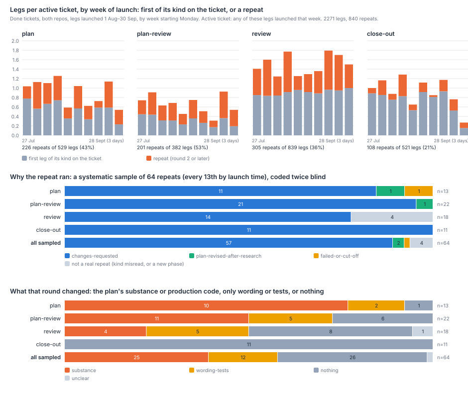
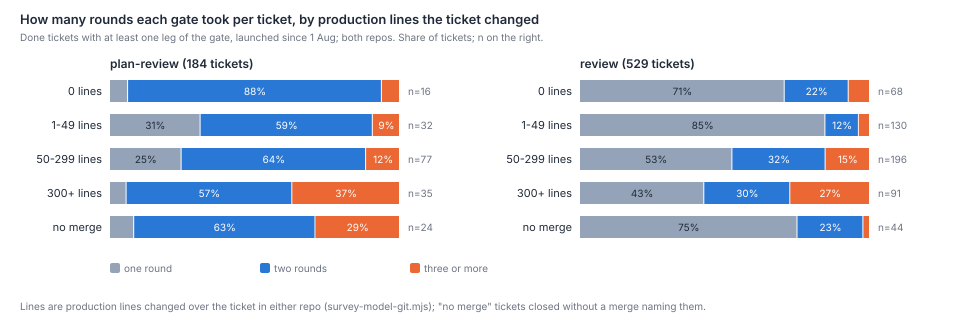

# Why do Harbour's planning, review and close-out legs repeat, and what do the repeats buy?

A leg repeats because a gate asked for changes. 840 of the 2,271 plan, plan-review, review
and close-out sessions on Done tickets since 1 August are repeats. We read a systematic sample
of 64 of them, each coded by two readers who did not see each other's codes. Of the 60 that are
real repeats, 57 are the next round of a send-back loop. None was a duplicate launch, a stale
re-grounding, added scope or red CI. What a repeat buys depends on its kind. A repeated plan
changed the plan's substance in 10 of 13. A repeated plan-review raised something no earlier
round had in 20 of 22, and in 16 it was real. A repeated review changed production code in 2
of 14. Later review rounds do catch real faults, but 20 of the 21 in `which-rules-pay.md`'s
codes sit on three tickets. A repeated close-out changed nothing in 11 of 11: it re-checks a
hold after the fix has landed. In September the repeats cost 3.1 of the 39.4 dispatches per correct change (7.8%),
10% of the tokens and 6% of the session-hours. Tickets that go round three or more times are
the large ones, and most rounds after the second follow a ruling by John or a coordinator.



## Findings

**Repeats are a third of all legs, and a half of plan-reviews.** Every fresh session of the four
kinds on a ticket that is Done now, launched 1 August to 30 September, in both repos:

| Kind | Legs | Repeats | Share |
|---|--:|--:|--:|
| Plan | 529 | 226 | 43% |
| Plan-review | 382 | 201 | 53% |
| Review | 839 | 305 | 36% |
| Close-out | 521 | 108 | 21% |
| All | 2,271 | 840 | 37% |

Repeat plan-reviews outnumber first ones, 201 to 181, as `survey-check-4.md` found for
September's unexplained legs (84 to 69). In August the two are level, 95 repeats to 97 first
ones; in September repeats lead, 106 to 84. By repo the share is about the same: LinearViewer 567 of
1,618 legs (35%, 416 tickets), simple-dispatcher 111 of 303 (37%, 73 tickets). The 15 tickets
that merged into both repos repeated 62 of 109 (57%). The 60 tickets that closed without a merge
repeated 100 of 241 (41%). The review count overstates August's repeats; see Limits.

**Repeats bunch on a few tickets, and they follow quickly.** 263 of the 564 tickets (47%) had no
repeat. The tenth of tickets with the most repeats (56) carry 42% of them, up to 18 on one
ticket. A repeat usually starts within the hour after the last leg of its kind. The median gap is
0.4 hours for plans and plan-reviews, 0.6 for reviews and 0.9 for close-outs. 84% of plan
repeats and 85% of plan-review repeats start within the hour. So the loop turns in about the time one leg takes: a
leg's median session runs 8 to 9 minutes.

**Nearly every repeat is the next round of a send-back.** The sample is every 13th repeat by
launch time, 64 in all, on 61 tickets, 32 in each month.

| Why the repeat ran | Sampled repeats |
|---|--:|
| A verdict asked for changes (plan-review, review or close-out hold) | 57 |
| The plan was revised after a spike or a human instruction | 2 |
| The previous session failed | 1 |
| Not a real repeat: an earlier "review" was triage or design, or the review was of the next phase | 4 |
| Staleness, rescue, duplicate or mistaken launch, added scope, red CI | 0 |

57 is 89% (Wilson 95%: 79–95%) of the sample and 95% (86–98%) of the 60 real repeats. The two
readers gave the same reason for all 64 (Cohen's κ 1.00). They agreed on what the round changed
in 62 (κ 0.95), and on whether a gate round found something new in 37 of 40 (κ 0.78). The one
failed session was a ninth plan leg, launched after resume attempts failed on the terminal
substrate. Every sampled close-out repeat followed an earlier close-out's hold. That is the
close-out working as `review-consumption.md` and `close-out-claims.md` describe it: it reads the
ledger, holds on what is undischarged, and closes once it has been fixed.

**Later rounds follow a ruling.** The readers' notes name a ruling by John, the operator or a
coordinator in 17 of the 26 repeats at round three or later (65%, 46–81%). Among second rounds
it is 4 of 38 (11%). The notes describe rulings such as "a human go-ahead for one more pass",
"a coordinator allowed one final revision under a hard stop", and a carve or re-order of the
work. `review-loops.md` found that the window's two longest loops ended in a human ruling. In
this sample a ruling is also what starts most third rounds.

**What a repeat buys depends on its kind.** Of the 60 real repeats:

| Kind | Changed the plan's substance or production code | Only wording or tests | Nothing |
|---|--:|--:|--:|
| Plan (13) | 10 | 2 | 1 |
| Plan-review (22) | 11 | 5 | 6 |
| Review (14) | 2 | 5 | 7 |
| Close-out (11) | 0 | 0 | 11 |
| All (60) | 23 (38%) | 12 (20%) | 25 (42%) |

A repeated plan is the revision that answers the send-back, so it nearly always changes the
plan. A repeated review mostly checks the fix. It raised something new in 10 of 14 and something
real in 7, but only 2 led to a production change. Round three and later bought substance at
least as often as round two did, 13 of 26 against 12 of 38 (all 64).

**Plan-review's second round usually finds something the first missed, and it is usually real.**
20 of the 22 sampled plan-review repeats raised a finding no earlier round had (91%). 16 of those
were real (73% of the 22, 52–87%): a new defect or gap that the next revision or the
implementation fixed. Examples: an
inverted premise; a predicate that can never be reached because it compares a string with a
Date; a class wrongly excluded by a hand-drawn bound; a cancellation witness the plan claimed
but that did not exist. The other four were non-blocking notes.

**Later review rounds find real faults, but on three tickets.** `which-rules-pay-codes.json`
follows 478 review findings on 83 recent Done tickets to what each changed. By the round that
raised them:

| Review round | Findings | Tickets | Changed production code | Real faults | Tickets with a real fault |
|---|--:|--:|--:|--:|--:|
| First | 309 | 74 | 42 (14%) | 20 | 15 |
| Second or later | 169 | 36 | 33 (20%) | 21 | 4 |

Per finding, a later round is no emptier than the first. But LIN-3124, LIN-2934 and LIN-2837 hold
20 of the later rounds' 21 faults, the clusters `which-rules-pay.md` names. Most of LIN-2934's
were bugs that its own fixes had created. So the sample's picture and this one agree. The typical
review repeat checks the fix and changes no production code (7 of the 14 real ones changed
nothing). The few tickets that keep failing review carry most of what later rounds catch.

**Tickets that take three or more rounds are the big ones.** The number of plan-review rounds
per ticket, by production lines the ticket changed:



| Production lines | Plan-review tickets | One round | Three or more | Review tickets | One round | Three or more |
|---|--:|--:|--:|--:|--:|--:|
| 1–49 | 32 | 10 | 3 (9%) | 131 | 111 (85%) | 5 (4%) |
| 50–299 | 77 | 19 | 9 (12%) | 197 | 103 (52%) | 30 (15%) |
| 300+ | 35 | 2 | 13 (37%) | 99 | 46 (46%) | 25 (25%) |

Two plan-review rounds is the norm: 117 of 184 tickets (64%), with 34 in one and 33 in three or
more. For tickets that converged in one plan-review round the median change is 97 production lines;
for those that took three or more it is 278. For review the medians are 45 and 194. The first plan
comment is a little longer on tickets that went round more. On the 86 plan-reviewed tickets whose
comments were read, its median is 282 words for one round, 343 for two and 408 for three or
more. Tier separates little. By the writer tier in the commit trailers, frontier-written tickets averaged 1.94 plan-review rounds (36
tickets) and mid-written 2.13 (89). For review it was 1.51 against 1.63. Nearly every
implementation leg ran at mid tier, so the implementer's tier cannot be compared. Tickets touching both
repos averaged 3.0 plan-review rounds (11 tickets), and `lib` tickets 2.24 (58). Three or more
plan-review rounds rose from 10 of 95 tickets that began in August to 21 of 83 that began in
September.

**In September the repeats are 3.1 of 39.4 dispatches per correct change.** September's correct
code changes (140, both repos) took 5,520 dispatches. That is `what-doubled-the-dispatches.md`'s
population, re-run on the same day. 432 of them (7.8%) are repeat legs or follow-ups into them:
review 159, plan 121, plan-review 110, close-out 42. Over the 1,391 fresh Claude Code sessions
still on disk, repeats hold 10% of tokens (1.7 of 17.2 billion, cache reads included) and 6% of
session-hours (78 of 1,298). A repeat costs about what a first leg of its kind costs: median
tokens and minutes are within a quarter of each other for every kind. Carrying the sample's reasons
to the census, send-back loops account for 2.75 of the 3.1. `survey-check-4.md` put 12.8 per
correct change in no row of the steady-base map. The repeats are about a quarter of that. Some
review repeats already sit in the map's row 8 (review rounds after the first, 6–7%).

## Method

**Population.** Every fresh session of kind plan, plan-review, review (the implementation review)
or close-out that simple-dispatcher launched from 1 August to 30 September 20:00Z, on a ticket
that is Done now, in either repo. A leg belongs to the ticket its own `Issue:` line names. Its
kind is the one `what-doubled-the-dispatches.md` uses. It is exact where a local transcript
fetched the dispatch item (from 29 August, 778 legs). Otherwise it is decoded from the length of
the bootstrap prompt's `# LIN-n · kind` header (1,493 legs). A leg is a *repeat* when an earlier
fresh session of the same kind ran on the same ticket, at any date. Follow-ups into a leg, such
as stepper beats and wakes, count as its dispatches but are not legs. The repo is the one whose
`origin/main` merges name the ticket (`survey-model-git.mjs`). The ticket list and states were
paged over the proxy on 30 September.

**Sample and coding.** The sample is every 13th repeat by launch time, starting from the 7th: 64
of 840, fixed before any ticket was read. Each was read from a digest holding the ticket's legs,
its comments (headings and verdicts labelled by `survey-rules-timeline.mjs`'s reader) and its
commits in both repos by file class. The digest also carries the repeat's own launch prompt,
where the proxy still holds it (32 of 64). Two readers coded every digest against a rubric fixed
before any digest was read. Neither saw the other's codes, and reader B read in reverse order.
The author settled the seven disagreements from the digests; each ruling and its reason is in
`why-legs-repeat-codes.json`. The count of rulings is a keyword match on the readers' notes
(John, human, operator, ruling, ruled, coordinator), not a separate code.

**Convergence.** A ticket's rounds of a gate are its fresh legs of that kind, at any date.
Size is the production lines changed over the ticket in either repo. Area and writer tier come
from `survey-model-git.mjs`, and the implementer's tier from the launch model of the first
implementation leg. Plan length is the word count of the first comment whose heading reads as a
plan. It is measured on every third census ticket by number, the tickets whose comments were
fetched.

**Findings by review round.** `which-rules-pay-codes.json` records, for each of its 483 coded
findings, the comment that raised it. The comment's time, set against the ticket's review legs,
gives the round. All 478 review findings were dated this way; the five close-out findings are left
out.

**Cost.** September's dispatches per correct change are `what-doubled-the-dispatches.md`'s, on the
same day's runner snapshot and scorecard: 5,520 dispatches over 140 correct code changes. A
dispatch is in a repeat when it is a repeat leg, or a follow-up whose root is one. Tokens are
input, output, cache write and cache read, counting each API message once. Hours run from a
session's first transcript line to its last.

```sh
node scripts/survey-doubling-runner.mjs; node scripts/survey-doubling-transcripts.mjs
node scripts/survey-model-git.mjs --since 2026-05-01 --out data/survey-doubling/git.json
# data/survey/scorecard.json from survey-scorecard.mjs (a same-day copy was used)
node scripts/survey-repeats-fetch.mjs                 # the ticket list and states (proxy, 4.5 s a call)
node scripts/survey-repeats-census.mjs                # the census and September's cost
node scripts/survey-repeats-sample.mjs --n 64         # the systematic sample
node scripts/survey-repeats-fetch.mjs --detail data/survey-repeats/sample.json --every 3
node scripts/survey-repeats-digests.mjs               # one reading digest per sampled repeat
node scripts/survey-repeats-codes.mjs                 # merges both readers and the adjudication
node scripts/survey-repeats-analyse.mjs; node scripts/survey-repeats-figures.mjs
```

## Limits

- **The review count is too high in August.** A six-letter kind name decodes as review, but
  triage, design and custom sessions share the length. Four of the eight August review repeats in
  the sample were not second code reviews. Three followed a triage or design session. One reviewed
  the next phase's pull request. All ten September review repeats, whose kinds are exact, were
  real. So the census overstates review repeats, mostly in August, possibly by as much as half of
  August's 148. The reasons are unaffected, because those four are set apart.
- **Only fresh sessions are legs.** A revision done by resuming the plan session, or a review
  round run as a stepper beat inside one session, is not counted as a repeat. This biases the
  census down.
- **Cheap-tier sessions are missing.** Their kind cannot be read, so no cheap-tier leg is in the
  census. If cheap-tier legs repeat more, or less, than the others, the count misses it either way.
- **Done tickets only.** Tickets still open or cancelled are left out. So are the loops that never
  converged, which biases the rounds per ticket down.
- **The readers share the author's tier and read the same digest.** Agreement shows the readers
  were consistent, not that they were right. The digest labels verdicts by a heuristic, and a
  mislabel would mislead both readers alike. This leans towards "changes requested", the reason a
  verdict label makes easiest to see. With 64 repeats, per-kind counts carry wide intervals.
- **What a round "bought" is judged from the digest.** A production change credited to a finding
  is the readers' reading of the commit subjects and comments, so it can err either way.
- **Tokens and hours exist for September's Claude Code sessions only.** Hours include waiting
  inside a session, and cache reads dominate the tokens. The shares compare like with like, but
  the absolute figures are not a bill.
- **Plan length is on a third of tickets**, and on only 11 that passed plan-review in one round.

## Next

- **Does a second plan-review round find what the first missed, or what the revision
  introduced?** Of 22 sampled plan-review repeats, 16 found something real and new. For each,
  read revision 1 and say whether the finding was already there to be seen, or came in with the
  change the first round asked for. The two call for different remedies, and this paper cannot
  tell them apart.
- **Why did three or more plan-review rounds rise from 11% to 25% of tickets between August and
  September**, when size and tier did not move as much? Read September's three-round tickets
  against August's for scope, plan length and the rulings that ended them.
- **What does a close-out repeat check that the review round before it has not?** All 11 sampled
  close-out repeats changed nothing. Say how often the second close-out's verification repeats the
  re-review that ran just before it.
