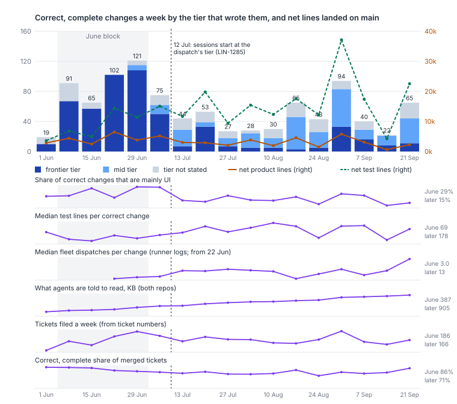
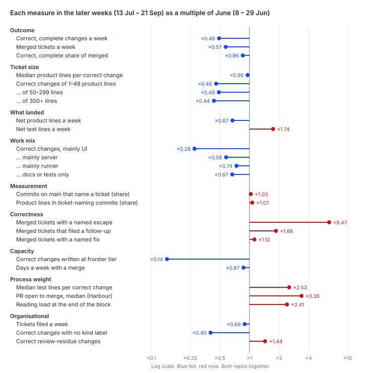

# Why did the weekly count of correct, complete changes halve from June to July?

Mostly because June was a different regime, not because the same work was counted or split
differently. The measure holds up. In both periods about nine in ten commits on main named a
ticket, and a correct change was the same size: a median of 70 production lines in June and 67
later. Every band of production size fell by about half. Most of the fall is fewer merged
tickets (113 a week in June, 65 later), and the rest is a lower correct, complete share (84% to
72%). How it splits depends on June's last week, 29 June to 5 July, the busiest on record. With
it, the split is four-fifths and one-fifth. On the three weeks wholly in June it is two-thirds and
one-third, and the later level is 0.54 of June's rather than 0.49. Product code landed fell by a
third, from 4,290 to 2,880 net lines a week, while net test lines rose from
9,400 to 16,300 a week. So total lines landed rose by 40%, and a correct change now carries 2.5×
the test lines. The fall is almost all Harbour's: 86 to 39 a week, against 9 to 8 in
simple-dispatcher. A third to two-fifths of the lost changes are UI work, which fell from 27 a
week to 7. The step lines up with 12 July, when sessions began to run at the tier each dispatch chose
(LIN-1285). Changes written at the frontier tier fell from 84 a week to 12. The mid tier that
replaced them costs the same per change and escapes more often, though not measurably four times. June looks like an early
burst: a UI build-out, written at frontier tier on a lighter process. But the process did not step
with the count. The plan-review leg arrived on 26 July, two weeks after the step, and the weeks
either side of it ran at 48 and 46 a week. Test lines per change ramped through July and August,
and the prompts grew fastest in the busiest week. The tier switch is the only candidate dated to
the step itself. June is not a level the later process was built to hold. June's session count
cannot be measured, so capacity can be neither ruled in nor ruled out.



*June* is the four weeks `measuring-throughput.md` used, those beginning 8 to 29 June (95 a week;
`:98`). The last of them runs to 5 July. June's calendar weeks, beginning 1 to 22 June, give 69
(`survey-check-2.md`), but only 39% of the first-parent commits in the week of 1 June named a
ticket, so 69 is low. The three weeks wholly in June give 86. *Later* is the 11 full weeks beginning 13 July to 21 September
(46.5 a week; `:19`). The week of 6 July is the step itself, at 75, and belongs to neither. Every
number is both repos together unless a repo is named.



## Findings

**Measurement is not the cause, and if anything it understates June.** The share of first-parent
commits that name a ticket was 89% in June and 92% later. Production lines inside ticket-naming
commits were 92% and 98%. So June has slightly more unclaimed work, not less. Merged but not
Done was 1.8% and 1.4%. Every week in both blocks is past its 30-day window. The naive counts
fall just as far: merged PRs went from 114.5 to 61.5 a week in LinearViewer and from 16.8 to 14.0
in simple-dispatcher. Dating a change by its last merge could move a few tickets across the
6 July boundary, but not 48 a week.

**Ticket size is not the cause: it is fewer changes of the same size, not the same product split
finer.** The median correct change had 70 production lines in June and 67 later. Correct
changes of 1–49 lines fell ×0.46, of 50–299 lines ×0.49 and of 300 or more ×0.44. On the three
weeks wholly in June the same bands fell ×0.55, ×0.57 and ×0.43. Changes with no production
lines, docs or tests only, fell less, ×0.67. Production churn per correct change rose slightly, from 189 lines to 210. Net product lines per correct
change rose from 45 to 62. If anything, changes grew.

**Product delivered fell by a third while tests grew, so the lines landed did not fall.** Net
production lines, excluding comments, ran 4,290 a week in June (Harbour 3,920, simple-dispatcher
360). Later they ran 2,880 (Harbour 2,480, simple-dispatcher 400). `growth-atlas.md`'s steady
2,872 a week is a June-to-August average that spans both regimes (`:80`). Week by week, June
stands above everything since. Net test lines went from 9,400 to 16,300 a week, and the median
correct change's test lines from 73 to 185. That is `steady-base.md`'s rising test-to-production
ratio (1.04 in June, then 1.73, 2.10 and 2.94; `:188-189`) seen per change. Product and test
together, the repos gained 13,700 net lines a week in June and 19,200 later.

**Work mix explains a third to two-fifths of the lost changes: UI work collapsed.** A
change's area is the one holding most of its production lines. simple-dispatcher's code all
counts as runner, so UI work is Harbour's by definition. Correct changes that
are mainly UI fell from 27.0 to 7.5 a week (×0.28), and UI production churn from 8,090 to 2,310
lines a week. Mainly-server changes fell from 37.8 to 21.8 (×0.58), runner changes from 9.0 to
6.6 (×0.74), and docs-or-tests-only changes from 10.8 to 7.2. Of the 48 correct changes a week
lost, 19.5 are UI and 15.9 server: two-fifths. On the three weeks wholly in June, UI is a third
of the loss. By repo, Harbour went from 86 to 39 a week and simple-dispatcher from 9 to 8.
simple-dispatcher's 9 leans on the week of 29 June: on the weeks wholly in June it had 5, so it
rose. Even outside UI, the count fell by 42%, so the mix does not explain it all.

**Correctness explains a fifth to a third, and part of that is the tier.** On a log scale, the
fall is 78% fewer merged tickets (×0.57) and 22% a lower correct, complete share (×0.86). On the
three weeks wholly in June it is 67% and 33%. The share of merged tickets with a named escape
rose from 1.1% to 7.1%. More than half of that rise is finder rows: 33 of the later weeks' 58
escape rows say, in their own reason, that the fault predates the change they name. Those Bugs
name the ticket whose review found an older fault, not the one that wrote it (`survey-check-2.md`).
Without them the escaped share is 3.1% and the later count 48.1 a week, and on the paper's weeks
the correct share is 18% of the fall. June has no finder rows. The share that filed a follow-up rose
from 9.7% to 18.1%. Named fixes barely moved, from 5.7% to 6.4%. Within the later weeks, changes
written mainly at frontier tier were 78% correct and complete and mid-tier changes 67%. The
escapes behind part of that gap need care. Some escape rows name the ticket whose review *found*
an older fault, not the one that wrote it (`survey-check-2.md`), and some were filed before the
change merged. Set those aside and frontier-written changes escaped none of 171 times, against 14
of 365 (3.8%) for mid. So mid does escape more (one-sided Fisher exact p = 0.004), but neither the
2.4% and 9.6% nor a ratio of four holds. On the same corrected basis the correct, complete shares
are 79.5% and 69.6%. At the frontier tier's rate the later weeks would have counted about 52
rather than 48, so the tier accounts for about 3 to 4 of the 48 either way. Some of the rise
is detection, not faults: the operator found 18 of June's 26 escapes, and agents found most of
them from July (`reliability-baseline.md:64-65`).

**Capacity: the engine changed at the step, and June's session count is unrecoverable.** Tier
comes from the model named in each commit's co-author trailer. It was the frontier tier for 88%
of June's correct changes (83.5 a week). Later, the frontier tier wrote 12.1 a week and the mid
tier 22.2; 12.2 have no tier stated. The switch is dated:
- On 12 July, simple-dispatcher began launching Claude Code at the model the dispatch selected
  (`b39648b`, LIN-1285).
- On the same day, Harbour split model choices per harness (`88dba96e`, LIN-1282).
- Mid-tier changes first appear in the weeks of 29 June and 6 July.

Within the later weeks the two tiers cost the same per change: a median of 12 and 13 dispatches,
and 1.52 and 1.60 working hours. Their changes are also the same size (84 and 96 production
lines). So the tier explains the correctness part, not the volume. The volume is harder to read:
- The runner's run logs hold only 21 fresh Harbour sessions before 1 July.
- Its logs have no record of 8–19 June (`where-the-effort-goes.md:280-281`).
- June's Harbour PRs came from `feat/` (89) and `claude/` (31) branches, not the runner's later
  `lin-N` style.
- The SDK runner and the dash substrate were removed on 2 July (simple-dispatcher #50 and #51).

So June's work ran partly on engines that left no census. Days a week with a merge fell only from
7.0 to 6.1.

**Process weight was higher later, but most of it ramped rather than stepped, and this data
cannot separate cause from consequence.** Every per-change measure of process is higher in the
later weeks. Only some of them moved at the step:
- Median test lines per correct change: ×2.5 between the blocks. By week it went 71 in the week of
  29 June, then 112, 142 and 219 through July, and mostly 200 to 260 in August: a ramp, not a
  step.
- What agents are told to read, at each week's end: 323 KB in the week of 8 June, 385 KB in the
  week of 22 June, 495 KB in the week of 29 June, 592 KB in the week of 13 July and 1,192 KB by
  21 September. Its largest rise before late August, 110 KB, came in the week of 29 June, the
  busiest on record. The prompt source files grew 27% in the week of 29 June and 7% in the week
  of 6 July.
- Median time from PR open to merge: 11 to 37 minutes in Harbour, and 5 to 31 in
  simple-dispatcher.
- Median fleet dispatches per change: 2 to 5 in the only June and early-July weeks the logs cover,
  then 12 to 15 in the weeks of 13 July to 10 August. After that the weekly median ranged from 2
  to 29.
- The plan-review leg arrived on 26 July (LIN-1602 and LIN-1603, PRs #1019 and #1024), two weeks
  after the step. The weeks of 13 and 20 July ran at 48.5 a week before it, and the weeks after at
  46.0, so it left no step of its own.
- At month end, the rendered close-out prompt went from 4,374 bytes in June to 8,110 in July, and
  the kickoff from 39 KB to 56 KB (`steady-base.md:49-56`). Month-end figures cannot place the
  rise within July.
- Comment words per Done ticket went from 1,702 to 8,180 (`growth-atlas.md:189-190`; also
  `writing-length.md:31`).

Only the tier switch is dated to the step itself. The UI slowdown and the jump in dispatches came
in the same fortnight. Test lines per change and prompt size were rising before it and kept rising
after, and the plan-review leg came later. A heavier process per change is consistent with fewer
changes from a similar number of sessions, but the June session count needed to show it does not
exist.

**Organisational: demand did not halve, and passages came later.** Tickets filed held at about
186 a week in June and 166 later. The count is estimated from ticket numbers, and the open pile
grew throughout (`growth-atlas.md:178`; `tasks-generate-tasks.md:24`). Passages began on
17 September (`where-the-effort-goes.md:20`; `what-supervisors-do.md:218`), long after the step.
What did change is where correct changes come from. Review-residue tickets rose from 7.3 to 10.5
correct changes a week, from 8% of the count to 22%. Tickets with no kind label fell from 72.8 to 29.3.
So, leaving out the process's own residue, the fall is steeper than the headline: ×0.41 against
×0.49. Human attention cannot be compared, because BLOCKED entries
exist only from 13 July.

## Method

The figures and every number above come from four committed scripts. They read snapshots in
git-ignored `data/`:

```
node scripts/survey-halving-git.mjs          # every first-parent commit since 4 May, both repos → data/survey-halving/git.json
node scripts/survey-growth-git.mjs lv . origin/main --json > data/survey-halving/growth-lv.json
node scripts/survey-growth-git.mjs sd ../simple-dispatcher origin/main --json > data/survey-halving/growth-sd.json
node scripts/survey-halving.mjs              # blocks, weekly series, ratios → data/survey-halving/analysis.json
node scripts/survey-halving-chart.mjs        # the two SVGs
```

- **Changes and correctness.** These are `measuring-throughput.md`'s: its
  `data/survey/scorecard.json` and the tracker and GitHub snapshots under it, taken on
  30 September, with the scorecard computed at `c65b7dd8`. They were reused, not re-fetched. The session made no proxy calls for data.
- **Commit census.** `survey-halving-git.mjs` keeps every first-parent commit, including those
  that name no ticket. For each one it records:
  - its kind (merge, squash or direct);
  - the ticket it names, under `survey-effort-git.mjs`'s rule;
  - lines by class (production, test, docs);
  - production lines by area: UI (`survey-effort-git.mjs`'s UI-only paths), server, runner
    (simple-dispatcher), process (prompt and instruction files) and scripts;
  - model tier, from each carried commit's `Co-Authored-By` trailer.
- **Assigning a change.** A change's area and tier are the ones holding most of its lines and
  trailers.
- **Net lines.** Net production and test lines are week-on-week differences of
  `survey-growth-git.mjs`'s week-end snapshots. Production excludes comments, as that script
  counts it.
- **Other measures.**
  - Tickets filed a week: the rise in the highest ticket number known to exist by each Monday,
    from the tracker snapshot's dated tickets and the changes' merge dates.
  - PR open to merge: from the GitHub snapshot.
  - Dispatches per change: the scorecard's figure, from the runner's run logs.
- **Contributions.** Contributions to the fall are shares of the log ratio: merged tickets
  ln 0.57 and correct share ln 0.86, out of ln 0.49. The tier's part substitutes the frontier
  tier's later correct share (78.2%) for the observed 71.6%.
- **Version 2's figures.** The other June blocks, the finder rows and the weeks either side of the
  plan-review leg come from `node scripts/survey-check-3.mjs blocks` and `finder`, over the same
  snapshots (`survey-check-3.md`). A finder row is an escape whose own reason says the fault
  predates the change it names.

## Limits

- **The design is a before-and-after across one week, when several things changed at once.** The
  tier switch, the UI slowdown and the jump in dispatches all land between 29 June and 13 July.
  Nothing here separates them. Each finding says what moved with the count, not what moved it.
- **June's block includes the first week of July.** The week of 29 June runs to 5 July and is the
  busiest on record, at 121. It is also the week the SDK runner and the dash substrate left and
  the first mid-tier changes appeared. With it, the split is four-fifths and one-fifth and UI is
  two-fifths of the loss. On the three weeks wholly in June, the split is two-thirds and one-third
  and UI a third.
- **June's capacity is unmeasured.** The runner's census starts on 13 July, with fragments from
  20 June. June's engines (SDK runner, dash, hand-launched `claude/` sessions) left no count. If
  June ran more sessions, capacity explains more than this paper can credit.
- **Escapes include finder rows.** 33 of the later weeks' 58 escape rows are Bugs that name the
  ticket whose review found an older fault. The reading is by reason text, one reader, and not
  blind. The tier comparison above sets them aside (`model-choice.md`); the block-level escape
  share is given both ways.
- **The tier comes from commit trailers.** 10% of June's correct changes and 26% of later ones
  have no tier stated. If most of those are frontier, the fall in frontier-written changes is
  overstated. The frontier-against-mid comparison inside the later block is observational: the
  frontier tier may have been given the harder or the easier tickets.
- **The area is by dominant churn, and path rules decide what counts as UI.** A mixed change
  counts only once, so UI work inside server-led changes is missed. That biases the UI share
  down in both blocks. The direction of the bias on the ratio is unknown.
- **Escapes in June are undercounted relative to later.** The operator found most of June's, and
  agents found most of the later ones. So June's correct share is biased up. The correctness part of the fall is overstated, and the
  volume part understated.
- **Tickets filed a week is smoothed.** It rests on 292 dated tickets, mostly Bugs, plus merge
  dates, so it flattens weekly swings. It counts ticket numbers, so canceled and duplicate filings
  count too, which biases both blocks up by a similar amount.
- **Dispatches per change for June cover only its last week and a half, from partial logs.**
  Missing logs drop sessions, so June's 2 to 5 is biased low.
- **Net lines come from week-end snapshots.** A week with a revert, or with a big move between
  areas, shows the net. Comment and prompt handling are `survey-growth-git.mjs`'s.

## Next

- **With size and area held fixed, do mid-tier changes fail more often than frontier ones?**
  Within the later weeks, mid-tier changes were 67% correct and complete against 78%, with more
  escapes (14 of 365 against none of 171), at the same cost. `model-choice.md` held size and area
  fixed and the gap stayed; ticket kind is still open. A matched comparison on size, area and ticket kind would
  say whether that is the tier or the tickets it was given. This goes into `proposals.md`.
- **What did June's sessions look like?** June's PRs, branch names and the tracker's
  dispatch-feedback comments may still show how many sessions ran in parallel and on which
  engine. That is the one missing number that would size capacity.
- **Why did the test lines per change rise 2.5× at the step?** Separate the rules that ask for
  tests (for example, runtime witnesses and pins) from what each tier writes unasked, using
  the later weeks' per-tier test lines.
- **Where did the UI work go?** Was June's UI build-out finished, displaced by fleet machinery, or
  deferred into the open pile? Tracker labels on open tickets by area would say.
- **Is 94 a week reachable under the current process?** The week of 31 August counted 94, with the
  largest test additions of any week. Read which tickets made it and whether they share a shape.
